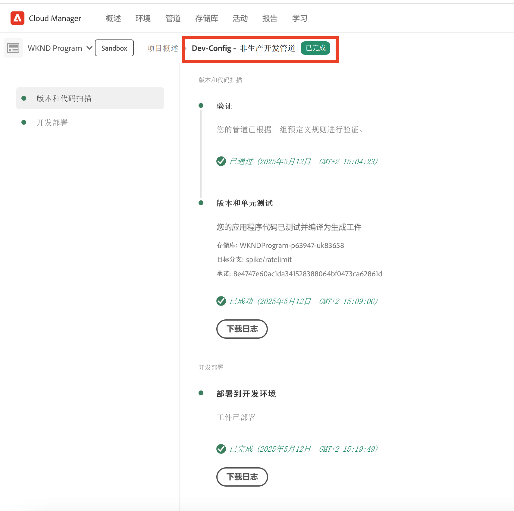
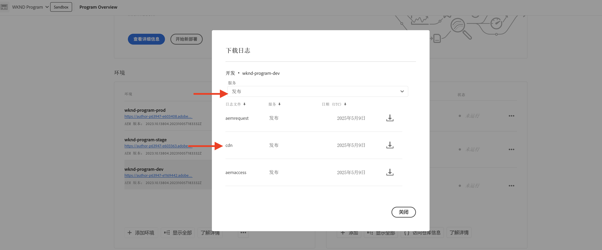
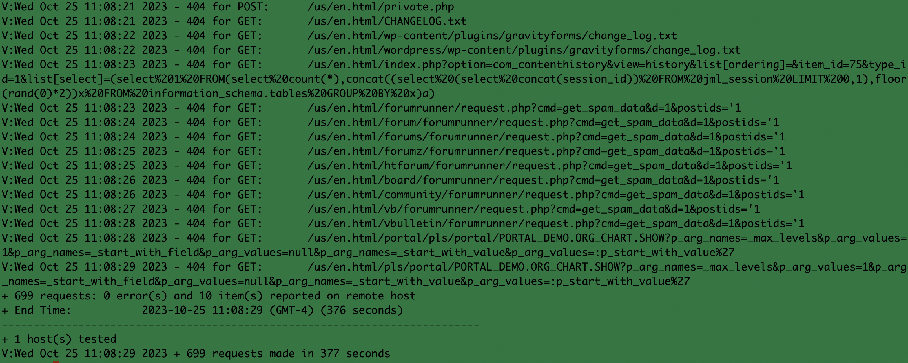

# 流量过滤器规则(包括WAF规则)的示例和结果分析

了解如何使用Adobe Experience Manager as a Cloud Service (AEMCS) CDN日志和仪表板工具声明各种类型的流量过滤器规则并分析结果。

在此部分中，您将探索流量过滤器规则(包括WAF规则)的实际示例。 您将了解如何使用[AEM WKND Sites项目](https://github.com/adobe/aem-guides-wknd#aem-wknd-sites-project)，根据URI（或路径）、IP地址、请求数和各种攻击类型来记录、允许和阻止请求。

此外，您将了解如何使用功能板工具来摄取AEMCS CDN日志，并通过Adobe提供的示例功能板可视化基本指标。

为了与您的特定要求保持一致，您可以增强和创建自定义功能板，从而更深入地了解并优化AEM网站的规则配置。

>[!VIDEO](https://video.tv.adobe.com/v/3425404?quality=12&learn=on)

## 示例

让我们探索各种流量过滤器规则示例，包括WAF规则。 请确保您已按照前[介绍如何设置](./how-to-setup.md)章中的说明完成所需的设置过程，并且您已克隆[AEM WKND Sites项目](https://github.com/adobe/aem-guides-wknd#aem-wknd-sites-project)。

### 记录请求

首先针对AEM Publish服务&#x200B;**记录WKND登录和注销路径**&#x200B;的请求。

- 将以下规则添加到WKND项目的`/config/cdn.yaml`文件。

```yaml
kind: CDN
version: '1'
metadata:
  envTypes:
    - dev
    - stage
    - prod
data:
  trafficFilters:
    rules:
    # On AEM Publish service log WKND Login and Logout requests
      - name: publish-auth-requests
        when:
          allOf:
            - reqProperty: tier
              matches: publish
            - reqProperty: path
              in:
                - /system/sling/login/j_security_check
                - /system/sling/logout
        action: log
```

- 提交更改并将其推送到Cloud Manager Git存储库。

- 使用之前创建的AEM `Dev-Config`配置管道[将更改部署到Cloud Manager开发环境](how-to-setup.md#deploy-rules-through-cloud-manager)。

  

- 通过在Publish服务（例如，`https://publish-pXXXX-eYYYY.adobeaemcloud.com/us/en.html`）上登录并注销程序的WKND站点来测试规则。 您可以使用`asmith/asmith`作为用户名和密码。

  

#### 正在分析{#analyzing}

让我们通过从Cloud Manager下载AEMCS CDN日志并使用您在前一章中设置的[仪表板工具](how-to-setup.md#analyze-results-using-elk-dashboard-tool)来分析`publish-auth-requests`规则的结果。

- 从[Cloud Manager](https://my.cloudmanager.adobe.com/)的&#x200B;**环境**&#x200B;卡中，下载AEMCS **发布**&#x200B;服务的CDN日志。

  

  >[!TIP]
  >
  >    新请求可能最多需要5分钟才能显示在CDN日志中。

- 将下载的日志文件（例如，下面的屏幕快照中的`publish_cdn_2023-10-24.log`）复制到Elastic Dashboard工具项目的`logs/dev`文件夹中。

  {width="800" zoomable="yes"}

- 刷新弹性仪表板工具页面。
   - 在前&#x200B;**全局筛选器**&#x200B;部分中，编辑`aem_env_name.keyword`筛选器并选择`dev`环境值。

     

   - 要更改时间间隔，请单击右上角的日历图标，然后选择所需的时间间隔。

     

- 查看已更新仪表板的&#x200B;**分析请求**、**已标记请求**&#x200B;和&#x200B;**已标记请求详细信息**&#x200B;面板。 为了匹配CDN日志条目，它应显示每个条目的客户端IP (cli_ip)、主机、URL、操作(waf_action)和规则名称(waf_match)的值。

  


### 阻止请求

在此示例中，让我们在已部署的WKND项目的路径`/content/wknd/internal`处的&#x200B;_internal_&#x200B;文件夹中添加一个页面。 然后，声明一个流量过滤器规则，该规则将&#x200B;**阻止从与您的组织匹配的指定IP地址以外的任何位置（例如，公司VPN）访问子页面的流量**。

您可以创建自己的内部页面（例如，`demo-page.html`），也可以使用[附加的包](./assets/demo-internal-pages-package.zip)。

- 在WKND项目的`/config/cdn.yaml`文件中添加以下规则：

```yaml
kind: CDN
version: '1'
metadata:
  envTypes:
    - dev
    - stage
    - prod
data:
  trafficFilters:
    rules:
    ...

    # Block requests to (demo) internal only page/s from public IP address but allow from internal IP address.
    # Make sure to replace the IP address with your own IP address.
      - name: block-internal-paths
        when:
          allOf:
            - reqProperty: path
              matches: /content/wknd/internal
            - reqProperty: clientIp
              notIn: [192.150.10.0/24]
        action: block
```

- 提交更改并将其推送到Cloud Manager Git存储库。

- 在Cloud Manager中使用[之前创建的](how-to-setup.md#deploy-rules-through-cloud-manager) `Dev-Config`配置管道将更改部署到AEM开发环境。

- 通过访问WKND站点的内部页面（例如`https://publish-pXXXX-eYYYY.adobeaemcloud.com/content/wknd/internal/demo-page.html`）或使用以下CURL命令测试规则：

  ```bash
  $ curl -I https://publish-pXXXX-eYYYY.adobeaemcloud.com/content/wknd/internal/demo-page.html
  ```

- 根据规则中使用的IP地址，然后使用不同的IP地址（例如，使用手机）重复上述步骤。

#### 正在分析

要分析`block-internal-paths`规则的结果，请执行与[前面的示例](#analyzing)中描述的相同步骤。

但是，这次您应该会在客户端IP (cli_ip)、主机、URL、操作(waf_action)和规则名称(waf_match)列中看到&#x200B;**已阻止的请求**&#x200B;和相应的值。


### 防御DoS攻击

让我们通过阻止来自IP地址的请求来&#x200B;**阻止DoS攻击**，这些请求每秒发出100个请求，导致其被阻止5分钟。

- 在WKND项目的`/config/cdn.yaml`文件中添加以下[速率限制流量过滤器规则](https://experienceleague.adobe.com/docs/experience-manager-cloud-service/content/security/traffic-filter-rules-including-waf.html#ratelimit-structure)。

```yaml
kind: CDN
version: '1'
metadata:
  envTypes:
    - dev
    - stage
    - prod
data:
  trafficFilters:
    rules:
    ...
    #  Prevent DoS attacks by blocking client for 5 minutes if they make more than 100 requests in 1 second.
      - name: prevent-dos-attacks
        when:
          reqProperty: path
          like: '*'
        rateLimit:
          limit: 100
          window: 1
          penalty: 300
          groupBy:
            - reqProperty: clientIp
        action: block
```

>[!WARNING]
>
>对于您的生产环境，请与Web安全团队协作以确定`rateLimit`的适当值，

- 提交、推送和部署更改，如[前面的示例](#logging-requests)中所述。

- 若要模拟DoS攻击，请使用以下[Vegeta](https://github.com/tsenart/vegeta)命令。

  ```shell
  $ echo "GET https://publish-pXXXX-eYYYY.adobeaemcloud.com/us/en.html" | vegeta attack -rate=120 -duration=60s | vegeta report
  ```

  此命令在5秒内发出120个请求并输出报告。 如您所见，成功率为32.5%；其余部分接收到406 HTTP响应代码，表明流量被阻止。

  

#### 正在分析

要分析`prevent-dos-attacks`规则的结果，请执行与[前面的示例](#analyzing)中描述的相同步骤。

此时，您应该会在客户端IP (cli_ip)、主机、URL、操作(waf_action)和规则名称(waf_match)列中看到许多&#x200B;**已阻止的请求**&#x200B;和相应的值。


此外，客户端IP、国家/地区和用户代理发起的&#x200B;**前100项攻击**&#x200B;面板会显示其他详细信息，可用于进一步优化规则配置。


有关如何阻止DoS和DDoS攻击的更多信息，请参阅[使用流量过滤规则阻止DoS和DDoS攻击](../blocking-dos-attack-using-traffic-filter-rules.md)教程。

### WAF规则

迄今为止，流量过滤器规则示例可以由所有Sites和Forms客户配置。

接下来，让我们探讨一下已购买增强安全性或WAF-DDoS保护许可证的客户的体验，该许可证允许他们配置高级规则以保护网站免受更复杂的攻击。

在继续之前，请按照流量过滤器规则文档[设置步骤](https://experienceleague.adobe.com/docs/experience-manager-cloud-service/content/security/traffic-filter-rules-including-waf.html?lang=en#setup)中的说明，为程序启用WAF-DDoS保护。

#### 不带WAFFlags

我们首先来看一下在声明WAF Rules之前的体验。 在您的项目上启用WAF-DDoS后，您的CDN会默认记录任何匹配的恶意流量，因此您拥有适当的信息以制定适当的规则。

让我们从在不添加WAF规则（或使用`wafFlags`属性）的情况下攻击WKND站点开始并分析结果。

- 要模拟攻击，请使用下面的[Nikto](https://github.com/sullo/nikto)命令，该命令会在6分钟内发送约700个恶意请求。

  ```shell
  $ ./nikto.pl -useragent "AttackSimulationAgent (Demo/1.0)" -D V -Tuning 9 -ssl -h https://publish-pXXXX-eYYYY.adobeaemcloud.com/us/en.html
  ```

  

  要了解有关攻击模拟的信息，请查阅[Nikto - Scan Tuning](https://github.com/sullo/nikto/wiki/Scan-Tuning)文档，该文档说明了如何指定要包含或排除的测试攻击类型。

##### 正在分析

若要分析攻击模拟的结果，请按照[前面的示例](#analyzing)中描述的相同步骤操作。

但是，这次您应该会在客户端IP (cli_ip)、主机、URL、操作(waf_action)和规则名称(waf_match)列中看到&#x200B;**标记的请求**&#x200B;和相应的值。 此信息允许您分析结果并优化规则配置。


请注意&#x200B;**WAF标记分发**&#x200B;和&#x200B;**热门攻击**&#x200B;面板如何显示其他详细信息，这些信息可用于进一步优化规则配置。


#### 带有WAFFlags

现在，让我们添加包含`wafFlags`属性的WAF规则作为`action`属性的一部分，并&#x200B;**阻止模拟的攻击请求**。

从语法的角度来看，WAF规则与前面看到的规则类似，但是，`action`属性引用了一个或多个`wafFlags`值。 要了解有关`wafFlags`的更多信息，请查看[WAF标记列表](https://experienceleague.adobe.com/docs/experience-manager-cloud-service/content/security/traffic-filter-rules-including-waf.html#waf-flags-list)部分。

- 在WKND项目的`/config/cdn.yaml`文件中添加以下规则。 请注意，`block-waf-flags`规则如何包含模拟恶意流量攻击时在仪表板工具中出现的一些wafFlags。 事实上，随着时间的推移，分析日志以决定随着威胁演进要宣布什么新规则是很好的做法。

```yaml
kind: CDN
version: '1'
metadata:
  envTypes:
    - dev
    - stage
    - prod
data:
  trafficFilters:
    rules:
    ...
    # Enable WAF protections (only works if WAF is enabled for your environment)
      - name: block-waf-flags
        when:
          reqProperty: tier
          matches: "author|publish"
        action:
          type: block
          wafFlags:
            - SANS
            - TORNODE
            - NOUA
            - SCANNER
            - USERAGENT
            - PRIVATEFILE
            - ABNORMALPATH
            - TRAVERSAL
            - NULLBYTE
            - BACKDOOR
            - LOG4J-JNDI
            - SQLI
            - XSS
            - CODEINJECTION
            - CMDEXE
            - NO-CONTENT-TYPE
            - UTF8
```

- 提交、推送和部署更改，如[前面的示例](#logging-requests)中所述。

- 要模拟攻击，请使用与之前相同的[Nikto](https://github.com/sullo/nikto)命令。

  ```shell
  $ ./nikto.pl -useragent "AttackSimulationAgent (Demo/1.0)" -D V -Tuning 9 -ssl -h https://publish-pXXXX-eYYYY.adobeaemcloud.com/us/en.html
  ```

##### 正在分析

重复[前面示例](#analyzing)中描述的相同步骤。

此时，您应该会看到&#x200B;**已阻止的请求**&#x200B;下的条目，以及客户端IP (cli_ip)、主机、URL、操作(waf_action)和规则名称(waf_match)列中的相应值。


此外，**WAF标记分发**&#x200B;和&#x200B;**热门攻击**&#x200B;面板会显示其他详细信息。


### 综合分析

在上述&#x200B;_分析_&#x200B;部分中，您已了解如何使用仪表板工具分析特定规则的结果。 您可以进一步探索使用其他仪表板面板来分析结果，包括：


- 已分析、已标记和已阻止的请求
- WAF标记一段时间的分布情况
- 随时间触发的流量过滤器规则
- 按WAF标记ID划分的热门攻击
- 顶级触发的流量过滤器
- 按客户端IP、国家/地区和用户代理划分的前100名攻击者


## 下一步

熟悉建议的[最佳实践](./best-practices.md)以降低安全漏洞的风险。

## 其他资源

[流量过滤器规则语法](https://experienceleague.adobe.com/docs/experience-manager-cloud-service/content/security/traffic-filter-rules-including-waf.html#rules-syntax)

[CDN日志格式](https://experienceleague.adobe.com/docs/experience-manager-cloud-service/content/security/traffic-filter-rules-including-waf.html#cdn-log-format)

