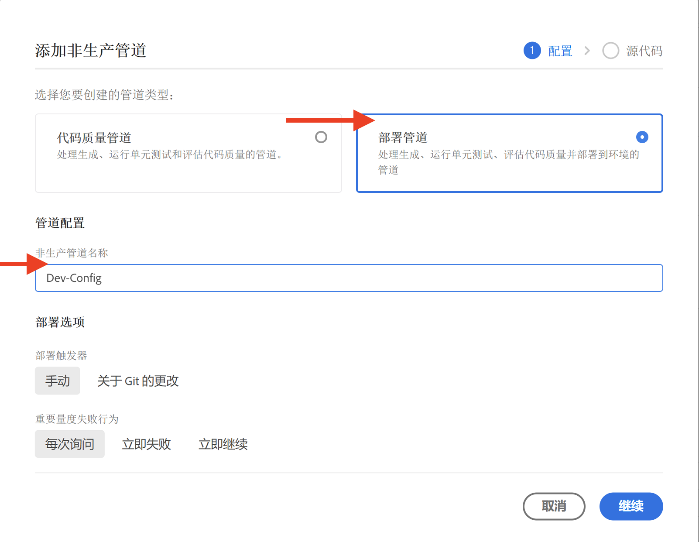
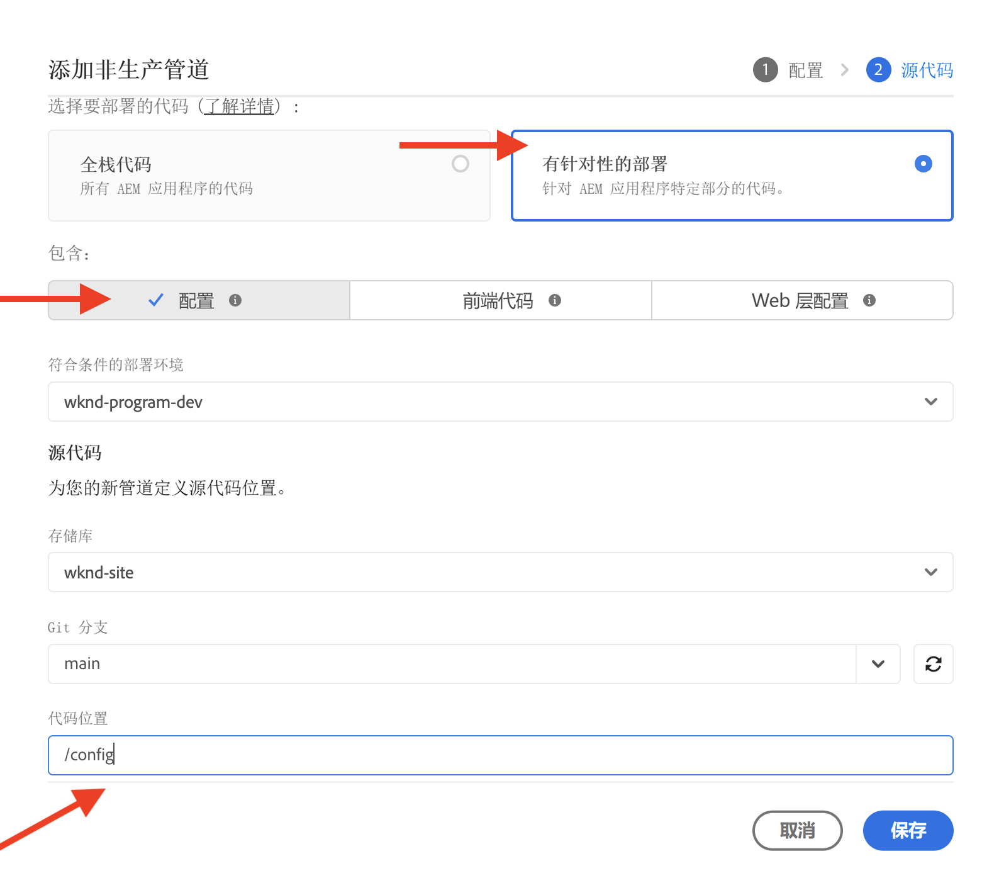

# 如何设置流量过滤规则（包括 WAF 规则）

了解&#x200B;**如何设置**&#x200B;流量过滤规则（包括 WAF 规则）。阅读有关创建、部署、测试和分析结果的信息。

>[!VIDEO](https://video.tv.adobe.com/v/3425407?quality=12&learn=on)

## 设置

设置过程包括以下内容：

- 使用适当的 AEM 项目结构和配置文件来&#x200B;_创建规则_。
- 使用 Adobe Cloud Manager 的配置管道来&#x200B;_部署规则_。
- 使用各种工具生成流量的&#x200B;_测试规则_。
- 使用 AEMCS CDN 日志和仪表板工具&#x200B;_分析结果_。

### 在 AEM 项目中创建规则

要创建规则，请按照以下步骤操作：

1. 在 AEM 项目的顶层，创建一个名为 `config` 的文件夹。

1. 在 `config` 文件夹中，创建一个名为 `cdn.yaml` 的新文件。

1. 将以下元数据添加到 `cdn.yaml` 文件：

```yaml
kind: CDN
version: '1'
metadata:
  envTypes:
    - dev
    - stage
    - prod
data:
  trafficFilters:
    rules:
```

查看 AEM Guides WKND Sites 项目中的 `cdn.yaml` 文件示例：

{width="800" zoomable="yes"}

### 通过 Cloud Manager 部署规则 {#deploy-rules-through-cloud-manager}

要部署规则，请按照以下步骤操作：

1. 在 [my.cloudmanager.adobe.com](https://my.cloudmanager.adobe.com/) 上登录到 Cloud Manager 并选择适当的组织和项目。

1. 导航到&#x200B;_项目概述_&#x200B;页面中的&#x200B;_管道_&#x200B;信息卡，并单击 **+添加**&#x200B;按钮，然后选择所需的管道类型。

   

   在上述示例中，由于使用的是开发环境，因此出于演示目的，选择了&#x200B;_添加非生产管道_。

1. 在&#x200B;_添加非生产管道_&#x200B;对话框中，选择并输入以下详细信息：

   1. 配置步骤：

      - **类型**：部署管道
      - **管道名称**：Dev-Config

      

   2. 源代码步骤：

      - **要部署的代码**：有针对性的部署
      - **包括**：配置
      - **部署环境**：您的环境名称，例如 wknd-program-dev。
      - **存储库**：管道应从哪个 Git 存储库检索代码；例如，`wknd-site`
      - **Git 分支**：Git 存储库分支的名称。
      - **代码位置**：`/config`，对应于上一步中创建的顶级配置文件夹。

      

### 通过生成流量来测试规则

为了测试规则，市面上有各种第三方工具可供选择，而您的组织可能也有偏好的工具。为了进行演示，我们将使用以下工具：

- 使用 [Curl](https://curl.se/) 进行基本测试，如调用 URL 和检查响应代码。

- [Vegeta](https://github.com/tsenart/vegeta) 将执行拒绝服务 (DOS)。按照 [Vegeta GitHub](https://github.com/tsenart/vegeta#install) 中的安装说明进行操作。

- 使用 [Nikto](https://github.com/sullo/nikto/wiki) 来查找潜在问题和安全漏洞，如 XSS、SQL 注入等。请按照 [Nikto GitHub](https://github.com/sullo/nikto) 上的安装说明进行操作。

- 通过运行以下命令，验证工具是否已安装且可在终端中使用：

  ```shell
  # Curl version check
  $ curl --version
  
  # Vegeta version check
  $ vegeta -version
  
  # Nikto version check
  $ cd <PATH-OF-CLONED-REPO>/program
  ./nikto.pl -Version
  ```

### 使用仪表板工具分析结果

在创建、部署和测试规则后，您可以使用 **CDN** 日志和 **AEMCS-CDN-Log-Analysis-Tooling** 来分析结果。该工具提供了一组仪表板，用于可视化 Splunk 和 ELK（Elasticsearch、Logstash和Kibana）堆栈的结果。

该工具可以从 [AEMCS-CDN-Log-Analysis-Tooling](https://github.com/adobe/AEMCS-CDN-Log-Analysis-Tooling) GitHub 存储库中克隆。然后，按照说明为您首选的可观察性工具安装并加载 **CDN 流量仪表板**&#x200B;和 **WAF 仪表板**。

在本教程中，我们使用的是 ELK 堆栈。请按照[用于 AEMCS CDN 日志分析的 ELK Docker 容器](https://github.com/adobe/AEMCS-CDN-Log-Analysis-Tooling/blob/main/ELK/README.md)说明来设置 ELK 堆栈。

- 加载示例仪表板后，您的 Elastic 仪表板工具页面应如下所示：

  

>[!NOTE]
>
>    由于尚未摄取 AEMCS CDN 日志，因此仪表板为空。


## 下一步

在[示例与结果分析](./examples-and-analysis.md)章节中，使用 AEM WKND Sites 项目，学习如何声明包括 WAF 规则在内的流量过滤规则。
