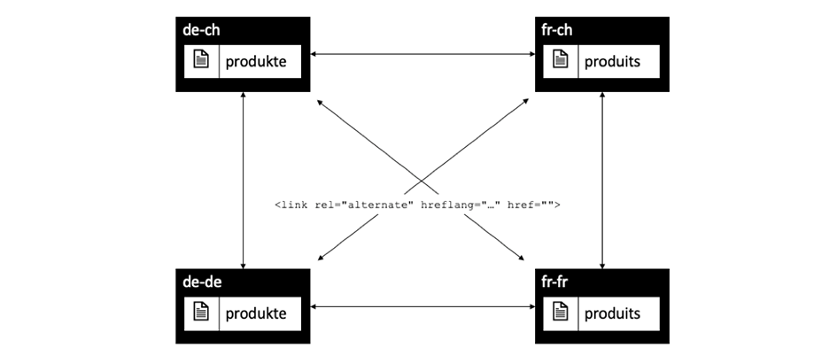
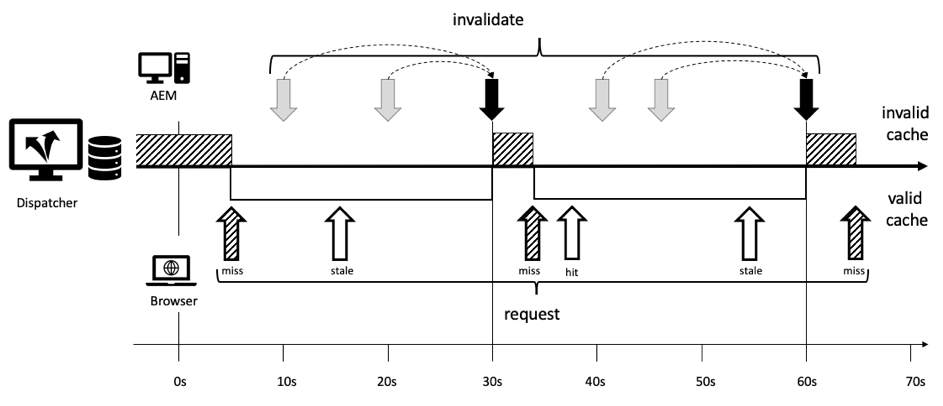

# 第1章 — Dispatcher概念、模式和反模式

## 概述

本章简要介绍Dispatcher的历史和机制，并讨论这会如何影响AEM开发人员如何设计其组件。

## 为什么开发人员应关注基础架构

Dispatcher是大多数（如果不是全部）AEM安装的重要组成部分。 您可以找到许多讨论如何配置Dispatcher以及提示和技巧的在线文章。

但是，这些零星的信息总是从非常技术性的层面开始 — 假设您已经知道要做什么，因此只提供有关如何实现所需内容的详细信息。 我们从未找到任何概念性文章来描述&#x200B;_什么是_&#x200B;以及为什么是，以及您使用调度程序可以执行哪些操作，但不能执行哪些操作。

### 反模式：Dispatcher作为后想

这种基本信息的缺乏导致了许多反模式。我们在许多AEM项目中看到过：

1. 由于Dispatcher安装在Apache Web Server中，因此配置它是项目中“Unix gods”的作业。 “凡人Java开发者”不必担心这个问题。

2. Java开发人员需要确保他的代码可正常工作……调度程序稍后会神奇地使其变快。 调度程序始终是事后才考虑的问题。 然而，这种做法并不奏效。 开发人员在设计代码时必须考虑调度程序。 他需要知道它的基本概念才能做到这点。

### “先让它工作，然后让它快”并不总是正确的

您可能听过编程建议&#x200B;_“首先使其正常工作 — 然后使其快速运行。”_。这并非完全错误。 但是，如果没有正确的上下文，它往往被误解并且无法正确应用。

该建议应避免开发人员过早优化代码，此类代码可能永远不会运行，或者运行非常少，以至于优化的影响力不足以证明有理由进行优化。 此外，优化会导致代码更加复杂，从而引入错误。 因此，如果您是开发人员，请不要在微优化每行代码上花费太多时间。 只需确保您选择了正确的数据结构、算法和库，并等待探查器的热点分析，以查看更彻底的优化在哪些情况下可以提高整体性能。

### 架构决策和工件

然而，在“架构”决策方面，“先让它运作，然后让它快起来”的建议是完全错误的。 什么是体系结构决策？ 简言之，它们是昂贵、困难和/或事后不可能改变的决定。 请记住，这种“昂贵”有时等同于“不可能”。  例如，当项目预算不足时，不可能实施成本高昂的更改。 对的基础结构变化是这一类别中第一个出现在多数人脑海中的变化。 不过，还有另外一种“建筑”工艺品，它们可能会变得非常讨厌改变：

1. 位于应用程序“中心”的代码段，许多其他代码段都依赖该代码段。 更改这些组件时，需要一次性更改并重新测试所有依赖项。

2. 伪像，涉及一些与时间相关的异步场景，在这种场景中，输入 — 以及系统的行为可能非常随机地变化。 变化可能会产生无法预料的影响，而且可能很难测试。

3. 在系统的所有部分和部件中反复使用和重复使用的软件模式。 如果软件模式被证明是次优的，则所有使用该模式的工件都需要重新编码。

还记得吗？ 在本页上，我们说过Dispatcher是AEM应用程序的重要组成部分。 对Web应用程序的访问非常随机，用户来往于不可预测的时间。 最终 — 所有内容将（或应该）缓存在Dispatcher中。 因此，如果您仔细研究，您可能已经意识到，缓存可以视为“架构”构件，因此应该被团队的所有成员、开发人员和管理员所理解。

我们并不是说开发人员应该实际配置Dispatcher。 他们需要了解概念（尤其是边界），以确保Dispatcher也能利用他们的代码。

Dispatcher不会奇迹般地提高代码速度。 开发人员需要在创建组件时考虑Dispatcher。 因此，他需要知道它是如何运作的。

## Dispatcher缓存 — 基本原则

### Dispatcher用作缓存Http — 负载平衡器

Dispatcher是什么？为什么它最初被称为“Dispatcher”？

Dispatcher是

* 首先是缓存

* 反向代理

* 用于Apache httpd webserver的模块，用于为Apache的多功能性添加AEM相关功能，并与所有其他Apache模块（例如SSL甚至SSI包含，我们将在后面看到）一起平稳运行

在Web的早期，一个网站可能会有几百个访客。 一个Dispatcher的设置，“已调度”或平衡多台AEM发布服务器的请求负载，这通常就足够了 — 因此，名称为“Dispatcher”。 但是，这种设置已经不再经常使用。

我们将在本文后面看到设置Dispatcher和Publish系统的不同方法。 首先，我们来了解一些http缓存基础知识。


*Dispatcher缓存的基本功能*

<br> 

此处解释了Dispatcher的基础知识。 Dispatcher是一个简单的缓存反向代理，能够接收和创建HTTP请求。 正常的请求/响应周期如下所示：

1. 用户请求页面
2. Dispatcher会检查它是否已具有该页面的渲染版本。 假设这是对此页面的第一个请求，并且Dispatcher找不到本地缓存副本。
3. Dispatcher从发布系统请求页面
4. 在发布系统中，页面通过JSP或HTL模板渲染
5. 页面将返回到Dispatcher
6. Dispatcher将缓存页面
7. Dispatcher会将页面返回到浏览器
8. 如果再次请求同一页面，则可以直接从Dispatcher缓存中提供该页面，而无需在发布实例上重新渲染该页面。 这节省了用户和CPU在发布实例上循环的等待时间。

我们在最后一节中谈到“页面”。 但同样的方案也适用于其他资源，如图像、CSS文件、PDF下载等。

#### 数据缓存方式

Dispatcher模块利用托管Apache Server提供的工具。 HTML-pages、下载和图片等资源作为简单文件存储在Apache文件系统中。 就是这么简单。

文件名由所请求资源的URL派生。 如果您请求文件`/foo/bar.html`，该文件例如存储在/`var/cache/docroot/foo/bar.html`下。

原则上，如果所有文件都缓存并因此静态存储在Dispatcher中，则可以拉取Publish系统的插件，而Dispatcher将充当一个简单的Web服务器。 但这只是为了说明原则。 现实生活要复杂得多。 您不能缓存所有内容，而且缓存永远不会完全“满”，因为由于渲染过程的动态性，资源数量可能是无限的。 静态文件系统的模型有助于粗略了解Dispatcher的功能。 并且它有助于解释Dispatcher的限制。

#### AEM URL结构和文件系统映射

要更详细地了解Dispatcher，让我们重新访问一个简单示例URL的结构。  让我们看下面的示例，

`http://domain.com/path/to/resource/pagename.selectors.html/path/suffix.ext?parameter=value&otherparameter=value#fragment`

* `http`表示协议

* `domain.com`是域名

* `path/to/resource`是资源存储在CRX中的路径，随后存储在Apache Server的文件系统中

从这里，AEM文件系统与Apache文件系统之间有些许不同。

在AEM中，

* `pagename`是资源标签

* `selectors`表示Sling中使用的多个选择器以确定资源的呈现方式。 URL可以具有任意数量的选择器。 它们以句点分隔。 例如，选择器部分可能类似于“french.mobile.fancy”。 选择器只能包含字母、数字和破折号。

* `html`作为最后一个“选择器”称为扩展。 在AEM/Sling中，它还会部分确定渲染脚本。

* `path/suffix.ext`是一个类似路径的表达式，可以作为URL的后缀。  可以在AEM脚本中使用它来进一步控制资源的呈现方式。 稍后我们将提供有关此部分的完整部分。 目前，了解您可以将其用作附加参数应该已经足够。 后缀必须具有扩展名。

* `?parameter=value&otherparameter=value`是URL的查询节。 它用于将任意参数传递给AEM。 无法缓存包含参数的URL，因此应限制仅使用绝对必需的参数。

* `#fragment`，URL的片段部分没有传递到AEM，它仅在浏览器中使用；在JavaScript框架中作为“路由参数”使用，或者跳转到页面上的特定部分。

在Apache中（*引用以下图表*），

* `pagename.selectors.html`在缓存的文件系统中用作文件名。

如果URL具有后缀`path/suffix.ext`，则

* `pagename.selectors.html`已创建为文件夹

* `path` `pagename.selectors.html`文件夹中的文件夹

* `suffix.ext`是`path`文件夹中的文件。 注意：如果后缀没有扩展名，则不会缓存文件。

从Dispatcher获取URL后

从Dispatcher获取URL后&#x200B;*文件系统布局*

<br> 

#### 基本限制

URL、资源和文件名之间的映射非常简单。

不过，你可能注意到一些陷阱，

1. URL可能会变得很长。 在本地文件系统上添加`/docroot`的“路径”部分很容易超出某些文件系统的限制。 在Windows上的NTFS中运行Dispatcher是一项挑战。 不过，使用Linux是安全的。

2. URL可以包含特殊字符和变音。 这通常不是Dispatcher的问题。 但请记住，URL会在应用程序的多个位置进行解释。 我们经常会看到某个应用程序表现出奇怪的行为 — 只是为了找出一段很少使用的（自定义）代码未经过彻底测试而出现的特殊字符。 如果你可以的话，你应该避开他们。 如果做不到，请计划全面测试。

3. 在CRX中，资源包含子资源。 例如，一个页面将具有多个子页面。 这在文件系统中无法匹配，因为文件系统具有文件或文件夹。

#### 不缓存不带扩展名的URL

URL必须始终具有扩展名。 不过，您可以在AEM中处理不带扩展名的URL。 这些URL将不会缓存在Dispatcher中。

**示例**

`http://domain.com/home.html`是&#x200B;**可缓存**

`http://domain.com/home`是&#x200B;**不可缓存**

当URL包含后缀时，将应用相同的规则。 后缀需要具有扩展才能缓存。

**示例**

`http://domain.com/home.html/path/suffix.html`是&#x200B;**可缓存**

`http://domain.com/home.html/path/suffix`是&#x200B;**不可缓存**

您可能会问，如果资源部分没有扩展名，但后缀有扩展名，会出现什么情况？ 在这种情况下，URL完全没有后缀。 查看下一个示例：

**示例**

`http://domain.com/home/path/suffix.ext`

`/home/path/suffix`是资源的路径……因此URL中没有后缀。

**结论**

始终将扩展添加到路径和后缀。 了解SEO的人有时会辩称，这会在搜索结果中将你排在后面。 但是，未缓存的网页速度会非常慢，排名会进一步下降。

#### 冲突的后缀URL

假定您有两个有效的URL

`http://domain.com/home.html`

和

`http://domain.com/home.html/suffix.html`

它们在AEM中绝对有效。 在本地开发计算机上，您不会看到任何问题(没有Dispatcher)。 在UAT或负载测试中，您很可能也不会遇到任何问题。 我们面临的问题是如此微妙，以至于通过了大多数测试。  当您处于高峰期并且处理时间有限、可能没有服务器访问权限或资源无法修复它时，它将给您带来沉重打击。 我们在那里……

那么……有什么问题吗？

文件系统中的`home.html`可以是文件或文件夹。 但并非两者都与AEM中的情况相同。

如果您先请求`home.html`，则将其创建为文件。

对`home.html/suffix.html`的后续请求返回有效结果，但由于文件`home.html`在文件系统中“阻止”该位置，因此无法再次创建`home.html`作为文件夹，因此不会缓存`home.html/suffix.html`。


*文件系统中的文件阻止位置阻止缓存子资源*

<br> 

如果反过来，首先请求`home.html/suffix.html`，然后先将`suffix.html`缓存在文件夹`/home.html`下。 但是，当您随后请求`home.html`作为资源时，此文件夹会被删除并替换为文件`home.html`。


*当父级作为资源获取时删除路径结构*

<br> 

因此，缓存的结果完全是随机的，取决于传入请求的顺序。 让事情变得更加棘手的是，您通常有多个调度程序。 此外，在不同的Dispatcher中，性能、缓存命中率和行为可能会有所不同。 如果您想了解网站无响应的原因，您需要确保查看的是包含不幸缓存顺序的正确Dispatcher。 如果你正在查看的Dispatcher幸运地拥有更有利的请求模式，那么你将迷失在寻找问题的过程中。

#### 避免冲突的URL

当您为资源使用不同的扩展名且带有后缀时，您可以避免“冲突的URL”，在这种情况下，文件夹名称和文件名会在文件系统中“竞争”相同的路径。

**示例**

* `http://domain.com/home.html`

* `http://domain.com/home.dir/suffix.html`

两者都是可以高速缓存的，


在请求后缀或完全避免使用后缀时，为资源选择专用扩展“dir”。 在极少数情况下，它们非常有用。 而且可以轻松地正确实施这些案例。  正如我们将在下一章中讨论缓存失效和刷新时所看到的。

#### 不可缓存的请求

让我们查看上一章的快速摘要，以及一些更多例外情况。 如果URL配置为可缓存，并且是GET请求，则Dispatcher可以缓存URL。 不能在以下异常之一下缓存它。

**可缓存的请求**

* 请求配置为可在Dispatcher配置中缓存
* 请求是一个普通的GET请求

**不可缓存的请求或响应**

* 配置拒绝缓存的请求（路径、模式、MIME类型）
* 返回“Dispatcher： no-cache”标头的响应
* 返回“Cache-Control： no-cache|private”标头的响应
* 返回“Pragma： no-cache”标头的响应
* 使用查询参数请求
* 不带扩展名的URL
* 后缀不含扩展的URL
* 返回200以外的状态代码的响应
* POST请求

## 使缓存失效并刷新

### 概述

最后一章列出了大量例外，即Dispatcher无法缓存请求时的情况。 但还需要考虑以下事项：仅由于Dispatcher _可以_&#x200B;缓存请求，这并不一定意味着它&#x200B;_应该_。

关键是：缓存通常很容易。 Dispatcher只需要存储响应的结果，并在下次传入非常相同的请求时返回该结果。 对吧？ 错了！

难点在于缓存的&#x200B;_无效_&#x200B;或&#x200B;_刷新_。 当资源发生更改时，Dispatcher需要查明相关信息 — 并且需要再次渲染。

乍一看，这任务似乎微不足道……但事实并非如此。 进一步阅读，您将发现单个资源和简单资源以及依赖于多个资源的高度网格结构的页面之间的一些棘手差异。

### 简单资源和刷新

我们已将AEM系统设置为在收到特殊的“缩略图”选择器的请求时，动态地为每个图像创建缩略图演绎版。

`/content/dam/path/to/image.thumb.png`

当然，我们还会提供一个URL，用于为原始图像提供无选择器的URL：

`/content/dam/path/to/image.png`

如果我们同时下载缩略图和原始图像，我们最终得到的结果将是，

```
/var/cache/dispatcher/docroot/content/dam/path/to/image.thumb.png

/var/cache/dispatcher/docroot/content/dam/path/to/image.png
```

在Dispatcher的文件系统中。

现在，用户上传并激活该文件的新版本。 最终从AEM向Dispatcher发送失效请求，

```
GET /invalidate
invalidate-path:  /content/dam/path/to/image

<no body>
```

失效很简单：向Dispatcher上的特殊“/invalidate”URL发出简单GET请求。 不需要HTTP主体，“payload”只是“invalidate-path”标头。 另请注意，标头中的invalidate-path是AEM知道的资源，而不是Dispatcher缓存的一个或多个文件。 AEM只了解资源。 请求资源时，在运行时使用扩展、选择器和后缀。 AEM不会就资源上使用的选择器执行任何记账，因此在激活资源时，它只需要知道资源路径即可。

就我们的情况来说，这已经足够了。 如果某个资源已更改，我们可以放心地假设，该资源的所有演绎版也已更改。 在我们的示例中，如果图像已更改，则也会呈现新的缩略图。

Dispatcher可以安全地删除包含其缓存的所有演绎版的资源。 它会做一些事情，

`$ rm /content/dam/path/to/image.*`

正在删除`image.png`和`image.thumb.png`以及与该模式匹配的所有其他演绎版。

非常简单，只要您只使用一个资源来响应请求即可。

### 引用和网格化内容

#### 网格化内容问题

与上载到AEM的图像或其他二进制文件不同，HTML页面不是孤立的动物。 它们成群结队地生活，通过超链接和引用彼此高度互联。 简单的链接无害，但在我们谈论内容引用时它会变得很棘手。 页面上无处不在的顶部导航或Teaser是内容引用。

#### 内容引用以及它们成为问题的原因

让我们来看一个简单的例子。 一家旅行社有一个宣传去加拿大旅行的网页。 此促销活动在其他两个页面的Teaser部分中进行，即“主页”页面和“冬季特惠”页面。

由于两个页面显示相同的Teaser，因此没有必要要求作者为每个应显示它的页面多次创建Teaser。 相反，目标页面“加拿大”在页面属性中保留一个部分，以便为Teaser提供信息 — 或者更好地提供完全呈现该Teaser的URL：

`<sling:include resource="/content/home/destinations/canada" addSelectors="teaser" />`

或

`<sling:include resource="/content/home/destinations/canada/jcr:content/teaser" />`


在AEM上，它只能发挥魅力作用，但是如果您在Publish实例中使用Dispatcher，则会出现奇怪的情况。

想象一下，您已发布您的网站。 “加拿大”页面上的标题为“加拿大”。 当访客请求您的主页（带有对该页面的Teaser引用）时，“加拿大”页面上的组件将呈现以下内容

```
<div class="teaser">
  <h3>Canada</h3>
  
</div>
```

*到*&#x200B;主页。 主页由Dispatcher作为静态.html文件存储，包括Teaser及其位于文件中的标题。

现在，营销人员了解到，Teaser头条应该可以操作。 因此，他决定将标题从“Canada”更改为“Visit Canada”，并更新了图片。

他出版了编辑过的《加拿大》页面，并翻阅了以前出版的主页来查看自己的改动。 但是 — 那里什么都没有改变。 它仍然显示旧的Teaser。 他仔细查了一下“冬季特惠”。 该页面以前从未请求过，因此不会静态缓存到Dispatcher中。 因此，此页面由Publish最新呈现，现在包含新的“访问加拿大”Teaser。


*Dispatcher在主页中存储过时的包含内容*

<br> 

发生了什么？ Dispatcher存储页面的静态版本，该页面包含在呈现时已从其他资源提取的所有内容和标记。

Dispatcher只是一个基于文件系统的Web服务器，它速度快，但相对简单。 如果包含的某个资源发生更改，则它不会意识到这一点。 它仍会链接到呈现包含页面时存在的内容。

“冬季特惠”页面尚未呈现，因此Dispatcher上没有静态版本，因此在应请求重新呈现时与新的Teaser一起显示。

您可能会认为，当资源发生更改时，Dispatcher将在呈现和刷新使用此资源的所有页面时跟踪它访问的每个资源。 但是，Dispatcher不呈现页面。 渲染由发布系统执行。 Dispatcher不知道哪些资源进入渲染的.html文件。

还是不相信吗？ 您可能会认为&#x200B;*“必须有实现某种依赖项跟踪的方法”*。 有，或者更准确地说&#x200B;*有*。 公报3：AEM的曾曾祖父在&#x200B;_会议_&#x200B;中实施了一个依赖关系跟踪器，用于呈现页面。

在请求期间，通过此会话获得的每个资源都作为当前所渲染URL的依赖项进行跟踪。

但事实证明，追踪这些依赖性是非常昂贵的。 人们很快发现，如果他们完全关闭依赖项跟踪功能，并依赖在更改一个html页面后重新呈现所有html页面，则网站速度更快。 此外，这一方案也不完美 — 过程中存在许多陷阱和例外。 在某些情况下，您不是使用请求默认会话获取资源，而是使用管理员会话获取一些辅助资源来呈现请求。 这些依赖项通常不会被跟踪，并导致令人头疼的问题，并且运营团队会打电话要求手动刷新缓存。 如果他们有标准程序那么做，那你就很幸运了。 途中还有更多的哥特教，不过，我们别再回忆了。 这可以追溯到2005年。 最终，该功能在公报4中被默认停用，未能重新成为后来成为AEM的继承CQ5。

### 自动失效

#### 完全刷新比依赖项跟踪更便宜时

由于CQ5，我们或多或少地完全依赖在只有一个页面发生更改时整个网站失效。 此功能称为“自动失效”。

但是，为什么扔掉并重新呈现数百个页面会比执行适当的依赖项跟踪和部分重新呈现更便宜？

主要原因有二：

1. 在普通网站上，只频繁请求一小部分页面。 因此，即使您丢弃了所有渲染的内容，事后也只能请求几十个内容。 在实际请求页面时，页面长尾的呈现可以随着时间分发。 因此，实际上，渲染页面上的负载没有您预期的那样高。 当然，总会有例外……我们稍后将讨论一些技巧，如何处理在大型网站上具有空Dispatcher缓存的均匀分布负载。

2. 所有页面仍通过主导航进行连接。 所以几乎所有的页面最终都是相互依赖的。 这意味着即使是最智能的依赖关系跟踪器也会发现我们已经知道的信息：如果其中一个页面发生更改，您必须使所有其他页面失效。

你不相信吗？ 让我们来说明最后一点。

我们使用了与上一个示例相同的参数，用于Teaser引用远程页面的内容。 直到现在，我们才使用了一个更极端的示例：自动渲染的主导航。 与Teaser一样，从链接的或“远程”页面中绘制导航标题作为内容引用。 远程导航标题不存储在当前呈现的页面中。 您应该记住，导航会在您网站中的每个页面上呈现。 因此，在有主导航的所有页面上，都会反复使用一个页面的标题。 如果要更改导航标题，则只需在远程页面上更改一次导航标题，而不是在引用该页面的每个页面上更改一次。

因此，在我们的示例中，导航通过使用目标页面的“NavTitle”在导航中渲染名称来网格化所有页面。 “冰岛”的导航标题摘自“冰岛”页面，并呈现到每个具有主导航的页面中。


*主导航通过拉动“NavTitles”不可避免地将所有页面的内容网格化在一起*

<br> 

如果您将冰岛页面上的NavTitle从“Iceline”更改为“Beautiful Iceline”，则会在所有其他页面的主菜单上立即更改该标题。 因此，在该更改之前呈现和缓存的页面都将变得陈旧并需要失效。

#### 如何实施自动失效： .stat文件

现在，如果您有一个包含数千个页面的大型网站，则可能需要相当长的时间来循环访问所有页面并将其实际删除。 在此期间，Dispatcher可能会无意中提供过时的内容。 更糟糕的是，在访问缓存文件时可能会发生一些冲突，可能是某个页面刚被删除时请求了，或者某个页面由于立即后续激活后发生第二次失效而再次被删除。 想想会有多乱。 幸好事情不是这样的。 Dispatcher巧妙地避免了这一情况：它不会删除数百个文件，而是在发布文件时将一个简单的空文件放入文件系统的根目录中，因此所有依赖的文件都被视为无效。 此文件称为“statfile”。 statfile是一个空文件 — 与statfile相关的只是其创建日期。

Dispatcher中所有文件的创建日期都早于statfile，并且在上次激活（和失效）之前已呈现，因此被视为“无效”。 虽然它们仍然在文件系统中实际存在，但Dispatcher会忽略它们。 它们已经“过时”了。 每当请求旧资源时，Dispatcher都会请求AEM系统重新渲染页面。 然后，新渲染的页面将存储在文件系统中 — 现在，具有新的创建日期，并且再次刷新。


*.stat文件的创建日期定义哪些内容已过时哪些内容是新鲜的*

<br> 

你可能会问，为什么它被称为“.stat”？ 也可能不是“.invalidated”？ 可以想象，将文件保存在您的文件系统上可帮助Dispatcher确定哪些资源可以&#x200B;*静态提供* — 就像从静态Web服务器提供一样。 这些文件不再需要动态呈现。

然而，这个名字的真正本质并不那么隐喻。 它派生自Unix系统调用`stat()`，该调用返回文件的修改时间（以及其他属性）。

#### 简单验证和自动验证混合

但等等，我们之前说过，单个资源会被物理删除。 现在我们说，在Dispatcher眼中，更新的statfile实际上将使它们失效。 那为什么要先进行物理删除？

答案很简单。 通常，这两种策略是并行使用的，但适用于不同类型的资源。 二进制资产（如图像）是独立的。 他们未连接到其他资源，因此需要呈现其信息。

另一方面，HTML页面是高度相互依赖的。 因此，您可以对这些应用自动失效。 这是Dispatcher中的默认设置。 属于失效资源的所有文件都会被实际删除。 此外，以“.html”结尾的文件会自动失效。

Dispatcher根据文件扩展名决定是否应用自动失效方案。

可配置自动失效的文件结尾。 理论上，您可以包含自动失效的所有扩展。 但请记住，这需要付出高昂的代价。 您不会看到过时的资源无意中交付，但交付性能因过度失效而大幅降低。

例如，假设您实施一个方案，其中动态渲染PNG和JPG并依赖其他资源来实现这一点。 您可能希望将高分辨率图像重新缩放为较小的与Web兼容的分辨率。 在这样做时，还会更改压缩率。 在此示例中，分辨率和压缩率不是固定常量，而是使用图像的组件中的可配置参数。 现在，如果更改此参数，则需要使图像失效。

没问题 — 我们刚刚了解到，可以将图像添加到自动失效中，并且每当发生任何更改时，都始终重新渲染图像。

#### 把婴儿和浴水一起扔掉

没错，这是个大问题。 请再次阅读最后一段。 “……每当发生任何更改时都会更新渲染的图像。” 如您所知，一个良好的网站会不断变化；在这里添加新内容，在那里更正打字错误，在其他地方调整Teaser。 这意味着您的所有图像都会不断失效，需要重新渲染。 别小看了。 在本地开发计算机上，动态渲染和传输图像数据的操作以毫秒为单位。 您的生产环境需要每秒执行一百倍的重复操作。

让我们在此处明确一点，当html页面发生更改时，您的jpg需要重新渲染，反之亦然。 只有一个“存储桶”的文件可自动失效。 它整体被冲洗。 无需分解成更详细的结构。

自动失效默认情况下保持为“.html”是有充分理由的。 目标是让那个桶尽可能的小。 不要为了安全起见，就为了让一切失效，把婴儿和浴水一起扔掉。

应在该资源的路径中提供自包含资源。 这能帮助我们失效很多。 保持简单，不要创建映射方案，如“/x/y/z”提供的资源/a/b/c。 使您的组件可与默认的Dispatcher自动失效设置配合使用。 请不要尝试在Dispatcher中修复设计不当且过度失效的组件。

##### 自动失效的例外：ResourceOnly失效

Dispatcher的失效请求通常由复制代理从发布系统触发。

如果您对依赖项信心十足，则可以尝试构建自己的失效复制代理。

本指南中介绍详细信息会有些困难，但我们希望至少给您一些提示。

1. 真的知道你在做什么。 要正确处理无效是很困难的。 这就是自动失效如此严格的原因之一；为了避免提供过时内容。

2. 如果您的代理发送HTTP标头`CQ-Action-Scope: ResourceOnly`，则意味着此单个失效请求不会触发自动失效。 此([https://github.com/cqsupport/webinar-dispatchercache/tree/master/src/refetching-flush-agent/refetch-bundle](https://github.com/cqsupport/webinar-dispatchercache/tree/master/src/refetching-flush-agent/refetch-bundle))段代码可能是您自己的复制代理的良好起点。

3. `ResourceOnly`，仅阻止自动失效。 要实际执行必要的依赖关系解析和失效操作，您必须自行触发失效请求。 您可能需要检查包Dispatcher刷新规则([https://adobe-consulting-services.github.io/acs-aem-commons/features/dispatcher-flush-rules/index.html](https://adobe-consulting-services.github.io/acs-aem-commons/features/dispatcher-flush-rules/index.html))以了解如何实际发生这种情况。

我们不建议您构建依赖关系解析方案。 只是努力太多而收效甚微 — 正如之前所说，犯错的次数太多了。

您应该做的是，找出哪些资源对其他资源没有任何依赖性，并且可以在不自动失效的情况下失效。 不过，您无需为此使用自定义复制代理。 只需在Dispatcher配置中创建一个自定义规则，以便将这些资源排除在自动失效之外。

我们说主导航或Teaser是依赖项的来源。  — 如果您异步加载导航和Teaser，或在Apache中使用SSI脚本包含它们，则您将没有要跟踪的依赖项。 当我们讨论“Sling Dynamic Include”时，我们将在本文档后面详细介绍异步加载组件。

这同样适用于弹出窗口或加载到灯箱中的内容。 这些片段也很少具有导航（也称为“依赖项”），并且可以作为单个资源失效。

## 在考虑Dispatcher的情况下构建组件

### Dispatcher力学在现实世界中的应用

最后我们介绍了Dispatcher的基本力学原理以及它的一般工作方式和局限性。

现在，我们希望将这些机械应用于您很可能可以在项目要求中找到的一类组件。 我们特意挑选组件，以展示您迟早也会遇到的问题。 不要害怕 — 并非所有组件都需要我们拿出那么多的考虑。 但是，如果您认为需要构建此类组件，那么您充分了解后果，并知道如何处理这些后果。

### 假脱机组件（防）模式

#### 响应式图像组件

让我们说明具有互连二进制文件的组件的共同模式（或反模式）。 我们将为“响应式图像”创建一个组件“respi”。 此组件应该能够将显示图像调整到显示它的设备。 在台式机和平板电脑上，它可显示图像的完整分辨率；在手机上，它可显示裁剪较窄的较小版本，甚至可显示完全不同的主题（在响应式世界中，这被称为“艺术方向”）。

这些资源已上传到AEM的DAM区域，并且在响应图像组件中只有&#x200B;_引用_。

响应组件既负责标记的呈现，又负责传送二进制图像数据。

我们在此处实施的方式是我们在许多项目中看到的通用模式，即使AEM核心组件之一也基于该模式。 因此，您作为开发人员很可能会调整该模式。 在封装方面，它有它的最佳之处，但需要付出大量努力才能使其为Dispatcher做好准备。 我们稍后将讨论如何缓解此问题的几个选项。

我们把这里使用的模式称为“后台处理程序模式”，因为问题可以追溯到《公报3》的早期，当时有一个方法“后台处理程序”，可以调用资源将其二进制原始数据流式传输到响应中。

原来的“假脱机”一词实际上是指共享慢速脱机外围设备，例如打印机，因此此处无法正确应用。 但不管怎样，我们喜欢这个词，因为它在网络世界里很少被区分。 而且每种模式都应该有一个可区别的名称，对吧？ 这到底是反模式还是反模式，由你来决定。

#### 实施

以下是实施我们的响应式图像组件的方式：

该组件包括两部分：第一部分渲染图像的HTML标记，第二部分“卷轴”参考图像的二进制数据。 由于这是一个具有响应式设计的现代网站，因此我们呈现的不是简单的``标记，而是`<picture/>`标记中的一组图像。 对于每个设备，我们都会将两个不同的图像上传到DAM中，并从图像组件中引用它们。

该组件具有三个渲染脚本（在JSP、HTL中实施或作为Servlet），每个脚本都使用专用选择器寻址：

1. `/respi.jsp` — 没有用于呈现HTML标记的选择器
2. `/respi.img.java`以呈现桌面版本
3. `/respi.img.mobile.java`渲染移动设备版本。


该组件放置在主页的parsys中。 CRX中生成的结构如下图所示。

CRX中响应图像的资源结构

CRX中响应图像的资源结构&#x200B;**

<br> 

组件标记将按如下方式呈现，

```plain
  #GET /content/home.html

  <html>

  …

  <div class="responsive-image>

  <picture>
    <source src="/content/home/jcr:content/par/respi.img.mobile.jpg" …/>
    <source src="/content/home/jcr:content/par/respi.img.jpg …/>

    …

  </picture>
  </div>
  …
```

而且……我们已经完成了精心封装的组件。

#### 正在使用的响应图像组件

现在，用户通过Dispatcher请求页面 — 以及资产。 这会导致Dispatcher文件系统中的文件，如下所示：


*封装的响应图像组件的缓存结构*

<br> 

考虑用户将两朵花图像的新版本上传并激活到DAM。 AEM将发送失效请求

`/content/dam/flower.jpg`

和

`/content/dam/flower-mobile.jpg`

到Dispatcher。 不过，这些要求都是徒劳的。 内容已缓存为组件子结构下的文件。 这些文件现已失效，但仍可根据请求提供服务。


*结构不匹配，导致内容过时*

<br> 

这种做法还有另外一个注意事项。 假定您在多个页面上使用相同的flower.jpg。 然后，您将在多个URL或文件下缓存相同的资产，

```
/content/home/products/jcr:content/par/respi.img.jpg

/content/home/offers/jcr:content/par/respi.img.jpg

/content/home/specials/jcr:content/par/respi.img.jpg

…
```

每次请求新的未缓存页面时，都会以不同的URL从AEM获取资源。 没有任何Dispatcher缓存和浏览器缓存可以加快交付速度。

#### 假脱机程序图案的亮点

有一个自然的例外，即使采用简单的形式，此模式也很有用：如果二进制文件存储在组件本身，而不是DAM中。 但是，这仅适用于网站上使用一次的图像，并且不会在DAM中存储资产，这意味着您管理资产会很困难。 想象一下，您针对特定资产的使用许可证用完了。 如何确定您使用资源的组件？

看到了吗？ DAM中的“M”表示“管理”，就像在数字资产管理中一样。 您不希望放弃该功能。

#### 结论

从AEM开发人员的角度来看，这种模式看上去非常优雅。 但是，如果把Dispatcher也考虑在内，你可能会同意，这种天真的做法可能还不够。

现在由你们来决定这到底是一种模式还是一种反模式。 也许您已经想到了一些好点子来缓解上面解释的问题？ 很好。 您应该很想知道其他项目是如何解决这些问题的。

### 解决常见的Dispatcher问题

#### 概述

我们来讨论一下如何更便于缓存来实现这一点。 有几个选项。 有时候，你无法选择最佳解决方案。 也许您遇到了一个已经在运行的项目，而您仅有有限的预算可用于解决手头的“缓存问题”，不足以执行全面的重构。 或者，您面临着一个比示例图像组件更复杂的问题。

我们将在以下各节中概述其原则和注意事项。

同样的，这是基于现实生活中的经验。 我们已经在野外看到过这些模式，所以这不是学术练习。 这就是为什么我们给你展示一些反模式，所以你有机会从别人已经犯过的错误中学习。

#### 缓存杀手

>[!WARNING]
>
>这是反模式。 不要使用它。 永远。

您是否曾看到`?ck=398547283745`之类的查询参数？ 它们称为cache-killer (“ck”)。 其思想是，如果添加任何查询参数，将不缓存资源。 此外，如果您添加随机数作为参数的值(例如“398547283745”)，则URL将变得唯一，并且您确保AEM系统和屏幕之间的任何其他缓存都不能缓存。 通常中间嫌犯会是位于Dispatcher前的“清漆”缓存、CDN甚至浏览器缓存。 再说一遍：别这样。 您确实希望尽可能长时间地缓存资源。 快取是你的朋友。 不要杀朋友。

#### 自动失效

>[!WARNING]
>
>这是反模式。 避免将其用于数字资产。 尝试保留Dispatcher的默认配置，即>仅对“.html”文件自动失效

在短期内，您可以将“.jpg”和“.png”添加到Dispatcher中的自动失效配置。 这意味着，每当发生失效时，都需要重新渲染所有“.jpg”、“.png”和“.html”。

如果企业所有者抱怨说他们的更改在实时网站上实现得不够快，则此模式非常容易实施。 但这只能给你争取一些时间，让你想出更复杂的解决方案。

确保您了解对性能的巨大影响。 这会显着降低您网站的运行速度，甚至可能影响稳定性（如果您的网站是一个高负载且经常发生更改的网站，例如新闻门户）。

#### URL指纹

URL指纹看起来像一个缓存杀手。 但事实并非如此。 它不是随机数，而是一个用于表示资源内容的值。 这可以是资源内容的哈希值，更简单的是，可以是上传、编辑或更新资源时的时间戳。

Unix时间戳足以满足实际实施的需要。 为了提高可读性，我们在本教程中使用了更易读的格式： `2018 31.12 23:59 or fp-2018-31-12-23-59`。

不得将指纹用作查询参数，如带有查询参数的URL   无法缓存。 您可以使用选择器或后缀作为指纹。

假设文件`/content/dam/flower.jpg`的`jcr:lastModified`日期为2018年12月31日，即23:59。 带有指纹的URL是`/content/home/jcr:content/par/respi.fp-2018-31-12-23-59.jpg`。

只要不更改引用的资源(`flower.jpg`)文件，此URL将保持稳定。 因此，它可以无限期地缓存，而且它不是缓存杀手。

请注意，此URL需要由响应式图像组件创建和提供。 它不是现成的AEM功能。

这是基本概念。 但是，有一些细节很容易被忽视。

在本例中，组件呈现并缓存到23:59。 现在图像已更改，假设为00:00。  组件&#x200B;_将_&#x200B;在其标记中生成一个新的指纹URL。

你可能认为它&#x200B;_应该_...但事实并非如此。由于只更改了图像的二进制文件，并且未触及包含页面，因此无需重新呈现HTML标记。 因此，Dispatcher使用旧指纹提供页面，从而提供图像的旧版本。


*图像组件比引用的图像更新，未呈现新的指纹。*

<br> 

现在，如果您重新激活了主页（或该站点的任何其他页面），则将更新statfile，Dispatcher将考虑home.html过时，并在图像组件中使用新指纹重新渲染它。

但我们没有激活主页，对吧？ 为什么我们应该激活一个我们无论如何都不会触碰它的页面？ 此外，我们可能没有足够的权限来激活页面，或者审批工作流太长且耗时，我们根本无法在短时间内完成此操作。 那么，该怎么办？

#### 懒惰管理员的工具 — 降低Statfile级别

>[!WARNING]
>
>这是反模式。 仅在短期内使用它，以争取一些时间，并想出更复杂的解决方案。

懒惰的管理员通常会“_将自动失效设置为jpgs，将statfile级别设置为0 — 这始终有助于解决所有类型的_&#x200B;缓存问题。” 您将在技术论坛中找到该建议，并且它有助于解决您的失效问题。

到目前为止，我们还没有讨论statfile级别。 自动失效基本上仅适用于同一子树中的文件。 但问题是，页面和资产通常不位于同一子树中。 页面在`/content/mysite`以下，而资产在`/content/dam`以下。

“statfile级别”定义子树的根节点的深度。 在上面的示例中，级别将为“2”(1=/content，2=/mysite，dam)

将statfile级别“降低”为0的思想基本上是将整个/content树定义为一个、唯一的子树，以使页面和资产处于同一自动失效域中。 因此我们只会在层级的大树上（在docroot“/”处）。 但这样做会在发布内容时自动使服务器上的所有站点失效，即使在完全不相关的站点上也是如此。 相信我们：从长远来看，这是个坏主意，因为这会严重降低您的整体缓存命中率。 您所能做的就是希望AEM服务器有足够的火力，能够在没有缓存的情况下运行。

稍后您将了解更深入的statfile级别的全部好处。

#### 实施自定义失效代理

无论如何 — 我们需要以某种方式告知Dispatcher，如果“.jpg”或“.png”更改为允许使用新URL重新呈现，则HTML-Pages将失效。

例如，我们在项目中看到的是发布系统上的特殊复制代理，每当发布某个站点的图像时，这些代理都会发送该站点的失效请求。

如果可以通过命名惯例从资产的路径中派生出站点的路径，则这样做会很有帮助。

通常，最好将站点和资源路径相匹配，如下所示：

**示例**

```
/content/dam/site-a
/content/dam/site-b

/content/site-a
/content/site-b
```

这样，当您的自定义Dispatcher刷新代理在`/content/dam/site-a`上遇到更改时，可以轻松地将请求发送给/content/site-a并使其失效。

实际上，您指示Dispatcher使用哪条路径失效并不重要，只要它在同一“子树”中的同一网站中即可。 您甚至不必使用真正的资源路径。 它也可以是“虚拟”的：

```
GET /dispatcher-invalidate
Invalidate-path /content/mysite/dummy
```


1. 当DAM中的文件更改时，会触发发布系统上的侦听器

2. 侦听器向Dispatcher发送失效请求。 由于自动失效，我们在自动失效中发送哪条路径并不重要，除非该路径位于网站主页下 — 或者在网站statfile级别更精确。

3. statfile已更新。

4. 下次请求主页时，将重新渲染主页。 新指纹/日期作为附加选择器从图像的lastModified属性中获取

5. 这会隐式创建对新图像的引用

6. 如果图像实际上是请求的，则会在Dispatcher中创建并存储新演绎版


#### 清理的必要性

噢。 已完成。 万岁！

还不太清楚。

那条路，

`/content/mysite/home/jcr:content/par/respi.img.fp-2018-31-12-23-59.jpg`

与任何失效的资源无关。 还记得吗？ 我们仅使“虚拟”资源失效，并依靠自动失效将“主页”视为无效。 图像本身可能永远不会被&#x200B;_物理删除_。 所以，缓存会不断增长。 更改和激活图像后，它们会在Dispatcher的文件系统中获得新文件名。

未实际删除缓存的文件并无限期保留它们存在三个问题：

1. 您正在浪费存储容量 — 非常明显。 当然 — 过去几年，存储成本越来越低。 但图像分辨率和文件大小在过去几年也有所增长 — 随着视网膜式显示器的出现，这些显示器渴望看到清晰的图像效果。

2. 尽管硬盘变得更便宜，“存储”可能并没有变得更便宜。 我们已经看到一种趋势，即不再使用（廉价）裸机HDD存储，而是由您的数据中心提供商在NAS上租赁虚拟存储。 这种存储更可靠、可扩展性更高，但成本也更高。 您可能不想通过存储过时的垃圾来浪费它。 这不仅与主存储有关，还可以考虑备份。 如果您有现成的备份解决方案，则可能无法排除缓存目录。 最后还要备份垃圾数据。

3. 更糟糕的是：您可能只在有限的时间内才为某些图像购买使用许可证 — 只要您需要这些许可证即可。 现在，如果您在许可证过期后仍存储图像，则可能会被视为版权侵权。 您可能不再会在网页中使用图像，但Google仍会找到它们。

最后，你将会想出一些清洁工来清理所有早于……一周的文件，以便控制住这种乱丢垃圾的情况。

#### 滥用URL指纹进行拒绝服务攻击

但等等，这个解决方案还有一个缺陷：

我们把选择器当做参数来滥用： fp-2018-31-12-23-59是作为某种“缓存杀手”动态生成的。 但或许某个无聊的孩子（或者某个疯狂的搜索引擎爬虫程序）开始请求这些页面：

```
/content/mysite/home/jcr:content/par/img.fp-0000-00-00-00-00.jpg
/content/mysite/home/jcr:content/par/img.fp-0000-00-00-00-01.jpg
/content/mysite/home/jcr:content/par/img.fp-0000-00-00-00-02.jpg

…
```

每个请求都将绕过Dispatcher，从而导致发布实例上出现负载。 更糟糕的是，在Dispatcher上创建一个相应的文件。

因此……您必须检查图像的jcr:lastModified日期并返回404（如果不是预期日期），而不是仅使用指纹作为简单的缓存杀手。 在Publish系统上，这需要一些时间和CPU周期……这是您首先要防止的。

#### 高频发布中URL指纹的注意事项

您不仅可以将指纹架构用于来自DAM的资源，还可以用于JS和CSS文件以及相关资源。

[版本化Clientlibs](https://adobe-consulting-services.github.io/acs-aem-commons/features/versioned-clientlibs/index.html)是使用此方法的模块。

但在这里，您可能会面临另一个警告：具有URL指纹：它会将URL与内容相关联。 在不更改URL（亦即，更新修改日期）的情况下无法更改内容。 这才是指纹设计之初的初衷。 但请考虑一下，您正在推出一个新版本，其中包含新的CSS和JS文件，因此是带有新指纹的新URL。 您的所有HTML页面仍具有对旧指纹URL的引用。 因此，要使新版本始终如一地工作，您需要一次使所有HTML页面失效，以强制使用对新指纹文件的引用重新渲染。 如果您有多个网站依赖相同的库，则可能需要大量重新渲染 — 在这种情况下，无法利用`statfiles`。 因此，请准备好在推出后看到发布系统上的负载峰值。 您可能会考虑采用带有缓存预热的蓝绿部署，或者在Dispatcher前面使用基于TTL的缓存……这种可能性是无限的。

#### 短暂休息

这要考虑的细节太多了，对吧？ 而且它很难被理解、测试和调试。 而这一切都是为了一个看似优雅的解决方案。 不可否认，它相当优雅，但只是从AEM的角度来看。 与Dispatcher一起，它变得令人讨厌。

但是，它并不能解决一个基本警告，如果某个图像在不同页面上多次使用，则会将这些图像缓存在这些页面下。 这里没有多少缓存协同效应。

通常，URL指纹是您工具包中一个不错的工具，但您需要小心地应用它，因为它可能会导致新问题，同时仅解决少数现有问题。

所以，那是一个很长的篇章。 但我们经常看到这种模式，以至于我们觉得有必要给大家呈现整体图景，其中既有优点也有缺点。 URL指纹解决了后台处理程序模式的一些固有问题，但实施的工作量非常大，您还需要考虑其他更简单的解决方案。 我们的建议是，始终检查您是否可以将URL基于提供的资源路径而不是中间组件。 我们将在下一章中讨论此内容。

##### 运行时依赖关系解析

运行时依赖项解析是我们一直在一个项目中考虑的概念。 但仔细想一想就变得相当复杂了，我们决定不去实施它。

以下是基本思路：

Dispatcher不知道资源的依赖关系。 它只是一些带有小语意的单一文件。

AEM对依赖关系也知之甚少。 它缺乏适当的语义或“依赖关系跟踪器”。

AEM了解其中一些引用。 当您尝试删除或移动引用的页面或资产时，它使用此知识来警告您。 它通过在删除资产时查询内部搜索来实现这一点。 内容引用的确具有一个非常特殊的形式。 它们是以“/content”开头的路径表达式。 因此，它们可以轻松进行全文索引，并在必要时进行查询。

在我们的示例中，我们需要在Publish系统上使用自定义的复制代理，当路径发生更改时，该代理将触发搜索特定路径。

比如说

`/content/dam/flower.jpg`

在发布时已更改。 代理将触发对“/content/dam/flower.jpg”的搜索，并查找引用这些图像的所有页面。

然后，它可以向Dispatcher发出大量失效请求。 每个包含资产的页面对应一个资产。

理论上，这应该管用。 但仅限于第一级依赖关系。 例如，当您在页面上使用的体验片段上使用图像时，您不希望将该方案应用于多级依赖项。 实际上，我们认为这种方法过于复杂，并且可能存在运行时问题。 一般来说，最好的建议是不要在事件处理程序中进行昂贵的计算。 尤其是搜索会变得非常昂贵。

##### 结论

我们希望我们对假脱机程序模式进行了彻底的讨论，以帮助您决定何时在实施中使用以及何时不使用假脱机程序。

## 避免Dispatcher问题

### 基于资源的URL

解决依赖性问题的一个更优雅的方法是根本不要依赖性。 避免使用一种资源仅代理另一种资源时出现的人工依赖关系 — 就像我们在最后一个示例中所做的那样。 尽量将资源视为“孤立”实体。

我们的示例很容易解决：


*使用绑定到图像的servlet而非组件假脱机图像。*

<br> 

我们使用资源原始资源路径来呈现数据。 如果需要按原样呈现原始图像，我们可以为资源使用AEM默认呈现器。

如果需要对特定组件进行一些特殊处理，我们将在路径上注册一个专用的servlet，并选择器代表组件进行转换。 我们在这里用“.respi”做到了模范。 选择器。 明智的做法是跟踪全局URL空间中使用的选择器名称（如`/content/dam`），并遵循良好的命名惯例以避免命名冲突。

顺便说一下，我们没发现代码一致性有任何问题。 Servlet可以与组件sling模型在同一Java包中定义。

我们甚至可以在全局空间使用额外的选择器，例如，

`/content/dam/flower.respi.thumbnail.jpg`

别激动，对吧？ 那为什么人们会想出像后台打印程序这样的复杂模式呢？

那么，我们可以解决避免内部内容引用的问题，因为外部组件对内部资源的渲染几乎没有增加值或信息，它可以很容易地被编码成一组静态选择器，这些选择器控制单个资源的表示。

但是，对于一类情况，使用基于资源的URL无法轻松解决。 我们称之为“参数注入元件”，并在下一章中讨论。

### 参数注入元件

#### 概述

上一章中的Spooler只是资源周围的精简Wrapper。 它造成的麻烦比解决问题要大。

我们可以使用简单的选择器轻松替换包装，并添加相应的servlet来为此类请求提供服务。

但如果“respi”组件不仅仅是一个代理呢？ 如果组件真正有助于组件的渲染，该怎么办？

让我们介绍一下“respi”组件的一小部分扩展，这有点儿改变游戏规则。 同样，我们将首先提出一些天真的解决方案来应对新的挑战，并表明它们未能达到什么目标。

#### Respi2组件

respi2组件是一个显示响应图像的组件 — 与respi组件一样。 不过它还有些附加作用，


*CRX结构： respi2组件向投放添加质量属性*

<br> 

图像为jpeg，并且可以压缩jpeg。 压缩jpeg图像时，需要牺牲图像质量来换取文件大小。 压缩被定义为范围从“1”到“100”的数值“质量”参数。 “1”表示“小但质量差”，“100”表示“质量好但文件大”。 那么，哪一种才是完美价值呢？

就像在所有IT事务中一样，答案是：“这要看情况。”

这要看主旨了。 具有高对比度边缘的图案，如图案，包括书面文本、建筑的照片、插图、草图或产品盒的照片（具有清晰的轮廓和文字），通常都属于该类别。 具有更柔和的颜色和对比度过渡的图案（如风景或肖像）可以进一步压缩而不会失去可见质量。 自然摄影通常属于这一类。

此外，根据图像的使用位置，您可能要使用其他参数。 Teaser中的小缩略图可能会比全屏主页横幅中使用的相同图像承受更好的压缩。 这意味着，质量参数并非与图像有关，而是与图像和上下文有关。 而且符合作者的品味。

简而言之：没有适合所有图片的完美设置。 没有一刀切的解决办法。 最好由作者决定。 他将“质量”参数作为组件中的属性进行调整，直到他对质量满意为止，并且不会进一步牺牲带宽。

现在，我们在DAM中有一个二进制文件，以及一个提供高质量属性的组件。 URL应该是什么样的？ 哪个组件负责假脱机？

#### 朴素方法1：将属性作为查询参数传递

>[!WARNING]
>
>这是反模式。 不要使用它。

在上一章，组件渲染的图像URL如下所示：

`/content/dam/flower.respi.jpg`

唯一缺少的就是质量的价值。 组件知道作者输入的属性……在呈现标记时（如`flower.respi2.jpg?quality=60`），它可以轻松地作为查询参数传递给图像渲染servlet：

```plain
  <div class="respi2">
  <picture>
    <source src="/content/dam/flower.respi2.jpg?quality=60" …/>
    …
  </picture>
  </div>
  …
```

这是个坏主意。 还记得吗？ 无法缓存包含查询参数的请求。

#### 天真的方法2：将其他信息作为选择器传递

>[!WARNING]
>
>这或许会成为一种反模式。 请小心使用。


*将组件属性作为选择器传递*

<br> 

这与上一个URL略有不同。 仅在此次，我们使用选择器将属性传递给servlet，以便可以缓存结果：

`/content/dam/flower.respi.q-60.jpg`

这要好得多，但还记得上一章里那个讨厌的剧本小子吗？他总是寻找这种模式。 他会看到自己在价值上反复攀升能走多远：

```plain
  /content/dam/flower.respi.q-60.jpg
  /content/dam/flower.respi.q-61.jpg
  /content/dam/flower.respi.q-62.jpg
  /content/dam/flower.respi.q-63.jpg
  …
```

这再次绕过缓存并在发布系统上创建负载。 所以，这也许是个坏主意。 您可以通过仅过滤一小部分参数来缓解这种情况。 您只想允许`q-20, q-40, q-60, q-80, q-100`。

#### 使用选择器时过滤无效请求

减少选择器的数量是一个良好的开端。 根据经验，您应始终将有效参数的数量限制为绝对最小值。 如果您非常聪明地执行这项操作，甚至可以在不深入了解底层AEM系统的情况下，使用AEM外部的静态筛选器集来利用Web应用程序防火墙来保护您的系统：

```
Allow: /content/dam/(-\_/a-z0-9)+/(-\_a-z0-9)+
       \.respi\.q-(20|40|60|80|100)\.jpg
```

如果您没有Web应用程序防火墙，则必须在Dispatcher或AEM本身中进行筛选。 如果您在AEM中这样做，请确保

1. 该滤波器的实现效率非常高，不会过多访问CRX而浪费内存和时间。

2. 筛选器响应“404 — 未找到”错误消息

让我们再强调一下最后一点。 HTTP对话将如下所示：

```plain
  GET /content/dam/flower.respi.q-41.jpg

  Response: 404 – Not found
  << empty response body >>
```

我们还看到了一些实施，这些实施过滤了无效参数，但在使用无效参数时返回了有效的回退渲染。 假设，我们仅允许20-100之间的参数。 介于两者之间的值将映射到有效的值。 所以，

`q-41, q-42, q-43, …`

将始终响应与q-40相同的图像：

```plain
  GET /content/dam/flower.respi.q-41.jpg

  Response: 200 – OK
  << flower.jpg with quality = 40 >>
```

这种做法毫无用处。 这些请求实际上是有效的请求。  它们会消耗处理能力，并在Dispatcher上的缓存目录中占用空间。

最好是返回`301 – Moved permanently`：

```plain
  GET /content/dam/flower.respi.q-41.jpg

  Response: 301 – Moved permanently
  Location: /content/dam/flower.respi.q-40.jpg
```

AEM正在告诉浏览器。 “我没有`q-41`。 但您好，您可以问我有关“`q-40`”的问题。

这会向会话添加一个额外的请求 — 响应循环，这会带来一些额外开销，但比在`q-41`上执行完全处理要便宜。 而且您可以利用已在`q-40`下缓存的文件。 但是，您必须了解，302响应不会缓存在Dispatcher中，我们正在讨论的是在AEM中执行的逻辑。 一次又一次。 所以你最好让它变得轻薄而快速。

我们个人喜欢404的回应最多。 它让事情变得非常明显。 并帮助您在分析日志文件时检测网站上的错误。 可以计划使用301s，在此情况下，应始终分析和消除404。

## 安全性 — 偏移

### 筛选请求

#### 在何处筛选最佳内容

最后，我们指出了为已知选择器过滤来话流量的必要性。 这就提出了一个问题：我实际上应该从哪里过滤请求？

视情况而定。 越快越好。

#### Web应用程序防火墙

如果您拥有专为Web安全而设计的Web应用程序防火墙设备或“WAF”，则绝对应该利用这些功能。 但是您可能会发现，WAF是由对您的内容应用程序了解有限的人运营的，他们或者会过滤有效的请求，或者会允许传递过多有害请求。 您可能会发现，WAF的运营人员被分配到不同的部门，他们的轮班和发布时间表不尽相同，与直接队友的沟通可能不像您自己那么紧密，您也不总是能够及时得到变化，这意味着最终您的开发和内容速度会受到影响。

你最终可能会得到一些一般规定，甚至一个阻止列表，你的直觉上说，这个规则可能会被收紧。

#### Dispatcher — 和发布筛选

下一步是在Apache核心和/或Dispatcher中添加URL过滤规则。

在此处，您只能访问URL。 您只能使用基于模式的过滤器。 如果您需要设置更多基于内容的筛选（例如，仅允许具有正确时间戳的文件），或者希望对作者控制某些筛选，则最终将会编写类似于自定义servlet筛选器的内容。

#### 监控和调试

在实践中，您将在每个级别上获得一些安全性。 但请确保您有办法查明在哪个级别过滤掉请求。 确保您可以直接访问发布系统、Dispatcher和WAF上的日志文件，以找出链中的哪个过滤器阻止了请求。

### 选择器和选择器数量激增

本章中的“选择器 — 参数”方法简单快捷，可以加快新部件的开发速度，但是存在局限性。

设置“quality”属性只是一个简单的示例。 但是，假设servlet还希望“宽度”的参数更具通用性。

通过减少可能的选择器值的数量，您可以减少有效URL的数量。 对于宽度，您也可以执行相同的操作：

质量= q-20、q-40、q-60、q-80、q-100

宽度= w-100、w-200、w-400、w-800、w-1000、w-1200

但现在所有组合都是有效的URL：

```
/content/dam/flower.respi.q-40.w-200.jpg
/content/dam/flower.respi.q-60.w-400.jpg
…
```

现在，我们已经有一个资源的5x6=30个有效URL。 每个额外的属性都会增加复杂性。 而且可能会有一些属性，无法将其缩减到合理数量的值。

因此，这种方法也有局限性。

#### 无意中公开API

这里发生了什么？ 如果我们仔细观察，就会发现，我们正在逐渐从静态呈现的网站转向高度动态的网站。 而且我们无意中将一个图像渲染API呈现给客户的浏览器，而实际上，该API仅供作者使用。

应由作者编辑页面来设置图像的质量和大小。 如果Servlet公开相同的功能，则可能被视为拒绝服务攻击的一种特征或矢量。 实际是什么，取决于具体情况。 网站的业务重要性如何？ 服务器上的负载有多大？ 还剩多少空间？ 贵机构的实施预算是多少？ 你必须平衡这些因素。 您应该知道优点和缺点。

## 后台处理程序模式 — 重新审视和修复

### 假脱机程序如何避免公开API

我们在最后一章中在一定程度上否定了假脱机程序模式。 是时候修复它了。


假脱机程序模式可防止出现我们在上一章中讨论的API公开问题。 这些属性将存储并封装在组件中。 我们只需访问组件的路径即可访问这些属性。 我们不必使用URL作为载体，在标记和二进制渲染之间传输参数：

1. 当在主请求循环中请求组件时，客户端渲染HTML标记

2. 组件路径用作从标记到组件的回引用

3. 浏览器使用此反向引用来请求二进制文件

4. 当请求命中组件时，我们手中掌握了所有的属性来调整、压缩和缓冲二进制数据

5. 图像通过组件传输到客户端浏览器

假脱机程序模式毕竟没有那么糟糕，这就是为什么它如此受欢迎的原因。 如果只是在缓存失效方面没有那么麻烦的地方……

### 倒置的假脱机程序 — 两个世界的最佳情况是什么？

这就引出了一个问题。 为什么我们不能兼得两个世界的好处？ 假脱机程序模式的良好封装和基于资源的URL的良好缓存属性？

我们必须承认，我们还没有在一个真正的直播项目中看到这一点。 但无论如何，让我们在这里做一个小小的思想实验 — 作为你自己的解决方案的起点。

我们将此模式称为&#x200B;_反向后台打印程序_.. 反向后台处理程序必须基于图像资源，才能具有所有良好的缓存失效属性。

但它不能公开任何参数。 所有属性都应封装在组件中。 但我们可以公开组件路径 — 作为对这些属性的不透明引用。

这会导致URL采用以下形式：

`/content/dam/flower.respi3.content-mysite-home-jcrcontent-par-respi.jpg`

`/content/dam/flower`是图像资源的路径

`.respi3`是用于选择交付图像的正确servlet的选择器

`.content-mysite-home-jcrcontent-par-respi`是一个额外的选择器。 它编码组件的路径，该组件存储了图像转换所需的属性。 选择器限制为比路径更小的字符范围。 这里的编码方案就是典范。 用“ — ”替换“/”。 没有考虑的是，路径本身也可以包含“ — ”。 在真实世界中，建议使用更复杂的编码方案。 Base64应正常。 但这让调试变得难上加难。

`.jpg`是文件后缀

### 结论

哇……关于后台打印机的讨论比预想的更长，更复杂。 我们缺你个借口。 但我们觉得有必要向你展示许多方面 — 好方面和坏方面 — 以便你能够形成一些直觉，了解哪些在Dispatcher地区行之有效，哪些则行不通。

## Statfile和Statfile级别

### 基础知识

#### 简介

我们之前已简要提及&#x200B;_statfile_。 它与自动失效相关：

如果Dispatcher文件系统中配置为自动失效的所有缓存文件的上次修改日期早于`statfile's`上次修改日期，则这些缓存文件被视为无效。

>[!NOTE]
>
>所说的上次修改日期是缓存文件的日期，即从客户端的浏览器请求该文件，并最终在文件系统中创建该文件的日期。 它不是资源的`jcr:lastModified`日期。

statfile (`.stat`)的上次修改日期是在Dispatcher上收到来自AEM的失效请求的日期。

如果你有多个Dispatcher，这可能会导致奇怪的效果。 您的浏览器可以具有更新版本的Dispatcher(如果您有多个Dispatcher)。 或者，Dispatcher可能认为其他Dispatcher发布的浏览器版本已过期，并且不必要地发送了新副本。 这些影响不会对性能或功能需求产生重大影响。 而且它们会随着时间推移稳定下来，当浏览器具有最新版本时。 但是，当您优化和调试浏览器缓存行为时，可能会有点混乱。 所以要小心。

#### 使用/statfileslevel设置失效域

当我们引入自动失效和statfile时，我们说，*所有*&#x200B;文件在出现任何更改时都被视为无效，并且所有文件无论如何都是相互依赖的。

这不太准确。 通常，共享公共主导航根目录的所有文件都是相互依赖的。 但一个AEM实例可以托管多个网站 — *独立*&#x200B;网站。 不共享通用导航 — 事实上，不共享任何内容。

使站点B失效不是因为站点A发生了更改而是一种浪费吗？ 是的，是的。 而且也不一定非要如此。

Dispatcher提供了一种将网站彼此分离的简单方法： `statfiles-level`。

它是一个数字，用于定义文件系统中的哪个级别，将两个子树视为“独立”。

让我们看一下statfileslevel为0的默认情况。


`/statfileslevel "0":`在docroot中创建`.stat`文件。 失效域涵盖整个安装，包括所有站点。

无论哪个文件失效，始终更新Dispatchers docroot最顶部的`.stat`文件。 因此，当您使`/content/site-b/home`失效时，`/content/site-a`中的所有文件也会失效，因为它们现在比docroot中的`.stat`文件旧。 当您使`site-b`失效时，显然不是您所需要的。

在此示例中，您希望将`statfileslevel`设置为`1`。

现在，如果您发布 — 从而使`/content/site-b/home`或低于`/content/site-b`的任何其他资源失效，`.stat`文件将在`/content/site-b/`创建。

`/content/site-a/`下的内容不受影响。 此内容将与位于`.stat`的`/content/site-a/`文件进行比较。 我们创建了两个单独的失效域。


*statfileslevel“1”创建不同的失效域*

<br> 

大型安装的结构通常更加复杂和深刻。 一种常见方案是按品牌、国家/地区和语言构建站点。 在这种情况下，您可以将statfileslevel设置得更高。 _1_&#x200B;将创建每个品牌的失效域、_2_&#x200B;每个国家/地区和&#x200B;_3_&#x200B;每个语言。

### 均一场地结构的必要性

statfileslevel平均应用于设置中的所有站点。 因此，有必要使所有站点遵循相同的结构并从同一级别开始。

假设您的产品组合中有一些品牌仅在少数几个小市场销售，而其他品牌则在全球销售。 小型市场碰巧只有一种当地语言，而在全球市场上，有些国家说一种以上的语言：

```plain
  /content/tiny-local-brand/finland/home
  /content/tiny-local-brand/finland/products
  /content/tiny-local-brand/finland/about
                              ^
                          /statfileslevel "2"
  …

  /content/tiny-local-brand/norway
  …

  /content/shiny-global-brand/canada/en
  /content/shiny-global-brand/canada/fr
  /content/shiny-global-brand/switzerland/fr
  /content/shiny-global-brand/switzerland/de
  /content/shiny-global-brand/switzerland/it
                                          ^
                                /statfileslevel "3"
  ..
```

前者需要`statfileslevel`2 _的_，而后者需要&#x200B;_3_。

情况不理想。 如果将其设置为&#x200B;_3_，则自动失效在子分支`/home`、`/products`和`/about`之间的较小站点中不起作用。

将其设置为&#x200B;_2_&#x200B;意味着在较大的站点中，您声明了`/canada/en`和`/canada/fr`依赖关系，而它们可能不是依赖关系。 因此，`/en`中的每个失效都将使`/fr`失效。 这将导致缓存命中率略微降低，但仍比提供过时的缓存内容要好。

当然，最好的解决方案是让所有网站的根基都一样深：

```
/content/tiny-local-brand/finland/fi/home
/content/tiny-local-brand/finland/fi/products
/content/tiny-local-brand/finland/fi/about
…
/content/tiny-local-brand/norway/no/home
                                 ^
                        /statfileslevel "3"
```

### 站点间链接

现在哪个级别合适？ 这取决于您在站点之间的依赖关系数量。 为呈现页面而解析的包含项被视为“硬依赖项”。 在本指南开头引入&#x200B;_Teaser_&#x200B;组件时，我们演示了此&#x200B;_包含_。

_超链接_&#x200B;是较软的依赖关系形式。 您很有可能会在一个网站内添加超链接……而且您在网站之间添加链接的可能性也不大。 简单的超链接通常不会在网站之间创建依赖关系。 只要想一想您从网站设置到Facebook的外部链接……如果facebook上发生任何变化，您就不必渲染页面，反之亦然，对吗？

从链接的资源（如导航标题）读取内容时，会发生依赖关系。 如果您只依赖本地输入的导航标题，而不从目标页面绘制它们（与使用外部链接时一样），则可以避免此类依赖关系。

#### 意外的依赖关系

不过，你的设置中可能有一部分 — 本应是独立的 — 网站汇集在一起。 让我们看一下我们在某个项目中遇到的真实情景。

客户具有类似于上一章中草绘的站点结构：

```
/content/brand/country/language
```

例如，

```
/content/shiny-brand/switzerland/fr
/content/shiny-brand/switzerland/de

/content/shiny-brand/france/fr

/content/shiny-brand/germany/de
```

每个国家都有自己的领地，

```
www.shiny-brand.ch

www.shiny-brand.fr

www.shiny-brand.de
```

语言站点之间没有可导航的链接，也没有明显的包含内容，因此我们将statfileslevel设置为3。

所有网站基本上都提供相同的内容。 唯一的主要区别是语言。

Google等搜索引擎认为不同URL上的相同内容具有“欺骗性”。 用户可能希望通过创建提供相同内容的场来尝试获得更高的排名或更频繁地被列出。 搜索引擎会识别这些尝试，并实际对仅回收内容的页面进行低排名。

您可以通过在每个页面的标题部分为每个相关页面设置[标记来防止排名下降，防止您实际上拥有多个具有相同内容的页面，以及防止您不尝试“游戏”系统(请参阅](https://support.google.com/webmasters/answer/189077?hl=en)“告诉Google您的页面的本地化版本”`<link rel="alternate">`)：

```
# URL: www.shiny-brand.fr/fr/home/produits.html

<head>

  <link rel="alternate" 
        hreflang="fr-ch" 
        href="http://www.shiny-brand.ch/fr/home/produits.html">
  <link rel="alternate" 
        hreflang="de-ch" 
        href="http://www.shiny-brand.ch/de/home/produkte.html">
  <link rel="alternate" 
        hreflang="de-de" 
        href="http://www.shiny-brand.de/de/home/produkte.html">

</head>

----

# URL www.shiny-brand.de/de/home/produkte.html

<head>

  <link rel="alternate" 
        hreflang="fr-fr" 
        href="http://www.shiny-brand.fr/fr/home/produits.html">
  <link rel="alternate" 
        hreflang="fr-ch" 
        href="http://www.shiny-brand.ch/fr/home/produits.html">
  <link rel="alternate" 
        hreflang="de-ch"
         href="http://www.shiny-brand.ch/de/home/produits.html">

</head>
```



*相互链接全部*

<br> 

一些SEO专家甚至认为，这可能会将一种语言的高排名网站的信誉或“链接汁”转移到另一种语言的同一家网站。

这种方案不仅存在很多链接，而且存在很多问题。 _p_&#x200B;在&#x200B;_n_&#x200B;语言中所需的链接数为&#x200B;_p x (n<sup>2</sup>-n)_：每个页面链接到除自身之外的其他各个页面(_n x n_) (_-n_)。 此方案将应用于每个页面。 如果我们有一个采用4种语言、20页的小型网站，则每个网站将包含&#x200B;_240_&#x200B;个链接。

首先，您不希望编辑器必须手动维护这些链接，这些链接必须由系统自动生成。

其次，它们应该准确。 每当系统检测到新的“相对”页面时，您都希望将其从具有相同内容（但使用不同语言）的所有其他页面中链接。

在我们的项目中，经常会弹出新的相对页面。 但它们并没有成为“替代”链接。 例如，当`de-de/produkte`页面在德国网站上发布时，它不会立即在其他网站上可见。

原因在于，在我们的设置中，这些站点应该是独立的。 因此，德国网站上的变化并未导致法国网站失效。

您已经知道如何解决这个问题了。 只需将statfileslevel降低到2级即可扩大失效域。 当然，这也会降低缓存命中率 — 特别是在发布时 — 因此失效的发生频率更高。

在我们的例子中，情况更加复杂：

虽然我们拥有相同的内容，但实际上并非品牌在各国是不同的。

`shiny-brand`在法国称为`marque-brillant`，在德国称为`blitzmarke`：

```
/content/marque-brillant/france/fr
/content/shiny-brand/switzerland/fr
/content/shiny-brand/switzerland/de
/content/blitzmarke/germany/de
…
```

这会将`statfiles`级别设置为1 — 这会导致失效域过大。

重组网站将解决这个问题。 将所有品牌合并到一个公用根下。 但当时我们没有这种能力，而那只会给我们提供二级能力。

我们决定坚持第3级，为此付出的代价是并不总是拥有最新的“替代”链接。 为了缓解此问题，我们在Dispatcher上运行了一个“reaper”cron-job，该作业将清理超过1周的文件。 所以最终所有页面在某个时间点重新呈现。 但这是一个需要在每个项目中单独决定的权衡。

## 结论

我们介绍了Dispatcher的一般工作方式的一些基本原则，并举出了一些示例，在这些示例中，您可能需要更加努力地实施以正确处理该问题，并且您可能需要做出取舍。

我们没有详细介绍如何在Dispatcher中进行配置。 我们希望您首先了解基本概念和问题，不要过早使您转到控制台。 而且 — 实际配置工作已经有了详尽的记录 — 如果您了解基本概念，您应该知道各种交换机的用途。

## Dispatcher提示和技巧

在本书的第一部分结束时，我们将随机收集一些可能在某些情况下有用的提示和技巧。 正如我们之前所做的那样，我们不是在展示解决方案，而是展示构思，以便您有机会了解构思和构思，并链接到更详细地描述实际配置的文章。

### 更正失效时间

如果安装现成的AEM Author和Publish ，则拓扑结构会有点奇怪。 作者将内容发送到发布系统，同时将失效请求发送到Dispatcher。 由于发布系统和Dispatcher都是通过队列与创作环境分离的，所以时间安排可能会有点不幸。 在发布系统上更新内容之前，Dispatcher可以接收来自作者的失效请求。

如果客户在此期间请求该内容，Dispatcher将请求和存储过时的内容。

更可靠的设置是在发布系统&#x200B;_收到内容_&#x200B;后从其发送失效请求。 文章“[使发布实例中的Dispatcher缓存失效](https://helpx.adobe.com/cn/experience-manager/dispatcher/using/page-invalidate.html#InvalidatingDispatcherCachefromaPublishingInstance)”描述了详细信息。

**引用**

[helpx.adobe.com — 使发布实例中的Dispatcher缓存失效](https://helpx.adobe.com/cn/experience-manager/dispatcher/using/page-invalidate.html#InvalidatingDispatcherCachefromaPublishingInstance)

### HTTP标头和标头缓存

过去，Dispatcher只是将普通文件存储在文件系统中。 如果您需要将HTTP标头交付给客户，可以通过根据从文件或位置获得的小信息配置Apache来实现这一点。 当您在AEM中实施严重依赖于HTTP标头的Web应用程序时，这会特别令人烦恼。 在仅限AEM的实例中，一切正常，但在使用Dispatcher时无法正常工作。

通常，您会使用资源路径和后缀可能派生的信息，开始将缺少的标头重新应用到具有`mod_headers`的Apache Server中的资源。 但这并不总是足够的。

特别令人恼火的是，即使使用Dispatcher，对浏览器的前&#x200B;_个未缓存_&#x200B;响应也来自具有完整标题的Publish系统，而后续响应则由Dispatcher生成，具有有限的标题集。

从Dispatcher 4.1.11开始，Dispatcher可以存储由发布系统生成的标头。

这可让您在Dispatcher中消除标题逻辑的重复，并释放HTTP和AEM的完整表达能力。

**引用**

* [helpx.adobe.com — 缓存响应标头](https://helpx.adobe.com/experience-manager/kb/dispatcher-cache-response-headers.html)

### 单个缓存异常

一般情况下，您可能希望缓存所有页面和图像，但在某些情况下会例外。 例如，您要缓存PNG图像，但不缓存PNG图像以显示验证码（假设在每个请求上发生更改）。 Dispatcher可能不会将验证码识别为验证码……但AEM确实如此。 它可以要求Dispatcher不要缓存该请求，方法是随响应发送相应的标头：

```plain
  response.setHeader("Dispatcher", "no-cache");

  response.setHeader("Cache-Control: no-cache");

  response.setHeader("Cache-Control: private");

  response.setHeader("Pragma: no-cache");
```

Cache-Control和Pragma是正式的HTTP标头，它们会传播到上层缓存层（如CDN）并由其解释。 `Dispatcher`标头只是提示Dispatcher不要缓存。 它可用于告知Dispatcher不要缓存，同时仍允许上层缓存层这么做。 实际上，很难找到这种有用的案例。 但我们肯定有的，某处。

**引用**

* [Dispatcher — 无缓存](https://helpx.adobe.com/experience-manager/kb/DispatcherNoCache.html)

### 浏览器缓存

最快的http响应是浏览器本身提供的响应。 其中，请求和响应不必通过网络传送到高负载下的Web服务器。

您可以通过在资源中设置到期日期，帮助浏览器决定何时向服务器请求文件的新版本。

通常，您可以通过使用Apache的`mod_expires`或存储来自AEM的Cache-Control和Expires标头来静态执行此操作（如果您需要更单个的控制）。

浏览器中缓存的文档可以具有三个最新级别。

1. _保证新鲜_ — 浏览器可以使用缓存的文档。

2. _可能过时_ — 浏览器应首先询问服务器缓存的文档是否仍然是最新的，

3. _过时_ — 浏览器必须向服务器请求新版本。

前者由服务器设置的到期日期保证。 如果资源未过期，则无需再次询问服务器。

如果文档到达了过期日期，它仍然可能是新鲜的。 到期日期在提交文档时设置。 但是，您经常不知道何时有新内容可用，因此这只是保守的估计。

要确定浏览器缓存中的文档是否仍然与新请求中传递的文档相同，浏览器可以使用文档的`Last-Modified`日期。 浏览器会询问服务器：

“_我的版本从6月10日起……是否需要更新？“_”，服务器可以使用

“_304 — 您的版本仍为最新_”，没有重新传输资源，或者服务器可以使用进行应答

_200 — 以下是HTTP标头中的较新版本_，以及HTTP正文中的实际较新内容。

要使第二部分正常工作，请确保将`Last-Modified`日期传输到浏览器，以便它有一个参考点来请求更新。

我们前面解释道，当Dispatcher生成`Last-Modified`日期时，在不同的请求之间可能会有所不同，因为缓存的文件（以及日期）是在浏览器请求文件时生成的。 另一种方法是使用“电子标签”，即标识实际内容的数字（例如，通过生成哈希代码），而不是日期。

[ACS Commons包](https://adobe-consulting-services.github.io/acs-aem-commons/features/etag/index.html)中的“_Etag支持_”使用此方法。 但这需要付出代价：由于电子标签必须以标头形式发送，但在计算哈希代码时要求完全读取响应，因此必须在主内存中完全缓冲响应，然后才能投放响应。 当网站更有可能具有未缓存的资源时，这会对延迟产生负面影响，当然，您需要监控AEM系统占用的内存。

如果您使用的是URL指纹，则可以设置很长的到期日期。 您可以在浏览器中永久缓存指纹资源。 新版本使用新URL标记，旧版本无需更新。

我们在引入后台处理程序模式时使用了URL指纹。 来自`/etc/design` (CSS、JS)的静态文件很少更改，这使其成为用作指纹的良好候选项。

对于常规文件，我们通常设置固定的方案，例如每30分钟重新检查HTML，每4小时重新检查一次图像，等等。

浏览器缓存在Author系统上非常有用。 您想要在浏览器中缓存尽可能多的内容以增强编辑体验。 遗憾的是，最昂贵的资产 — 无法缓存html页面……作者应会频繁更改这些页面。

构成AEM UI的Granite库可以缓存相当长的时间。 您还可以在浏览器中缓存站点的静态文件(字体、CSS和JavaScript)。 即使`/content/dam`中的图像通常也可以缓存15分钟左右，因为它们的更改频率低于页面上的复制文本。 在AEM中不会以交互方式编辑图像。 它们先经过编辑和批准，然后再上传到AEM。 因此，您可以假设它们不像文本那样频繁地更改。

在编辑模式下，缓存UI文件、站点库文件和图像可以显着加快页面重新加载速度。


**引用**

*[developer.mozilla.org — 正在缓存](https://developer.mozilla.org/en-US/docs/Web/HTTP/Caching)

* [apache.org - Mod过期](https://httpd.apache.org/docs/current/mod/mod_expires.html)

* [ACS Commons - Etag支持](https://adobe-consulting-services.github.io/acs-aem-commons/features/etag/index.html)

### 截断URL

您的资源存储在

`/content/brand/country/language/…`

但是，这当然不是您希望向客户展示的URL。 出于美学、可读性和SEO原因，您可能需要截断已在域名中表示的部分。

如果您拥有域

`www.shiny-brand.fi`

通常没有必要让品牌和国家走上这条道路。 而不是，

`www.shiny-brand.fi/content/shiny-brand/finland/fi/home.html`

你会想要，

`www.shiny-brand.fi/home.html`

您必须在AEM上实施该映射，因为AEM需要知道如何根据该截断的格式呈现链接。

但不要只依赖AEM。 如果这样做，则缓存的根目录中将具有诸如`/home.html`之类的路径。 现在，这是Finish的“家”，还是德语的“家”，还是加拿大的“家”？ 如果Dispatcher中存在文件`/home.html`，Dispatcher如何知道在收到`/content/brand/fi/fi/home`的失效请求时必须将它失效。

我们已经看到一个项目，每个域都有单独的圆点。 调试和维护这些设备是一个噩梦 — 实际上，我们从未看到它完美运行。

我们可以通过重组缓存来解决这些问题。 所有域只有一个docroot，由于服务器上的所有文件都以:1开头，因此可以处理1`/content`的失效请求。

截断部分也很容易。  由于`/etc/map`中的相应配置，AEM生成了截断的链接。

现在，当请求`/home.html`进入Dispatcher时，首先发生的是应用重写规则，该规则在内部扩展路径。

该规则是在每个vhost配置中静态设置的。 简言之，规则是这样的，

```plain
  # vhost www.shiny-brand.fi

  RewriteRule "^(.\*\.html)" "/content/shiny-brand/finland/fi/$1"
```

在文件系统中，我们现在有基于`/content`的简单路径，这些路径可在Author和Publish上找到 — 这有助于进行大量调试。 更不用说正确失效了 — 那已经不是问题了。

请注意，我们仅对“可见”URL（即显示在浏览器URL插槽中的URL）执行了此操作。 例如，图像的URL仍然是纯“/content”URL。 我们认为，在搜索引擎优化方面美化“主”URL已经足够。

拥有一个共同的docroot还有一个不错的特征。 当Dispatcher中发生任何错误时，我们可以通过执行来清理整个缓存，

`rm -rf /cache/dispatcher/*`

（某些您不希望在高负载高峰时执行的操作）。

**引用**

* [apache.org — 修改重写](https://httpd.apache.org/docs/2.4/mod/mod_rewrite.html)

* [helpx.adobe.com — 资源映射](https://helpx.adobe.com/cn/experience-manager/6-4/sites/deploying/using/resource-mapping.html)

### 错误处理

在AEM课程中，您将了解如何在Sling中为错误处理程序编程。 这与编写常规模板没有太大区别。 您只需使用JSP或HTL编写模板即可，对吗？

是的，但这只是AEM的部分。 请记住 — Dispatcher不缓存`404 – not found`或`500 – internal server error`响应。

如果您在每个（失败的）请求上动态呈现这些页面，则会在发布系统上产生不必要的高负载。

我们发现有用的地方在于，在发生错误时不呈现完整的错误页面，而只呈现该页面的超简化和小版本，甚至静态版本，没有任何修饰或逻辑。

这当然不是客户看到的情况。 在Dispatcher中，我们注册了`ErrorDocuments`，如下所示：

```
ErrorDocument 404 "/content/shiny-brand/fi/fi/edocs/error-404.html"
ErrorDocument 500 "/content/shiny-brand/fi/fi/edocs/error-500.html"
```

现在，AEM系统只需通知Dispatcher出现了问题，Dispatcher便可以交付闪亮而美观的错误文档版本。

这里需要注意两点。

首先，`error-404.html`始终是同一页面。 因此，不存在诸如“您对&quot;_product_&quot;的搜索未产生结果”之类的单个消息。 我们可以轻松地接受这一点。

第二……嗯，如果我们看到内部服务器错误 — 或者更糟的是，我们遇到AEM系统中断，则无法要求AEM呈现错误页面，对吗？ 在`ErrorDocument`指令中定义的必需后续请求也将失败。 我们通过运行cron-job解决了此问题，该作业将定期通过`wget`从其定义的位置提取错误页面，并将其存储到`ErrorDocuments`指令中定义的静态文件位置。

**引用**

* [apache.org — 自定义错误文档](https://httpd.apache.org/docs/2.4/custom-error.html)

### 缓存受保护内容

默认情况下，Dispatcher在交付资源时不检查权限。 实施过程与此类似，是出于某种目的，目的是为了加快您的公共网站的运行速度。 如果您希望通过登录保护某些资源，则基本上有三个选项，

1. 在请求点击缓存之前保护资源 — 即，由Dispatcher前面的SSO（单点登录）网关或作为Apache服务器中的模块

2. 不缓存敏感资源，因此始终从发布系统实时提供这些资源。

3. 在Dispatcher中使用权限敏感型缓存

当然，您可以应用所有三种方法的组合。

**选项1**。 您的组织仍可能会强制实施“SSO”网关。 如果您的访问方案非常粗粒度，则可能不需要来自AEM的信息来决定是授予还是拒绝对资源的访问。

>[!NOTE]
>
>此模式需要&#x200B;_截取_&#x200B;每个请求并执行实际&#x200B;_授权_&#x200B;的&#x200B;_网关_ — 向Dispatcher授予或拒绝请求。 如果您的SSO系统是&#x200B;_身份验证器_，该验证器仅建立您必须实施选项3的用户的身份。 如果您在SSO系统手册中读到“SAML”或“OAauth”等术语，则强烈表明您必须实施选项3。


**选项2**。 “不缓存”通常不是个好主意。 如果这样做，请确保排除的流量和敏感资源数很小。 或者，确保在发布系统中安装一些内存缓存，确保发布系统能够处理由此产生的负载 — 有关本系列第三部分的更多信息。

**选项3**。 “权限敏感型缓存”是一种有趣的方法。 Dispatcher正在缓存资源，但在交付之前，它会询问AEM系统是否可以使用。 这会创建从Dispatcher到发布的额外请求，但通常情况下，如果已经缓存了页面，发布系统无需重新渲染页面。 但是，此方法需要一些自定义实施。 在文章[权限敏感型缓存](https://helpx.adobe.com/cn/experience-manager/dispatcher/using/permissions-cache.html)中查找详细信息。

**引用**

* [helpx.adobe.com — 权限敏感型缓存](https://helpx.adobe.com/cn/experience-manager/dispatcher/using/permissions-cache.html)

### 设置宽限期

如果您经常在短时间内失效 — 例如，通过树激活或只是为了保持内容处于最新状态，您可能会经常刷新缓存，并且访客几乎总是点击空缓存。

下图说明了访问单个页面时的可能时间。  当然，当请求的不同页面数量增加时，问题会变得更严重。


*频繁激活导致大部分时间缓存无效*

<br> 

为了缓解有时称为的“缓存失效风暴”的问题，您可以对`statfile`解释不那么严格。

您可以将Dispatcher设置为使用`grace period`自动失效。 这会在`statfiles`修改日期内部添加一些额外时间。

假设您的`statfile`的修改时间为今天12:00，并且您的`gracePeriod`设置为2分钟。 然后，所有自动失效的文件在12:01和12:02被视为有效。 它们在12:02之后重新呈现。

引用配置建议的`gracePeriod`为两分钟，理由充分。 你也许会想，“两分钟？ 这几乎算不了什么。 我可以轻松地等待10分钟让内容显示……”  因此，您可能希望设置更长的时间（假设10分钟后至少会显示您的内容）。

>[!WARNING]
>
>这不是`gracePeriod`的工作方式。 宽限期是&#x200B;_而不是_&#x200B;保证文档失效的时间，但不会发生失效的时间范围。 在此帧&#x200B;_内的每个后续失效都会延长_&#x200B;时间范围 — 这可能会无限长。

让我们说明`gracePeriod`是如何实际使用示例的：

假设您正在运营一个媒体网站，并且您的编辑人员每5分钟会定期提供一次内容更新。 假定您将gracePeriod设置为5分钟。

我们将从12:00处的一个快速示例开始。

12:00 - Statfile设置为12:00。 在12:05之前，所有缓存的文件都被视为有效。

12:01 — 发生失效。 这将光栅时间延长到12:06

12:05 — 另一编辑发布了他的文章 — 将宽限期延长到另一个gracePeriod 12:10。

等等……内容永远不会失效。 在&#x200B;*内，每次*&#x200B;失效都会有效地延长宽限期。 `gracePeriod`旨在承受失效风暴……但您最终必须外出下雨……因此，请尽量缩短`gracePeriod`以防止永远藏在庇护所中。

#### 确定性宽限期

我们想要介绍另一个想法，如何承受失效的风暴。 这只是个主意。 我们还没有在生产中尝试过，但我们发现这个概念非常有意思，可以和大家分享这个想法。

如果定期复制间隔短于`gracePeriod`，则`gracePeriod`可能会变得不可预测地长。

另一个想法是：仅在固定的时间间隔内失效。 介于两者之间的时间始终意味着提供过时的内容。 最终将会发生失效，但许多失效信息会被收集到一起“批量”失效，这样Dispatcher就有机会同时提供一些缓存的内容，并给发布系统一些喘息的机会。

实施将如下所示：

您使用“自定义失效脚本”（请参阅引用），该脚本将在失效发生后运行。 此脚本将读取`statfile's`的上次修改日期，并将其四舍五入到下一个间隔停止。 Unix shell命令`touch --time`，让我们指定时间。

例如，如果将宽限期设置为30秒，Dispatcher会将statfile的上次修改日期舍入到接下来的30秒。 在中发生的失效请求只是将相同的下一个完整30秒设置为相同。



*将失效延迟到下一个完整的30秒会增加点击率。*

<br> 

之后，在失效请求到下一轮30秒时隙之间发生的缓存命中将被视为过时；发布时发生了更新，但Dispatcher仍会提供旧内容。

这种做法有助于确定较长的宽限期，而不必担心随后的请求会无限期地延长宽限期。 正如我们之前所说，这只是个想法，我们没有机会去测试。

**引用**

[helpx.adobe.com - Dispatcher配置](https://helpx.adobe.com/cn/experience-manager/dispatcher/using/dispatcher-configuration.html)

### 自动重新获取

您的网站具有非常特殊的访问模式。 您的传入流量负载较高，并且大多数流量集中在页面的一小部分。 主页、促销活动登陆页面和最受欢迎的产品详细信息页面将获得90%的流量。 或者，如果您运营一个新网站，则较新的文章的流量数量会高于较旧的文章。

现在，这些页面很可能会缓存在Dispatcher中，因为请求频率很高。

系统会向Dispatcher发送任意失效请求，从而导致所有页面（包括您最受欢迎的一个）失效。

随后，由于这些页面非常受欢迎，因此出现了来自不同浏览器的新传入请求。 让我们以主页为例。

由于缓存现在无效，所有同时传入的主页请求都将转发到发布系统，从而产生高负载。


*对空缓存上的相同资源的并行请求：请求被转发到发布*

通过自动重新获取，您可以在一定程度上缓解这种情况。 在自动失效后，大多数失效页面仍会以物理方式存储在Dispatcher中。 它们仅&#x200B;_被视为_&#x200B;过时。 _自动重新获取_&#x200B;意味着，在向发布系统启动&#x200B;_一个_&#x200B;请求以重新获取过时内容时，您仍会为这些过时页面提供几秒钟的时间：


*在后台重新获取时提供过时内容*

<br> 

要启用重新获取，您必须告知Dispatcher在自动失效后要重新获取哪些资源。 请记住，您激活的任何页面也会自动使所有其他页面（包括您的受欢迎页面）失效。

重新获取实际上意味着在每个(！)失效请求中告知Dispatcher您希望重新获取最受欢迎的无效请求，以及最受欢迎的无效请求。

这可以通过在失效请求正文中放置资源URL（实际URL，而不仅仅是路径）的列表来实现：

```
POST /dispatcher/invalidate.cache HTTP/1.1

CQ-Action: Activate
CQ-Handle: /content/my-brand/home/path/to/some/resource
Content-Type: Text/Plain
Content-Length: 207

/content/my-brand/home.html
/content/my-brand/campaigns/landing-page-1.html
/content/my-brand/campaigns/landing-page-2.html
/content/my-brand/products/product-1.html
/content/my-brand/products/product-2.html
```

当Dispatcher看到此类请求时，它将像往常一样触发自动失效，并立即将请求排入队列，以从发布系统重新获取新内容。

由于我们现在使用的是请求正文，因此还需要根据HTTP标准设置content-type和content-length。

Dispatcher还在内部标记相应的URL，以便知道可以直接交付这些资源，即使这些资源因自动失效而被视为无效。

所有列出的URL都是逐一请求的。 因此，您无需担心在发布系统上创建太高的负载。 但您也不希望在该列表中放置过多URL。 最终，需要在限定时间内最终处理队列，以免在太长时间内提供陈旧内容。 只需包含您最常访问的10个页面即可。

如果您查看Dispatcher的缓存目录，将会看到标有时间戳的临时文件。 这些是当前正在后台加载的文件。

**引用**

[helpx.adobe.com — 使从AEM中缓存的页面失效](https://helpx.adobe.com/cn/experience-manager/dispatcher/using/page-invalidate.html)

### 保护发布系统

Dispatcher通过屏蔽发布系统免受仅用于维护的请求的影响，提供了一定的额外安全性。 例如，您不想向公众公开`/crx/de`或`/system/console` URL。

在系统中安装Web应用程序防火墙(WAF)没有坏处。 但这给您的预算增加了很大数量，而且并非所有项目都能够负担得起，并且（别忘了）运行和维护一个WAF。

我们经常看到Dispatcher配置中的一组Apache重写规则，这些规则阻止访问更易受攻击的资源。

但您也可以考虑另一种方法：

根据Dispatcher配置，Dispatcher模块绑定到特定目录：

```
<Directory />
  SetHandler dispatcher-handler
  …
</Directory>
```

但为何要将处理程序绑定到整个docroot，这时您需要对其进行过滤？

首先，您可以缩小处理程序的绑定。 `SetHandler`刚刚将处理程序绑定到目录，您可以将处理程序绑定到URL或URL模式：

```
<LocationMatch "^(/content|/etc/design|/dispatcher/invalidate.cache)/.\*">
  SetHandler dispatcher-handler
</LocationMatch>

<LocationMatch "^/dispatcher/invalidate.cache">
  SetHandler dispatcher-handler
</LocationMatch>

…
```

如果您这样做，请不要忘记始终将调度程序处理程序绑定到Dispatcher的失效URL — 否则，您将无法从AEM向Dispatcher发送失效请求。

使用Dispatcher作为筛选器的另一种方法是在`dispatcher.any`中设置筛选指令

```
/filter {
  /0001  { /glob "\*" /type "deny" }
  /0002  { /type "allow"  /url "/content\*"  }
```

我们并非强制使用一个指令而强制使用另一个指令，而是建议对所有指令进行适当的组合。

但我们确实建议，您考虑在链中尽可能早地缩小URL空间（根据需要），并以尽可能简单的方式这样做。 请记住，这些技术不能取代高度敏感网站上的WAF。 有人将这些技术称为“穷人的防火墙” — 这是有原因的。

**引用**

[apache.org- sethandler指令](https://httpd.apache.org/docs/2.4/mod/core.html#sethandler)

[helpx.adobe.com — 配置对内容过滤器的访问](https://helpx.adobe.com/cn/experience-manager/dispatcher/using/dispatcher-configuration.html#ConfiguringAccesstoContentfilter)

### 使用正则表达式和Glob进行筛选

以前，您只能使用“glob” — 简单的占位符在Dispatcher配置中定义过滤器。

幸运的是，在Dispatcher的更高版本中，这种情况已经发生了变化。 现在，您也可以使用POSIX正则表达式，并且可以访问请求的各个部分来定义过滤器。 对于刚开始使用Dispatcher的人来说，这或许被认为是理所当然的。 但如果你习惯于只拥有地球，这有点令人吃惊，而且很容易被忽视。 此外，glob和regexes的语法也过于相似。 让我们比较两个相同功能的版本：

```
# Version A

/filter {
  /0001  { /glob "\*" /type "deny" }
  /0002  { /type "allow"  /url "/content\*"  }

# Version B

/filter {
  /0001  { /glob "\*" /type "deny" }
  /0002  { /type "allow"  /url '/content.\*'  }
```

你看到区别了吗？

版本B使用单引号`'`来标记&#x200B;_正则表达式模式_。 使用`.*`表示“任何字符”。

_通配模式_，相比之下，使用双引号`"`，您只能使用简单占位符，如`*`。

如果您知道这些差异，那也算不了什么，但如果不知道，您就可以轻松地混淆引号，花一个晴朗的下午时间调试配置。 现在你被警告了。

“我在配置中识别`'/url'`...但您可能会询问筛选器中的`'/glob'`是什么？

该指令表示整个请求字符串，包括方法和路径。 它可以代表

`"GET /content/foo/bar.html HTTP/1.1"`

这是您的模式要与之进行比较的字符串。 初学者往往会忘记第一部分，`method` (GET、POST...)。 所以，一个模式

`/0002  { /glob "/content/\*" /type "allow" }`

将始终失败，因为“/content”与“GET..”不匹配 请求的。

所以当你想用地球，

`/0002  { /glob "GET /content/\*" /type "allow" }`

是正确的。

对于初始拒绝规则，如

`/0001  { /glob "\*" /type "deny" }`

这没关系。 但是，对于后续允许，使用请求的各个部分会更好、更清晰、更安全：

```
/method
/url
/path
/selector
/extension
/suffix
```

如下所示：

```
/005  {

  /type "allow"
  /method "GET"
  /extension '(css|gif|ico|js|png|swf|jpe?g)' }
```

请注意，您可以在规则中混合使用正则表达式和glob表达式。

每个定义前面最后一个“行号”（如`/005`）的词，

他们一点意义都没有！ 可以为规则选择任意的分母。 使用数字无需费多大力气去考虑一个方案，但请记住，顺序很重要。

如果您有数百条规则，例如：

```
/001
/002
/003
…
/100
…
```

您希望在/001和/002之间插入一个值，那么后续的数字会发生什么情况？ 您是否正在增加他们的数量？ 您是否插入了中间数字？

```
/001
/001a
/002
/003
…
/100
…
```

或者，如果您更改以重新排序/003和/001 ，将会发生什么情况？您是更改名称及其身份还是您？

```
/003
/002
/001
…
/100
…
```

从长远来看，虽然从一开始看似乎是一个简单的选择，但编号却达到了极限。 说实话，选择数字作为标识符无论如何都是一个糟糕的编程风格。

我们想要提出一种不同的方法：您很可能不会为每个单独的过滤器规则提供有意义的标识符。 但它们可能服务于更大的目的，因此它们可以以某种方式根据这一目的分组。 例如，“基本设置”、“特定于应用程序的例外”、“全局例外”和“安全性”。

然后，您可以相应地命名规则并进行分组，并在文件中为配置的读者（您亲爱的同事）提供一些方向：

```plain
  # basic setup:

  /filter {

    # basic setup

    /basic_01  { /glob "\*"             /type "deny"  }
    /basic_02  { /glob "/content/\*"    /type "allow" }
    /basic_03  { /glob "/etc/design/\*" /type "allow" }

    /basic_04  { /extension '(json|xml)'  /type "deny"  }
    …


    # login

    /login_01 { /glob "/api/myapp/login/\*" /type "allow" }
    /login_02 { … }

    # global exceptions

    /global_01 { /method "POST" /url '.\*contact-form.html' }
```


您很有可能会向其中一个组添加新规则，甚至可能创建一个新组。 在这种情况下，要重命名/重新编号的项目数仅限于该组。

>[!WARNING]
>
>更复杂的设置将筛选规则拆分为多个文件，这些文件包含在主`dispatcher.any`配置文件中。 但是，新文件不会引入新命名空间。 因此，如果您在一个文件中具有规则“001”，而在另一个文件中具有规则“001”，则会收到错误。 更有理由想出语气强硬的名字。

**引用**

[helpx.adobe.com — 为glob属性设计模式](https://helpx.adobe.com/cn/experience-manager/dispatcher/using/dispatcher-configuration.html#DesigningPatternsforglobProperties)

### 协议规范

最后一个提示不是真正的提示，但我们觉得还是值得与您共享。

大多数情况下，AEM和Dispatcher均可开箱即用。 因此，您不会找到有关失效协议的全面Dispatcher协议规范，从而在上面构建您自己的应用程序。 这些信息是公开的，但分散在若干资源中。

我们试图在一定程度上填补这个空白。 以下是失效请求的外观：

```
POST /dispatcher/invalidate.cache HTTP/1.1
CQ-Action: <action>
CQ-Handle: <path-pattern>
[CQ-Action-Scope]
[Content-Type: Text/Plain]
[Content-Length: <bytes in request body>]

<newline>

<refetch-url-1>
<refetch-url-2>

…

<refetch-url-n>
```

`POST /dispatcher/invalidate.cache HTTP/1.1` — 第一行是Dispatcher控件端点的URL，您可能无法更改它。

`CQ-Action: <action>` — 应该发生什么情况。 `<action>`是：

* `Activate:`删除`/path-pattern.*`
* `Deactive:`删除`/path-pattern.*`
并删除`/path-pattern/*`
* `Delete:`   删除`/path-pattern.*`
并删除`/path-pattern/*`
* `Test:`   返回“ok”但不执行任何操作

`CQ-Handle: <path-pattern>` — 要失效的内容资源路径。 请注意，`<path-pattern>`实际上是一个“路径”，而不是“模式”。

`CQ-Action-Scope: ResourceOnly` — 可选：如果设置了此标头，则不会接触`.stat`文件。

```
[Content-Type: Text/Plain]
[Content-Length: <bytes in request body>]
```

如果定义自动重新获取URL的列表，请设置这些标头。 `<bytes in request body>`是HTTP正文中的字符数

`<newline>` — 如果您有请求正文，则必须用空行将其与标头分开。

```
<refetch-url-1>
<refetch-url-2>
…
<refetch-url-n>
```

列出失效后要立即重新获取的URL。

## 其他资源

有关Dispatcher缓存的良好概述和简介： [https://helpx.adobe.com/cn/experience-manager/dispatcher/using/dispatcher.html](https://helpx.adobe.com/cn/experience-manager/dispatcher/using/dispatcher.html)

Dispatcher文档及所有指令说明： [https://helpx.adobe.com/cn/experience-manager/dispatcher/using/dispatcher-configuration.html](https://helpx.adobe.com/cn/experience-manager/dispatcher/using/dispatcher-configuration.html)

一些常见问题：[https://helpx.adobe.com/cn/experience-manager/using/dispatcher-faq.html](https://helpx.adobe.com/cn/experience-manager/using/dispatcher-faq.html)

关于Dispatcher优化的网络研讨会录像 — 强烈建议：[https://my.adobeconnect.com/p7th2gf8k43?proto=true](https://my.adobeconnect.com/p7th2gf8k43?proto=true)

在2018年Potsdam举行的“内容失效的未充分了解的力量”会议、“adaptTo()”演示文稿[https://adapt.to/2018/en/schedule/the-underappreciated-power-of-content-invalidation.html](https://adapt.to/2018/en/schedule/the-underappreciated-power-of-content-invalidation.html)

使从AEM中缓存的页面失效： [https://helpx.adobe.com/cn/experience-manager/dispatcher/using/page-invalidate.html](https://helpx.adobe.com/cn/experience-manager/dispatcher/using/page-invalidate.html)

## 下一步

* [2 - 基础设施模式](chapter-2.md)
