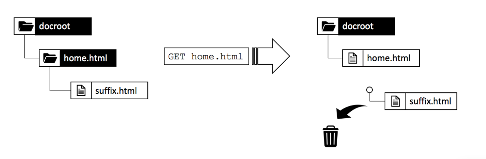

# 第1章 — 调度程序概念、模式和反模式

## 概述

本章简要介绍Dispatcher的历史和机制，并讨论这如何影响AEM开发人员设计其组件的方式。

## 为什么开发者应该关注基础架构

Dispatcher是大多数(如果不是所有AEM安装)的重要部分。 您可以找到许多讨论如何配置Dispatcher的在线文章以及提示和技巧。

但是，这些细节信息总是在非常技术的层面上进行开始 — 假设您已经知道自己想做什么，因此只提供有关如何实现自己想要的细节。 我们从未发现任何概念性文件，其中描述了在您能够和不能对调度程序执行什么操作时， _是什么以及为什么_。

### 反图案：作为后事

缺乏基本信息会导致许多反模式，我们在许多AEM项目中都看到过：

1. 由于Dispatcher安装在Apache Web服务器中，因此它是项目中“Unix gods”的作业，用于配置它。 “凡人的java开发者”不需要关心它。

2. Java开发人员需要确保其代码正常工作……调度程序稍后将神奇地加快它。 调度程序始终是事后考虑。 但是，这行不通。 开发人员必须在设计代码时考虑到调度程序。 他需要知道它的基本概念。

### “先让它起作用，然后让它快速起作用”并非总是正确

您可能已经听到编程建议&#x200B;_“首先使它起作用，然后让它快速运行。”_. 这并非完全错误。 但是，如果没有正确的上下文，则往往会被误解，并且无法正确应用。

建议应防止开发者过早地优化可能永远无法运行的代码，或者极少运行的代码，以至于优化不会产生足够的影响来证明投入优化的努力的合理性。 此外，优化可能导致更复杂的代码，从而引入错误。 因此，如果您是开发者，请不要将太多时间花在微优化每一行代码上。 只需确保您选择了正确的分析结构、算法和库，然后等待概要分析器的热点，了解更彻底的优化可以提高整体性能。

### 建筑决策和艺术品

然而，“先让它起作用，然后快速做”的建议在“建筑”决策方面完全是错误的。 什么是建筑决策？ 简言之，它们是代价高昂、困难和/或不可能事后改变的决定。 请记住，这种“昂贵”有时与“不可能”相同。  例如，当您的项目预算不足时，就无法实施代价高昂的更改。 对基础设施的改变是大多数人想到的类别中第一种改变。 但还有另一种“建筑”艺术品，它们可能变得非常讨厌：

1. 应用程序“中心”中的一段代码，许多其他部分都依赖它。 更改这些属性要求立即更改并重新测试所有依赖关系。

2. 在一些异步的、与时间相关的场景中，会出现不自然现象，因为输入 — 因此，系统的行为可能会非常随机地变化。 更改可能会产生不可预知的效果，并且很难测试。

3. 在系统的所有部分和部分反复使用和重复使用的软件模式。 如果软件模式被证明是次优的，则需要重新编码使用该模式的所有伪像。

记住? 在本页顶部，我们说调度程序是AEM应用程序的重要部分。 对Web应用程序的访问是非常随机的 — 用户在不可预测的时间来来去。 最后 — 所有内容将（或应）缓存到调度程序中。 因此，如果您非常关注缓存，您可能已经意识到缓存可以被视为“架构”工具，因此应该被团队的所有成员、开发人员和管理员都理解。

我们并不是说开发人员应实际配置Dispatcher。 他们需要了解相关概念，特别是边界，以确保调度程序也能利用他们的代码。

调度程序不会神奇地提高代码的速度。 开发人员需要在创建组件时牢记Dispatcher。 因此，他需要知道它是如何工作的。

## 调度程序缓存 — 基本原则

### 作为缓存的Http的Dispatcher — 负载平衡器

调度程序是什么，为什么最初称为“调度程序”？

调度程序

* 首先也是最重要的缓存

* 反向代理

* Apache httpd webserver的一个模块，将AEM相关功能添加到Apache的通用性中，并与所有其他Apache模块（如SSL或甚至SSI）顺利协作

在Web的早期，您会期望有几百个访客访问站点。 一个调度程序的设置，“已调度”或平衡了对多个AEM发布服务器的请求负载，这通常已足够，因此名称为“Dispatcher”。 但是，现在这种设置已经不常使用。

本文后面将介绍设置Dispatcher和Publish系统的不同方法。 首先，让我们用一些HTTP缓存基础知识进行开始。


*调度程序缓存的基本功能*

<br> 

此处将介绍调度程序的基本功能。 调度程序是一个简单的缓存反向代理，能够接收和创建HTTP请求。 正常的请求/响应周期如下：

1. 用户请求页面
2. 调度程序将检查其是否已具有该页面的渲染版本。 假设它是此页面的第一个请求，而调度程序找不到本地缓存副本。
3. 调度程序从发布系统请求该页面
4. 在发布系统中，页面由JSP或HTL模板呈现
5. 页面将返回到调度程序
6. 调度程序缓存页面
7. 调度程序将页面返回到浏览器
8. 如果再次请求同一页面，则可以直接从调度程序缓存中提供该页面，而无需在Publish实例上重新渲染该页面。 这节省了用户和CPU循环在Publish实例上的等待时间。

我们在最后一节讨论“页面”。 但同样的方案也适用于其他资源，如图像、CSS文件、PDF下载等。

#### 数据的缓存方式

调度程序模块利用托管Apache服务器提供的设施。 HTML页、下载和图片等资源作为简单文件存储在Apache文件系统中。 就是这么简单。

文件名由所请求资源的URL派生。 如果请求文件`/foo/bar.html`，它会存储在例如/`var/cache/docroot/foo/bar.html`下。

原则上，如果所有文件都已缓存并因此在Dispatcher中静态存储，您可以拔出Publish系统的插件，而Dispatcher将充当简单的Web服务器。 但这只是说明了原则。 现实生活更复杂。 您无法缓存所有内容，而且缓存从未完全“完全”，因为渲染过程的动态性质使资源数量可以是无限的。 静态文件系统的模型有助于生成调度程序功能的粗图。 它有助于解释调度程序的局限性。

#### AEM URL结构和文件系统映射

要更详细地了解调度程序，请让我们重新访问简单示例URL的结构。  下面的例子，

`http://domain.com/path/to/resource/pagename.selectors.html/path/suffix.ext?parameter=value&amp;otherparameter=value#fragment`

* `http` 表示协议

* `domain.com` 是域名

* `path/to/resource` 是资源存储在CRX中的路径，随后存储在Apache服务器的文件系统中

从这里看，AEM文件系统和Apache文件系统之间的情况略有不同。

在AEM中，

* `pagename` 是资源标签

* `selectors` 表示Sling中使用的许多选择器，用于确定资源的呈现方式。URL可以具有任意数量的选择器。 他们隔了一段时间。 例如，选择器部分可以是“french.mobile.fancy”。 选择器应仅包含字母、数字和短划线。

* `html` 作为最后一个“选择器”称为扩展。在AEM/Sling中，它还部分决定了渲染脚本。

* `path/suffix.ext` 是一个类似路径的表达式，可以作为URL的后缀。它可用于AEM脚本中，以进一步控制资源的呈现方式。 稍后我们将提供有关此部分的整个部分。 目前，您应该知道，您可以将其用作其他参数。 后缀必须有扩展名。

* `?parameter=value&otherparameter=value` 是URL的查询部分。它用于将任意参数传递给AEM。 无法缓存带参数的URL，因此参数应仅限于绝对必要的情况。

* `#fragment`, URL的片段部分不会传递给AEM，而是仅在浏览器中使用；在JavaScript框架中作为“路由参数”或跳转到页面上的某个部分。

在Apache中（*引用下图*），

* `pagename.selectors.html` 用作缓存的文件系统中的文件名。

如果URL有后缀`path/suffix.ext`,

* `pagename.selectors.html` 创建为文件夹

* `path` 文件夹中的文 `pagename.selectors.html` 件夹

* `suffix.ext` 是文件夹中的 `path` 文件。注意：如果后缀没有扩展名，则不会缓存文件。


*从调度程序获取URL后的文件系统布局*

<br> 

#### 基本限制

URL、资源和文件名之间的映射非常简单。

你可能注意到了一些陷阱，

1. URL可能会变长。 在本地文件系统上添加`/docroot`的“路径”部分可能会轻松超出某些文件系统的限制。 在Windows上的NTFS中运行调度程序可能是个难题。 但是，Linux是安全的。

2. URL可以包含特殊字符和变音。 对于调度程序而言，这通常不是问题。 但请记住，URL在应用程序的许多位置都有解释。 我们经常看到应用程序的奇怪行为 — 只是为了找出一个很少使用（自定义）的代码没有对特殊字符进行彻底测试。 如果可以的话，你应该避开他们。 如果不能，请计划进行彻底测试。

3. 在CRX中，资源具有子资源。 例如，一个页面将包含多个子页面。 在文件系统中无法匹配此项，因为文件系统具有文件或文件夹。

#### 未缓存无扩展名的URL

URL始终必须具有扩展名。 尽管您可以在AEM中提供不带扩展的URL。 这些URL将不会缓存在调度程序中。

**示例**

`http://domain.com/home.html` 是可 **缓存**

`http://domain.com/home` 无法 **缓存**

URL包含后缀时，同样的规则也适用。 后缀需要有可缓存的扩展。

**示例**

`http://domain.com/home.html/path/suffix.html` 是可 **缓存**

`http://domain.com/home.html/path/suffix` 无法 **缓存**

您可能会想，如果资源部分没有扩展，但后缀有扩展，会发生什么情况？ 那么，在这种情况下，URL根本没有后缀。 请看下一个示例：

**示例**

`http://domain.com/home/path/suffix.ext`

`/home/path/suffix`是资源的路径……，因此URL中没有后缀。

**结论**

始终为路径和后缀添加扩展名。 有意识搜索引擎优化的人有时会辩称，这是在给你在搜索结果中排名靠后。 但未缓存的页面速度会非常慢，排名会更低。

#### 后缀URL冲突

您有两个有效的URL

`http://domain.com/home.html`

和

`http://domain.com/home.html/suffix.html`

它们在AEM中绝对有效。 如果没有调度程序，您不会在本地开发机器上看到任何问题。 在UAT或负载测试中，您很可能也不会遇到任何问题。 我们面临的问题非常微妙，以至于在大多数测试中都漏掉了。  当您处于高峰时期时，它会对您造成很大冲击，并且您将受到解决该问题的时间限制，可能无法访问服务器，也无资源修复它。 我们去过……

那么，有什么问题？

`home.html` 文件系统中可以是文件或文件夹。与AEM不同时。

如果您首先请求`home.html`，它将创建为文件。

对`home.html/suffix.html`的后续请求返回有效结果，但由于文件`home.html` &quot;阻止&quot;文件系统中的位置，因此不能再次创建`home.html`作为文件夹，因此`home.html/suffix.html`未缓存。


*文件系统中阻止子资源被缓存的文件阻止位置*

<br> 

如果以相反的方式进行，则首先请求`home.html/suffix.html` ，然后首先将`suffix.html`缓存在文件夹`/home.html`下。 但是，当您随后请求将`home.html`作为资源时，该文件夹会被删除并替换为文件`home.html`。



*在将父项作为资源读取时删除路径结构*

<br> 

因此，缓存内容的结果完全是随机的，取决于传入请求的顺序。 更棘手的是，您通常拥有多个调度程序。 而且，性能、缓存命中率和行为可能因调度程序的不同而异。 如果要了解您的网站为何没有响应，您需要确保查看的是缓存顺序不正确的正确调度程序。 如果您正在寻找具有更有利的请求模式的调度程序，您将在尝试查找问题时迷失方向。

#### 避免冲突的URL

当您对资源使用不同扩展时，您可以避免使用“冲突的URL”，即文件夹名称和文件名“竞争”文件系统中的同一路径。

**示例**

* `http://domain.com/home.html`

* `http://domain.com/home.dir/suffix.html`

两者都完全可以连接，


当您请求后缀或避免完全使用后缀时，为资源选择专用扩展“dir”。 在很少的情况下，它们是有用的。 而且，正确实施这些情况很容易。  正如我们在下一章中介绍缓存失效和刷新时所看到的那样。

#### 不可执行的请求

让我们查看最后一章的快速摘要以及一些其他例外情况。 如果URL配置为可缓存，并且是GET请求，则调度程序可以缓存它。 无法在以下异常之一下缓存它。

**可缓存请求**

* 请求配置为在调度程序配置中可缓存
* 请求是纯GET请求

**不可缓存的请求或响应**

* 按配置拒绝缓存的请求（路径、模式、MIME类型）
* 返回“调度程序：no-cache&quot;头
* 返回“缓存控制：no-cache|private&quot;头
* 返回“Pragma:no-cache&quot;头
* 具有查询参数的请求
* 无扩展名的URL
* 带后缀且没有扩展名的URL
* 返回200以外的状态代码的响应
* POST请求

## 使缓存失效和刷新

### 概述

最后一章列出了当调度程序无法缓存请求时的大量异常。 但还有更多事情需要考虑：仅仅因为调度程序&#x200B;_可以_&#x200B;缓存请求，它不一定表示它&#x200B;_应_。

要点是：缓存通常很容易。 调度程序只需存储响应的结果，并在下次收到相同的请求时返回。 右? 错！

困难部分是缓存的&#x200B;_invalidation_&#x200B;或&#x200B;_flushing_。 调度程序需要了解资源何时发生更改，并需要重新渲染。

乍一看，这似乎是一个微不足道的任务...但事实并非如此。 进一步阅读，您会发现单一资源和简单资源以及依赖高度网状多资源结构的页面之间的一些棘手差异。

### 简单资源和刷新

我们已设置AEM系统，在通过特殊的“缩略图”选择器提出请求时，为每个图像动态创建缩略图呈现：

`/content/dam/path/to/image.thumb.png`

并且 — 当然，我们提供一个URL，用于为原始图像提供一个无选择器URL:

`/content/dam/path/to/image.png`

如果我们同时下载缩览图和原始图像，我们最终会得到类似，

```
/var/cache/dispatcher/docroot/content/dam/path/to/image.thumb.png

/var/cache/dispatcher/docroot/content/dam/path/to/image.png
```

调度程序的文件系统中。

现在，用户将上载并激活该文件的新版本。 最终，会从AEM向调度程序发送失效请求，

```
GET /invalidate
invalidate-path:  /content/dam/path/to/image

<no body>
```

失效是那么容易的：对调度程序上的特殊“/invalidate”URL的简单GET请求。 HTTP-body不是必需的，“payload”只是“invalidate-path”标头。 另请注意，标头中的invalidate-path是AEM所知的资源，而不是调度程序已缓存的文件。 AEM只了解资源。 请求资源时，在运行时使用扩展、选择器和后缀。 AEM不会对资源上使用的选择器执行任何记帐，因此在激活资源时，它只知道资源路径。

就我们而言，这就足够了。 如果某个资源发生了更改，我们可以安全地假设该资源的所有演绎版也发生了更改。 在我们的示例中，如果图像已更改，则还会渲染新的缩略图。

调度程序可以安全地删除其已缓存的所有演绎版的资源。 它会做类似的，

`$ rm /content/dam/path/to/image.*`

删除`image.png`和`image.thumb.png`以及与该模式匹配的所有其他演绎版。

非常简单……只要您只使用一个资源来响应请求。

### 引用和网格化内容

#### 网格化内容问题

与上传到AEM的图像或其他二进制文件不同，HTML页面不是孤立的动物。 它们生活在群组中，通过超链接和引用彼此高度互联。 简单的链接是无害的，但当我们讨论内容引用时，它会变得很棘手。 页面上无处不在的顶部导航或Teaser是内容引用。

#### 内容引用及其成为问题的原因

让我们看一个简单的例子。 旅行社有一个网页，宣传去加拿大旅行。 此促销活动在另外两个页面的Teaser部分、“主页”页面和“冬季特别计划”页面中提供。

由于两个页面都显示相同的Teaser，因此不必要求作者为应显示它的每个页面多次创建Teaser。 相反，目标页面“加拿大”会在页面属性中保留一个部分以提供Teaser的信息，或者更好地提供渲染该Teaser的URL:

`<sling:include resource="/content/home/destinations/canada" addSelectors="teaser" />`

或

`<sling:include resource="/content/home/destinations/canada/jcr:content/teaser" />`


仅在AEM上，它的工作方式与魅力无异，但如果您在Publish实例中使用Dispatcher，则会出现奇怪的情况。

想象一下，您发布了您的网站。 您的加拿大页面上的标题为“Canada”。 当访客请求您的主页时（其中包含对该页面的Teaser引用），“加拿大”页面上的组件会呈现类似

```
<div class="teaser">
  <h3>Canada</h3>
  
</div>
```

** 进入主页。主页由调度程序以静态.html文件形式存储，包括Teaser及其在文件中的标题。

营销人员已经了解到，Teaser标题应具有可操作性。 因此，他决定将标题从“加拿大”改为“访问加拿大”，并更新图像。

他发布编辑后的“加拿大”页面，并重新访问之前发布的主页以查看其更改。 但是，那里没有什么变化。 它仍显示旧的Teaser。 他多次查“冬季特惠”。 以前从未请求过该页面，因此不会在调度程序中静态缓存该页面。 因此，此页面由“发布”新呈现，且此页面现在包含新的“访问加拿大”Teaser。


*在主页中存储陈旧内容的调度程序*

<br> 

怎么了？ 调度程序存储页面的静态版本，该版本包含呈现时从其他资源绘制的所有内容和标记。

Dispatcher只是基于文件系统的Web服务器，速度快，但也相对简单。 如果某个包含的资源发生更改，它并未意识到这一点。 呈现包含页面时的内容仍会保留。

“冬季特殊”页面尚未渲染，因此调度程序上没有静态版本，因此将随新Teaser一起显示，因为新Teaser将在请求时新呈现。

您可能会认为，当资源发生更改时，调度程序会在渲染和刷新已使用此资源的所有页面时跟踪它触及的每个资源。 但调度程序不会呈现页面。 渲染由发布系统执行。 调度程序不知道渲染后的.html文件中将包含哪些资源。

还不信吗？ 您可能认为&#x200B;*&quot;必须有一种方法来实现某种依赖性跟踪&quot;*。 有，或者更准确的说，*是*。 公报3,AEM的曾曾曾祖父在用于呈现页面的&#x200B;_会话_&#x200B;中实施了一个依赖跟踪器。

在请求期间，通过此会话获取的每个资源都会被跟踪为当前呈现的URL的依赖关系。

但事实证明，追踪这些依赖关系非常昂贵。 很快，人们发现，如果完全关闭依赖项跟踪功能，并且依赖于在一个html页面发生更改后重新渲染所有html页面，则网站的速度会更快。 此外，这一方案也并不完美 — 在路上还有许多陷阱和例外。 在某些情况下，您不是使用请求默认会话来获取资源，而是使用管理员会话来获取一些帮助资源来呈现请求。 这些依赖关系通常未被跟踪，并导致头痛和给运营团队打电话要求手动刷新缓存。 如果他们有标准程序，你就很幸运。 路上还有很多人在追忆，但是……我们别再追忆了。 这样可以追溯到2005年。 最终，这一功能在公报4中被默认取消激活，而它没有让它回到后续的CQ5中，CQ5随后成为AEM。

### 自动失效

#### 当完全冲洗比依赖跟踪更便宜时

由于CQ5，只有其中一个页面发生更改时，我们或多或少地依赖于整个站点的失效。 此功能称为“自动失效”。

但是，抛弃和重新渲染数百页比进行适当的依赖跟踪和部分重新渲染更便宜，这怎么可能呢？

有两个主要原因：

1. 在平均网站上，只经常请求一小部分页面。 因此，即使您扔掉所有渲染的内容，实际上只会在之后立即请求几打。 页面的长尾的呈现可以随着时间而分布，当实际请求时。 因此，实际上，渲染页面上的负载没有您期望的那么高。 当然，总有例外……稍后，我们将讨论一些技巧，如何在具有空Dispatcher缓存的较大网站上处理均匀分布的负载。

2. 所有页面仍通过主导航连接。 因此，几乎所有页面最终都是互相依赖的。 这意味着，即便是最聪明的依赖追踪者也会发现我们已经知道的：如果其中一个页面发生更改，则必须使所有其他页面失效。

你不相信？ 让我们来说明最后一点。

我们使用的参数与上一个示例中的参数相同，Teaser引用远程页面的内容。 直到现在，我们才用一个更极端的例子：自动呈现的主导航。 与Teaser一样，导航标题从链接或“远程”页面中作为内容引用来绘制。 远程导航标题不存储在当前呈现的页面中。 您应该记住，导航会呈现在您网站的每个页面上。 因此，在具有主导航的所有页面上，都会反复使用一个页面的标题。 如果要更改导航标题，则只希望在远程页面上执行一次 — 而不是在引用该页面的每个页面上执行此操作。

因此，在我们的示例中，导航通过使用目标页面的“NavTitle”在导航中呈现名称来将所有页面网格化在一起。 “冰岛”的导航标题从“冰岛”页面中提取，并呈现到具有主导航的每个页面中。


*通过拉动所有页面的“NavTitles”，主导航不可避免地将所有页面的内容划分在一起*

<br> 

如果您将冰岛页面上的NavTitle从“Icelaz”更改为“Beautiful Iciland”，则该标题会在所有其他页面主菜单上立即更改。 因此，在更改之前呈现和缓存的页面都变得陈旧，需要使其失效。

#### 如何实现自动失效：.stat文件

现在，如果您有一个包含数千个页面的大型网站，则需要花费相当长的时间循环浏览所有页面并实际删除它们。 在此期间，调度程序可能会无意中提供过时的内容。 更糟的是，在访问缓存文件时可能会发生一些冲突，可能在页面被删除时请求页面，或由于在立即后续激活后发生的第二次失效而再次删除页面。 想想会是多么乱。 幸运的是，事情并非如此。 调度程序使用巧妙的技巧来避免：在文件发布后，它不会删除成百上千个文件，而是将一个简单的空文件放入文件系统的根文件中，因此所有依赖的文件都被认为是无效的。 此文件称为“statfile”。 statfile是空文件 — 与statfile相关的只是其创建日期。

调度程序中创建日期早于statfile的所有文件都已在上次激活（和失效）之前呈现，因此被视为“无效”。 它们在物理上仍存在于文件系统中，但调度程序忽略它们。 他们“过时”了。 每当向过时资源发出请求时，调度程序都会要求AEM系统重新渲染页面。 新呈现的页面随后会存储在文件系统中 — 现在有了新的创建日期，它又是新的。


*.stat文件的创建日期定义哪些内容过时和哪些内容是新鲜*

<br> 

您可能会问为什么它称为“.stat”？ 也许不是&quot;无效&quot; 您可以想象，将该文件放在您的文件系统中可帮助调度程序确定哪些资源可以以静态方式&#x200B;**&#x200B;提供服务 — 就像从静态Web服务器提供的资源一样。 这些文件不再需要动态呈现。

然而，这个名字的真实性质，却不是暗喻。 它源自Unix系统调用`stat()`，该调用返回文件的修改时间（其他属性中）。

#### 混合简单验证和自动验证

但等等……我们刚才说，单个资源被实际删除。 现在，我们说，在调度程序的眼中，更新的状态文件实际上会使它们无效。 那么，为什么首先是物理删除？

答案很简单。 您通常并行使用两种策略 — 但针对不同类型的资源。 二进制资源（如图像）是自包含的。 它们与其他资源之间没有联系，因为它们需要提供其信息。

而HTML页面则高度相互依赖。 因此，您会对这些应用自动失效。 这是调度程序中的默认设置。 将物理删除属于无效资源的所有文件。 此外，以“.html”结尾的文件会自动失效。

调度程序决定是否应用自动失效方案。

可配置自动失效的文件结尾。 理论上，您可以包含自动失效的所有扩展。 但请记住，这是一个非常高的代价。 您不会不注意地提供过时的资源，但由于过度失效，投放性能会大大降低。

例如，您实施了一个方案，其中PNG和JPG是动态渲染的，并依赖其他资源执行此操作。 您可能希望将高分辨率图像重新缩放为较小的Web兼容分辨率。 当您处于这种状态时，还可以更改压缩率。 此示例中的分辨率和压缩率不是固定常量，而是使用图像的组件中的可配置参数。 现在，如果更改了此参数，则需要使图像失效。

没有问题 — 我们刚刚学到，我们可以将图像添加到自动失效中，并且每当有任何变化时，都会呈现新渲染的图像。

#### 《把婴儿和洗澡水一起扔掉》

这是对的 — 这是个大问题。 再读一遍最后一段。 “……只要有任何变化，就新鲜渲染的图像。” 如您所知，一个好网站不断变化；在此处添加新内容，在此处更正打字错误，在其他位置调整teaser。 这意味着您的所有图像会不断失效，需要重新渲染。 别低估了。 在本地开发机器上动态渲染和传输图像数据的工作时间只需几毫秒。 您的生产环境需要将这一操作频率提高100倍 — 每秒。

在此，请务必清楚，当html页面发生更改时，需要重新渲染您的jpg，反之亦然。 只有一个“存储桶”文件可自动失效。 它整体上被冲了。 不用任何手段将结构进一步细化。

默认情况下，自动失效保持为“.html”有很好的原因。 目标是尽可能小。 不要把婴儿和洗澡水一起扔出去，只是让一切都变得无效 — 只是为了站在安全的一边。

自成一体的资源应该在该资源的道路上提供。 这对失效有很大帮助。 请保持简单，不要创建映射方案，如“resource /a/b/c”是从“/x/y/z”提供的。 使您的组件使用默认的Dispatcher自动失效设置。 请勿尝试修复Dispatcher中设计错误且失效过度的组件。

##### 自动失效的例外：仅资源无效

调度程序的失效请求通常由复制代理从发布系统触发。

如果您对依赖关系非常有信心，可以尝试构建您自己的失效复制代理。

要了解详细信息，本指南略有不足，但我们想至少给您一些提示。

1. 真的知道你在做什么。 要正确行使失效真的很难。 这就是汽车失效如此严格的原因之一；来避免交付过时的内容。

2. 如果代理发送HTTP头`CQ-Action-Scope: ResourceOnly`，则表示此单个失效请求不会触发自动失效。 这([https://github.com/cqsupport/webinar-dispatchercache/tree/master/src/refetching-flush-agent/refetch-bundle](https://github.com/cqsupport/webinar-dispatchercache/tree/master/src/refetching-flush-agent/refetch-bundle))条代码可能是您自己的复制代理的一个好起点。

3. `ResourceOnly`，仅防止自动失效。要实际执行必要的依赖关系解析和失效，您必须自己触发失效请求。 您可能希望检查包Dispatcher刷新规则([https://adobe-consulting-services.github.io/acs-aem-commons/features/dispatcher-flush-rules/index.html](https://adobe-consulting-services.github.io/acs-aem-commons/features/dispatcher-flush-rules/index.html))，以了解实际情况。

我们不建议您构建依赖关系解决方案。 我们的努力太多，收益也很少 — 正如之前所说，你错得太多。

相反，您应该了解哪些资源不依赖于其他资源，并且可以在不自动失效的情况下失效。 但是，您不必为此使用自定义复制代理。 只需在Dispatcher配置中创建一个自定义规则，该规则将这些资源排除在自动失效之外。

我们说主导航或Teaser是依赖关系的源。 好吧 — 如果您异步加载导航和Teaser，或将它们包含在Apache中的SSI脚本中，您将没有要跟踪的依赖关系。 我们将在本文档稍后讨论“Sling Dynamic Includes”时详细介绍异步加载组件。

弹出窗口或加载到Lightbox中的内容也是如此。 这些部分也很少具有导航（即&quot;依赖关系&quot;），并可作为单个资源失效。

## 在构建组件时要牢记调度程序

### 调度器机制在实际案例中的应用

在最后一章中，我们将说明Dispatcher的基本机制、它的一般工作方式以及限制。

现在，我们想将这些力学应用到一些可能在项目要求中找到的元件。 我们故意挑选组件，以展示您迟早也会面临的问题。 恐惧不是 — 并非所有的组成部分都需要我们拿出的那样的考虑。 但是，如果您认为有必要构建这样一个组件，那么您会清楚地意识到后果，并知道如何处理它们。

### 假脱机组件（防）图案

#### 响应式图像组件

让我们说明一个具有互连二进制文件的组件的通用模式（或反模式）。 我们将创建一个“响应”组件 — 用于“响应式图像”。 此组件应能够将显示的图像调整为其所显示的设备。 在台式机和平板电脑上，它显示图像的全分辨率，在手机上以较小的版本显示，裁切范围很窄，甚至可能是完全不同的主题（在响应式世界中，这称为“艺术方向”）。

资产上传到AEM的DAM区域，响应式图像组件中只有&#x200B;_被引用_。

响应组件负责标记的渲染和二进制图像数据的传送。

我们在此实施它的方式是我们在许多项目中看到的一种常见模式，甚至AEM核心组件之一都基于该模式。 因此，作为开发者，您很可能会改变这种模式。 在封装方面，它有其最佳点，但要使其具备Dispatcher就绪性，它需要付出大量努力。 我们稍后将讨论如何减轻问题的几个选项。

我们把这里使用的模式称为“假脱机模式”，因为问题可以追溯到公报3的早期，当时有一种方法“假脱机”，可以对资源调用，以将二进制原始数据流化到响应中。

原始术语“假脱机”实际上是指共享的慢速脱机外设，如打印机，因此无法正确应用。 但我们还是喜欢这个词，因为在网络世界中，这个词很少能区分。 每个模式都应该有一个可辨别的名称，对吧？ 由你来决定这是一种模式还是一种反模式。

#### 实施

下面是响应式图像组件的实现方式：

该构件分为两部分：第一部分渲染图像的HTML标记，第二部分“绕轴”渲染引用图像的二进制数据。 由于这是具有响应式设计的现代网站，因此我们不渲染简单的``标签，而是在`<picture/>`标签中渲染一组图像。 对于每台设备，我们会将两个不同的图像上传到DAM，并从图像组件中引用它们。

该组件有三个渲染脚本（通过JSP、HTL或Servlet实现），每个脚本都使用专用选择器解决：

1. `/respi.jsp`  — 没有用于呈示HTML标记的选择器
2. `/respi.img.java` 渲染桌面版本
3. `/respi.img.mobile.java` 来渲染移动版本。


组件位于主页的parsys中。 CRX中的结果结构如下所示。


*CRX中响应式图像的资源结构*

<br> 

组件的标记是这样呈现的，

```plain
  #GET /content/home.html

  <html>

  …

  <div class="responsive-image>

  <picture>
    <source src="/content/home/jcr:content/par/respi.img.mobile.jpg" …/>
    <source src="/content/home/jcr:content/par/respi.img.jpg …/>

    …

  </picture>
  </div>
  …
```

我们用封装精良的组件完成了。

#### 响应式图像组件实际操作情况

现在，用户通过Dispatcher请求页面和资产。 这会导致Dispatcher文件系统中的文件，如下所示：


*封装的响应式图像组件的缓存结构*

<br> 

考虑用户上传并将两个花卉图像的新版本激活到DAM。 AEM将根据无效请求发送

`/content/dam/flower.jpg`

和

`/content/dam/flower-mobile.jpg`

调度程序。 然而，这些要求是徒劳的。 内容已缓存为组件子结构下的文件。 这些文件现在已过时，但仍会在请求时提供。


*结构不匹配导致内容陈旧*

<br> 

这一方法还有一个警示。 请考虑在多个页面上使用相同的flower.jpg。 然后，您将在多个URL或文件下缓存同一资源，

```
/content/home/products/jcr:content/par/respi.img.jpg

/content/home/offers/jcr:content/par/respi.img.jpg

/content/home/specials/jcr:content/par/respi.img.jpg

…
```

每次都会请求一个新的、未缓存的页面，从AEM中以不同的URL获取资源。 没有调度程序缓存和浏览器缓存可以加快投放。

#### 后台播放器图案的位置

有一个自然的例外，即使以简单的形式，这种模式也是有用的：如果二进制文件存储在组件本身中，而不是存储在DAM中。 但是，此功能仅对在网站上使用过一次的图像有用，而不将资产存储在DAM意味着您很难管理资产。 想象一下，您针对特定资源的使用许可证已用完。 您如何能够找到已使用资产的组件？

看到了吗？ DAM中的“M”代表“管理”，与数字资产管理一样。 你不想放弃这个功能。

#### 结论

从AEM开发人员的角度看，这种图案看起来非常优雅。 但是，如果调度程序考虑到这个等式，您可能会同意，天真的做法可能不够。

我们让你来决定这是一种模式还是一种反模式。 也许您已经有一些好的想法，想要如何减轻上述问题？ 很好。 然后，您将迫切地想知道其他项目是如何解决这些问题的。

### 解决常见调度程序问题

#### 概述

让我们讨论一下如何实现更加适合缓存的功能。 有多种选择。 有时，您无法选择最佳解决方案。 可能您进入一个已在运行的项目，并且您的预算有限，仅仅解决手头的“缓存问题”，而不足以进行完全重构。 或者，您会遇到一个问题，这比示例图像组件更复杂。

我们将在以下几节中概述这些原则和注意事项。

同样，这是基于现实体验。 我们已经看到了这些野外模式，所以它不是学术活动。 这就是为什么我们向你们展示一些反模式，因此你们有机会从别人已经犯下的错误中吸取教训。

#### 缓存杀手

>[!WARNING]
>
>这是一种反模式。 不要使用它。 永远。

您是否曾见过`?ck=398547283745`等查询参数？ 它们称为缓存杀手(“ck”)。 其思想是，如果添加任何查询参数，则不会缓存资源。 此外，如果添加随机数作为参数值(如“398547283745”)，则URL将变得唯一，并且您确保，AEM系统和屏幕之间的其他缓存也无法缓存。 通常的中间可疑元素是Dispatcher、CDN甚至浏览器缓存前的“清漆”缓存。 再次：别这样。 您确实希望尽可能长地缓存您的资源。 缓存是您的朋友。 别杀朋友。

#### 自动失效

>[!WARNING]
>
>这是一种反模式。 避免将其用于数字资产。 请尝试仅保留Dispatcher的默认配置（>对于“.html”文件自动失效）

短期而言，您可以在Dispatcher中向自动失效配置添加“.jpg”和“.png”。 这意味着，每当出现无效时，都需要重新渲染所有“.jpg”、“.png”和“.html”。

如果企业所有者抱怨自己的更改在现场实现的速度不够快，则这种模式非常容易实施。 但这只能为您争取一些时间，来制定更复杂的解决方案。

确保您了解对性能的巨大影响。 这将显着降低您的网站的速度，甚至可能影响网站的稳定性（如果您的网站是高负载且频繁更改的网站），例如新闻门户。

#### URL指纹

URL指纹看起来就像是一个缓存杀手。 但事实并非如此。 它不是随机数，而是表示资源内容的值。 这可以是资源内容的哈希值，也可以是上传、编辑或更新资源时的时间戳。

Unix时间戳对于实际实施来说足够好。 为了更好的可读性，我们在本教程中使用了更易读的格式：`2018 31.12 23:59 or fp-2018-31-12-23-59`。

指纹不能用作查询参数，作为带有查询参数的URL   无法缓存。 您可以使用选择器或指纹后缀。

假设文件`/content/dam/flower.jpg`的日期`jcr:lastModified`为2018年12月31日，23:59。 具有指纹的URL为`/content/home/jcr:content/par/respi.fp-2018-31-12-23-59.jpg`。

只要引用的资源(`flower.jpg`)文件没有更改，此URL将保持稳定。 因此，它可以无限时间地缓存，而且它不是缓存杀手。

注意，此URL需要由响应式图像组件创建并提供。 它不是现成的AEM功能。

这是基本概念。 然而，有一些细节很容易被忽视。

在我们的示例中，组件在23:59时渲染并缓存。 现在图像已经更改，比如00:00。  组件&#x200B;_将在其标记中生成新的指纹URL。_

您可能认为它&#x200B;_应_...但它不会。由于只更改了图像的二进制文件，而未更改包含页面，因此无需重新渲染HTML标记。 因此，调度程序使用旧指纹为页面提供服务，从而提供旧版本的图像。


*图像组件比参考图像更新，无新的指纹。*

<br> 

现在，如果您重新激活了主页（或该站点的任何其他页面），将更新statfile，调度程序会考虑home.html过时，并在图像组件中使用新指纹重新渲染它。

但我们没有激活主页，对吧？ 我们为什么要激活一个我们根本没有触及的页面？ 此外，我们可能没有足够的权限来激活页面，或者审批工作流程如此漫长而耗时，以至于我们无法在短时间通知您。 那么，该怎么办？

#### 懒惰管理员的工具 — 降低状态文件级别

>[!WARNING]
>
>这是一种反模式。 只在短期内使用它来赢得一些时间，并想出更复杂的解决方案。

懒惰管理员通常&quot;_将自动失效设置为jpgs，将statfile级别设置为零 — 这始终有助于解决所有类型的缓存问题_。&quot; 在科技论坛上，您会发现这一建议，它有助于解决您的无效问题。

到目前为止，我们还没有讨论过静态文件级别。 基本上，自动失效仅适用于同一子树中的文件。 但问题是，页面和资产通常不位于同一子树中。 页面位于`/content/mysite`以下，而资产位于`/content/dam`以下。

“statfile level”定义子树的根节点在什么深度处。 在上面的示例中，级别为&quot;2&quot;(1=/content， 2=/mysite，dam)

将状态文件级别“降低”为0的想法基本上是将整个/content树定义为一个子树，将页面和资产置于同一个自动失效域中。 因此，我们只能在大树上，在大树上，在大树上（在大树上，“/”）。 但是，只要发布内容，即使在完全无关的网站上，也会自动使服务器上的所有站点失效。 相信我们：从长远看，这是个坏主意，因为您会严重降低总体缓存命中率。 您能做的只是希望您的AEM服务器拥有足够的火力来在没有缓存的情况下运行。

稍后，您将了解更深入的状态文件级别的全部优势。

#### 实现自定义失效代理

总之，如果“.jpg”或“.png”发生更改，允许使用新的URL重新渲染，则我们需要通知调度程序使HTML页失效。

我们在项目中看到的是 — 例如 — 发布系统上的特殊复制代理，每当发布站点的映像时，这些代理都会发送站点的无效请求。

在此，如果您可以通过命名约定从资产的路径派生站点的路径，那么这对您有很大帮助。

通常来说，最好匹配站点和资产路径，如下所示：

**示例**

```
/content/dam/site-a
/content/dam/site-b

/content/site-a
/content/site-b
```

这样，当您的自定义Dispatcher Flushing代理遇到`/content/dam/site-a`更改时，可以轻松地向/content/site-a发送和失效请求。

事实上，告诉调度程序使其失效的路径并不重要 — 只要它位于同一站点中，位于同一“子树”中。 您甚至不必使用真正的资源路径。 它也可以是“虚拟”的：

`GET /dispatcher-invalidate
Invalidate-path /content/mysite/dummy`


1. 当DAM中的文件发生更改时，将触发发布系统上的侦听器

2. 侦听器向调度程序发送失效请求。 由于自动失效，我们在自动失效中发送的路径并不重要，除非它位于站点的主页下 — 或更精确地位于站点静态文件级别。

3. 将更新statfile。

4. 下次请求主页时，主页会重新呈现。 新的指纹/日期从图像的lastModified属性中作为附加选择器

5. 这会隐式创建对新图像的引用

6. 如果实际请求了该图像，则会在调度程序中创建并存储新的再现


#### 清理的必要性

噢。 已完成. 好！

还不是。

路径，

`/content/mysite/home/jcr:content/par/respi.img.fp-2018-31-12-23-59.jpg`

与任何已失效的资源无关。 记住? 我们仅使“虚拟”资源失效，并依赖自动失效将“主”视为无效。 图像本身可能永远不会被&#x200B;_实际_&#x200B;删除。 因此，缓存会增长并增长。 更改和激活图像后，调度程序的文件系统中会显示新的文件名。

在物理删除缓存文件并无限期保留它们方面存在三个问题：

1. 你在浪费存储容量 — 很明显。 当然，存储在过去几年已变得更廉价。 但过去几年，随着渴望获得水晶般锐利图像的视网膜样显示器的出现，图像分辨率和文件大小也在增长。

2. 尽管硬盘已变得更便宜，但“存储”可能也不会变得更便宜。 我们看到一种趋势，即没有（廉价）裸机硬盘存储，而是由您的数据中心提供商在NAS上租用虚拟存储。 这种存储更可靠，更可伸缩，但也更昂贵。 你可能不想通过存储过时的垃圾来浪费它。 这不仅与主存储有关，还要考虑备份。 如果您有现成的备份解决方案，则可能无法排除缓存目录。 最后，您还在备份垃圾数据。

3. 更糟糕的是：您可能购买了特定图像的使用许可证的时间有限 — 只要您需要。 现在，如果您在许可证过期后仍存储图像，这可能被视为版权侵权。 您可能不再在网页中使用图像，但Google仍会找到它们。

最后，您会提出一些家务任务，来清理所有比……更旧的文件……让我们假设一周时间来控制这种乱七八糟的文件。

#### 滥用URL指纹进行拒绝服务攻击

但等等，这个解决方案还存在另一个缺陷：

我们滥用选择器作为参数：fp-2018-31-12-23-59作为某种“高速缓存杀手”动态生成。 但或许有些无聊的孩子（或者某个搜索引擎爬虫已经疯了）开始会请求这些页面：

```
/content/mysite/home/jcr:content/par/img.fp-0000-00-00-00-00.jpg
/content/mysite/home/jcr:content/par/img.fp-0000-00-00-00-01.jpg
/content/mysite/home/jcr:content/par/img.fp-0000-00-00-00-02.jpg

…
```

每个请求都将绕过调度程序，导致Publish实例加载。 而且，更糟糕的是，在调度程序上创建一个相应文件。

因此……您必须检查图像的jcr:lastModified日期，如果它不是预期日期，则返回404，而不是仅将指纹用作简单的缓存杀手。 在发布系统上，这需要一些时间和CPU周期……这是您最初希望阻止的。

#### 高频版本中URL指纹的注意事项

您不仅可以对来自DAM的资产使用指纹模式，还可以对JS和CSS文件及相关资源使用。

[版本化](https://adobe-consulting-services.github.io/acs-aem-commons/features/versioned-clientlibs/index.html) 的Clientlibsis是使用此方法的模块。

但在这里，您可能会面临另一个警告：它将URL与内容绑定。 不更改URL（aka.，更新修改日期），您就无法更改内容。 这就是指纹的设计初衷。 但请考虑，您即将推出一个新版本，包含新的CSS和JS文件，从而包含新指纹的新URL。 您的所有HTML页面仍引用旧的指纹URL。 因此，要使新版本始终有效，您需要同时使所有HTML页失效，以使用对新指纹文件的引用强制重新渲染。 如果您有多个站点依赖相同的库，这可能需要大量重新渲染 — 此时您无法利用`statfiles`。 因此，请准备好在转出后查看发布系统上的负载峰值。 您可能会考虑采用蓝绿色部署，并加热缓存，或者在Dispatcher前面使用基于TTL的缓存……无限的可能性。

#### 短暂的休息

这是很多细节要考虑，对吧？ 它拒绝被理解、测试和调试。 而这一切都是为了一个看似优雅的解决方案。 诚然，它很优雅 — 但只从AEM的视角看。 和调度员一起，它变得肮脏。

但是，它并不能解决一个基本警告，如果在不同页面上多次使用图像，它们将缓存在这些页面下。 那里没有多少缓存协同效应。

通常，URL指纹识别是工具包中的一个好工具，但您需要谨慎应用，因为它可能导致新问题，同时仅解决少数现有问题。

那……那是一个长篇大论。 但我们经常看到这种模式，我们觉得有必要给你们全貌，用所有的利弊。 URL指纹解决了后台处理程序模式中的一些固有问题，但实施工作量很大，您还需要考虑其他更简单的解决方案。 我们的建议是始终检查您是否可以根据提供的资源路径使用您的URL，而不是包含中间组件。 我们将在下一章讨论这个问题。

##### 运行时依赖关系解决

运行时依赖关系解决是我们在一个项目中考虑的概念。 但是，想清楚这件事变得相当复杂，我们决定不实施它。

以下是基本思路：

调度程序不知道资源的相关性。 它只是一堆单个文件，没有任何语义。

AEM对相关性知之甚少。 它缺乏正确的语义或“依赖追踪器”。

AEM了解一些参考。 在您尝试删除或移动引用的页面或资产时，系统会使用此知识向您发出警告。 删除资产时，会通过查询内部搜索来执行此操作。 内容引用的表单确实非常特殊。 它们是以“/content”开头的路径表达式。 因此，它们可以轻松实现全文索引，并在必要时进行查询。

在我们的情况下，我们需要在发布系统上使用一个自定义复制代理，该代理在该路径发生更改时触发对特定路径的搜索。

假设

`/content/dam/flower.jpg`

在发布时已更改。 座席将启动“/content/dam/flower.jpg”搜索并查找引用这些图像的所有页面。

然后，它可以向调度程序发出许多无效请求。 每个包含资产的页面对应一个。

理论上，这应该行得通。 但仅针对第一级依赖项。 您不希望将该方案应用于多级依赖关系，例如，在页面上使用的体验片段上使用图像时。 事实上，我们认为这种方法过于复杂 — 并且可能存在运行时问题。 通常，最好的建议是不要在事件处理程序中使用昂贵的计算。 特别是搜索可能变得非常昂贵。

##### 结论

我们希望我们已经充分讨论了Spooler模式，以帮助您确定何时使用它，而不是在您的实施中使用它。

## 避免调度程序问题

### 基于资源的URL

解决依赖性问题的一个更优雅的方法是根本没有依赖性。 避免在使用一个资源简单地代理另一个资源时出现的人工依赖关系 — 如上例中所示。 尽量将资源视为&quot;单独&quot;实体。

我们的例子很容易解决：


*使用绑定到图像（而非组件）的servlet假脱机处理图像。*

<br> 

我们使用资产原始资源路径来呈现数据。 如果我们需要按原样渲染原始图像，我们只能使用AEM。资产的默认渲染器。

如果需要对特定组件执行一些特殊处理，我们将在该路径上注册一个专用servlet并选择器，以代表该组件进行转换。 我们以&quot;。respi&quot;为榜样。 选择器。 最好跟踪全局URL空间（如`/content/dam`）上使用的选择器名称，并有一个良好的命名约定以避免命名冲突。

顺便说一句，我们没有发现任何代码一致性问题。 Servlet可以在与组件sling模型相同的Java包中定义。

我们甚至可以在全局空间中使用其他选择器，例如，

`/content/dam/flower.respi.thumbnail.jpg`

轻松，对吧？ 那为什么人们会想出一个复杂的模式，比如Spooler?

因为外部组件对内部资源的呈现几乎没有增加任何价值或信息，可以很容易地在控制孤立资源表示的静态选择器集合中进行编码，所以可以解决避免内部内容引用的问题。

但是，有一类情况无法通过基于资源的URL轻松解决。 我们将这种类型的案例称为“参数注入组件”，并在下一章中对它们进行讨论。

### 参数注入组件

#### 概述

最后一章中的后台处理程序只是资源周围的一个薄包装。 它给解决问题带来了更多的麻烦。

我们可以使用一个简单的选择器轻松替换该包装，并添加一个按照servlet来满足此类请求。

但如果“respi”组件不仅仅是一个代理，那会怎样呢？ 如果组件确实有助于组件的呈现，该怎么办？

让我们来介绍一下我们的“respi”组件的一小段扩展，这有点改变游戏规则。 我们将再次提出一些天真的解决方案，以应对新挑战，并说明新挑战的不足之处。

#### Respi2组件

响应2组件是显示响应式图像的组件，响应组件也是。 但它有一点附加功能，


*CRX结构：respi2组件向投放添加quality属性*

<br> 

图像是jpegs，jpegs可以压缩。 在压缩jpeg图像时，您会以质量换文件大小。 压缩定义为介于“1”到“100”之间的数字“quality”参数。 “1”表示“小但质量差”，“100”表示“质量好但文件大”。 那么，哪个是完美价值？

与所有IT领域一样，答案是：“这要看情况。”

这取决于主题。 具有高对比度边缘的图案，如书写文本、建筑物照片、插图、草图或产品包装盒照片（上面写有清晰的轮廓和文本），通常都属于这种类别。 具有较柔和的颜色和对比度过渡（如风景或肖像）的图案可以进一步压缩，而不会出现可见的质量损失。 大自然的照片通常会落入类别。

此外，根据图像的使用位置，您可能希望使用其他参数。 Teaser中的小缩略图可能比在屏幕范围的英雄横幅中使用的同一图像承受更好的压缩。 这意味着，质量参数不是图像固有的，而是图像和上下文固有的。 还有作者的品味。

简而言之：没有适合所有照片的完美设置。 没有一刀切。 作者最好决定。 他将调整“quality”参数作为组件中的属性，直到对质量满意为止，并且不会进一步牺牲带宽。

现在，我们在DAM中有一个二进制文件和一个组件，它提供了quality属性。 URL应该是什么样子？ 哪个组件负责假脱机？

#### 天真的方法1:将属性作为查询参数传递

>[!WARNING]
>
>这是一种反模式。 不要使用它。

在最后一章中，组件呈现的图像URL如下所示：

`/content/dam/flower.respi.jpg`

缺少的只是质量值。 组件知道作者输入了哪些属性……当渲染标记时，它可以作为查询参数轻松传递给图像渲染servlet，如`flower.respi2.jpg?quality=60`:

```plain
  <div class="respi2">
  <picture>
    <source src="/content/dam/flower.respi2.jpg?quality=60" …/>
    …
  </picture>
  </div>
  …
```

这是个坏主意。 记住? 具有查询参数的请求不可缓存。

#### 天真的方法2:将其他信息作为选择器传递

>[!WARNING]
>
>这可能会成为一种反模式。 小心使用。


*将组件属性作为选择器传递*

<br> 

这是最后一个URL的轻微变化。 只是这一次，我们使用一个选择器将属性传递给servlet，以便结果可缓存：

`/content/dam/flower.respi.q-60.jpg`

这要好得多，但还记得上一章中那个讨厌的“脚本小孩”，他们在寻找这种模式吗？ 他会看到，在价值上反复重复，能走多远：

```plain
  /content/dam/flower.respi.q-60.jpg
  /content/dam/flower.respi.q-61.jpg
  /content/dam/flower.respi.q-62.jpg
  /content/dam/flower.respi.q-63.jpg
  …
```

这同样会绕过缓存并在发布系统上创建负载。 所以，这可能是个坏主意。 您可以通过仅过滤一小部分参数来减轻这种影响。 您希望仅允许`q-20, q-40, q-60, q-80, q-100`。

#### 使用选择器时筛选无效请求

减少选择器数量是一个不错的开始。 作为经验法则，您应始终将有效参数的数量限制为绝对最小值。 如果您做到这一点，您甚至可以在AEM之外利用Web 应用程序 Firewall使用静态过滤器集，而无需深入了解基础AEM系统，从而保护您的系统：

`Allow: /content/dam/(-\_/a-z0-9)+/(-\_a-z0-9)+
\.respi\.q-(20|40|60|80|100)\.jpg`

如果您没有Web 应用程序防火墙，则必须在调度程序或AEM中进行过滤。 如果在AEM中执行，请确保

1. 该滤波器实现效率极高，无需过多地访问CRX，并浪费了内存和时间。

2. 过滤器响应“404 — 未找到”错误消息

我们再强调一下最后一点。 HTTP对话将如下所示：

```plain
  GET /content/dam/flower.respi.q-41.jpg

  Response: 404 – Not found
  << empty response body >>
```

我们还看到了一些实现，它确实过滤了无效参数，但在使用无效参数时返回了有效的回退呈现。 假设，我们只允许20-100的参数。 中间的值将映射到有效值。 所以，

`q-41, q-42, q-43, …`

会始终响应与q-40相同的图像：

```plain
  GET /content/dam/flower.respi.q-41.jpg

  Response: 200 – OK
  << flower.jpg with quality = 40 >>
```

这种方法根本起不到任何作用。 这些请求实际上是有效请求。  它们消耗处理能力并占用调度程序缓存目录中的空间。

最好返回`301 – Moved permanently`:

```plain
  GET /content/dam/flower.respi.q-41.jpg

  Response: 301 – Moved permanently
  Location: /content/dam/flower.respi.q-40.jpg
```

这是AEM告诉浏览器。 “我没有`q-41`。 但是，你可以问我关于`q-40` &quot;的问题。

这为会话增加了一个额外的请求 — 响应循环，这有点开销，但比在`q-41`上完全处理要便宜。 您还可以利用已在`q-40`下缓存的文件。 但是，您必须了解的是，302个响应未缓存在调度程序中，我们讨论的是在AEM中执行的逻辑。 一次又一次。 所以你最好让它纤细而快。

我们个人喜欢404响应最大。 这让事情变得非常明显。 在分析日志文件时，还有助于检测您网站上的错误。 301是可以预定的，404总是应当加以分析和消除。

## 安全性 — 偏移

### 筛选请求

#### 最佳筛选位置

最后，我们指出了过滤已知选择器传入流量的必要性。 这就引出了一个问题：我应该在哪里筛选请求？

看情况。 越快越好。

#### Web 应用程序防火墙

如果您有专为Web安全而设计的Web 应用程序 Firewall设备或“WAF”，则绝对应利用这些功能。 但您可能会发现，WAF是由对内容应用程序了解有限的人员运营的，他们要么筛选有效请求，要么让过多有害请求通过。 也许您会发现，WAF的运营人员被指派到具有不同班次和发布计划的不同部门，沟通可能不像直接队友那样紧密，而且您并不总能及时做出更改，这意味着最终您的开发和内容速度会受到影响。

你最终可能会得到一些一般规则，甚至阻止列表是，你的直觉说，这些规则可能会加强。

#### 调度程序和发布过滤

下一步是在Apache核心和/或调度程序中添加URL过滤规则。

您只能访问URL。 您仅限于基于模式的过滤器。 如果您需要设置更基于内容的过滤（如只允许文件使用正确的时间戳），或者您希望对作者控制某些过滤 — 您最终将编写类似于自定义servlet过滤器的内容。

#### 监视和调试

实际上，您在每个级别都会拥有一些安全性。 但请确保您有办法了解请求被过滤掉的级别。 确保您可以直接访问发布系统、调度程序和WAF上的日志文件，以找出链中的哪个过滤器正在阻止请求。

### 选择器和选择器扩散

最后一章中采用“选择器参数”的方法快速、简便，可以加快新组件的开发速度，但有局限性。

设置“quality”属性只是一个简单的示例。 但假设，Servlet还希望“width”的参数更具通用性。

您可以通过减少可能的选择器值数来减少有效URL的数量。 您也可以使用宽度执行相同操作：

quality = q-20、q-40、q-60、q-80、q-100

width = w-100、w-200、w-400、w-800、w-1000、w-1200

但所有组合现在都是有效的URL:

```
/content/dam/flower.respi.q-40.w-200.jpg
/content/dam/flower.respi.q-60.w-400.jpg
…
```

现在，我们已有一个资源的5x6=30个有效URL。 每个附加属性都会增加复杂性。 也许有些属性，不能降到合理的数值。

因此，这种方法也有局限性。

#### 无意中暴露API

这里发生了什么？ 如果仔细观察，我们会发现，我们正逐渐从静态呈现的网站转变为高度动态的网站。 我们无意中为客户的浏览器显示了一个图像渲染API，实际上它仅供作者使用。

编辑页面的作者应完成图像的质量和大小设置。 Servlet所公开的相同功能可被视为拒绝服务攻击的功能或矢量。 实际情况取决于背景。 网站对业务有多重要？ 服务器上有多少负载？ 还剩多少头部？ 您有多少实施预算？ 你必须平衡这些因素。 您应该了解利弊。

## 后卫模式 — 再认识和重建

### 后台处理程序如何避免暴露API

我们在最后一章中就让后卫模式失信了。 是时候恢复它了。


后台处理器模式可防止公开我们在上一章讨论的API的问题。 属性会存储并封装在组件中。 访问这些属性所需的只是组件的路径。 我们不必将URL用作在标记和二进制渲染之间传输参数的工具：

1. 当在主请求循环中请求组件时，客户端将呈现HTML标记

2. 组件路径用作从标记到组件的反向引用

3. 浏览器使用此反向引用请求二进制

4. 当请求命中组件时，我们手中拥有所有属性来调整二进制数据的大小、压缩和缓冲二进制数据

5. 图像通过组件传输到客户端浏览器

“后台版”毕竟没那么糟糕，所以它才如此受欢迎。 如果只在缓存失效方面不那么麻烦……

### 倒排后台听写器 — 两全其美？

这就引出了问题。 为什么我们不能同时得到两个世界的最佳结果？ 后台处理程序模式的良好封装和基于资源的URL的良好缓存属性？

我们必须承认，我们在一个真实的项目中还没有看到。 不过，让我们大胆尝试一下这里的想法 — 作为你自己解决方案的起点。

我们将此模式称为&#x200B;_反转后台播放器_。 反向后台处理程序必须基于图像资源，才能具有所有好缓存失效属性。

但它不能公开任何参数。 所有属性都应封装在组件中。 但是，我们可以公开组件路径 — 作为对属性的不透明引用。

这会导致表单中出现URL:

`/content/dam/flower.respi3.content-mysite-home-jcrcontent-par-respi.jpg`

`/content/dam/flower` 是图像资源的路径

`.respi3` 是一个选择器，用于选择正确的servlet以传送图像

`.content-mysite-home-jcrcontent-par-respi` 是其他选择器。它将路径编码到存储图像转换所需属性的组件。 选择器仅限于比路径更小的字符范围。 这里的编码方案只是一个示范。 它用&quot;-&quot;替换&quot;/&quot;。 路径本身也可以包含“ — ”，这并不考虑。 在一个实际例子中，建议使用更复杂的编码方案。 Base64应该可以。 但它让调试变得更加困难。

`.jpg` 是文件后缀

### 结论

对后卫的讨论比预期的更长、更复杂。 我们欠你个借口。 但我们觉得有必要向您介绍许多方面 — 好和坏 — 以便您能够就哪些在调度程序领域有效以及哪些在调度程序领域无效产生一些直觉。

## Statfile和Statfile级

### 基本信息

#### 简介

我们之前已经简要地提到了&#x200B;_statfile_。 它与自动失效有关：

如果调度程序文件系统中所有配置为自动失效的缓存文件的上次修改日期早于`statfile's`上次修改日期，则这些缓存文件将被视为无效。

>[!NOTE]
>
>我们讨论的上次修改日期是缓存文件，即从客户端浏览器请求文件并最终在文件系统中创建文件的日期。 它不是资源的`jcr:lastModified`日期。

statfile的上次修改日期(`.stat`)是在调度程序上收到来自AEM的无效请求的日期。

如果您有多个调度程序，这可能会产生奇怪的效果。 您的浏览器可以有一个更新版本的调度程序（如果您有多个调度程序）。 或者，调度程序可能会认为由其他调度程序发布的浏览器版本已过时，并会不必要地发送新副本。 这些影响对性能或功能要求没有重大影响。 随着时间的推移，当浏览器具有最新版本时，它们会逐渐平衡。 但是，当您优化和调试浏览器缓存行为时，可能会有些混淆。 所以要警告。

#### 使用/statfilelevel设置无效域

当我们引入自动失效和我们说的statfile时，当发生任何更改时，*所有*&#x200B;文件都被视为无效，并且所有文件仍然是相互依赖的。

这不太准确。 通常，共享共同主导航根目录的所有文件都是相互依赖的。 但一个AEM实例可以托管多个网站 — *independent*&#x200B;网站。 不共享通用导航 — 事实上，不共享任何内容。

站点B因A发生更改而失效，岂不是浪费？ 是的。 而且不一定非要这样。

调度程序提供了将站点彼此分离的简单方法：`statfiles-level`。

它是一个数字，用于定义文件系统中的哪个级别，两个子树被视为“独立”。

让我们看一下statfilelevel为0的默认情况。


`/statfileslevel "0":` 文 `.stat` 件在Docroot中创建。失效域横跨整个安装，包括所有站点。

无论哪个文件无效，都会始终更新调度程序Docroot顶部的`.stat`文件。 因此，当使`/content/site-b/home`失效时，`/content/site-a`中的所有文件也失效，因为它们现在比docroot中的`.stat`文件旧。 当您使`site-b`失效时，显然不是您需要的。

在此示例中，您宁可将`statfileslevel`设置为`1`。

现在，如果发布 — 因此使`/content/site-b/home`或`/content/site-b`下的任何其他资源失效，则在`/content/site-b/`上创建`.stat`文件。

`/content/site-a/`以下的内容不受影响。 此内容将与`/content/site-a/`处的`.stat`文件进行比较。 我们创建了两个单独的无效域。


*statfilelevel &quot;1&quot;创建不同的无效域*

<br> 

大型设备的结构通常会更复杂、更深。 一个共同的方案是按品牌、国家和语言来构建网站。 在这种情况下，您可以设置更高的statfiles级别。 _1_ 将创建每个品牌的失效域、 _2_ 个国家和 _3_ 个语言。

### 同质场地结构的必要性

statfilelevel同样适用于设置中的所有站点。 因此，必须使所有地点在同一层次上遵循相同的结构和开始。

考虑一下，投资组合中有一些品牌只在少数几个小市场销售，而其他品牌则在全球销售。 小型市场碰巧只有一种本地语言，而在全球市场上，有些国家说的语言不止一种：

```plain
  /content/tiny-local-brand/finland/home
  /content/tiny-local-brand/finland/products
  /content/tiny-local-brand/finland/about
                              ^
                          /statfileslevel "2"
  …

  /content/tiny-local-brand/norway
  …

  /content/shiny-global-brand/canada/en
  /content/shiny-global-brand/canada/fr
  /content/shiny-global-brand/switzerland/fr
  /content/shiny-global-brand/switzerland/de
  /content/shiny-global-brand/switzerland/it
                                          ^
                                /statfileslevel "3"
  ..
```

前者要求`statfileslevel`_2_，后者要求&#x200B;_3_。

不是理想的情况。 如果将其设置为&#x200B;_3_，则在子分支`/home`、`/products`和`/about`之间的较小站点内，自动失效将不起作用。

将它设置为&#x200B;_2_&#x200B;表示，在较大站点中，您声明`/canada/en`和`/canada/fr`为dependent，而它们可能不是。 因此，`/en`中的每个失效也将使`/fr`失效。 这将导致缓存点击率略有降低，但仍比传送陈旧缓存内容好。

当然，最好的解决方案是让所有网站的根基都同样深厚：

```
/content/tiny-local-brand/finland/fi/home
/content/tiny-local-brand/finland/fi/products
/content/tiny-local-brand/finland/fi/about
…
/content/tiny-local-brand/norway/no/home
                                 ^
                        /statfileslevel "3"
```

### 站点间链接

现在哪个水平才合适？ 这取决于您在站点之间的依赖关系数量。 您为渲染页面而解析的包含项被视为“硬依赖项”。 在本指南的开头引入&#x200B;_Teaser_&#x200B;组件时，我们演示了这样的&#x200B;_inclution_。

_超链_ 接是比较软的依赖形式。您很可能会在一个网站内创建超链接……并且您的网站之间不太可能有链接。 简单超链接通常不会在网站之间创建依赖关系。 只需考虑您从网站设置到facebook的外部链接……如果facebook上发生任何更改，您无需渲染页面，对吗？

当您从链接的资源（例如，导航标题）中读取内容时，会发生依赖关系。 如果您只依赖本地输入的导航标题而不是从目标页面中绘制这些属性（与使用外部链接时一样），则可以避免此类依赖关系。

#### 意外的依赖关系

但是，您的设置中可能会有一部分，据信这些站点是独立的。 让我们看看我们其中一个项目中遇到的真实场景。

客户的网站结构与上一章中描述的一样：

```
/content/brand/country/language
```

例如，

```
/content/shiny-brand/switzerland/fr
/content/shiny-brand/switzerland/de

/content/shiny-brand/france/fr

/content/shiny-brand/germany/de
```

每个国家都有自己的领域，

```
www.shiny-brand.ch

www.shiny-brand.fr

www.shiny-brand.de
```

语言站点之间没有可导航的链接，也没有明显的包含项，因此我们将statfilelevel设置为3。

所有站点基本上提供相同的内容。 唯一的主要区别是语言。

谷歌等搜索引擎认为，在不同URL上有相同的内容“具有欺骗性”。 用户可能希望通过创建提供相同内容的场来尝试获得更高的排名或更频繁地列出。 搜索引擎可以识别这些尝试，并实际将页面排名低一些，而这只是重复利用内容。

通过透明化，您实际上有多个页面具有相同内容，并且您不尝试通过在每个页面的标题部分中为每个相关页面设置`<link rel="alternate">`标记来“游戏”系统（请参阅[&quot;告诉Google有关页面的本地化版本&quot;](https://support.google.com/webmasters/answer/189077?hl=en)）：

```
# URL: www.shiny-brand.fr/fr/home/produits.html

<head>

  <link rel="alternate" 
        hreflang="fr-ch" 
        href="http://www.shiny-brand.ch/fr/home/produits.html">
  <link rel="alternate" 
        hreflang="de-ch" 
        href="http://www.shiny-brand.ch/de/home/produkte.html">
  <link rel="alternate" 
        hreflang="de-de" 
        href="http://www.shiny-brand.de/de/home/produkte.html">

</head>

----

# URL www.shiny-brand.de/de/home/produkte.html

<head>

  <link rel="alternate" 
        hreflang="fr-fr" 
        href="http://www.shiny-brand.fr/fr/home/produits.html">
  <link rel="alternate" 
        hreflang="fr-ch" 
        href="http://www.shiny-brand.ch/fr/home/produits.html">
  <link rel="alternate" 
        hreflang="de-ch"
         href="http://www.shiny-brand.ch/de/home/produits.html">

</head>
```


*全部链接*

<br> 

一些SEO专家甚至辩称，这可能会将名声或“链接”从一种语言的高级网站转移到同一语言网站。

该方案不仅产生了许多链接，还产生了一些问题。 _n_&#x200B;语言中&#x200B;_p_&#x200B;所需的链接数为&#x200B;_p x(n<sup>2</sup>-n)_:每个页面链接到彼此的页面(_n x n_)，但本身除外(_-n_)。 此方案将应用于每个页面。 如果我们有一个4种语言、20页的小网站，则每个网站都相当于&#x200B;_240_&#x200B;链接。

首先，您不希望编辑者必须手动维护这些链接 — 这些链接必须由系统自动生成。

其次，它们应该是准确的。 只要系统检测到新的“相对”，您就希望从具有相同内容（但使用不同语言）的所有其他页面链接它。

在我们的项目中，新的相对页面会频繁出现。 但它们并没有成为“替代”的链接。 例如，当`de-de/produkte`页面发布到德国网站时，其他网站上不会立即显示该页面。

原因是，在我们的设置中，网站应该是独立的。 因此，德国网站上的变动并未引发法国网站的无效声明。

您已经知道一个解决方案如何解决该问题。 只需将statfilelevel减小到2即可扩展失效域。 当然，这也会降低缓存命中率 — 特别是当发布时 — 因此失效更频繁。

就我们而言，情况更加复杂：

尽管我们有相同的内容，但每个国家实际上并非品牌名称的不同。

`shiny-brand` 在法 `marque-brillant` 国和德 `blitzmarke` 国被叫：

```
/content/marque-brillant/france/fr
/content/shiny-brand/switzerland/fr
/content/shiny-brand/switzerland/de
/content/blitzmarke/germany/de
…
```

这本来意味着将`statfiles`级别设置为1 — 这会导致失效域过大。

重组网站将能解决这个问题。 将所有品牌合并到一个共同的根中。 但那时我们还没有能力，而且 — 那只会让我们达到2级。

我们决定坚持采用第3级，并支付不总是具有最新“备选”链接的价格。 为了减轻问题，我们在调度程序上运行了一个“死神”cron作业，该作业将清除1周以前的文件。 最终，所有页面都在某个时间点重新呈现。 但这是一个取舍，需要在每个项目中单独决定。

## 结论

我们介绍了一些关于Dispatcher如何总体工作的基本原则，并且我们给出了一些示例，您可能需要付出更多的实施努力才能实现目标，并且您可能希望取得平衡。

我们没有详细说明如何在调度程序中配置。 我们希望您首先了解基本概念和问题，而不要过早失去控制台。 而且 — 实际的配置工作已经有详细记录 — 如果您了解基本概念，您应该知道各种交换机的用途。

## 调度程序提示与技巧

在本书的第一部分，我们将随机收集一些提示和技巧，这些提示和技巧可能对某种情况有用。 正如我们之前所做的，我们不是在介绍解决方案，而是在介绍这个想法，以便您有机会了解这个想法和概念，并链接到文章，详细描述实际配置。

### 正确的失效时间

如果您安装了AEM作者并立即发布，则拓扑会有点奇怪。 作者将内容发送到发布系统，并将失效请求同时发送到调度程序。 由于Publish系统和Dispatcher都通过队列与作者分离，因此时间可能有点不合适。 在发布系统上更新内容之前，调度程序可以从作者处接收失效请求。

如果客户端同时请求该内容，调度程序将请求并存储过时的内容。

一个更可靠的设置是在Publish系统&#x200B;_收到内容后发送失效请求。_&#x200B;文章“[从Publishing Instance](https://helpx.adobe.com/experience-manager/dispatcher/using/page-invalidate.html#InvalidatingDispatcherCachefromaPublishingInstance)中使调度程序缓存失效”描述了详细信息。

**引用**

[helpx.adobe.com - Publishing Instance中的Dispatcher缓存无效](https://helpx.adobe.com/experience-manager/dispatcher/using/page-invalidate.html#InvalidatingDispatcherCachefromaPublishingInstance)

### HTTP头和头缓存

过去，调度程序只是在文件系统中存储纯文件。 如果您需要将HTTP头发送给客户，则根据您从文件或位置获得的少量信息配置Apache即可。 当您在AEM中实施严重依赖HTTP头的Web应用程序时，这尤其令人讨厌。 在仅AEM实例中，一切正常，但在您使用Dispatcher时不是。

通常，您开始使用可通过资源路径和后缀派生的信息，将缺少的标头重新应用到具有`mod_headers`的Apache服务器中的资源。 但这并不总是足够。

尤其令人讨厌的是，即使对于Dispatcher，对浏览器的第一个&#x200B;_uncached_&#x200B;响应也来自具有全部标头的Publish系统，而后续响应则由Dispatcher生成，并且标头数量有限。

从Dispatcher 4.1.11开始，Dispatcher可以存储由发布系统生成的标头。

这样，您就可以在Dispatcher中复制头逻辑，并释放HTTP和AEM的充分表现力。

**引用**

* [helpx.adobe.com — 缓存响应标头](https://helpx.adobe.com/experience-manager/kb/dispatcher-cache-response-headers.html)

### 单个缓存异常

您可能希望一般缓存所有页面和图像 — 但在某些情况下应该进行例外。 例如，您希望缓存PNG图像，但不要缓存显示验证码的PNG图像（假定每个请求都会更改）。 调度程序可能无法将验证码识别为验证码……但AEM确实可以。 它可以通过发送相应的标头和响应，要求调度程序不要缓存该请求：

```plain
  response.setHeader("Dispatcher", "no-cache");

  response.setHeader("Cache-Control: no-cache");

  response.setHeader("Cache-Control: private");

  response.setHeader("Pragma: no-cache");
```

“缓存控制”和“编译指示”是传播到高级缓存层（如CDN）并由其解释的官方HTTP头。 `Dispatcher`标头只是调度程序不缓存的提示。 它可用于告诉调度程序不要缓存，同时仍允许上缓存层缓存。 实际上，很难找到一个可能有用的案例。 但是我们肯定有，某处。

**引用**

* [调度程序 — 无缓存](https://helpx.adobe.com/experience-manager/kb/DispatcherNoCache.html)

### 浏览器缓存

最快的http-response是浏览器本身提供的响应。 在高负载下，请求和响应不必通过网络传输到Web服务器。

您可以通过设置资源的过期日期来帮助浏览器决定何时向服务器请求新版本的文件。

通常，您可以使用Apache的`mod_expires`或通过存储来自AEM的缓存控制和过期标头（如果需要更多单独的控件）静态地执行此操作。

浏览器中缓存的文档可以具有三个最新级别。

1. _保证新鲜_  — 浏览器可以使用缓存的文档。

2. _可能过时_  — 浏览器应首先询问服务器是否缓存的文档仍为最新，

3. _过时_  — 浏览器必须要求服务器提供新版本。

第一个由服务器设置的到期日保证。 如果资源未过期，则无需再次询问服务器。

如果文档到达过期日期，仍可以是新的。 到期日期在文档交付时设置。 但是，您通常不会提前知道新内容何时可用，因此这只是保守的估计。

要确定浏览器缓存中的文档是否仍与新请求中传递的文档相同，浏览器可以使用浏览器的`Last-Modified`日期。 浏览器会询问服务器：

&quot;_我有6月10日以来的版本……是否需要更新？_”而服务器可以以

&quot;_304 — 您的版本仍为最新版本_&quot;，无需重新传输资源，或者服务器可以回答

&quot;_200 — 此处是HTTP头中较新的版本_&quot;，以及HTTP正文中实际较新的内容。

要使第二部分正常工作，请确保将`Last-Modified`日期传输到浏览器，以便其具有要求更新的参考点。

我们之前解释说，当`Last-Modified`日期由调度程序生成时，它可能因不同请求而异，因为缓存的文件（及其日期）是在浏览器请求文件时生成的。 另一种方法是使用“e-tags”，即标识实际内容（例如，通过生成哈希代码）而非日期的数字。

“[Etag Support](https://adobe-consulting-services.github.io/acs-aem-commons/features/etag/index.html)”（来自&#x200B;_ACS Commons Package_）使用此方法。 然而，这是有代价的：由于E-Tag必须作为头发送，但哈希代码的计算需要完全读取响应，因此在传递响应之前，响应必须在主内存中完全缓冲。 当您的网站更有可能有未缓存的资源，并且您当然需要留意AEM系统占用的内存时，这可能会对延迟产生负面影响。

如果您使用URL指纹，则可以设置很长的过期日期。 您可以在浏览器中永久缓存指纹资源。 新版本带有新URL标记，旧版本无需更新。

我们在介绍后台处理器模式时使用了URL指纹。 来自`/etc/design`(CSS、JS)的静态文件很少更改，这也使它们成为可用作指纹的良好候选文件。

对于常规文件，我们通常会设置一个固定方案，如每30分钟重新检查一次HTML、每4小时重新检查一次图像，等等。

浏览器缓存对作者系统非常有用。 您希望尽可能地在浏览器中缓存以增强编辑体验。 很遗憾，由于资源最昂贵，无法缓存html页面……这些页面应在作者时经常更改。

可以缓存相当长的时间，花岗岩库由AEM UI组成。 您还可以在浏览器中缓存站点静态文件（字体、CSS和JavaScript）。 即使是`/content/dam`中的图像，也通常可缓存约15分钟，因为它们不像页面上的复制文本那样频繁更改。 在AEM中不会以交互方式编辑图像。 在将它们上传到AEM之前，会先对它们进行编辑和批准。 因此，您可以假设它们没有文本更改的频率。

缓存UI文件、站点库文件和图像可以显着加快页面在编辑模式下的重新加载。


**引用**

*[developer.mozilla.org - Caching](https://developer.mozilla.org/en-US/docs/Web/HTTP/Caching)

* [apache.org — 修改过期](https://httpd.apache.org/docs/current/mod/mod_expires.html)

* [ACS Commons - Etag支持](https://adobe-consulting-services.github.io/acs-aem-commons/features/etag/index.html)

### 正在截断URL

您的资源存储在

`/content/brand/country/language/…`

但是，这当然不是您想要向客户展示的URL。 出于美感、可读性和SEO原因，您可能希望截断域名中已表示的部件。

如果您有域

`www.shiny-brand.fi`

通常不需要将品牌和国家置于道路上。 而不是，

`www.shiny-brand.fi/content/shiny-brand/finland/fi/home.html`

你会想的，

`www.shiny-brand.fi/home.html`

您必须在AEM上实现该映射 — 因为AEM需要知道如何根据截断的格式呈现链接。

但不要只依赖AEM。 如果这样做，则缓存的根目录中会有`/home.html`等路径。 那是Finish、德语或加拿大网站的“家”吗？ 如果调度程序中有文件`/home.html`，调度程序如何知道当`/content/brand/fi/fi/home`的无效请求出现时，该文件必须失效。

我们看到一个项目，每个域都有不同的协作。 调试和维护是一场噩梦 — 实际上，我们从未看到它完美运行。

通过重构缓存，可以解决问题。 对于所有域，我们只有一个docroot，失效请求可以处理1:1，因为服务器上的所有文件都以`/content`启动。

截断部分也很容易。  AEM根据`/etc/map`中的配置生成了截断的链接。

现在，当请求`/home.html`正在访问Dispatcher时，发生的第一件事就是应用在内部扩展路径的重写规则。

该规则是在每个主机配置中静态设置的。 简而言之，规则是这样的，

```plain
  # vhost www.shiny-brand.fi

  RewriteRule "^(.\*\.html)" "/content/shiny-brand/finland/fi/$1"
```

在文件系统中，我们现在有基于`/content`的简单路径，这也可以在作者和发布上找到 — 这有助于调试很多。 更别提正确的失效了，这已经不再是问题了。

注意，我们仅针对浏览器URL插槽中显示的“可见”URL和URL执行了该操作。 例如，图像的URL仍是纯“/content”URL。 我们认为，在搜索引擎优化方面，美化“主”URL就足够了。

有一个共同的多克罗也有另一个好的特点。 当调度程序中出现任何问题时，我们可以通过执行

`rm -rf /cache/dispatcher/*`

（在高负载高峰时，您可能不想做的事情）。

**引用**

* [apache.org - Mod Rewrite](https://httpd.apache.org/docs/2.4/mod/mod_rewrite.html)

* [helpx.adobe.com — 资源映射](https://helpx.adobe.com/experience-manager/6-4/sites/deploying/using/resource-mapping.html)

### 错误处理

在AEM课程中，您将学习如何在Sling中项目错误处理程序。 这与编写一个通常的模板没有太大区别。 您只需使用JSP或HTL编写模板，对吗？

是的，但这只是AEM部分。 记住 — 调度程序不缓存`404 – not found`或`500 – internal server error`响应。

如果您对每个（失败）请求动态渲染这些页面，则发布系统上将负载不必要。

我们发现，有用的是，在出错时不渲染完整错误页面，而只渲染该页面的超简小版本，甚至是静态版本，没有任何装饰或逻辑。

这当然不是客户看到的。 在Dispatcher中，我们注册了`ErrorDocuments`，如下所示：

```
ErrorDocument 404 "/content/shiny-brand/fi/fi/edocs/error-404.html"
ErrorDocument 500 "/content/shiny-brand/fi/fi/edocs/error-500.html"
```

现在，AEM系统只需通知调度程序出错，调度程序可以提供亮丽的错误文档版本。

这里应当注意两点。

首先，`error-404.html`始终是同一页。 因此，没有诸如“您对“_producten_”的搜索未产生结果”之类的单独消息。 我们很容易接受。

其次……如果我们看到内部服务器错误 — 甚至更严重的是，我们遇到AEM系统的中断，无法要求AEM呈现错误页面，对吧？ 在`ErrorDocument`指令中定义的必要后续请求也将失败。 我们通过运行cron-job来解决该问题，该cron-job将通过`wget`定期从其定义位置提取错误页面，并将它们存储到在`ErrorDocuments`指令中定义的静态文件位置中。

**引用**

* [apache.org — 自定义错误文档](https://httpd.apache.org/docs/2.4/custom-error.html)

### 缓存受保护的内容

默认情况下，调度程序在交付资源时不检查权限。 它是按照此目的实施的，以加快您的公共网站。 如果要通过登录保护某些资源，您基本上有三个选项，

1. Protect请求到达缓存前的资源 — 即，通过调度程序前的SSO（单点登录）网关或Apache服务器中的模块

2. 从缓存中排除敏感资源，从而始终从发布系统中实时提供这些资源。

3. 在调度程序中使用对权限敏感的缓存

当然，你可以将三种方法结合起来。

**选项1**。您的组织仍可能强制使用“SSO”网关。 如果您的访问方案非常粗糙，您可能不需要AEM提供的信息来决定是授予还是拒绝对某个资源的访问。

>[!NOTE]
>
>此模式需要&#x200B;___截取每个请求_&#x200B;的网关，并执行实际的&#x200B;_授权_ — 授予或拒绝对调度程序的请求。 如果您的SSO系统是&#x200B;_身份验证器_，则仅确定必须实现选项3的用户的身份。 如果您在SSO系统手册中阅读了“SAML”或“OAauth”等术语 — 这是您必须实施选项3的强大指标。


**备选2**。“不缓存”通常是个坏主意。 如果您这样做，请确保流量和被排除的敏感资源数量较小。 或者，请确保在发布系统中安装了一些内存内存缓存，发布系统可以处理由此产生的负载 — 更多情况在此系列的第三部分中。

**备选3**。“权限敏感缓存”是一个有趣的方法。 调度程序正在缓存资源，但在传送资源之前，它会询问AEM系统是否会缓存资源。 这将创建从调度程序到发布的额外请求 — 但是，如果页面已缓存，则通常会禁止发布系统重新渲染页面。 但是，此方法需要一些自定义实现。 在文章[权限敏感型缓存](https://helpx.adobe.com/experience-manager/dispatcher/using/permissions-cache.html)中在此处查找详细信息。

**引用**

* [helpx.adobe.com — 对权限敏感的缓存](https://helpx.adobe.com/experience-manager/dispatcher/using/permissions-cache.html)

### 设置宽限期

如果您经常在短时间内连续失效(例如，由于树激活或仅仅出于保持内容最新的需要而失效)，则可能会经常刷新缓存，而访客几乎总是会碰到空缓存。

下图说明了访问单个页面时的可能时间。  当请求的不同页面数量增加时，问题当然会变得更严重。


*导致缓存无效的频繁激活在大部分时间*

<br> 

要缓解此“缓存失效风暴”（有时称为该风暴）的问题，您可以对`statfile`解释不那么严格。

可以将调度程序设置为使用`grace period`进行自动失效。 这将在内部为`statfiles`修改日期添加一些额外时间。

假设您的`statfile`的修改时间为今天12:00，而您的`gracePeriod`设置为2分钟。 然后，所有自动失效的文件将在12:01和12:02被视为有效。 12点02分之后，他们将重新渲染。

引用配置建议使用`gracePeriod`两分钟，这是一个很好的原因。 你会想&quot;两分钟？ 这几乎没什么。 我可以轻松等待10分钟，让内容显示……”。  因此，您可能会想设置一个更长的时间段 — 假设您的内容至少在这10分钟后出现，假设是10分钟。

>[!WARNING]
>
>这不是`gracePeriod`的工作方式。 宽限期&#x200B;_不_&#x200B;是保证文档失效后的时间，但是不发生失效的时间帧。 此帧&#x200B;_内的每个后续失效都延长了_&#x200B;时间帧 — 这可以无限长。

下面让我们来说明`gracePeriod`实际如何处理一个示例：

假设您操作的是媒体站点，而编辑人员每5分钟提供一次定期内容更新。 请考虑将gracePeriod设置为5分钟。

我们将在12:00开始一个简短的示例。

12:00 — 状态文件设置为12:00。 在12:05之前，所有缓存文件均被视为有效。

12:01 — 发生失效。 将炉排时间延长到12:06

12:05 — 另一位编辑发布了他的文章 — 将宽限期再延长到12:10。

等等……内容永远不会失效。 宽限期内的每个失效&#x200B;*都有效地延长宽限期。*`gracePeriod`设计用于抵御失效风暴……但您最终必须到雨中……因此，请保持`gracePeriod`相当短的距离，以防止永远隐藏在避难所中。

#### 确定宽限期

我们想再介绍一下，你如何能抵御一场失效风暴。 这只是个主意。 我们还没有在制作中尝试过，但我们发现这个概念足够有趣，可以与您分享这个想法。

如果您的常规复制间隔比您的`gracePeriod`短，则`gracePeriod`可能会变得不可预测的长。

另一个想法是：仅在固定时间间隔内失效。 中间的时间始终意味着提供陈旧的内容。 最终会发生失效，但会将许多失效收集到一个“批量”失效中，因此调度程序有机会同时提供某些缓存内容并为发布系统提供喘息空气。

实施过程如下：

您使用的“自定义无效脚本”（请参阅参考）将在失效发生后运行。 此脚本将读取`statfile's`上次修改日期，并将其舍入到下一个间隔停止。 Unix shell命令`touch --time`，让我们指定时间。

例如，如果将宽限期设置为30秒，调度程序会将statfile的上次修改日期舍入到30秒。 在间隔内发生的无效请求只需设置相同的下一个完整30秒。


*将失效延迟到下一个30秒全速将提高命中率。*

<br> 

在失效请求和下一轮30秒的时隙之间发生的缓存命中被视为过时；发布有更新 — 但调度程序仍提供旧内容。

这种方法有助于定义更长的宽限期，而不必担心随后的请求将无限期延长宽限期。 尽管如我们之前所说，这只是一个想法，我们没有机会测试它。

**引用**

[helpx.adobe.com — 调度程序配置](https://helpx.adobe.com/cn/experience-manager/dispatcher/using/dispatcher-configuration.html)

### 自动重取

您的站点具有非常特殊的访问模式。 您的传入流量负载很高，且大多数流量集中在您页面的一小部分。 主页、活动登陆页和特色最多的产品详细信息页面会收到90%的流量。 或者，如果您运行新网站，则较新文章的流量会高于旧文章。

现在，这些页面很可能会在Dispatcher中缓存，因为请求它们的频率很高。

随机失效请求会发送到调度程序，导致所有页面（包括您最受欢迎的页面一次）都失效。

随后，由于这些页面非常流行，因此会有来自不同浏览器的新传入请求。 让我们以主页为例。

与现在一样，缓存无效，同时传入主页的所有请求都将转发到生成高负载的发布系统。


*对空缓存上的同一资源并行请求：请求将转发到发布*

通过自动重取，您可以在一定程度上缓解这种情况。 自动失效后，大多数失效的页面仍实际存储在调度程序上。 它们只&#x200B;_被视为_&#x200B;过时。 _自_ 动重新取回意味着，在向发布系统发起一个请求以重 _新取_ 回过时内容时，您仍会在几秒钟内提供这些过时页面：


*在后台重新获取时交付陈旧内容*

<br> 

要启用重取，您必须告知调度程序在自动失效后要重取哪些资源。 请记住，您激活的任何页面也会自动使所有其他页面失效，包括常用页面。

重新获取实际意味着在每个(!) invalidation请求您要重新获取最受欢迎的、最受欢迎的。

这是通过在无效请求主体中放置资源URL（实际URL，而不仅仅是路径）列表来实现的：

```
POST /dispatcher/invalidate.cache HTTP/1.1

CQ-Action: Activate
CQ-Handle: /content/my-brand/home/path/to/some/resource
Content-Type: Text/Plain
Content-Length: 207

/content/my-brand/home.html
/content/my-brand/campaigns/landing-page-1.html
/content/my-brand/campaigns/landing-page-2.html
/content/my-brand/products/product-1.html
/content/my-brand/products/product-2.html
```

当调度程序看到此类请求时，它将像往常一样触发自动失效，并立即排队请求以从发布系统重新获取新内容。

与现在一样，我们使用的是请求体，我们还需要根据HTTP标准设置内容类型和内容长度。

调度程序还会根据URL在内部进行标记，以便它知道即使这些资源被自动失效视为无效，也可以直接传送这些资源。

所有列出的URL都是逐个请求的。 因此，您无需担心在发布系统上创建过高负载。 但您也不希望在该列表中放置过多URL。 最后，队列最终需要在有界时间内进行处理，才能在过长时间内不提供陈旧内容。 只需包含10个最常访问的页面。

如果查看Dispatcher的缓存目录，您会看到带有时间戳的临时文件。 这些是当前正在后台加载的文件。

**引用**

[helpx.adobe.com — 使来自AEM的缓存页面失效](https://helpx.adobe.com/experience-manager/dispatcher/using/page-invalidate.html)

### 屏蔽发布系统

调度程序通过保护发布系统不受仅用于维护目的的请求的影响，提供了一些额外的安全性。 例如，您不希望向公众公开`/crx/de`或`/system/console` URL。

在系统中安装Web应用程序防火墙(WAF)不会有任何危害。 但是，这给预算增加了很大的数量，而且并非所有项目都处于一种他们负担得起、并且 — 不会忘记 — 运营和维持一个WAF的境地。

我们经常看到的是Dispatcher配置中的一组Apache重写规则，这些规则可防止访问更易受攻击的资源。

但您也可以考虑另一种方法：

根据调度程序配置，调度程序模块绑定到特定目录：

```
<Directory />
  SetHandler dispatcher-handler
  …
</Directory>
```

但是，当您需要在之后进行筛选时，为什么要将处理函数绑定到整个docroot?

您可以首先缩小处理函数的绑定范围。 `SetHandler` 只需将一个处理函数绑定到目录，就可以将该处理函数绑定到URL或URL模式：

```
<LocationMatch "^(/content|/etc/design|/dispatcher/invalidate.cache)/.\*">
  SetHandler dispatcher-handler
</LocationMatch>

<LocationMatch "^/dispatcher/invalidate.cache">
  SetHandler dispatcher-handler
</LocationMatch>

…
```

如果这样做，请不要忘记始终将调度程序处理程序绑定到调度程序的无效URL，否则您将无法将失效请求从AEM发送到调度程序。

使用Dispatcher作为过滤器的另一种方法是在`dispatcher.any`中设置过滤器指令

```
/filter {
  /0001  { /glob "\*" /type "deny" }
  /0002  { /type "allow"  /url "/content\*"  }
```

我们不是强制使用一个指令，而是建议对所有指令进行适当组合。

但我们建议您尽可能早地在链中缩小URL空间，并尽可能以最简单的方式缩小。 请记住，这些技术并非高度敏感网站上的WAF的替代品。 有些人称这些技术为“穷人的防火墙” — 这是有原因的。

**引用**

[apache.org-sethandler指令](https://httpd.apache.org/docs/2.4/mod/core.html#sethandler)

[helpx.adobe.com — 配置对内容过滤器的访问](https://helpx.adobe.com/experience-manager/dispatcher/using/dispatcher-configuration.html#ConfiguringAccesstoContentfilter)

### 使用常规表达式和全局进行过滤

早期，您只能使用“globs” — 简单的占位符来定义Dispatcher配置中的过滤器。

幸运的是，在Dispatcher的较新版本中，情况发生了变化。 现在，您还可以使用POSIX常规表达式，并可以访问请求的各个部分来定义筛选器。 对于刚刚开始使用Dispatcher的人，这可能是理所当然的。 但如果你习惯只拥有球，那就有点意外，很容易被忽视。 除了globs和regexes的语法过于相似。 让我们比较两个相同的版本：

```
# Version A

/filter {
  /0001  { /glob "\*" /type "deny" }
  /0002  { /type "allow"  /url "/content\*"  }

# Version B

/filter {
  /0001  { /glob "\*" /type "deny" }
  /0002  { /type "allow"  /url '/content.\*'  }
```

你看到区别了吗？

版本B使用单引号`'`标记&#x200B;_常规表达式模式_。 &quot;Any character&quot; is expressed by using `.*`.

_相比之下_，“格局”图案使用多次 `"` 引号，您只能使用简单的占位符，如 `*`下。

如果您知道这一差异，那将微不足道 — 但如果不知道，您可以轻松地将引号混在一起，然后花一个晴朗的下午调试配置。 现在你被警告了。

&quot;我在配置中识别`'/url'`...但是，您可能会问的过滤器中的`'/glob'`是什么？

该指令表示整个请求字符串，包括方法和路径。 它可以代表

`"GET /content/foo/bar.html HTTP/1.1"`

这是将与您的模式进行比较的字符串。 初学者往往会忘记第一部分，`method`(GET、POST...)。 所以，一种模式

`/0002  { /glob "/content/\*" /type "allow" }`

将始终失败，因为“/content”与“GET..”不匹配 请求。

所以当你想用Globs

`/0002  { /glob "GET /content/\*" /type "allow" }`

是正确的。

对于初始拒绝规则，如

`/0001  { /glob "\*" /type "deny" }`

这很好。 但对于随后的允许，使用请求的各个部分会更好、更清晰、更具表现力、更加安全：

```
/method
/url
/path
/selector
/extension
/suffix
```

如此：

```
/005  {

  /type "allow"
  /method "GET"
  /extension '(css|gif|ico|js|png|swf|jpe?g)' }
```

请注意，您可以在规则中混合正则表达式和全局表达式。

关于每个定义前面的&quot;行号&quot;,`/005`

他们根本没意义！ 可以为规则选择任意分母。 使用数字并不需要花很多精力去考虑一个计划，但请记住，顺序很重要。

如果您有数百条这样的规则：

```
/001
/002
/003
…
/100
…
```

您希望在/001和/002之间插入一个，后续数字会出现什么情况？ 你是在增加他们的数量吗？ 是否插入中间数字？

```
/001
/001a
/002
/003
…
/100
…
```

或者，如果您更改为/003和/001的重新排序，您将更改其名称和身份，或者您是

```
/003
/002
/001
…
/100
…
```

编号，尽管从长远看看，在一开始看上去是一个简单的选择，但却达到了极限。 老实说，选择数字作为标识符是糟糕的编程方式。

我们想提出一种不同的办法：您很可能不会为每个过滤器规则提供有意义的标识符。 但它们可能有更大的目的，因此它们可以按照目的以某种方式分组。 例如，“基本设置”、“应用程序特定例外”、“全局例外”和“安全性”。

然后，您可以相应地命名规则并对其分组，并为配置的读者（您亲爱的同事）提供文件中的某个方向：

```plain
  # basic setup:

  /filter {

    # basic setup

    /basic_01  { /glob "\*"             /type "deny"  }
    /basic_02  { /glob "/content/\*"    /type "allow" }
    /basic_03  { /glob "/etc/design/\*" /type "allow" }

    /basic_04  { /extension '(json|xml)'  /type "deny"  }
    …


    # login

    /login_01 { /glob "/api/myapp/login/\*" /type "allow" }
    /login_02 { … }

    # global exceptions

    /global_01 { /method "POST" /url '.\*contact-form.html' }
```


您最可能会向其中一个组添加新规则，甚至可能会创建新组。 在这种情况下，要重命名/重新编号的项目数限于该组。

>[!WARNING]
>
>更复杂的设置将过滤规则拆分为多个文件，这些文件由主`dispatcher.any`配置文件包括。 但是，新文件不会引入新命名空间。 因此，如果一个文件中有规则“001”，另一个文件有规则“001”，您将收到错误。 更有理由用语义上的强名来命名。

**引用**

[helpx.adobe.com — 全局属性的设计模式](https://helpx.adobe.com/experience-manager/dispatcher/using/dispatcher-configuration.html#DesigningPatternsforglobProperties)

### 协议规范

最后的小费不是真正的小费，但我们觉得与您分享这些信息是值得的。

AEM和Dispatcher在大多数情况下均可开箱即用。 因此，您找不到有关失效协议的全面的调度程序协议规范，以在上面构建您自己的应用程序。 这些信息是公开的，但有些分散在很多资源上。

我们试图在这里填补空白。 无效请求的外观如下所示：

```
POST /dispatcher/invalidate.cache HTTP/1.1
CQ-Action: <action>
CQ-Handle: <path-pattern>
[CQ-Action-Scope]
[Content-Type: Text/Plain]
[Content-Length: <bytes in request body>]

<newline>

<refetch-url-1>
<refetch-url-2>

…

<refetch-url-n>
```

`POST /dispatcher/invalidate.cache HTTP/1.1`  — 第一行是Dispatcher控件端点的URL，您很可能不会更改它。

`CQ-Action: <action>`  — 应该发生什么。`<action>` 是以下任一：

* `Activate:` 删除  `/path-pattern.*`
* `Deactive:` 删 `/path-pattern.*`
除和删除  `/path-pattern/*`
* `Delete:`   删 `/path-pattern.*`
除和删除 
`/path-pattern/*`
* `Test:`   返回“ok”但不执行任何操作

`CQ-Handle: <path-pattern>`  — 要失效的内容资源路径。注意，`<path-pattern>`实际上是&quot;path&quot;，而不是&quot;pattern&quot;。

`CQ-Action-Scope: ResourceOnly`  — 可选：如果设置了此标题，则 `.stat` 不会触及文件。

```
[Content-Type: Text/Plain]
[Content-Length: <bytes in request body>]
```

如果定义自动重取URL的列表，请设置这些标题。 `<bytes in request body>` 是HTTP正文中的字符数

`<newline>`  — 如果您有请求正文，则必须用空行将其与标题分开。

```
<refetch-url-1>
<refetch-url-2>
…
<refetch-url-n>
```

列表在失效后要立即重新提取的URL。

## 其他资源

Dispatcher缓存的完善概述和简介：[https://helpx.adobe.com/experience-manager/dispatcher/using/dispatcher.html](https://helpx.adobe.com/experience-manager/dispatcher/using/dispatcher.html)

更多优化提示与技巧：[https://helpx.adobe.com/experience-manager/kb/optimizing-the-dispatcher-cache.html#use-ttls](https://helpx.adobe.com/experience-manager/kb/optimizing-the-dispatcher-cache.html#use-ttls)

包含所有指令的调度程序文档已说明：[https://helpx.adobe.com/experience-manager/dispatcher/using/dispatcher-configuration.html](https://helpx.adobe.com/experience-manager/dispatcher/using/dispatcher-configuration.html)

一些常见问题：[https://helpx.adobe.com/experience-manager/using/dispatcher-faq.html](https://helpx.adobe.com/experience-manager/using/dispatcher-faq.html)

录制有关Dispatcher优化的网络研讨会 — 强烈建议：[https://my.adobeconnect.com/p7th2gf8k43?proto=true](https://my.adobeconnect.com/p7th2gf8k43?proto=true)

演示文稿&quot;内容失效的未充分重视的力量&quot;, 2018年在波茨坦召开的&quot;adaptTo()&quot;会议[https://adapt.to/2018/en/schedule/the-underappreciated-power-of-content-invalidation.html](https://adapt.to/2018/en/schedule/the-underappreciated-power-of-content-invalidation.html)

从AEM中使缓存页面失效：[https://helpx.adobe.com/experience-manager/dispatcher/using/page-invalidate.html](https://helpx.adobe.com/experience-manager/dispatcher/using/page-invalidate.html)

## 下一步

* [2 — 基础结构模式](chapter-2.md)
