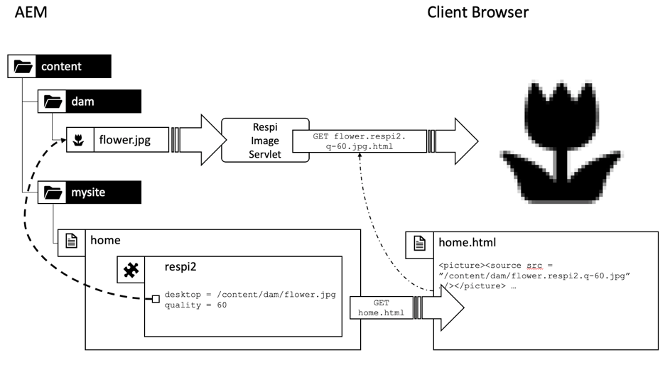

# 第1章 — 调度程序概念、模式和反模式

## 概述

本章简要介绍Dispatcher的历史和机制，并讨论这对AEM开发人员设计其组件的方式有何影响。

## 为什么开发人员应该关心基础架构

Dispatcher是大多数(即使不是所有AEM安装)安装中必不可少的一部分。 您可以找到许多在线文章，其中讨论了如何配置Dispatcher以及提示和技巧。

但是，这些信息总是从非常技术性的层面开始 — 假设您已经知道自己想做什么，因此只提供有关如何实现您所希望的内容的详细信息。 我们从未找到任何描述 _什么是和为什么是_ 当您可以和不能对调度程序执行什么操作时。

### 反模式：Dispatcher的事后思考

缺乏这些基本信息会导致我们在许多AEM项目中看到的一些反模式：

1. 当Dispatcher安装在Apache Web服务器中时，它是项目中“Unix之神”的作业来配置它。 “凡人的java开发者”不必关心它。

2. Java开发人员需要确保其代码有效……调度程序稍后会神奇地加快其速度。 调度程序始终是事后才考虑的事。 但是，这不起作用。 开发人员必须牢记调度程序并设计其代码。 他需要知道它的基本概念。

### “先让它起作用，然后让它快速起作用”并非总是正确

你可能听过编程建议 _“首先让它起作用，然后让它迅速起作用。”_. 这并非完全错误。 但是，如果没有正确的上下文，则容易误解和不正确应用。

建议应避免开发人员过早地优化可能永远无法运行的代码，或者极少运行的代码，以致于优化不会产生足够的影响，无法证明将投入优化的工作是合理的。 此外，优化可能导致代码更复杂，从而引入错误。 因此，如果您是开发人员，请不要花太多时间对每一行代码进行微优化。 只需确保选择正确的数据结构、算法和库，然后等待Profiler的热点分析，以了解更彻底的优化可以提高整体性能。

### 建筑决策和艺术品

然而，在“建筑”决策方面，“先让它起作用，然后让它快速起作用”的建议是完全错误的。 什么是建筑决策？ 简言之，这些决定是代价高昂、难度大、或是事后不可能改变的。 请记住，“昂贵”有时与“不可能”相同。  例如，当您的项目预算不足时，就无法实施成本高昂的更改。 对基础设施的改变是大多数人想到的第一类改变。 但还有另一种“建筑”艺术品，它们可能变得非常难改变：

1. 应用程序“中心”中的代码段，许多其他代码段都依赖于该代码段。 更改这些依赖项时，需要立即更改并重新测试所有依赖项。

2. 伪像，这些伪像涉及到一些与时间相关的异步场景中，在这种场景中，输入 — 因此，系统的行为可能会非常随机地改变。 更改可能会产生不可预知的效果，并且很难测试。

3. 在系统的所有部分和部分中反复使用和重复使用的软件模式。 如果软件模式被证明为次优，则需要重新编码使用该模式的所有工件。

记住? 在本页顶部，我们说Dispatcher是AEM应用程序的重要部分。 访问Web应用程序是非常随机的 — 用户在不可预测的时间来来去。 最后 — 所有内容将（或应）缓存到调度程序中。 因此，如果您非常关注缓存，您可能已经意识到缓存可被视为“体系结构”项目，因此团队的所有成员、开发人员和管理员都应该理解缓存。

我们并不是说开发人员实际应该配置Dispatcher。 他们需要了解概念（尤其是边界），以确保调度程序也可以利用其代码。

Dispatcher不会神奇地提高代码速度。 开发人员需要牢记Dispatcher来创建其组件。 因此，他需要知道它是如何工作的。

## 调度程序缓存 — 基本原则

### 作为缓存Http的调度程序 — 负载平衡器

什么是Dispatcher，最初为什么称为“Dispatcher”？

调度程序是

* 首先，也是最重要的缓存

* 反向代理

* Apache httpd Webserver的一个模块，为Apache的通用性添加了AEM相关功能，并与所有其他Apache模块（如SSL甚至SSI包含，我们稍后将看到）一起正常工作

在Web早期，您会希望有几百位访客访问一个网站。 一个Dispatcher的设置，即“已调度”或平衡了对多个AEM发布服务器的请求负载，且通常足够了，因此名称为“Dispatcher”。 但是，现在这种设置已不再经常使用。

下文将介绍设置Dispatcher和发布系统的不同方法。 首先，让我们从一些HTTP缓存基础知识开始。


*调度程序缓存的基本功能*

<br> 

此处介绍了调度程序的基本知识。 调度程序是一个简单的缓存反向代理，能够接收和创建HTTP请求。 正常的请求/响应周期如下所示：

1. 用户请求页面
2. 调度程序会检查（如果它已经具有该页面的渲染版本）。 假设它是此页面的第一个请求，并且Dispatcher找不到本地缓存的副本。
3. 调度程序从发布系统请求页面
4. 在发布系统中，页面由JSP或HTL模板呈现
5. 页面将返回到调度程序
6. 调度程序缓存页面
7. Dispatcher将页面返回到浏览器
8. 如果再次请求同一页面，则可以直接从Dispatcher缓存提供该页面，而无需在Publish实例上重新渲染该页面。 这可节省Publish实例上用户和CPU周期的等待时间。

我们在最后一节讨论“页面”。 但同样的方案也适用于其他资源，如图像、CSS文件、PDF下载等。

#### 数据如何缓存

调度程序模块利用托管Apache服务器提供的设施。 HTML页、下载和图片等资源作为简单文件存储在Apache文件系统中。 就这么简单。

文件名由请求资源的URL派生。 如果您请求文件 `/foo/bar.html` 例如，存储在/下`var/cache/docroot/foo/bar.html`.

原则上，如果所有文件都被缓存并静态存储在Dispatcher中，您可以提取发布系统的插件，Dispatcher将用作简单的Web服务器。 但这只是为了说明原则。 现实生活更复杂。 您无法缓存所有内容，并且缓存从不会完全“完全”，因为由于渲染过程的动态性质，资源数量可能是无限的。 静态文件系统的模型有助于生成调度程序功能的粗略图景。 这有助于解释调度程序的限制。

#### AEM URL结构与文件系统映射

要更详细地了解Dispatcher，让我们重新访问简单示例URL的结构。  下面的示例，

`http://domain.com/path/to/resource/pagename.selectors.html/path/suffix.ext?parameter=value&amp;otherparameter=value#fragment`

* `http` 表示协议

* `domain.com` 是域名

* `path/to/resource` 是资源存储在CRX中的路径，随后存储在Apache服务器的文件系统中

与此相比，AEM文件系统和Apache文件系统之间的情况略有不同。

在AEM中，

* `pagename` 是资源标签

* `selectors` 表示Sling中使用的多个选择器，用于确定资源的呈现方式。 一个URL可以具有任意数量的选择器。 他们隔了一段时间。 例如，选择器部分可能类似于“french.mobile.fancy”。 选择器应仅包含字母、数字和短划线。

* `html` 作为“选择器”的最后一个选项，称为扩展。 在AEM/Sling中，它还部分决定了渲染脚本。

* `path/suffix.ext` 是一个类似路径的表达式，可以是URL的后缀。  它可用于AEM脚本中，以进一步控制资源的呈现方式。 我们稍后将提供有关此部分的完整部分。 目前，您应该已经知道可以将其用作其他参数。 后缀必须具有扩展名。

* `?parameter=value&otherparameter=value` 是URL的查询部分。 它用于将任意参数传递到AEM。 无法缓存带有参数的URL，因此，参数应仅限于绝对有必要的情况。

* `#fragment`，则URL的片段部分不会传递到AEM，而是仅在浏览器中使用；在JavaScript框架中作为“路由参数”，或跳转到页面上的某个部分。

在Apache中(*参考下图*)、

* `pagename.selectors.html` 用作缓存文件系统中的文件名。

如果URL具有后缀 `path/suffix.ext` 然后，

* `pagename.selectors.html` 创建为文件夹

* `path` 文件夹 `pagename.selectors.html` 文件夹

* `suffix.ext` 是 `path` 文件夹。 注意：如果后缀没有扩展名，则不会缓存文件。


*从调度程序获取URL后的文件系统布局*

<br> 

#### 基本限制

URL、资源和文件名之间的映射非常简单。

但是，您可能发现了一些陷阱，

1. URL可能会变得非常长。 添加 `/docroot` 本地文件系统上的文件系统可能会轻松超出某些文件系统的限制。 在Windows上的NTFS中运行Dispatcher可能是一个难题。 但是，Linux是安全的。

2. URL可以包含特殊字符和变音。 调度程序通常不会遇到此问题。 但请记住，该URL会在应用程序的许多位置进行解释。 我们经常看到应用程序的奇怪行为 — 只是为了发现一段很少使用（自定义）的代码没有经过针对特殊字符的彻底测试。 你应该尽量避开他们。 如果不能，请计划彻底测试。

3. 在CRX中，资源具有子资源。 例如，一个页面将具有多个子页面。 在文件系统中无法匹配此文件，因为文件系统具有文件或文件夹。

#### 不会缓存没有扩展名的URL

URL必须始终具有扩展名。 尽管您可以在AEM中提供不带扩展名的URL。 这些URL将不会缓存在Dispatcher中。

**示例**

`http://domain.com/home.html` is **缓存**

`http://domain.com/home` is **无法缓存**

当URL包含后缀时，同样的规则也适用。 后缀需要具有可缓存的扩展名。

**示例**

`http://domain.com/home.html/path/suffix.html` is **缓存**

`http://domain.com/home.html/path/suffix` is **无法缓存**

您可能会想，如果资源部分没有扩展名，但后缀有扩展名，会发生什么情况？ 那么，在这种情况下，URL根本没有后缀。 请看下一个示例：

**示例**

`http://domain.com/home/path/suffix.ext`

的 `/home/path/suffix` 是资源的路径…… ，因此URL中没有后缀。

**结论**

始终为路径和后缀添加扩展名。 有SEO意识的人有时会辩称，这在搜索结果中排名靠前。 但是，一个未缓存的页面速度会非常慢，排名会更靠后。

#### 后缀URL冲突

假定您有两个有效的URL

`http://domain.com/home.html`

和

`http://domain.com/home.html/suffix.html`

它们在AEM中是绝对有效的。 在本地开发计算机上（没有Dispatcher），您不会看到任何问题。 在UAT或负载测试中，您很可能也不会遇到任何问题。 我们面临的问题非常微妙，以至于它在大多数测试中都漏掉了。  当您处于高峰时间时，它会给您带来沉重的打击，并且您的寻址时间有限，可能没有服务器访问权限，也没有修复它的资源。 我们去过那里……

那，有什么问题？

`home.html` 文件系统中可以是文件或文件夹。 不会与在AEM中同时出现。

如果您请求 `home.html` 首先，将其创建为文件。

后续请求 `home.html/suffix.html` 返回有效结果，但作为文件 `home.html` “阻止”文件系统中的位置，  `home.html` 无法再次创建为文件夹，因此 `home.html/suffix.html` 未缓存。


*文件系统中阻止子资源被缓存的文件阻塞位置*

<br> 

如果反过来，首先请求 `home.html/suffix.html` then `suffix.html` 缓存在文件夹下 `/home.html` 开始。 但是，此文件夹会被删除并替换为文件 `home.html` 随后请求 `home.html` 作为资源。


*在作为资源获取父项时删除路径结构*

<br> 

因此，缓存内容的结果完全是随机的，并且取决于传入请求的顺序。 更棘手的是，您通常拥有多个调度程序。 而且，不同调度程序的性能、缓存点击率和行为可能会有所不同。 如果要了解您的网站为何没有响应，您需要确保查看正确的Dispatcher并且缓存顺序不佳。 如果您正在查找具有更有利请求模式的Dispatcher（幸运的是），那么在尝试查找问题时将会丢失。

#### 避免URL冲突

当您为资源使用不同的扩展名（后缀为）时，您可以避免出现“冲突的URL”，其中文件夹名称和文件名“竞争”文件系统中的同一路径。

**示例**

* `http://domain.com/home.html`

* `http://domain.com/home.dir/suffix.html`

两者都完全可以缓存，


在请求后缀或避免完全使用后缀时，为资源选择专用扩展“dir”。 在极少数情况下，它们很有用。 而且这些案例的正确实施非常容易。  正如我们在下一章中讨论缓存失效和刷新时所看到的。

#### 不可执行的请求

让我们查看最后一章的快速摘要以及一些其他例外。 如果URL配置为可缓存，并且是GET请求，则Dispatcher可以缓存该URL。 无法在以下异常之一下缓存。

**可缓存请求**

* 请求配置为可在Dispatcher配置中缓存
* 请求是纯GET请求

**不可缓存的请求或响应**

* 被配置拒绝缓存的请求（路径、模式、MIME类型）
* 返回“调度程序：no-cache&quot;标头
* 返回“Cache-Control:no-cache|private&quot;标头
* 返回“Pragma:no-cache&quot;标头
* 具有查询参数的请求
* 不带扩展名的URL
* 后缀为不带扩展名的URL
* 返回200以外的状态代码的响应
* POST请求

## 使缓存失效和刷新

### 概述

最后一章列出了当Dispatcher无法缓存请求时的大量例外。 但还有更多事情需要考虑：就因为调度程序 _can_ 缓存请求，它不一定表示 _show_.

重点是：缓存通常很简单。 Dispatcher只需存储响应的结果，并在下次传入完全相同的请求时返回即可。 右? 错了！

难点在于 _失效_ 或 _刷新_ 的子代。 当资源发生更改时，Dispatcher需要了解相关情况，并且需要再次渲染。

乍一看，这似乎是一项琐碎的任务……但却并非如此。 进一步阅读，您会发现单个资源和简单资源与依赖多个资源高度划分结构的页面之间存在一些棘手的差异。

### 简单资源和刷新

我们已设置AEM系统，以便在使用特殊的“缩略图”选择器提出请求时，为每个图像动态创建缩略图呈现：

`/content/dam/path/to/image.thumb.png`

而且 — 当然，我们提供了一个URL，以通过一个无选择器URL来提供原始图像：

`/content/dam/path/to/image.png`

如果同时下载缩览图和原始图像，最终会得到类似，

```
/var/cache/dispatcher/docroot/content/dam/path/to/image.thumb.png

/var/cache/dispatcher/docroot/content/dam/path/to/image.png
```

在Dispatcher的文件系统中。

现在，用户上传并激活该文件的新版本。 最终，失效请求会从AEM发送到Dispatcher，

```
GET /invalidate
invalidate-path:  /content/dam/path/to/image

<no body>
```

失效很简单：对Dispatcher上特殊“/invalidate”URL的简单GET请求。 不需要HTTP-body，“payload”只是“invalidate-path”标头。 另请注意，标头中的invalidate-path是AEM所知的资源，而不是Dispatcher已缓存的文件。 AEM只了解资源。 请求资源时，会在运行时使用扩展、选择器和后缀。 AEM不会对资源上使用的选择器执行任何簿记操作，因此在激活资源时，它只知道资源路径。

就我们而言，这就足够了。 如果资源发生更改，我们可以安全地假定该资源的所有演绎版也发生了更改。 在我们的示例中，如果图像发生更改，也会呈现一个新的缩略图。

Dispatcher可以安全地删除其已缓存的所有演绎版的资源。 它会做类似，

`$ rm /content/dam/path/to/image.*`

删除 `image.png` 和 `image.thumb.png` 和与该模式匹配的所有其他演绎版。

超级简单的确……只要您只使用一个资源来响应请求。

### 参照和网格化内容

#### 网格化内容问题

与上传到AEM的图像或其他二进制文件不同，HTML页面不是单独的动物。 它们生活在群锁中，通过超链接和引用高度相互关联。 简单的链接是无害的，但当我们讨论内容引用时，却会变得棘手。 页面上无处不在的顶部导航或Teaser是内容引用。

#### 内容引用及其产生原因

让我们看一个简单的示例。 旅行社有一个网页，宣传去加拿大的旅行。 此促销活动在其他两个页面的Teaser部分、“主页”页面和“冬季特别计划”页面中都有。

由于两个页面显示相同的Teaser，因此不必要求作者为应显示的每个页面多次创建Teaser。 相反，目标页面“加拿大”会在页面属性中保留一个部分以提供Teaser的信息，或者最好提供一个完全呈现该Teaser的URL:

`<sling:include resource="/content/home/destinations/canada" addSelectors="teaser" />`

或

`<sling:include resource="/content/home/destinations/canada/jcr:content/teaser" />`


仅在AEM上，它像魅力一样起作用，但如果您在Publish实例中使用Dispatcher，会发生奇怪的情况。

想象一下，您已经发布了您的网站。 您的加拿大页面上的标题为“Canada”。 当访客请求您的主页（该主页具有对该页面的Teaser引用）时，“加拿大”页面上的组件会呈现类似于

```
<div class="teaser">
  <h3>Canada</h3>
  
</div>
```

*into* 主页。 主页由Dispatcher作为静态.html文件存储，包括Teaser和该文件中的标题。

现在，营销人员已经知道，Teaser标题应该可以操作。 因此，他决定将标题从“加拿大”改为“访问加拿大”，并更新图像。

他发布编辑的“加拿大”页面，并重新访问之前发布的主页以查看其更改。 但是，那里没有什么变化。 它仍显示旧的Teaser。 他仔细检查“冬日特惠”。 以前从未请求过该页面，因此不会静态缓存到Dispatcher中。 因此，此页面由Publish全新呈现，并且此页面现在包含新的“访问加拿大”Teaser。


*在主页中存储过时包含内容的调度程序*

<br> 

怎么了？ Dispatcher存储页面的静态版本，该页面包含渲染时从其他资源绘制的所有内容和标记。

Dispatcher只是一个基于文件系统的Web服务器，速度很快，但也相对简单。 如果包含的资源发生更改，它不会意识到这一点。 它仍会链接到呈现包含页面时所在的内容。

“冬季特殊”页面尚未呈现，因此调度程序上没有静态版本，因此在新Teaser应请求全新呈现时，会随新Teaser一起显示该页面。

您可能认为，当资源发生更改时，Dispatcher会在渲染和刷新所有使用此资源的页面时，跟踪其接触的每个资源。 但Dispatcher不呈现页面。 渲染由发布系统执行。 Dispatcher不知道将哪些资源放入渲染的.html文件中。

还没被说服？ 你可能认为 *“必须有一种方法来实施某种依赖关系跟踪”*. 那里有，或者更准确的说 *was*. AEM的曾曾曾祖父在第3号公报中实施了扶养追踪系统 _会话_ 用于呈现页面的URL。

在请求期间，通过此会话获取的每个资源都会作为当前呈现的URL的依赖项进行跟踪。

但事实证明，追踪这些依赖项是非常昂贵的。 人们很快发现，如果完全关闭依赖项跟踪功能，并且依赖在一个html页面发生更改后重新渲染所有html页面，则网站的速度会更快。 此外，这一方案也不完美 — 在路上有许多陷阱和例外。 在某些情况下，您没有使用请求默认会话来获取资源，而是使用管理员会话来获取一些帮助程序资源来呈现请求。 通常不会跟踪这些依赖项，从而导致头痛和给运营团队打电话要求手动刷新缓存。 如果他们有标准的程序，你很幸运。 路上还有更多的麻烦，但是……我们别再回忆了。 这可以追溯到2005年。 最终，该功能在公报4中默认被取消激活，而未能重新纳入随后成为AEM的后续CQ5。

### 自动失效

#### 当完全刷新比依赖项跟踪更便宜时

自CQ5起，仅当其中一个页面发生更改时，我们完全依赖于整个网站的失效（或多或少）。 此功能称为“自动失效”。

但是，抛弃和重新渲染数百页的成本，又怎么可能比正确跟踪依赖关系和部分重新渲染成本更低呢？

原因有二：

1. 通常，只会经常请求一小部分页面。 因此，即使您将所有渲染的内容都丢弃，实际上，之后也只会立即请求几打渲染。 实际请求页面时，长尾的渲染可以随时间分发。 因此，实际上，渲染页面上的负载没有您预期的那么高。 当然，总有例外……我们将讨论一些技巧，以便在大型网站上使用空的Dispatcher缓存处理均匀分布的负载。

2. 所有页面仍通过主导航连接。 因此，几乎所有页面最终都是相互依赖的。 这意味着，即便是最聪明的依赖追踪者，也会发现我们已经知道的：如果其中一个页面发生更改，则必须使所有其他页面失效。

你不相信吗？ 让我们来说明最后一点。

我们将使用与上一个示例中相同的参数，并使用引用远程页面内容的Teaser。 直到现在，我们才用了一个更极端的例子：自动呈现的主导航。 与Teaser一样，导航标题是从链接或“远程”页面中作为内容引用来绘制的。 远程导航标题不会存储在当前呈现的页面中。 您应该记住，导航会呈现在您网站的每个页面上。 因此，在具有主导航的所有页面上，都会反复使用一个页面的标题。 如果要更改导航标题，则只想在远程页面上执行一次该操作 — 而不是在每个引用该页面的页面上执行此操作。

因此，在我们的示例中，导航会使用目标页面的“NavTitle”在导航中呈现名称，从而将所有页面网格化在一起。 “Iceland”的导航标题从“Icelaz”页面中提取，并呈现到每个具有主导航的页面中。


*主导航通过提取所有页面的“NavTitles”，不可避免地将其内容网格化在一起*

<br> 

如果您将冰岛页面上的NavTitle从“Iceland”更改为“Beautiful Iceland”，则该标题会在所有其他页面主菜单上立即更改。 因此，在发生该更改之前呈现和缓存的页面都会失效。

#### 如何实施自动失效：.stat文件

现在，如果您有一个包含数千页的大型网站，则需要相当长的时间来循环浏览所有页面并实际删除这些页面。 在此期间，Dispatcher可能会无意中提供过时的内容。 更糟糕的是，在访问缓存文件时可能会发生一些冲突，可能是在页面被删除时请求页面，或者由于在随后立即激活后发生第二次失效而再次删除页面。 想想会是多么乱。 幸运的是，事情并非如此。 Dispatcher使用巧妙的技巧来避免这种情况：当文件发布时，它不会删除数百个和数千个文件，而是将一个简单的空文件放入文件系统的根中，因此所有依赖的文件都被视为无效。 此文件称为“statfile”。 statfile是空文件 — 与statfile有关的只是其创建日期。

调度程序中创建日期早于statfile的所有文件均已在上次激活（和失效）之前呈现，因此被视为“无效”。 它们在文件系统中仍然存在，但Dispatcher忽略它们。 他们“过时”了。 每当向过时的资源发出请求时，Dispatcher都会要求AEM系统重新渲染页面。 然后，新呈现的页面将存储在文件系统中 — 现在有新的创建日期，并且它又重新刷新了。


*.stat文件的创建日期定义哪些内容已过时和哪些内容已更新*

<br> 

您可能会问为什么它叫做“.stat”？ 而不是“.unvalide”？ 您可以想象，将该文件放在您的文件系统中有助于Dispatcher确定哪些资源可以 *静态* 提供 — 与从静态Web服务器提供的一样。 这些文件不再需要动态呈现。

然而，这个名字的真实性质，并不那么具有隐喻性。 它是从Unix系统调用派生的 `stat()`，返回文件的修改时间（以及其他属性）。

#### 将简单验证与自动验证结合使用

但是，等等，我们之前说过，单个资源会被实际删除。 现在，我们说，较新的statfile实际上会在Dispatcher的眼中导致它们无效。 那么，为什么首先进行物理删除呢？

答案很简单。 通常，您会并行使用这两个策略 — 但会针对不同类型的资源使用。 二进制资产（如图像）是自包含的。 它们与其他资源之间没有关联，这意味着它们需要呈现其信息。

HTML页面是高度相互依赖的。 因此，您将对这些应用自动失效功能。 这是Dispatcher中的默认设置。 属于无效资源的所有文件都将被物理删除。 此外，以“.html”结尾的文件会自动失效。

Dispatcher决定是否应用自动失效方案来扩展文件。

可配置自动失效的文件结尾。 理论上，您可以包含要自动失效的所有扩展。 但请记住，这是一个非常高的代价。 您不会无意中看到已交付过时的资源，但交付性能会因过度失效而显着降低。

例如，假设您实施了一种方案，其中PNG和JPG是动态呈现的，并依赖其他资源来实现。 您可能希望将高分辨率图像重新缩放为较小的Web兼容分辨率。 在使用时，也会更改压缩率。 此示例中的分辨率和压缩率不是固定常量，而是使用图像的组件中的可配置参数。 现在，如果更改了此参数，则需要使图像失效。

没问题 — 我们刚刚了解到，我们可以将图像添加到自动失效中，并且每当发生任何更改时，都会始终提供新渲染的图像。

#### 把婴儿和洗澡水一起扔出去

这是对的，这是个大问题。 再读一遍最后一段。 “……只要有任何变化，就会新呈现图像。” 如你所知，一个好网站会不断变化；在此处添加新内容、在此处更正拼写错误、在其他地方调整teaser。 这意味着您的所有图像会不断失效，需要重新渲染。 别小瞧。 动态渲染和传输图像数据在本地开发计算机上的工作时间（以毫秒为单位）。 您的生产环境需要更频繁地执行该操作 — 每秒。

让我们在此处明确一下，当html页面发生更改时，需要重新渲染您的jpg，反之亦然。 只有一个“存储段”文件可自动失效。 它整体上冲。 不用再细分细节结构。

默认情况下，自动失效保留为“.html”的原因很充分。 目标是尽可能地把那个桶塞小。 不要把婴儿和洗澡水一起扔掉，只是让一切失效 — 只是为了站在安全的一边。

自成一体的资源应按照该资源的路径提供。 这很有帮助失效。 保持简单，请勿创建映射方案，如“resource /a/b/c”是从“/x/y/z”提供的映射方案。 使组件能够使用默认的Dispatcher自动失效设置。 请勿尝试在Dispatcher中修复设计不当且过度失效的组件。

##### 自动失效的例外：ResourceOnly失效

Dispatcher的失效请求通常由复制代理从发布系统触发。

如果您对依赖关系非常有信心，可以尝试构建自己的使复制代理失效的代理。

要详细说明，本指南有些不足，但我们想至少给您一些提示。

1. 真的知道你在做什么。 正确地使失效变得非常困难。 这就是自动失效如此严格的原因之一；以避免传递过时的内容。

2. 如果您的代理发送HTTP标头 `CQ-Action-Scope: ResourceOnly`，这意味着此单个失效请求不会触发自动失效。 此( [https://github.com/cqsupport/webinar-dispatchercache/tree/master/src/refetching-flush-agent/refetch-bundle](https://github.com/cqsupport/webinar-dispatchercache/tree/master/src/refetching-flush-agent/refetch-bundle))一段代码可能是您自己的复制代理的一个好起点。

3. `ResourceOnly`，则仅阻止自动失效。 要实际执行必要的依赖关系解析和无效，您必须自行触发失效请求。 您可能需要检查包Dispatcher刷新规则([https://adobe-consulting-services.github.io/acs-aem-commons/features/dispatcher-flush-rules/index.html](https://adobe-consulting-services.github.io/acs-aem-commons/features/dispatcher-flush-rules/index.html))，以激发我们如何真正做到这一点。

我们不建议您构建依赖关系解决方案。 我们的努力太多，收益也太少 — 正如之前所说，你会犯错的太多。

相反，您应该做的是找出哪些资源对其他资源没有任何依赖性，并且这些资源可以在不自动失效的情况下失效。 但是，您不必为此使用自定义复制代理。 只需在Dispatcher配置中创建一个自定义规则，以便将这些资源排除在自动失效之外。

我们说主导航或Teaser是依赖项的来源。 好吧 — 如果异步加载导航和Teaser，或在Apache中通过SSI脚本包含它们，则您将没有要跟踪的依赖项。 在本文档的后面部分，我们将详细介绍异步加载组件，当我们介绍“Sling动态包含”时。

这同样适用于加载到灯箱中的弹出窗口或内容。 这些片段很少具有导航（即“依赖项”），并且可以作为单个资源失效。

## 考虑调度程序构建组件

### 调度程序机制在实际应用中的示例

在最后一章中，我们介绍了Dispatcher的基本机制、一般工作方式以及限制。

现在，我们希望将这些机制应用于您很可能会在项目要求中找到的一类组件。 我们故意选择组件，以展示您迟早还会遇到的问题。 恐惧不是 — 并非所有组成部分都需要我们提供的足够考虑。 但是，如果您看到需要构建这样一个组件，您会非常了解后果并知道如何处理。

### 假脱机组件（防）模式

#### 响应式图像组件

让我们说明具有互连二进制文件的组件的通用模式（或反模式）。 我们将为“响应式图像”创建一个组件“响应”。 此组件应该能够将显示的图像调整为其所显示的设备。 在台式机和平板电脑上，它显示图像的完整分辨率，在手机上显示较小版本、裁剪较窄，甚至可能是完全不同的主题（在响应式世界中，这被称为“艺术方向”）。

资产会上传到AEM的DAM区域，并且仅 _引用_ 在响应式图像组件中。

响应组件负责标记的渲染和二进制图像数据的传送。

我们在此实施该集成的方法是在许多项目中看到的一种常见模式，即使其中一个AEM核心组件也基于该模式。 因此，作为开发者，您很可能会调整这种模式。 在封装方面，它有其最佳点，但要使Dispatcher准备就绪，需要付出大量努力。 我们稍后将讨论几种如何减轻问题的方法。

我们将这里使用的模式称为“后台程序模式”，因为问题可以追溯到公报3的早期，在那里，有一种方法“短管”可以被调用，用于将二进制原始数据传输到响应中。

原始术语“假脱机”实际上是指共享的慢速脱机外围设备（如打印机），因此无法在此处正确应用。 但我们还是喜欢这个词，因为它很少在网络世界上如此明显。 每个模式都应该有一个可辨别的名字，对吧？ 这取决于你是否是一种模式或反模式。

#### 实施

以下是响应式图像组件的实施方式：

该构件分为两部分；第一部分呈现图像的HTML标记，第二部分“假脱机”引用图像的二进制数据。 由于这是一个具有响应式设计的现代网站，因此我们不会渲染简单的 `` 标记，但是 `<picture/>` 标记。 对于每个设备，我们会将两个不同的图像上传到DAM，并从图像组件中引用它们。

该组件有三个渲染脚本（在JSP、HTL中实现，或作为Servlet实现），每个脚本都使用专用选择器处理：

1. `/respi.jsp`  — 没有选择器以呈现HTML标记
2. `/respi.img.java` 呈现桌面版本
3. `/respi.img.mobile.java` 以呈现移动版本。


组件位于主页的Parsys中。 CRX中的结果结构如下所示。


*CRX中响应式图像的资源结构*

<br> 

组件标记如下所示，

```plain
  #GET /content/home.html

  <html>

  …

  <div class="responsive-image>

  <picture>
    <source src="/content/home/jcr:content/par/respi.img.mobile.jpg" …/>
    <source src="/content/home/jcr:content/par/respi.img.jpg …/>

    …

  </picture>
  </div>
  …
```

我们的封装组件已经完成了。

#### 正在使用的响应式图像组件

现在，用户通过Dispatcher请求页面和资产。 这会导致Dispatcher文件系统中的文件，如下图所示：


*封装的响应式图像组件的缓存结构*

<br> 

考虑用户上传两个花卉图像并将其新版本激活到DAM。 AEM将根据失效请求发送

`/content/dam/flower.jpg`

和

`/content/dam/flower-mobile.jpg`

调度程序。 不过，这些要求是徒劳的。 内容已缓存为组件子结构下的文件。 这些文件现在已过时，但仍会根据请求提供。


*结构不匹配导致内容过时*

<br> 

这一方法还有另一个注意事项。 请考虑在多个页面上使用相同的flower.jpg。 然后，您会在多个URL或文件下缓存同一资产，

```
/content/home/products/jcr:content/par/respi.img.jpg

/content/home/offers/jcr:content/par/respi.img.jpg

/content/home/specials/jcr:content/par/respi.img.jpg

…
```

每次请求一个新的未缓存页面时，都会从AEM中以不同的URL获取资产。 没有Dispatcher缓存和浏览器缓存都无法加快交付速度。

#### 辐射器图案在哪里放光

有一个自然的例外，即使以简单的形式，这种模式也是有用的：如果二进制文件存储在组件本身中，而不是DAM中。 但是，这仅对网站上使用过一次的图像非常有用，并且不在DAM中存储资产意味着您很难管理资产。 假设您在特定资产的使用许可证已用完。 您如何确定已使用资产的组件？

看到没？ DAM中的“M”表示“管理” — 与在数字资产管理中一样。 您不想将该功能发布。

#### 结论

从AEM开发人员的角度看，这种模式看起来非常优雅。 但是，如果Dispatcher考虑了这个等式，您可能会同意，天真的方法可能是不够的。

现在，我们由你来决定这是一种模式还是一种反模式。 也许你已经有一些好的想法，想如何缓解上述问题？ 很好。 那么，你应该迫切地想看看其他项目是如何解决这些问题的。

### 解决常见Dispatcher问题

#### 概述

让我们来讨论一下，如何能够更友好地实施该功能。 有几个选项。 有时你无法选择最好的解决方案。 您可能遇到一个已在运行的项目，并且您的预算有限，只能解决手头的“缓存问题”，而且还不足以进行完全重构。 或者您遇到一个比示例图像组件更加复杂的问题。

以下各节将简要介绍相关原则和注意事项。

同样，这是基于现实经验的。 我们已经看到了所有这些野外模式，所以这不是一项学术研究。 这就是为什么我们向你们展示一些反模式的原因，所以你们有机会从别人已经犯的错误中吸取教训。

#### 缓存杀手

>[!WARNING]
>
>这是反模式。 请勿使用。 永远。

您是否曾看到查询参数，如 `?ck=398547283745`? 它们称为缓存杀手(“ck”)。 其思想是，如果添加任何查询参数，则资源将不会缓存。 此外，如果添加随机数作为参数的值(如“398547283745”)，则URL将变得唯一，并且您确保AEM系统和屏幕之间的其他缓存也无法缓存。 中间常见的情况是调度程序、CDN甚至浏览器缓存前面的“清漆”缓存。 再次：别这样。 您确实希望尽可能多地缓存资源。 缓存是你的朋友。 别杀朋友。

#### 自动失效

>[!WARNING]
>
>这是反模式。 避免将其用于数字资产。 尝试保留Dispatcher的默认配置，该配置>仅对“.html”文件自动失效

短期而言，您可以向Dispatcher中的自动失效配置添加“.jpg”和“.png”。 这意味着，每当发生失效时，都需要重新渲染所有“.jpg”、“.png”和“.html”。

如果业务所有者抱怨他们的更改没有在实时网站上足够快地实现，则这种模式非常容易实施。 但这只能给你一些时间来想出更复杂的解决方案。

确保您了解对性能的巨大影响。 这会显着降低您的网站的运行速度，甚至会影响网站的稳定性（如果您的网站是负载较高且频繁更改的网站），例如新闻门户。

#### URL指纹

URL指纹看起来像是一个缓存杀手。 但事实并非如此。 它不是随机数，而是表示资源内容的值。 这可以是资源内容的哈希，或者更简单的是，是上传、编辑或更新资源时的时间戳。

Unix时间戳非常适合于实际实施。 为了更好的可读性，我们在本教程中使用了更易读的格式： `2018 31.12 23:59 or fp-2018-31-12-23-59`.

不得将指纹用作查询参数，因为无法缓存具有查询参数的URL。 您可以使用选择器或指纹的后缀。

假设，文件 `/content/dam/flower.jpg` 具有 `jcr:lastModified` 2018年12月31日，23:59。 带有指纹的URL是 `/content/home/jcr:content/par/respi.fp-2018-31-12-23-59.jpg`.

只要引用的资源(`flower.jpg`)文件。 因此，它可以被无限期地缓存，而不是缓存杀手。

请注意，此URL需要由响应式图像组件创建并提供。 它不是现成的AEM功能。

这是基本概念。 不过，有一些细节可能很容易被忽视。

在我们的示例中，组件在23:59处呈现并缓存。 现在图像已经更改，比如00:00。  组件 _wild_ 在其标记中生成新的指纹URL。

你可能觉得 _show_...但没有。由于只更改了图像的二进制文件且未接触包含页面，因此无需重新渲染HTML标记。 因此，Dispatcher会使用旧指纹来提供页面，进而提供旧版本的图像。


*图像组件比引用的图像更新，不会呈现新的指纹。*

<br> 

现在，如果您重新激活主页（或该网站的任何其他页面），则statfile将会更新，则Dispatcher会考虑home.html版本，并在图像组件中使用新指纹重新渲染该页面。

但我们没激活主页，对吗？ 为什么我们应该激活一个没有触摸的页面？ 此外，我们可能没有足够的权限来激活页面，或者审批工作流过程漫长而耗时，以至于我们无法在短时间通知您时执行此操作。 那么，该怎么办？

#### 懒惰管理工具 — 降低状态文件级别

>[!WARNING]
>
>这是反模式。 只在短期内使用它来赢得一些时间，然后提出更复杂的解决方案。

懒惰管理员通常为“_将自动失效设置为jpgs，将statfile级别设置为零 — 这始终有助于解决各种缓存问题_.&quot; 您会在技术论坛中找到该建议，这有助于解决失效问题。

直到现在，我们还没有讨论statfile级别。 基本上，自动失效仅适用于同一子树中的文件。 但是，问题是页面和资产通常不会位于同一子树中。 页面位于下面的某个位置 `/content/mysite` 而资产则处于以下状态 `/content/dam`.

“statfile level”定义子树的根节点深度的位置。 在以上示例中，级别为“2”(1=/content， 2=/mysite，dam)

将statfile级别“降低”为0的思想基本上是将整个/content树定义为一个子树，并且只将该子树定义为一个子树，以使页面和资产处于同一自动失效域中。 因此，我们只会在大树的级别上（在docroot“/”）。 但是，每当发布某些内容时，服务器上的所有网站都会自动失效，甚至在完全不相关的网站上也是如此。 相信我们：从长远看，这是个坏主意，因为您会严重降低缓存总命中率。 您只能希望您的AEM服务器拥有足够的火力来在没有缓存的情况下运行。

稍后，您将了解更深入的statfile级别的全部优势。

#### 实施自定义失效代理

无论如何 — 如果“.jpg”或“.png”发生更改，以允许使用新URL重新渲染，我们需要以某种方式告知Dispatcher，以使HTML页面失效。

我们在项目中看到的是（例如）发布系统上的特殊复制代理，每当发布站点的图像时，这些代理都会发送站点的失效请求。

如果您可以通过命名约定从资产路径派生网站路径，则在此功能非常有用。

通常，最好匹配以下网站和资产路径：

**示例**

```
/content/dam/site-a
/content/dam/site-b

/content/site-a
/content/site-b
```

这样，当您的自定义Dispatcher刷新代理遇到更改时，便可以轻松地向/content/site-a发送和失效请求 `/content/dam/site-a`.

事实上，无论您通过哪条路径告知Dispatcher失效（只要它位于同一站点、同一“子树”中），都无关紧要。 您甚至不必使用真正的资源路径。 它也可以是“虚拟”的：

```
GET /dispatcher-invalidate
Invalidate-path /content/mysite/dummy
```


1. 当DAM中的文件发生更改时，将触发发布系统上的侦听器

2. 侦听器向调度程序发送失效请求。 由于自动失效，因此我们在自动失效中发送的路径无关紧要，除非它位于网站的主页下方 — 或者更精确地位于网站状态文件级别下。

3. statfile已更新。

4. 下次请求主页时，会重新渲染主页。 新指纹/日期取自图像的lastModified属性，作为附加选择器

5. 这会隐式创建对新图像的引用

6. 如果实际请求了图像，则会在Dispatcher中创建新演绎版并将其存储


#### 清理的必要性

噢。 已完成. 好！

还不是。

路，

`/content/mysite/home/jcr:content/par/respi.img.fp-2018-31-12-23-59.jpg`

与任何已失效的资源无关。 记住? 我们仅使“虚拟”资源失效，并且依赖自动失效来将“home”视为无效。 图像本身可能永远不会 _物理_ 已删除。 因此，缓存会增长并增长。 当图像被更改和激活时，它们会在Dispatcher的文件系统中获得新的文件名。

在物理上删除缓存文件并无限期保留这些文件时，存在以下三个问题：

1. 您正在浪费存储容量 — 这显然是。 当然，在过去几年中，存储变得更便宜。 但过去几年，图像分辨率和文件大小也在增长 — 随着渴望获得水晶般清晰图像的视网膜类显示器的出现。

2. 尽管硬盘已变得更便宜，但“存储”可能并没有变得更便宜。 我们已经看到一种趋势，即没有（廉价）裸机HDD存储，而是由您的数据中心提供商在NAS上租用虚拟存储。 这种存储比较可靠、可扩展，但也比较昂贵。 你可能不想通过储存过时的垃圾来浪费它。 这不仅与主存储有关，还与备份有关。 如果您有现成的备份解决方案，则可能无法排除缓存目录。 最终，您还在备份垃圾数据。

3. 更糟的是：您可能只在有限的时间（只要您需要）为某些图像购买了使用许可证。 现在，如果您在许可证过期后仍然存储图像，则可能会被视为侵犯版权。 您可能不会再在网页中使用图像 — 但Google仍会找到它们。

最后，你会想出一些家政任务来清理所有……以前的文件，让我们用一周时间来控制这种乱七八糟的事情。

#### 滥用URL指纹进行拒绝服务攻击

但等等，这个解决方案还有另一个缺陷：

我们滥用选择器作为参数：fp-2018-31-12-23-59是作为某种“cache-killer”动态生成的。 但也许有些无聊的孩子（或者一个疯狂的搜索引擎爬虫）开始请求网页：

```
/content/mysite/home/jcr:content/par/img.fp-0000-00-00-00-00.jpg
/content/mysite/home/jcr:content/par/img.fp-0000-00-00-00-01.jpg
/content/mysite/home/jcr:content/par/img.fp-0000-00-00-00-02.jpg

…
```

每个请求都将绕过Dispatcher，从而导致在发布实例上加载。 而且，更糟糕的是，在Dispatcher上创建一个相应的文件。

因此……您不必仅使用指纹作为简单的缓存杀手，而是必须检查图像的jcr:lastModified日期，如果它不是预期日期，则返回404。 发布系统需要一些时间和CPU周期……这是您最初希望防止的情况。

#### 高频版本中URL指纹的注意事项

您不仅可以对来自DAM的资产使用指纹架构，还可以对JS和CSS文件及相关资源使用指纹架构。

[版本控制的Clientlibs](https://adobe-consulting-services.github.io/acs-aem-commons/features/versioned-clientlibs/index.html) 是使用此方法的模块。

但在这里，您可能会面临另一个警告，即URL指纹：它将URL与内容绑定。 如果不更改URL（即更新修改日期），则无法更改内容。 这是指纹最初设计的目的。 但请考虑，您正在推出一个新版本，其中包含新的CSS和JS文件，从而包含新指纹的新URL。 所有HTML页面仍引用旧的指纹URL。 因此，为了使新版本始终有效，您需要同时使所有HTML页失效，以强制重新渲染并引用新指纹文件。 如果您有多个网站依赖于相同的库，则重新渲染的次数可能会相当多，而在这里，您无法利用 `statfiles`. 因此，在推出后，请准备好查看发布系统上的负载峰值。 您可能会考虑使用蓝绿色部署来加热缓存，或者在Dispatcher之前使用基于TTL的缓存……这种可能性是无穷的。

#### 短暂的休息

这个细节很多，对吧？ 它拒绝被理解、测试和调试。 这一切都是为了一个看似优雅的解决方案。 诚然，它很优雅 — 但只从AEM的角度。 与调度程序一起，它变得肮脏。

但是，这并不能解决一个基本的警告，如果图像在不同页面上被多次使用，则它们会缓存在这些页面下。 缓存的协同效应不大。

通常，URL指纹识别是工具包中的一个好工具，但您需要谨慎应用，因为它可能会导致新问题，同时仅解决少数现有问题。

那……那是个很长的章节。 但我们经常看到这种模式，我们觉得有必要给你全部的照片，以及所有的利弊。 URL指纹可解决后台处理程序模式中的一些固有问题，但实施工作量很大，您还需要考虑其他更轻松的解决方案。 我们的建议是，始终检查您是否可以根据提供的资源路径来设置URL，而不是包含中间组件。 我们将在下一章中讨论此内容。

##### 运行时依赖关系解决方案

运行时依赖关系解析是我们在一个项目中考虑的一个概念。 但是想清楚它变得相当复杂，我们决定不实施它。

以下是基本的想法：

Dispatcher不知道资源的依赖关系。 只是一堆单一的文件，没有任何语义。

AEM对依赖关系也知之甚少。 它缺乏正确的语义或“依赖追踪器”。

AEM了解一些引用。 当您尝试删除或移动引用的页面或资产时，该工具会使用此知识警告您。 删除资产时，会通过查询内部搜索来执行此操作。 内容引用的确具有一个非常特定的表单。 它们是以“/content”开头的路径表达式。 因此，它们可以轻松进行全文索引 — 并在必要时进行查询。

在本例中，我们需要发布系统上的自定义复制代理，当该路径发生更改时，该代理将触发对特定路径的搜索。

假设

`/content/dam/flower.jpg`

已在发布时更改。 代理将触发对“/content/dam/flower.jpg”的搜索，并查找引用这些图像的所有页面。

然后，它可以向调度程序发出许多失效请求。 每个包含资产的页面对应一个。

理论上，这应该管用。 但仅适用于第一级依赖项。 您不希望将该方案应用于多级别依赖关系，例如，在页面上使用的体验片段上使用图像时。 事实上，我们认为方法过于复杂 — 并且可能存在运行时问题。 通常最好的建议是不要在事件处理程序中进行昂贵的计算。 特别是搜索会变得很昂贵。

##### 结论

我们希望我们已充分讨论了后台处理器模式，以帮助您确定何时在实施中使用而不是使用该模式。

## 避免调度程序问题

### 基于资源的URL

解决依赖问题的一个更为优雅的方法是根本没有依赖关系。 避免在使用一个资源仅代理另一个资源时出现人为依赖关系，如上一个示例中所示。 尽量将资源视为“单独”实体。

我们的示例很容易解决：


*使用绑定到图像的Servlet假脱机图像，而不是组件。*

<br> 

我们使用资产原始资源路径来呈现数据。 如果我们需要按原样渲染原始图像，则只能使用AEM。资产的默认渲染器。

如果需要对特定组件执行一些特殊处理，我们将在该路径上注册一个专用的Servlet，并选择器以代表该组件进行转换。 我们在这里以&quot;。respi&quot;为榜样。 选择器。 明智的做法是，跟踪全局URL空间中使用的选择器名称(例如 `/content/dam`)，且具有良好的命名约定，以避免命名冲突。

顺便说一下，我们没有发现任何与代码一致性有关的问题。 可以在与组件sling模型相同的Java包中定义Servlet。

我们甚至可以在全局空间中使用其他选择器，例如，

`/content/dam/flower.respi.thumbnail.jpg`

轻松吧？ 那为什么人们会想出像斯波勒这样的复杂模式呢？

因为外部组件对内部资源的呈现没有增加任何价值或信息，所以可以解决内部内容引用不存在的问题，它很容易被编码成一组静态选择器来控制孤立资源的表示。

但有一类情况是，您无法通过基于资源的URL轻松解决。 我们将这种类型的大小写称为“参数注入组件”，并在下一章中对它们进行讨论。

### 参数注入组件

#### 概述

最后一章中的后台处理程序只是资源周围的瘦包装器。 它给解决问题带来了比帮助解决问题更多的麻烦。

我们可以使用简单选择器轻松替换该包装，并添加一个相应的Servlet来提供此类请求。

但如果“响应”组件不仅仅是一个代理，会怎么样呢？ 如果组件确实有助于渲染组件，该怎么办？

让我们来介绍一下我们“响应”组件的一小段扩展，这有点改变游戏规则。 我们将再次提出一些天真的解决办法，以应对新挑战，并说明新挑战的不足之处。

#### Respi2组件

响应2组件是显示响应式图像的组件，响应组件也是如此。 但有一点附加，


*CRX结构：响应2组件向投放添加质量属性*

<br> 

图像是jpegs，并且jpegs可以压缩。 当压缩jpeg图像时，会根据文件大小来交换质量。 “压缩”定义为介于“1”到“100”之间的数值“质量”参数。 “1”表示“小但质量差”，“100”表示“质量好但文件大”。 那么，哪个是完美的价值呢？

与所有IT领域一样，答案是：“视情况而定。”

这取决于主题。 具有高对比度边缘的主体，如文字、建筑照片、插图、草图或产品盒照片（轮廓清晰，上面写有文字），通常属于这一类。 具有较柔和的颜色和对比度转换（如景观或肖像）的基体可以进一步压缩，而不会出现可见的质量损失。 自然照片通常属于这一类。

此外，根据图像的使用位置，您可能希望使用其他参数。 Teaser中的小缩略图可能比在屏幕范围的主页横幅中使用的相同图像承受更好的压缩。 这意味着质量参数不是图像固有的，而是图像和上下文固有的。 和作者的品味。

简而言之：没有完美的设置来拍摄所有图片。 没有一刀切。 作者最好决定。 他将调整“quality”参数作为组件中的属性，直到他对质量满意为止，并且不会为了不牺牲带宽而进一步调整。

我们现在在DAM中有一个二进制文件和一个组件，该组件提供了质量属性。 URL应该是什么样的？ 哪个组件负责假脱机？

#### 天真的做法1:将属性作为查询参数传递

>[!WARNING]
>
>这是反模式。 请勿使用。

在最后一章中，组件呈现的图像URL如下所示：

`/content/dam/flower.respi.jpg`

所缺少的只是质量值。 该组件知道作者输入的属性……在渲染标记时，它可以轻松地作为查询参数传递到图像渲染Servlet，如 `flower.respi2.jpg?quality=60`:

```plain
  <div class="respi2">
  <picture>
    <source src="/content/dam/flower.respi2.jpg?quality=60" …/>
    …
  </picture>
  </div>
  …
```

这是个坏主意。 记住? 无法缓存具有查询参数的请求。

#### 天真的做法2:将其他信息作为选择器传递

>[!WARNING]
>
>这可能会变成一种反模式。 小心使用。



*将组件属性作为选择器传递*

<br> 

这是最后一个URL的细微变化。 只是这一次，我们使用选择器将属性传递到Servlet，以便可缓存结果：

`/content/dam/flower.respi.q-60.jpg`

这要好得多，但是，还记得那个最后一章里那个讨厌的剧本小子，他在寻找这样的模式吗？ 他会看到，通过反复遍历值，他可以达到多远：

```plain
  /content/dam/flower.respi.q-60.jpg
  /content/dam/flower.respi.q-61.jpg
  /content/dam/flower.respi.q-62.jpg
  /content/dam/flower.respi.q-63.jpg
  …
```

这同样会绕过缓存并在发布系统上创建负载。 所以，这可能是个坏主意。 您可以通过仅过滤一小部分参数来缓解此问题。 您希望仅允许 `q-20, q-40, q-60, q-80, q-100`.

#### 使用选择器时筛选无效请求

减少选择器数量是一个良好的开端。 作为经验法则，您应始终将有效参数的数量限制为绝对最小值。 如果您这样做，甚至可以在AEM外使用一组静态筛选器来利用Web应用程序防火墙，而无需深入了解底层AEM系统，从而保护您的系统：

```
Allow: /content/dam/(-\_/a-z0-9)+/(-\_a-z0-9)+
       \.respi\.q-(20|40|60|80|100)\.jpg
```

如果您没有Web应用程序防火墙，则必须在Dispatcher或AEM中进行过滤。 如果您在AEM中执行此操作，请确保

1. 该滤波器实现得非常高效，不会过多地访问CRX，也不会浪费内存和时间。

2. 过滤器响应“404 — 未找到”错误消息

我们再强调一下最后一点。 HTTP对话将如下所示：

```plain
  GET /content/dam/flower.respi.q-41.jpg

  Response: 404 – Not found
  << empty response body >>
```

我们还看到过一些实施，这些实施确实会过滤无效参数，但在使用无效参数时会返回有效的回退渲染。 假设我们仅允许20-100之间的参数。 中的值会映射到有效的值。 所以，

`q-41, q-42, q-43, …`

将始终响应与q-40相同的图像：

```plain
  GET /content/dam/flower.respi.q-41.jpg

  Response: 200 – OK
  << flower.jpg with quality = 40 >>
```

这种方法根本起不到作用。 这些请求实际上是有效的请求。  它们消耗处理能力，占用Dispatcher上缓存目录中的空间。

最好是返回 `301 – Moved permanently`:

```plain
  GET /content/dam/flower.respi.q-41.jpg

  Response: 301 – Moved permanently
  Location: /content/dam/flower.respi.q-40.jpg
```

以下AEM告诉浏览器。 “我没有 `q-41`. 但你可以问我 `q-40` &quot;

这会为对话增加一个额外的请求响应循环，这虽然有点开销，但比在 `q-41`. 您可以利用已缓存在 `q-40`. 但是，您必须了解，302个响应未缓存在Dispatcher中，我们讨论的是在AEM中执行的逻辑。 一遍又一遍。 所以你最好让它变得苗条和快。

我们个人最喜欢404响应。 这让事情变得非常明显。 并有助于在分析日志文件时检测您网站上的错误。 301可以预期，其中应始终分析并消除404。

## 安全性 — 偏移

### 筛选请求

#### 最佳过滤位置

在最后一章的末尾，我们指出了过滤已知选择器传入流量的必要性。 这就留下了问题：我应该将请求实际过滤到哪里？

这要视情况而定。 越早越好。

#### Web应用程序防火墙

如果您有专为Web安全而设计的Web应用程序防火墙设备或“WAF”，则绝对应该利用这些功能。 但您可能会发现，WAF由对内容应用程序知之甚少的人员操作，他们要么会过滤有效请求，要么会让过多有害请求。 您可能会发现，WAF的运营人员被分配到具有不同班次和发布时间安排的不同部门，沟通可能不像直接队友那样紧密，而且您并不总能及时做出更改，这意味着最终您的开发和内容速度会受到影响。

你可能会得到一些一般规则，甚至是一阻止列表个，你的直觉说，这些规则可能会收紧。

#### 调度程序和发布过滤

下一步是在Apache核心和/或Dispatcher中添加URL过滤规则。

您只能在此处访问URL。 您只能使用基于模式的过滤器。 如果您需要设置更基于内容的过滤（例如，仅允许具有正确时间戳的文件），或者您希望对作者控制某些过滤 — 您最终将编写类似于自定义Servlet过滤器的内容。

#### 监控和调试

实际上，您在每个级别上都会拥有一些安全性。 但请确保您有办法了解请求在哪个级别被过滤掉。 确保您能够直接访问发布系统、调度程序和WAF上的日志文件，以找出链中的哪个筛选器正在阻止请求。

### 选择器和选择器数量激增

最后一章中使用“选择器参数”的方法快速、简便，可以加快新组件的开发速度，但有局限性。

设置“quality”属性只是一个简单的示例。 但假设，Servlet还希望“宽度”参数的用途更广。

您可以通过减少可能的选择器值数量来减少有效URL的数量。 您也可以使用宽度执行相同的操作：

质量= q-20、q-40、q-60、q-80、q-100

宽度= w-100、w-200、w-400、w-800、w-1000、w-1200

但是，所有组合现在都是有效的URL:

```
/content/dam/flower.respi.q-40.w-200.jpg
/content/dam/flower.respi.q-60.w-400.jpg
…
```

现在，我们已拥有一个资源的5x6=30个有效URL。 每个附加属性都会增加复杂性。 也许有一些属性，这些属性不能减到合理数量的值。

因此，这种方法也有局限性。

#### 无意中暴露API

这里发生了什么？ 如果仔细观察，我们会发现，我们正在逐步从静态呈现到高度动态的网站。 我们无意中向客户的浏览器显示了一个图像渲染API，该API实际上仅供作者使用。

图像的质量和大小设置应由作者编辑页面来完成。 Servlet公开的相同功能可被视为拒绝服务攻击的特征或矢量。 实际情况取决于背景。 网站对业务有多重要？ 服务器上的负载是多少？ 还剩多少头部？ 您有多少实施预算？ 你必须平衡这些因素。 您应该了解优缺点。

## 辐射器模式 — 再论和修复

### 后台处理程序如何避免公开API

在最后一章中，我们让斯波勒模式失去了信誉。 是时候恢复它了。


后台处理器模式可防止公开我们在最后一章中讨论的API时出现问题。 属性将存储并封装在组件中。 访问这些属性时，我们只需要找到组件的路径。 我们不必将URL用作在标记和二进制渲染之间传输参数的工具：

1. 当组件在主请求循环中被请求时，客户端会呈现HTML标记

2. 组件路径用作从标记到组件的回引

3. 浏览器使用此反向引用请求二进制文件

4. 当请求命中组件时，我们手中拥有所有属性，可用于调整二进制数据的大小、压缩二进制数据并将其转储

5. 图像通过组件传输到客户端浏览器

“后卫模式”毕竟没那么糟糕，这就是它如此受欢迎的原因。 如果只在缓存失效方面不那么麻烦……

### 倒立的后台听写器 — 两全其美？

这就引出了问题。 为什么我们不能同时得到两个世界的好处呢？ 后台处理模式的良好封装以及基于资源的URL的良好缓存属性？

我们必须承认，我们在真实的现场项目中还没有看到。 但是，我们还是可以在这里尝试一些思维实验 — 作为你自己解决方案的起点。

我们将这种模式称为 _倒置后处理器_.. 倒置后台处理程序必须基于图像资源，才能具有所有好的缓存失效属性。

但是，它不能公开任何参数。 所有属性都应封装在组件中。 但我们可以公开组件路径 — 作为对属性的不透明引用。

这会导致表单中的URL:

`/content/dam/flower.respi3.content-mysite-home-jcrcontent-par-respi.jpg`

`/content/dam/flower` 是图像资源的路径

`.respi3` 是一个选择器，用于选择正确的servlet以交付图像

`.content-mysite-home-jcrcontent-par-respi` 是一个额外的选择器。 它会对存储图像转换所需属性的组件路径进行编码。 选择器的字符范围比路径少。 这里的编码方案只是一个示例。 它用“ — ”替换“/”。 路径本身也可以包含“ — ”，这并未考虑。 在真实世界中，建议使用更复杂的编码方案。 Base64应该可以。 但这会让调试变得难一点。

`.jpg` 是文件后缀

### 结论

跟声员的讨论比预想的更长、更复杂。 我们欠你个借口。 但是，我们觉得有必要向您介绍多个方面（好的和坏的方面），以便您能够就Dispatcher-land中哪些功能好以及哪些功能不好形成一些直觉。

## Statfile和Statfile级别

### 基本信息

#### 简介

我们已经简略地提到 _statfile_ 之前。 它与自动失效相关：

如果Dispatcher文件系统中配置为自动失效的所有缓存文件的上次修改日期早于 `statfile's` 上次修改日期。

>[!NOTE]
>
>我们讨论的上次修改日期是缓存文件，即从客户端的浏览器中请求文件并最终在文件系统中创建该文件的日期。 不是 `jcr:lastModified` 资源的日期。

statfile(`.stat`)是Dispatcher上收到AEM的失效请求的日期。

如果您有多个Dispatcher，这可能会导致奇怪的效果。 您的浏览器可以有更新版本的Dispatcher（如果您有多个Dispatcher）。 或者，Dispatcher可能认为由其他Dispatcher发布的浏览器版本已过时，会不必要地发送新副本。 这些影响对性能或功能要求没有重大影响。 随着时间的推移，当浏览器具有最新版本时，它们会逐渐平衡。 但是，在优化和调试浏览器缓存行为时，可能会有些混淆。 所以要警醒。

#### 使用/statfileslevel设置失效域

当我们引入自动失效和statfile时，我们说 *全部* 如果存在任何更改且所有文件都是相互依赖的，则文件会被视为无效。

那不太准确。 通常，共享公共主导航根目录的所有文件都是相互依赖的。 但一个AEM实例可以托管多个网站 —  *独立* 网站。 不共享共同导航 — 事实上，不共享任何内容。

由于站点A发生了更改，在站点B中失效不会是浪费吗？ 是的。 不必那样。

Dispatcher提供了一种将站点彼此分离的简单方法：的 `statfiles-level`.

它是一个数字，用于定义文件系统中的哪个级别，两个子树被视为“独立”。

让我们看一下statfileslevel为0的默认情况。


`/statfileslevel "0":` 的 `.stat` 文件。 失效域跨整个安装，包括所有站点。

无论文件失效， `.stat` 将始终更新位于dispatcher docroot最顶部的文件。 所以当你失效 `/content/site-b/home`，也是 `/content/site-a` 也会失效，因为它们现在比 `.stat` 文件。 显然，当你失效时，你不需要什么 `site-b`.

在本例中，您希望将 `statfileslevel` to `1`.

现在，如果您发布 — 因此失效 `/content/site-b/home` 或下面的任何其他资源 `/content/site-b`, `.stat` 文件创建于 `/content/site-b/`.

下面的内容 `/content/site-a/` 不受影响。 此内容将与 `.stat` 文件位置 `/content/site-a/`. 我们创建了两个单独的失效域。


*statfileslevel &quot;1&quot;创建不同的失效域*

<br> 

大型安装的结构通常会更加复杂和更深。 一个共同的方案是按品牌、国家/地区和语言来构建网站。 在这种情况下，可以将statfiles级别设置得更高。 _1_ 将为每个品牌创建失效域， _2_ 每个国家/地区 _3_ 每种语言。

### 同质场地结构的必要性

statfiles级别同样适用于设置中的所有站点。 因此，必须使所有站点都遵循同一结构，并从同一级别开始。

考虑一下，您的产品组合中有一些品牌仅在少数几个小市场销售，而其他品牌则在全球范围内销售。 小型市场碰巧只有一种当地语言，而在全球市场上，有些国家使用多种语言：

```plain
  /content/tiny-local-brand/finland/home
  /content/tiny-local-brand/finland/products
  /content/tiny-local-brand/finland/about
                              ^
                          /statfileslevel "2"
  …

  /content/tiny-local-brand/norway
  …

  /content/shiny-global-brand/canada/en
  /content/shiny-global-brand/canada/fr
  /content/shiny-global-brand/switzerland/fr
  /content/shiny-global-brand/switzerland/de
  /content/shiny-global-brand/switzerland/it
                                          ^
                                /statfileslevel "3"
  ..
```

前者需要 `statfileslevel` of _2_，而后者要求 _3_.

不是理想的情况。 如果将其设置为 _3_，则在子分支之间的较小站点中，无法自动失效。 `/home`, `/products` 和 `/about`.

将其设置为 _2_ 表示您在大型网站中声明 `/canada/en` 和 `/canada/fr` 依赖，他们可能不是。 因此， `/en` 同样无效 `/fr`. 这将会略微降低缓存点击率，但仍优于交付过时的缓存内容。

当然，最好的解决方案是让所有网站的根同等深：

```
/content/tiny-local-brand/finland/fi/home
/content/tiny-local-brand/finland/fi/products
/content/tiny-local-brand/finland/fi/about
…
/content/tiny-local-brand/norway/no/home
                                 ^
                        /statfileslevel "3"
```

### 站点间链接

哪个级别合适？ 这取决于您在网站之间的依赖关系数量。 您为渲染页面而解析的包含项被视为“硬依赖项”。 我们展示了 _包含_ 当我们介绍 _Teaser_ 组件。

_超链接_ 是更柔和的依赖形式。 很可能，您会在一个网站中超链接……，并且您的网站之间不太可能存在链接。 简单超链接通常不会在网站之间创建依赖关系。 只需考虑您从网站设置到facebook的外部链接……如果在facebook上发生任何更改，则无需渲染页面，对吗？

从链接的资源（例如，导航标题）中读取内容时，会出现依赖关系。 如果您只依赖本地输入的导航标题，而不是从目标页面中绘制这些标题（与使用外部链接时一样），则可以避免此类依赖关系。

#### 意外的依赖项

但是，你的设置中可能会有一部分，据称是独立的网站会聚在一起。 让我们看看我们在其中一个项目中遇到的真实世界情景。

客户的网站结构与上一章所描绘的一样：

```
/content/brand/country/language
```

例如，

```
/content/shiny-brand/switzerland/fr
/content/shiny-brand/switzerland/de

/content/shiny-brand/france/fr

/content/shiny-brand/germany/de
```

每个国家都有自己的领域，

```
www.shiny-brand.ch

www.shiny-brand.fr

www.shiny-brand.de
```

语言站点之间没有可导航的链接，也没有明显的包含项，因此我们将statfileslevel设置为3。

所有网站基本上都提供相同的内容。 唯一的主要区别是语言。

像Google这样的搜索引擎考虑在不同的URL上使用相同的内容是“欺骗的”。 用户可能希望通过创建提供相同内容的场来尝试获得更高的排名或更高的排名。 搜索引擎会识别这些尝试，并实际将页面排在较低的位置，而这些页面只是回收内容。

您可以通过透明化来防止排名下降，确保您实际上有多个页面具有相同的内容，并且您不尝试对系统进行“游戏”(请参阅 [“告诉Google有关页面的本地化版本的信息”](https://support.google.com/webmasters/answer/189077?hl=en)) `<link rel="alternate">` 标记到每个页面标题部分中的每个相关页面：

```
# URL: www.shiny-brand.fr/fr/home/produits.html

<head>

  <link rel="alternate" 
        hreflang="fr-ch" 
        href="http://www.shiny-brand.ch/fr/home/produits.html">
  <link rel="alternate" 
        hreflang="de-ch" 
        href="http://www.shiny-brand.ch/de/home/produkte.html">
  <link rel="alternate" 
        hreflang="de-de" 
        href="http://www.shiny-brand.de/de/home/produkte.html">

</head>

----

# URL www.shiny-brand.de/de/home/produkte.html

<head>

  <link rel="alternate" 
        hreflang="fr-fr" 
        href="http://www.shiny-brand.fr/fr/home/produits.html">
  <link rel="alternate" 
        hreflang="fr-ch" 
        href="http://www.shiny-brand.ch/fr/home/produits.html">
  <link rel="alternate" 
        hreflang="de-ch"
         href="http://www.shiny-brand.ch/de/home/produits.html">

</head>
```


*全部链接*

<br> 

一些SEO专家甚至认为，这可能会以一种语言将声誉或“链接”从排名较高的网站转移到使用不同语言的同一网站。

此方案不仅产生了大量链接，还产生了一些问题。 所需的链接数 _p_ in _n_ 语言是 _p x(n)<sup>2</sup>-n)_:每个页面链接到彼此的页面(_n x n_)，但本身(_-n_)。 此方案将应用于每个页面。 如果我们有一个小型网站，其语言版本为4种，页面为20页，则每个页面都相当于 _240_ 链接。

首先，您不希望编辑器必须手动维护这些链接 — 这些链接必须由系统自动生成。

其次，它们应该是准确的。 每当系统检测到新的“相对”时，您都希望从具有相同内容（但使用不同语言）的所有其他页面将其链接。

在我们的项目中，新的相对页面经常出现。 但它们并没有变成“替代”链接。 例如，当 `de-de/produkte` 页面是在德国网站上发布的，但在其他网站上不会立即显示。

原因是，在我们的设置中，网站应该是独立的。 因此，德国网站上的更改不会在法国网站上触发失效操作。

您已经知道一个解决方案如何解决该问题。 只需将statfileslevel降低到2即可扩展失效域。 当然，这也会降低缓存命中率（尤其是在发布时），因此无效更频繁地发生。

就我们而言，情况更为复杂：

尽管我们有相同的内容，但每个国家/地区实际上没有品牌名称的情况却有所不同。

`shiny-brand` 已调用 `marque-brillant` 在法国和 `blitzmarke` 德国：

```
/content/marque-brillant/france/fr
/content/shiny-brand/switzerland/fr
/content/shiny-brand/switzerland/de
/content/blitzmarke/germany/de
…
```

那本该把 `statfiles` 级别为1 — 这会导致失效域过大。

重组网站就能解决这个问题。 将所有品牌合并到一个共同的根下。 但那时我们还没有能力，而且 — 那只会给我们一个2级。

我们决定坚持使用第3级，并支付并非总是具有最新“备用”链接的价格。 为了缓解问题，我们在Dispatcher上运行了“报纸”cron-job，该作业无论如何都会清理1周以前的文件。 因此，最终所有页面都会在某个时间点重新呈现。 但这是一个权衡取舍，需要在每个项目中单独决定。

## 结论

我们介绍了一些关于Dispatcher一般工作方式的基本原则，并且我们给出了一些示例，您可能需要付出更多实施努力才能使其正确工作，并且您可能希望在哪些方面做出权衡取舍。

我们没有详细介绍如何在Dispatcher中配置该配置。 我们希望您首先了解基本概念和问题，而不要过早地失去控制台。 而且 — 实际的配置工作有详细的记录 — 如果您了解基本概念，您应该知道各种交换机的用途。

## 调度程序提示和技巧

在本书的第一部分，我们将随机收集各种提示和技巧，这些提示和技巧可能在某种情况下有用。 正如我们之前所做的那样，我们不是在展示解决方案，而是展示其构思，以便您有机会了解其构思和概念，以及指向文章的链接，这些文章详细描述了实际配置。

### 正确的失效时间

如果安装AEM Author和Publish即装即用，则拓扑会有点奇怪。 作者将内容发送到发布系统，同时将失效请求发送到Dispatcher。 由于发布系统和调度程序都与作者分离，因此将时间排入队列可能会有点遗憾。 在发布系统上更新内容之前，Dispatcher可以从作者接收失效请求。

如果客户端同时请求该内容，则Dispatcher将请求并存储过时的内容。

一个更可靠的设置是从发布系统发送失效请求 _after_ 他们收到了内容。 文章“[从发布实例中使调度程序缓存失效](https://helpx.adobe.com/experience-manager/dispatcher/using/page-invalidate.html#InvalidatingDispatcherCachefromaPublishingInstance)”描述详细信息。

**引用**

[helpx.adobe.com — 使来自发布实例的调度程序缓存失效](https://helpx.adobe.com/experience-manager/dispatcher/using/page-invalidate.html#InvalidatingDispatcherCachefromaPublishingInstance)

### HTTP头和头缓存

以前， Dispatcher只是在文件系统中存储纯文件。 如果您需要将HTTP头交付给客户，则是根据您从文件或位置获得的少量信息配置Apache，以便交付给客户。 当您在AEM中实施严重依赖HTTP标头的Web应用程序时，这尤其令人讨厌。 在仅限AEM的实例中，一切正常，但在您使用Dispatcher时，却无法正常工作。

通常，您会开始使用 `mod_headers` 通过使用资源路径和后缀可以派生的信息。 但这并不总是足够的。

尤其令人讨厌的是，即使是第一个调度程序 _uncahed_ 对浏览器的响应来自具有完整范围标头的发布系统，而后续响应则由Dispatcher生成，其标头集有限。

从Dispatcher 4.1.11开始，Dispatcher可以存储由发布系统生成的标头。

这可以让您在Dispatcher中消除复制标头逻辑的麻烦，并充分发挥HTTP和AEM的完整表达能力。

**引用**

* [helpx.adobe.com — 缓存响应标头](https://helpx.adobe.com/experience-manager/kb/dispatcher-cache-response-headers.html)

### 单个缓存异常

您可能希望一般缓存所有页面和图像 — 但在某些情况下会出现异常。 例如，您要缓存PNG图像，但不要缓存显示验证码的PNG图像（假设每个请求都会发生更改）。 Dispatcher可能无法识别验证码……但AEM当然可以。 它可以通过发送相应标头以及响应来要求Dispatcher不要缓存该请求：

```plain
  response.setHeader("Dispatcher", "no-cache");

  response.setHeader("Cache-Control: no-cache");

  response.setHeader("Cache-Control: private");

  response.setHeader("Pragma: no-cache");
```

Cache-Control和Pragma是正式的HTTP标头，会传播到上级缓存层（如CDN）并由其进行解释。 的 `Dispatcher` 标头只是Dispatcher不缓存的提示。 它可用于指示调度程序不要缓存，同时仍允许上缓存层缓存。 实际上，很难找到这样的案例。 但我们肯定有，某处。

**引用**

* [调度程序 — 无缓存](https://helpx.adobe.com/experience-manager/kb/DispatcherNoCache.html)

### 浏览器缓存

最快的http响应是浏览器本身提供的响应。 在高负载下，请求和响应不必通过网络传输到Web服务器。

您可以通过在资源上设置过期日期来帮助浏览器确定何时向服务器请求新版本的文件。

通常，使用Apache的 `mod_expires` 或者，如果您需要更单独的控件，也可以存储来自AEM的Cache-Control和Expires Header。

浏览器中的缓存文档可以具有三个最新级别。

1. _有保证的新鲜_  — 浏览器可以使用缓存的文档。

2. _可能已过时_  — 浏览器应首先询问服务器缓存的文档是否仍为最新，

3. _失效_  — 浏览器必须要求服务器提供新版本。

第一个由服务器设置的过期日期保证。 如果资源未过期，则无需再次询问服务器。

如果文档到达过期日期，它仍可以是新的。 文档提交后将设置过期日期。 但有时候，你不会提前知道新内容何时可用 — 因此这只是一种保守的估计。

要确定浏览器缓存中的文档是否与在新请求中提交的文档相同，浏览器可以使用 `Last-Modified` 文档的日期。 浏览器询问服务器：

&quot;_我有6月10日的版本……我需要更新吗？_“并且服务器可以做出响应，

&quot;_304 — 您的版本仍为最新_“ ”，而无需重新传输资源，或者服务器可以通过

&quot;_200 — 以下是更新的版本_“ ”，以及HTTP主体中实际较新的内容。

要使第二部分正常工作，请确保传输 `Last-Modified` 日期到浏览器，以便它有一个要求更新的参考点。

我们之前解释说， `Last-Modified` 日期由Dispatcher生成，但它可能因不同请求而异，因为缓存文件（及其日期）是在浏览器请求文件时生成的。 一种替代方法是使用“e-tags”(e-tags) — 这些数字用于标识实际内容（例如，通过生成哈希代码），而不是日期。

&quot;[Etag支持](https://adobe-consulting-services.github.io/acs-aem-commons/features/etag/index.html)从 _ACS Commons包_ 使用此方法。 但这是有代价的：由于E-Tag必须作为标头发送，但哈希代码的计算需要完全读取响应，因此响应必须在主内存中完全缓冲，才能被发送。 当您的网站更有可能拥有未缓存的资源，并且当然您需要留意AEM系统所消耗的内存时，这可能会对延迟产生负面影响。

如果您使用的是URL指纹，则可以设置非常长的过期日期。 您可以永远在浏览器中缓存指纹资源。 新版本带有新URL标记，且无需更新旧版本。

引入后台处理程序模式时，我们使用了URL指纹。 来自的静态文件 `/etc/design` (CSS、JS)很少更改，这也使它们成为用作指纹的好候选项。

对于常规文件，我们通常会设置一个固定方案，例如每30分钟重新检查一次HTML，每4小时检查一次图像，等等。

浏览器缓存对创作系统非常有用。 您希望在浏览器中尽可能多地缓存以增强编辑体验。 遗憾的是，由于资产成本最高，无法缓存html页面……这些页面应该会在作者中频繁更改。

构成AEM UI的granite库可缓存相当长的时间。 您还可以在浏览器中缓存站点静态文件（字体、CSS和JavaScript）。 均匀图像 `/content/dam` 通常可以缓存大约15分钟，因为它们不会像页面上的复制文本一样频繁更改。 在AEM中，不会以交互方式编辑图像。 在将这些组件上传到AEM之前，首先对它们进行编辑和批准。 因此，您可以假定它们没有文本更改频率那么高。

缓存UI文件、站点库文件和图像可以显着加快在编辑模式下重新加载页面的速度。


**引用**

*[developer.mozilla.org — 缓存](https://developer.mozilla.org/en-US/docs/Web/HTTP/Caching)

* [apache.org — 修改过期](https://httpd.apache.org/docs/current/mod/mod_expires.html)

* [ACS Commons - Etag支持](https://adobe-consulting-services.github.io/acs-aem-commons/features/etag/index.html)

### 截断URL

您的资源存储在

`/content/brand/country/language/…`

但是，当然，这不是您想向客户显示的URL。 出于美学、可读性和SEO原因，您可能希望截断域名中已表示的部件。

如果您有域

`www.shiny-brand.fi`

通常没有必要把品牌和国家纳入道路。 而不是，

`www.shiny-brand.fi/content/shiny-brand/finland/fi/home.html`

你会想的，

`www.shiny-brand.fi/home.html`

您必须在AEM上实施该映射 — 因为AEM需要知道如何根据截断的格式渲染链接。

但不要只依赖AEM。 如果是这样，您将拥有如下路径 `/home.html` 在缓存的根目录中。 那是Finish的“家”，还是德语，还是加拿大网站？ 如果有文件 `/home.html` 在Dispatcher中，Dispatcher如何知道在对 `/content/brand/fi/fi/home` 进来。

我们已看到一个项目，每个域具有不同的域。 调试和维护是个噩梦 — 实际上，我们从未看到它运行得非常完美。

我们可以通过重构缓存来解决问题。 我们为所有域都有一个docroot，失效请求可以1:1处理，因为服务器上的所有文件均以 `/content`.

截断部分也很容易。  AEM在 `/etc/map`.

现在，当请求 `/home.html` 就是点击Dispatcher，发生的第一件事是应用可在内部扩展路径的重写规则。

该规则是在每个vhost配置中静态设置的。 简言之，规则是这样的，

```plain
  # vhost www.shiny-brand.fi

  RewriteRule "^(.\*\.html)" "/content/shiny-brand/finland/fi/$1"
```

在文件系统中，我们现在有了明确的 `/content`基于路径的URL，这些路径也可在创作和发布中找到 — 这有助于进行大量调试。 更别提正确的失效 — 这已不再是问题。

请注意，我们仅对浏览器URL插槽中显示的“可见”URL和URL执行了此操作。 例如，图像的URL仍然只是“/content”URL。 我们认为，在搜索引擎优化方面，美化“主”URL就足够了。

一个普通的多克罗也有另一个好的特点。 当调度程序中出现任何问题时，我们可以通过执行来清理整个缓存，

`rm -rf /cache/dispatcher/*`

（在高负载峰值时，您可能不希望执行某些操作）。

**引用**

* [apache.org - Mod Rewrite](https://httpd.apache.org/docs/2.4/mod/mod_rewrite.html)

* [helpx.adobe.com — 资源映射](https://helpx.adobe.com/experience-manager/6-4/sites/deploying/using/resource-mapping.html)

### 错误处理

在AEM类中，您了解如何在Sling中编程错误处理程序。 这与编写常规模板没有太大区别。 您只需在JSP或HTL中编写模板，对吗？

是的 — 但这只是AEM部分。 记住 — 调度程序不缓存 `404 – not found` 或 `500 – internal server error` 响应。

如果您在每个（失败）请求上动态渲染这些页面，则发布系统上的负载将不必要。

我们发现，有用的是，不要在发生错误时渲染完整错误页面，而是仅渲染该页面的超简小版本，甚至是静态版本，不包含任何装饰品或逻辑。

这当然不是客户看到的。 在Dispatcher中，我们注册了 `ErrorDocuments` 如此：

```
ErrorDocument 404 "/content/shiny-brand/fi/fi/edocs/error-404.html"
ErrorDocument 500 "/content/shiny-brand/fi/fi/edocs/error-500.html"
```

现在，AEM系统只能通知Dispatcher有问题，Dispatcher可以交付亮闪闪的错误文档版本。

这里应当注意两点。

首先， `error-404.html` 始终是同一页面。 因此，没有诸如“您的搜索”之类的单个消息&#x200B;_producten_&quot;未产生结果&quot;。 我们很容易就能接受。

其次……如果我们看到内部服务器错误 — 或者更严重的是，我们遇到AEM系统中断，则无法要求AEM呈现错误页面，对吗？ 在 `ErrorDocument` 指令也会失败。 我们通过运行cron-job来解决此问题，该cron-job会通过 `wget` 并将它们存储到 `ErrorDocuments` 指令。

**引用**

* [apache.org — 自定义错误文档](https://httpd.apache.org/docs/2.4/custom-error.html)

### 缓存受保护的内容

默认情况下，Dispatcher在交付资源时不会检查权限。 它的实施目的是这样，以加快您的公共网站。 如果要通过登录保护某些资源，您基本上有三个选项，

1. 请求到达缓存之前的Protect资源 — 即，通过Dispatcher前面的SSO（单点登录）网关，或作为Apache服务器中的模块

2. 从缓存中排除敏感资源，以便始终从发布系统中为敏感资源提供实时服务。

3. 在Dispatcher中使用权限敏感型缓存

当然，你可以用你自己的三种方法。

**选项1**. 您的组织仍可能会强制使用“SSO”网关。 如果访问方案的粗粒度，则可能不需要AEM中的信息来确定是授予还是拒绝对资源的访问。

>[!NOTE]
>
>此模式需要 _网关_ the _拦截_ 每个请求并执行实际 _授权_  — 授予或拒绝向Dispatcher发出请求。 如果您的SSO系统是 _验证人_，则仅确定必须实施选项3的用户的标识。 如果您在SSO系统手册中阅读了“SAML”或“OAauth”等术语，则表明您必须实施选项3。


**选项2**. 通常，“不缓存”是一个坏主意。 如果您这样做，请确保流量和被排除的敏感资源数量较小。 或者，确保在发布系统中安装了一些内存中的缓存，发布系统可以处理由此产生的负载 — 更多的是此系列第III部分中的负载。

**选项3**. “权限敏感型缓存”是一种有趣的方法。 调度程序正在缓存资源 — 但在交付资源之前，它会询问AEM系统是否可以缓存。 这会从调度程序向发布创建额外请求 — 但是，如果页面已缓存，则通常会阻止发布系统重新渲染页面。 但是，此方法需要一些自定义实施。 在文章的此处查找详细信息 [权限敏感型缓存](https://helpx.adobe.com/experience-manager/dispatcher/using/permissions-cache.html).

**引用**

* [helpx.adobe.com — 权限敏感型缓存](https://helpx.adobe.com/experience-manager/dispatcher/using/permissions-cache.html)

### 设置宽限期

如果您经常连续短时间取消验证（例如，通过树激活或仅仅出于保持内容最新的需要而取消验证），则可能会不断刷新缓存，并且访客几乎总是碰到空缓存。

下图说明了访问单个页面时的可能时间。  当请求的不同页面数量增加时，问题当然会更严重。


*导致缓存无效的频繁激活*

<br> 

要缓解此“缓存失效风暴”（有时也称为“缓存失效风暴”）的问题，您可以不那么严格地 `statfile` 解释。

您可以将Dispatcher设置为使用 `grace period` 自动失效。 这会在内部为 `statfiles` 修改日期。

比如说， `statfile` 修改时间为今天12:00，而您的 `gracePeriod` 设置为2分钟。 然后，所有自动失效的文件均在12:01和12:02被视为有效。 12时02分后重新渲染。

参考配置提出了 `gracePeriod` 两分钟的时间。 你可能会想&quot;两分钟？ 那几乎没什么。 我可以轻松等待10分钟，让内容显示……”  因此，您可能打算设置更长的时段 — 比如说10分钟，假设您的内容至少在这10分钟后显示。

>[!WARNING]
>
>这不是 `gracePeriod` 工作。 宽限期为 _not_ 保证文档失效的时间，但不会发生失效的时间范围。 此框架内的每个后续失效 _延长_ 时间范围 — 此时间范围可以无限期地延长。

让我们说明一下 `gracePeriod` 实际上正在使用示例：

比如说，您正在运行媒体网站，您的编辑人员每5分钟会定期提供一次内容更新。 请考虑将宽限期设置为5分钟。

我们将在12:00先来一个快速示例。

12:00 - Statfile设置为12:00。 在12:05之前，所有缓存文件都被视为有效文件。

12:01 — 发生失效。 将炉排时间延长到12:06

12:05 — 另一位编辑发布了他的文章 — 将宽限期延长到另一个宽限期为12:10。

等等，内容永远不会失效。 每个失效 *within* 宽限期有效地延长了宽限时间。 的 `gracePeriod` 是为了抵御失效风暴……但你最终必须下雨…… `gracePeriod` 很短，不能永远躲在掩体里。

#### 确定性宽限期

我们想介绍另一个概念，你如何能抵御失效风暴。 这只是个主意。 我们在生产中还没有尝试过它，但我们发现这个概念足够有趣，可以和大家分享这个想法。

的 `gracePeriod` 如果常规复制间隔比 `gracePeriod`.

另一个想法是：仅在固定时间间隔内失效。 中间的时间始终意味着提供过时的内容。 最终将会发生失效，但会将许多无效行为收集到一个“批量”失效状态，以便Dispatcher有机会同时提供一些缓存的内容并为发布系统提供一些喘息的空间。

实施将如下所示：

您使用“自定义失效脚本”（请参阅引用），该脚本将在失效后运行。 此脚本将读取 `statfile's` 上次修改日期，并将其四舍五入到下一个间隔停止。 Unix shell命令 `touch --time`，让您指定时间。

例如，如果您将宽限期设置为30秒，则Dispatcher会将statfile的上次修改日期四舍五入到下一个30秒。 在相同的下一次全部30秒之间发生的失效请求。


*将失效延迟到下一个完整的30秒会增加点击率。*

<br> 

失效请求与下一轮30秒插槽之间发生的缓存点击将被视为失效；发布时有更新 — 但调度程序仍提供旧内容。

这种方法有助于定义更长的宽限期，而不必担心后续请求会无限期地延长宽限期。 尽管我们之前已经说过，这只是个想法，我们没机会测试它。

**引用**

[helpx.adobe.com — 调度程序配置](https://helpx.adobe.com/experience-manager/dispatcher/using/dispatcher-configuration.html)

### 自动重新获取

您的网站具有非常特殊的访问模式。 您的传入流量负载很高，并且大多数流量都集中在页面的一小部分上。 主页、营销活动登陆页面和功能最丰富的产品详细信息页面会收到90%的流量。 或者，如果您运行新网站，则与旧网站相比，最近的文章具有更高的流量。

现在，由于请求频繁，这些页面很可能会缓存在Dispatcher中。

任意失效请求会发送到调度程序，从而导致所有页面（包括您最受欢迎的一次）失效。

随后，由于这些页面非常受欢迎，因此会有来自不同浏览器的新传入请求。 以主页为例。

由于缓存现在无效，因此同时进入主页的所有请求都将转发到发布系统，从而产生高负载。


*空缓存中对同一资源的并行请求：请求将转发到Publish*

通过自动重新获取，您可以在一定程度上缓解这种情况。 自动失效后，大多数失效的页面仍在Dispatcher上进行物理存储。 它们只是 _考虑_ 过时了。 _自动重取_ 表示在启动时，仍会为这些过时页面提供几秒钟的服务 _一个_ 请求发布系统重新获取旧内容：


*在后台重新获取时传送过时的内容*

<br> 

要启用重新获取，您必须告知Dispatcher在自动失效后要重新获取哪些资源。 请记住，您激活的任何页面也会自动使所有其他页面失效，包括您的常用页面。

重新获取实际上意味着在每个(!)中告知调度程序 失效请求，以请求您重新获取最受欢迎的受众以及最受欢迎的受众。

这是通过在失效请求正文中放置资源URL（实际URL — 不仅是路径）列表来实现的：

```
POST /dispatcher/invalidate.cache HTTP/1.1

CQ-Action: Activate
CQ-Handle: /content/my-brand/home/path/to/some/resource
Content-Type: Text/Plain
Content-Length: 207

/content/my-brand/home.html
/content/my-brand/campaigns/landing-page-1.html
/content/my-brand/campaigns/landing-page-2.html
/content/my-brand/products/product-1.html
/content/my-brand/products/product-2.html
```

当Dispatcher发现此类请求时，它将像往常一样触发自动失效，并会立即对请求进行排队，以从发布系统中重新获取新内容。

由于我们现在使用的是请求正文，因此还需要根据HTTP标准设置content-type和content-length 。

Dispatcher还会在内部根据URL进行标记，以便它知道即使被自动失效视为无效，也可以直接交付这些资源。

所有列出的URL都是逐一请求的。 因此，您无需担心在发布系统上创建的负载过高。 但您也不希望在该列表中放置过多URL。 最后，队列需要在有界的时间内最终进行处理，以免过长时间地提供过时的内容。 只需包含您10个最常访问的页面即可。

如果查看Dispatcher的缓存目录，您将看到带有时间戳的临时文件。 这些是当前正在后台加载的文件。

**引用**

[helpx.adobe.com — 使从AEM中缓存的页面失效](https://helpx.adobe.com/experience-manager/dispatcher/using/page-invalidate.html)

### 屏蔽发布系统

Dispatcher通过保护发布系统免受仅用于维护目的的请求的影响，提供了一些额外的安全性。 例如，您不希望公开您的 `/crx/de` 或 `/system/console` 公共URL。

在系统中安装Web应用程序防火墙(WAF)并不有害。 但这给预算增加了很大的数量，而且并非所有项目都处于他们负担得起、并且 — 以免忘记 — 运营和维护WAF的境地。

我们经常看到，Dispatcher配置中有一组Apache重写规则，这些规则可防止访问更易受攻击的资源。

但您也可以考虑一种不同的方法：

根据Dispatcher配置，Dispatcher模块绑定到特定目录：

```
<Directory />
  SetHandler dispatcher-handler
  …
</Directory>
```

但是，当以后需要过滤时，为什么要将处理程序与整个docroot绑定？

您首先可以缩小处理程序的绑定范围。 `SetHandler` 只需将处理程序绑定到目录，即可将处理程序绑定到URL或URL模式：

```
<LocationMatch "^(/content|/etc/design|/dispatcher/invalidate.cache)/.\*">
  SetHandler dispatcher-handler
</LocationMatch>

<LocationMatch "^/dispatcher/invalidate.cache">
  SetHandler dispatcher-handler
</LocationMatch>

…
```

如果您这样做，请不要忘记始终将调度程序处理程序绑定到Dispatcher的失效URL — 否则，您将无法将来自AEM的失效请求发送到Dispatcher。

使用Dispatcher作为过滤器的另一种方法是在 `dispatcher.any`

```
/filter {
  /0001  { /glob "\*" /type "deny" }
  /0002  { /type "allow"  /url "/content\*"  }
```

我们并不强制使用一个指令而不是另一个指令，而是建议对所有指令进行适当组合。

但是，我们确实建议您考虑尽可能早地在链中缩小URL空间，并尽可能以最简单的方式这样做。 但请记住，这些技术并非高度敏感网站上的WAF的替代品。 有些人称这些技术为“穷人的防火墙” — 这是有原因的。

**引用**

[apache-org-sethandler指令](https://httpd.apache.org/docs/2.4/mod/core.html#sethandler)

[helpx.adobe.com — 配置对内容过滤器的访问权限](https://helpx.adobe.com/experience-manager/dispatcher/using/dispatcher-configuration.html#ConfiguringAccesstoContentfilter)

### 使用正则表达式和全局进行过滤

早期，您只能使用“globs” — 简单的占位符在Dispatcher配置中定义过滤器。

幸好，在Dispatcher的更新版本中发生了更改。 现在，您还可以使用POSIX正则表达式，并可以访问请求的各个部分以定义过滤器。 对于刚刚开始使用Dispatcher的人，这可能是理所当然的。 但如果你习惯于只有球，那就有点意外，很容易被忽视。 除了globs和regexes的语法之外，它们也太相似了。 让我们比较两个执行相同操作的版本：

```
# Version A

/filter {
  /0001  { /glob "\*" /type "deny" }
  /0002  { /type "allow"  /url "/content\*"  }

# Version B

/filter {
  /0001  { /glob "\*" /type "deny" }
  /0002  { /type "allow"  /url '/content.\*'  }
```

你看到区别了吗？

版本B使用单引号 `'` 标记 _正则表达式模式_. “任意字符”使用 `.*`.

_通配模式_，而使用双引号 `"` 您只能使用简单的占位符，例如 `*`.

如果您知道这一区别，那将是微不足道的 — 但如果不知道，您可以轻松地将引号混合起来，花一个阳光明媚的下午来调试配置。 现在你被警告了。

“我知道 `'/url'` 在配置中……但那是什么 `'/glob'` 你可能会问吗？

该指令表示整个请求字符串，包括方法和路径。 它可以代表

`"GET /content/foo/bar.html HTTP/1.1"`

这是您的模式将与之进行比较的字符串。 初学者往往会忘记第一部分， `method` (GET、POST...)。 所以，一种模式

`/0002  { /glob "/content/\*" /type "allow" }`

将始终失败，因为“/content”与“GET...”不匹配 请求。

所以当你想用Globs时，

`/0002  { /glob "GET /content/\*" /type "allow" }`

是正确的。

对于初始拒绝规则，例如

`/0001  { /glob "\*" /type "deny" }`

这很好。 但是，对于后续允许，使用请求的各个部分会更好、更清晰、表达更清晰，并且更加安全：

```
/method
/url
/path
/selector
/extension
/suffix
```

就这样：

```
/005  {

  /type "allow"
  /method "GET"
  /extension '(css|gif|ico|js|png|swf|jpe?g)' }
```

请注意，您可以在规则中混合使用正则表达式和全局表达式。

关于“行号”的最后一个词，如 `/005` 在每个定义之前，

他们根本没意义！ 您可以为规则选择任意分母。 使用数字不需要花太多的精力去考虑一个方案，但请记住，顺序很重要。

如果您有数百条这样的规则：

```
/001
/002
/003
…
/100
…
```

而且您想在/001和/002之间插入一个，后续数字会怎么样？ 你在增加他们的人数吗？ 是否插入中间数字？

```
/001
/001a
/002
/003
…
/100
…
```

或者，如果您更改为/003和/001的重新排序，您会更改名称及其标识，还是您

```
/003
/002
/001
…
/100
…
```

数字化，虽然乍一看似乎是一个简单的选择，但从长远看，这一点已经达到了极限。 老实说，选择数字作为标识符无论如何都是一种糟糕的编程方式。

我们想提出一种不同的方法：您很可能不会为每个单独的过滤器规则提供有意义的标识符。 但是，它们可能有更大的用途，因此，它们可以根据目的以某种方式进行分组。 例如，“基本设置”、“应用程序特定例外”、“全局例外”和“安全性”。

然后，您可以对规则进行相应的命名和分组，并为配置的读者（您亲爱的同事）提供文件中的一些方向：

```plain
  # basic setup:

  /filter {

    # basic setup

    /basic_01  { /glob "\*"             /type "deny"  }
    /basic_02  { /glob "/content/\*"    /type "allow" }
    /basic_03  { /glob "/etc/design/\*" /type "allow" }

    /basic_04  { /extension '(json|xml)'  /type "deny"  }
    …


    # login

    /login_01 { /glob "/api/myapp/login/\*" /type "allow" }
    /login_02 { … }

    # global exceptions

    /global_01 { /method "POST" /url '.\*contact-form.html' }
```


您很可能会向其中一个组添加新规则，甚至可能会创建新组。 在这种情况下，要重命名/重新编号的项目数被限制为该组。

>[!WARNING]
>
>更复杂的设置将筛选规则拆分为多个文件，这些文件由主文件包含 `dispatcher.any` 配置文件。 但是，新文件不会引入新的命名空间。 因此，如果一个文件中有规则“001”，另一个文件中有规则“001”，则会收到错误。 更有理由用语义上的强名。

**引用**

[helpx.adobe.com — 为全局属性设计模式](https://helpx.adobe.com/experience-manager/dispatcher/using/dispatcher-configuration.html#DesigningPatternsforglobProperties)

### 协议规范

最后一个小费不是真正的小费，但我们觉得应该和你分享。

AEM和Dispatcher在大多数情况下均可开箱即用。 因此，您将找不到有关失效协议的全面Dispatcher协议规范，以便在顶部构建您自己的应用程序。 这些信息是公开的，但有些分散在许多资源上。

我们试图在这里填补空白。 失效请求的外观如下所示：

```
POST /dispatcher/invalidate.cache HTTP/1.1
CQ-Action: <action>
CQ-Handle: <path-pattern>
[CQ-Action-Scope]
[Content-Type: Text/Plain]
[Content-Length: <bytes in request body>]

<newline>

<refetch-url-1>
<refetch-url-2>

…

<refetch-url-n>
```

`POST /dispatcher/invalidate.cache HTTP/1.1`  — 第一行是Dispatcher控件端点的URL，您可能不会更改它。

`CQ-Action: <action>`  — 应该发生什么。 `<action>` 为以下任一值：

* `Activate:` 删除 `/path-pattern.*`
* `Deactive:` 删除 `/path-pattern.*`
和删除 `/path-pattern/*`
* `Delete:`   删除 `/path-pattern.*`
和删除 
`/path-pattern/*`
* `Test:`   返回“ok”，但不执行任何操作

`CQ-Handle: <path-pattern>`  — 要失效的内容资源路径。 注意， `<path-pattern>` 实际上是“路径”，而不是“模式”。

`CQ-Action-Scope: ResourceOnly`  — 可选：如果设置此标头，则 `.stat` 文件未处理。

```
[Content-Type: Text/Plain]
[Content-Length: <bytes in request body>]
```

如果定义自动重取URL的列表，请设置这些标头。 `<bytes in request body>` 是HTTP主体中的字符数

`<newline>`  — 如果您有请求正文，则必须用空行将其与标题分隔开。

```
<refetch-url-1>
<refetch-url-2>
…
<refetch-url-n>
```

列出在失效后要立即重新获取的URL。

## 其他资源

Dispatcher缓存的良好概述和简介： [https://helpx.adobe.com/experience-manager/dispatcher/using/dispatcher.html](https://helpx.adobe.com/experience-manager/dispatcher/using/dispatcher.html)

包含所有指令的调度程序文档说明： [https://helpx.adobe.com/experience-manager/dispatcher/using/dispatcher-configuration.html](https://helpx.adobe.com/experience-manager/dispatcher/using/dispatcher-configuration.html)

一些常见问题： [https://helpx.adobe.com/experience-manager/using/dispatcher-faq.html](https://helpx.adobe.com/experience-manager/using/dispatcher-faq.html)

记录有关Dispatcher优化的网络研讨会 — 强烈建议： [https://my.adobeconnect.com/p7th2gf8k43?proto=true](https://my.adobeconnect.com/p7th2gf8k43?proto=true)

2018年波茨坦&quot;adaptTo()&quot;会议&quot;内容失效的未充分认识的力量&quot; [https://adapt.to/2018/en/schedule/the-underappreciated-power-of-content-invalidation.html](https://adapt.to/2018/en/schedule/the-underappreciated-power-of-content-invalidation.html)

使从AEM中缓存的页面失效： [https://helpx.adobe.com/experience-manager/dispatcher/using/page-invalidate.html](https://helpx.adobe.com/experience-manager/dispatcher/using/page-invalidate.html)

## 下一步

* [2 — 基础架构模式](chapter-2.md)
