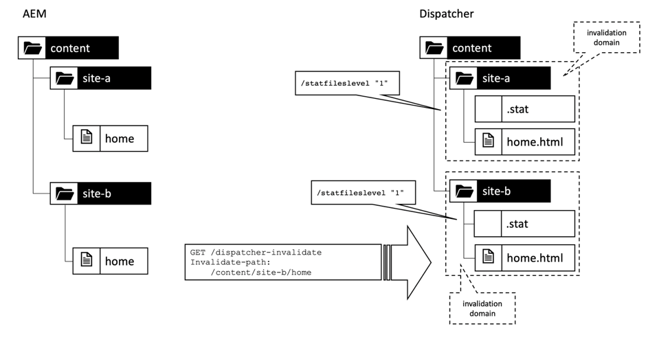

# 第1章 — Dispatcher概念、模式和反模式

## 概述

本章简要介绍Dispatcher的历史和机制，并讨论这会如何影响AEM开发人员如何设计其组件。

## 为什么开发人员应关注基础架构

Dispatcher是大多数(如果不是所有AEM安装的话)的重要组成部分。 您可以找到许多讨论如何配置Dispatcher以及提示和技巧的在线文章。

然而，这些零碎的信息总是从非常技术性的层面开始 — 假设您已经知道要做什么，因此只提供有关如何实现所需内容的详细信息。 我们从未找到任何概念性文件来描述 _什么是，为什么_ 关于您可以使用Dispatcher做什么、不能做什么的问题。

### 反模式：Dispatcher作为后思考

这种基本信息的缺乏导致了许多反模式，我们在许多AEM项目中看到了这一点：

1. 由于Dispatcher安装在Apache Web Server中，因此配置它是项目中的“Unix神”的作业。 一个“凡人Java开发人员”不需要担心这个问题。

2. Java开发人员需要确保其代码可工作……调度程序稍后将神奇地快速完成任务。 调度程序总是事后才考虑的。 但是，这行不通。 开发人员在设计代码时必须考虑调度程序。 他需要知道它的基本概念才能做到这点。

### “先让它工作，然后让它快速”并不总是正确的

你可能听说过编程的建议 _“首先让它发挥作用，然后让它变快。”_. 这并不完全是错误的。 然而，如果没有正确的背景，它往往被误解，无法正确适用。

该建议应避免开发人员过早优化代码，此类代码可能永远不会运行，或者运行频率极低，以至于优化的影响力不足以证明有理由进行优化。 此外，优化会导致代码变得更加复杂，从而引入错误。 因此，如果您是开发人员，请不要在微优化每行代码上花费太多时间。 只需确保选择了正确的数据结构、算法和库，然后等待分析器的热点分析，即可查看更彻底的优化在何处可以提高整体性能。

### 架构决策和工件

然而，在“建筑”决策方面，“首先让它发挥作用，然后让它迅速发挥作用”的建议是完全错误的。 什么是体系结构决策？ 简言之，它们是昂贵、艰难和/或事后不可能改变的决定。 请记住，“昂贵”有时等同于“不可能”。  例如，当项目预算不足时，不可能实施成本高昂的更改。 基础设施的变化是这一类别中第一个进入大多数人脑海的改变。 但还有另一种“建筑”文物，它们可能会变得非常难以改变：

1. 位于应用程序“中心”的代码段，许多其他代码段都依赖该代码段。 更改这些组件时，需要一次性更改并重新测试所有依赖项。

2. 伪像，涉及一些与时间相关的异步场景，在这种场景中，输入 — 以及系统的行为可以非常随机地变化。 更改可能会产生不可预测的影响，并且可能难以测试。

3. 在系统所有部件和部件中反复使用和重复使用的软件模式。 如果软件模式被证明为次优模式，则所有使用该模式的工件都需要重新编码。

记住? 在本页顶部，我们说Dispatcher是AEM应用程序的重要组成部分。 对Web应用程序的访问非常随机，用户来往于不可预测的时间。 最后 — 所有内容都将（或应该）缓存在Dispatcher中。 因此，如果您密切关注，您可能已经意识到，缓存可以视为“架构”构件，因此应该被团队的所有成员、开发人员和管理员都理解。

我们并不是说开发人员应该实际配置Dispatcher。 他们需要了解概念（尤其是边界），以确保Dispatcher也能利用他们的代码。

Dispatcher不会奇迹般地提高代码速度。 开发人员需要在创建Dispatcher组件时考虑使用Dispatcher。 因此，他需要知道它是如何运作的。

## Dispatcher缓存 — 基本原则

### Dispatcher作为缓存Http — 负载平衡器

什么是Dispatcher？为什么最初将其称为“Dispatcher”？

调度程序是

* 首先是缓存

* 反向代理

* 用于Apache httpd webserver的模块，用于为Apache的多功能性添加AEM相关功能，并与所有其他Apache模块（例如SSL甚至SSI包含，我们将在后面看到）一起顺利工作

在互联网发展初期，一个网站的访客数可能只有几百人。 一个Dispatcher的设置，“已调度”或平衡对许多AEM发布服务器的请求负载，这通常就足够了 — 因此，名称为“Dispatcher”。 然而，目前这种装置已不再经常使用。

我们将在本文的后面部分看到设置Dispatcher和Publish系统的不同方式。 首先，让我们从一些http缓存基础知识开始。


*Dispatcher缓存的基本功能*

<br> 

此处解释了Dispatcher的基础知识。 Dispatcher是一个简单的缓存反向代理，能够接收和创建HTTP请求。 正常的请求/响应周期如下所示：

1. 用户请求页面
2. Dispatcher会检查它是否已具有该页面的渲染版本。 假设这是此页面的第一个请求，并且Dispatcher找不到本地缓存副本。
3. Dispatcher从发布系统请求页面
4. 在发布系统中，页面通过JSP或HTL模板渲染
5. 页面将返回到Dispatcher
6. Dispatcher缓存页面
7. Dispatcher将页面返回到浏览器
8. 如果再次请求同一页面，则可以直接从Dispatcher缓存中提供该页面，而无需在发布实例上重新渲染它。 这节省了用户和CPU周期在发布实例上的等待时间。

我们在最后一节谈到“页面”。 但同样的方案也适用于其他资源，如图像、CSS文件、PDF下载等。

#### 数据缓存方式

Dispatcher模块利用托管Apache Server提供的工具。 HTML页、下载和图片等资源作为简单文件存储在Apache文件系统中。 就这么简单。

文件名由所请求资源的URL派生。 如果您请求一个文件 `/foo/bar.html` 例如存储在/下`var/cache/docroot/foo/bar.html`.

原则上，如果所有文件都经过缓存，因此静态存储在Dispatcher中，则可以提取Publish系统的插件，而Dispatcher将充当一个简单的Web服务器。 但这只是为了说明原则。 现实生活要复杂得多。 您不能缓存所有内容，而且缓存永远不会完全“满”，因为由于渲染过程的动态性质，资源数量可能是无限的。 静态文件系统的模型有助于生成Dispatcher功能的粗略图片。 它有助于解释Dispatcher的限制。

#### AEM URL结构和文件系统映射

要更详细地了解Dispatcher，让我们重新访问简单示例URL的结构。  让我们看下面的示例，

`http://domain.com/path/to/resource/pagename.selectors.html/path/suffix.ext?parameter=value&amp;otherparameter=value#fragment`

* `http` 表示协议

* `domain.com` 是域名

* `path/to/resource` 是资源存储在CRX中以及随后存储在Apache服务器的文件系统中的路径

从这里开始，AEM文件系统与Apache文件系统之间有些许不同。

在AEM中，

* `pagename` 是资源标签

* `selectors` 其中，表示Sling中使用的许多选择器以确定资源的呈现方式。 URL可以具有任意数量的选择器。 它们以句点分隔。 例如，选择器部分可以类似于“french.mobile.fancy”。 选择器只能包含字母、数字和破折号。

* `html` 作为最后一个“选择器”称为扩展。 在AEM/Sling中，它还部分确定渲染脚本。

* `path/suffix.ext` 是一个类似路径的表达式，可以作为URL的后缀。  可以在AEM脚本中使用它来进一步控制资源的呈现方式。 稍后我们将提供有关此部分的整个部分。 目前，了解您可以将其用作附加参数应该已经足够。 后缀必须具有扩展名。

* `?parameter=value&otherparameter=value` 是URL的查询节。 它用于将任意参数传递给AEM。 无法缓存包含参数的URL，因此参数应限制为绝对必要的情况。

* `#fragment`，URL的片段部分不会传递到AEM，它仅在浏览器中使用；在JavaScript框架中可以作为“路由参数”使用，也可以跳转到页面上的特定部分。

在Apache中(*参考下图*)，

* `pagename.selectors.html` 用作缓存文件系统中的文件名。

如果URL有后缀 `path/suffix.ext` 然后，

* `pagename.selectors.html` 创建为文件夹

* `path` 中的文件夹 `pagename.selectors.html` 文件夹

* `suffix.ext` 是一个文件，位于 `path` 文件夹。 注意：如果后缀没有扩展名，则不会缓存文件。


*从调度程序获取URL后的文件系统布局*

<br> 

#### 基本限制

URL、资源和文件名之间的映射非常简单。

不过，你可能会注意到一些陷阱，

1. URL可能会变得很长。 添加的“路径”部分 `/docroot` 本地文件系统上的限制很容易超过某些文件系统的限制。 在Windows上的NTFS中运行Dispatcher是一项挑战。 但是，使用Linux时是安全的。

2. URL可以包含特殊字符和变音。 这通常不是Dispatcher的问题。 但请记住，URL会在应用程序的许多位置进行解释。 我们经常会看到应用程序的异常行为 — 只是为了发现一段很少使用的（自定义）代码未经过彻底测试以获取特殊字符。 如果你能的话，就应该避开他们。 如果做不到，请计划进行全面测试。

3. 在CRX中，资源具有子资源。 例如，一个页面将具有多个子页面。 这在文件系统中无法匹配，因为文件系统具有文件或文件夹。

#### 不缓存不带扩展名的URL

URL必须始终具有扩展名。 尽管您可以在AEM中处理不带扩展名的URL。 这些URL将不会缓存在Dispatcher中。

**示例**

`http://domain.com/home.html` 是 **可缓存**

`http://domain.com/home` 是 **不可缓存**

当URL包含后缀时，将应用相同的规则。 后缀需要具有扩展才能缓存。

**示例**

`http://domain.com/home.html/path/suffix.html` 是 **可缓存**

`http://domain.com/home.html/path/suffix` 是 **不可缓存**

您可能会问，如果资源部分没有扩展名，但后缀有扩展名，会出现什么情况？ 在这种情况下，URL根本没有后缀。 查看下一个示例：

**示例**

`http://domain.com/home/path/suffix.ext`

此 `/home/path/suffix` 是资源的路径……因此URL中没有后缀。

**结论**

始终将扩展添加到路径和后缀。 了解SEO的人有时会辩称，这会在搜索结果中排名靠后。 但是，一个未缓存的网页速度会非常慢，排名会进一步下降。

#### 冲突的后缀URL

假定您有两个有效的URL

`http://domain.com/home.html`

和

`http://domain.com/home.html/suffix.html`

在AEM中它们是绝对有效的。 在本地开发计算机上（没有Dispatcher）不会看到任何问题。 在UAT或负载测试中，您很可能也不会遇到任何问题。 我们面临的问题是如此微妙，以至于它通过了大多数测试。  当您处于高峰期并且处理时间有限、可能没有服务器访问权限或资源无法修复它时，它将给您带来沉重打击。 我们曾经去过那里……

那么……有什么问题吗？

`home.html` 文件系统中可以是文件或文件夹。 并非两者都与AEM中的情况相同。

如果您请求 `home.html` 首先，创建为文件。

后续请求 `home.html/suffix.html` 返回有效结果，但作为文件 `home.html` “阻止”文件系统中的位置，  `home.html` 无法再次创建为文件夹，因此 `home.html/suffix.html` 不缓存。


*文件系统中的文件阻止位置防止子资源被缓存*

<br> 

反过来，先请求 `home.html/suffix.html` 则 `suffix.html` 缓存在文件夹下 `/home.html` 最初。 但是，此文件夹会被删除并替换为文件 `home.html` 当您随后请求 `home.html` 作为资源。


*在作为资源获取父项时删除路径结构*

<br> 

因此，缓存的结果完全是随机的，并且取决于传入请求的顺序。 让事情变得更加棘手的是，您通常有多个Dispatcher。 而且不同调度程序的性能、缓存命中率和行为可能有所不同。 如果您想了解网站无响应的原因，您需要确保查看的是包含不幸缓存顺序的正确Dispatcher。 如果您正在查看Dispatcher，但幸运的是，该程序具有更有利的请求模式，那么您在尝试查找问题时将迷失方向。

#### 避免冲突的URL

当您使用不同的扩展名作为资源并具有后缀时，您可以避免“冲突的URL”，在这种情况下，文件夹名称和文件名会在文件系统中“竞争”相同的路径。

**示例**

* `http://domain.com/home.html`

* `http://domain.com/home.dir/suffix.html`

两者都完全可以缓存，


在请求后缀或完全避免使用后缀时，为资源选择专用扩展“dir”。 在极少数情况下，它们非常有用。 而且可以轻松地正确实施这些案例。  正如我们将在下一章中介绍的缓存失效和刷新时所看到的。

#### 不可缓存的请求

让我们查看上一章的快速摘要，以及一些更多例外情况。 如果URL配置为可缓存，并且是GET请求，则Dispatcher可以缓存URL。 无法在以下异常之一下缓存它。

**可缓存的请求**

* 请求配置为可在Dispatcher配置中缓存
* 请求是普通的GET请求

**不可缓存的请求或响应**

* 配置拒绝缓存的请求（路径、模式、MIME类型）
* 返回“Dispatcher： no-cache”标头的响应
* 返回“Cache-Control： no-cache|private”标头的响应
* 返回“Pragma： no-cache”标头的响应
* 使用查询参数请求
* 不带扩展名的URL
* 后缀不含扩展名的URL
* 返回状态代码200以外的响应
* POST请求

## 使缓存失效并刷新

### 概述

最后一章列出了当Dispatcher无法缓存请求时的大量异常。 但还需要考虑其他事项：仅因为Dispatcher _可以_ 缓存请求，但这并不一定意味着 _应该_.

重点是：缓存通常很容易。 Dispatcher只需要存储响应的结果，并在下次传入非常相同的请求时返回该结果。 右? 错！

困难的部分是 _失效_ 或 _刷新_ 缓存的URL值。 当资源发生更改时，Dispatcher需要查明情况 — 并且需要再次渲染。

乍一看，这任务似乎微不足道……但事实并非如此。 进一步阅读，您将发现单个资源和简单资源以及依赖于由多个资源组成的高网格结构的页面之间的一些棘手差异。

### 简单资源和刷新

我们已将AEM系统设置为在收到特殊的“缩略图”选择器的请求时，动态地为每个图像创建缩略图演绎版。

`/content/dam/path/to/image.thumb.png`

当然，我们还会提供一个URL，用于为原始图像提供无选择器的URL：

`/content/dam/path/to/image.png`

如果我们同时下载缩略图和原始图像，我们最终得到的结果将是，

```
/var/cache/dispatcher/docroot/content/dam/path/to/image.thumb.png

/var/cache/dispatcher/docroot/content/dam/path/to/image.png
```

在我们的Dispatcher文件系统中。

现在，用户上传并激活该文件的新版本。 最终从AEM向Dispatcher发送失效请求，

```
GET /invalidate
invalidate-path:  /content/dam/path/to/image

<no body>
```

失效很简单：对Dispatcher上特殊的“/invalidate” URL的简单GET请求。 不需要HTTP主体，“payload”只是“invalidate-path”标头。 另请注意，标头中的invalidate-path是AEM知道的资源，而不是Dispatcher缓存的一个或多个文件。 AEM只了解资源。 请求资源时，在运行时使用扩展、选择器和后缀。 AEM不执行任何有关资源上已使用哪些选择器的帐簿管理，因此在激活资源时，资源路径就是所有它知道的已知内容。

这对我们来说就足够了。 如果某个资源已更改，我们可以放心地假设，该资源的所有演绎版也已更改。 在我们的示例中，如果图像已更改，则还会呈现新的缩略图。

Dispatcher可以安全地删除包含其缓存的所有演绎版的资源。 它会象这样，

`$ rm /content/dam/path/to/image.*`

正在删除 `image.png` 和 `image.thumb.png` 以及所有其他符合该模式的演绎版。

只要您只使用一个资源来响应请求，这确实非常简单。

### 引用和网格化内容

#### 网格化内容问题

与上载到AEM的图像或其他二进制文件不同，HTML页不是孤立的动物。 它们生活在群落中，通过超链接和引用彼此高度互联。 简单的链接无害，但当我们谈论内容引用时，它会变得很棘手。 页面上无处不在的顶部导航或Teaser是内容引用。

#### 内容引用以及它们成为问题的原因

让我们来看一个简单的示例。 一家旅行社有一个宣传去加拿大旅行的网页。 此促销活动在其他两个页面的Teaser部分中（“主页”页面和“冬季特惠”页面）进行介绍。

由于两个页面显示相同的Teaser，因此没有必要要求作者为每个应显示它的页面多次创建Teaser。 相反，目标页面“加拿大”会在页面属性中保留一个部分，以便为Teaser提供信息，或者更好地提供完全呈现该Teaser的URL：

`<sling:include resource="/content/home/destinations/canada" addSelectors="teaser" />`

或

`<sling:include resource="/content/home/destinations/canada/jcr:content/teaser" />`


在AEM上，它仅起类似魅力的作用，但如果您在Publish实例上使用Dispatcher，则会发生一些奇怪的情况。

想象一下，您已发布您的网站。 “加拿大”页面上的标题为“加拿大”。 当访客请求您的主页（其中包含对该页面的Teaser引用）时，“加拿大”页面上的组件将呈现以下内容

```
<div class="teaser">
  <h3>Canada</h3>
  
</div>
```

*到* 主页。 主页由Dispatcher存储为静态.html文件，包括Teaser及其位于文件中的标题。

现在，营销人员了解到，Teaser头条新闻应该是可操作的。 因此，他决定将标题从“Canada”改为“Visit Canada”，并更新了图片。

他出版了编辑过的《加拿大》页面，并翻阅了以前出版的主页，看看他所做的改动。 但是，那里什么都没有改变。 它仍然显示旧的Teaser。 他仔细查了一遍“冬季特惠”。 以前从未请求过该页面，因此不会静态缓存到Dispatcher中。 因此，此页面由Publish重新呈现，现在包含新的“访问加拿大”Teaser。


*Dispatcher将过时的包含内容存储在主页中*

<br> 

发生了什么？ Dispatcher存储页面的静态版本，该页面包含渲染时从其他资源提取的所有内容和标记。

Dispatcher只是一个基于文件系统的Web服务器，它速度很快，但也相对简单。 如果包含的资源发生更改，则它不会意识到这一点。 它仍然紧跟呈现包含页面时存在的内容。

“冬季特惠”页面尚未渲染，因此Dispatcher上没有静态版本，因此在请求时全新渲染时随新的Teaser一起显示。

您可能认为，当资源更改时，Dispatcher在呈现和刷新使用此资源的所有页面时将跟踪它访问的每个资源。 但Dispatcher不渲染页面。 渲染由发布系统执行。 Dispatcher不知道哪些资源进入渲染的.html文件。

还是不相信吗？ 你也许会认为 *“必须有方法实施某种依赖关系跟踪”*. 有，或者更准确地说 *为*. 公报3：AEM的曾曾祖父在 _session_ 用于呈现页面的属性。

在请求期间，通过此会话获得的每个资源均作为当前所渲染URL的依赖项进行跟踪。

但事实证明，追踪这些依赖性是非常昂贵的。 人们很快发现，如果他们完全关闭依赖项跟踪功能，并依赖在一个html页面更改后重新呈现所有html页面，则网站速度更快。 此外，这一机制也不完美 — 过程中存在许多隐患和例外。 在某些情况下，您未使用请求默认会话获取资源，而是使用管理员会话获取一些帮助程序资源来呈现请求。 这些依赖项通常不会被跟踪，并导致令人头疼的问题，并且运营团队会打电话要求手动刷新缓存。 如果他们有标准程序那么做，那你就很幸运了。 途中还有更多的哥特教，但是……让我们别再回想了。 这可以追溯到2005年。 最终，该功能在《公报4》中被默认停用，它没有重新成为后来成为AEM的继承CQ5。

### 自动失效

#### 完全刷新比依赖项跟踪更便宜时

由于CQ5，我们或多或少地完全依赖仅有一个页面发生更改时整个网站失效。 此功能称为“自动失效”。

但同样地，丢弃和重新渲染数百个页面比执行适当的依赖项跟踪和局部重新渲染更便宜，这是怎么回事？

主要原因有二：

1. 平均而言，网站只频繁请求页面的一小部分。 因此，即使您丢弃了所有渲染的内容，之后也只真正需要几十个内容。 在实际请求页面时，页面长尾的渲染可以随时间分发。 因此，实际上，渲染页面上的负载没有您预期的那样高。 当然，总会有例外……我们稍后将讨论一些有关如何处理在大型网站上具有空Dispatcher缓存的均匀分布的负载的技巧。

2. 所有页面仍由主导航连接。 因此，几乎所有页面最终都是相互依赖的。 这意味着即使是最智能的依赖项跟踪器也会发现我们已经知道的信息：如果其中一个页面发生更改，您必须使所有其他页面失效。

你不相信吗？ 让我们来说明最后一点。

我们使用的参数与上一个示例中的参数相同，其中Teaser引用远程页面的内容。 直到现在，我们才使用了一个更极端的示例：自动渲染的主导航。 与Teaser一样，导航标题是从链接的或“远程”页面中提取的，作为内容引用。 远程导航标题不存储在当前渲染的页面中。 您应该记住，导航会在您网站中的每个页面上呈现。 因此，在有主导航的所有页面上，都会反复使用一个页面的标题。 此外，如果要更改导航标题，则只需在远程页面上执行一次该操作 — 而不是在每个引用该页面的页面上。

因此，在我们的示例中，导航通过使用目标页面的“NavTitle”在导航中渲染名称来一起网格化所有页面。 “Iceland”的导航标题摘自“Iceland”页面，并呈现到每个具有主导航的页面中。


*主导航通过提取页面的“NavTitles”不可避免地将所有页面的内容拼合在一起*

<br> 

如果您将“冰岛”页面上的NavTitle从“冰岛”更改为“美丽的冰岛”，则会在所有其他页面的主菜单上立即更改该标题。 因此，在该更改之前呈现和缓存的页面都将变得陈旧并需要失效。

#### 自动失效的实施方式： .stat文件

现在，如果您有一个包含数千个页面的大型网站，则可能需要相当长的时间来循环访问所有页面并将其物理删除。 在此期间，Dispatcher可能会无意中提供过时的内容。 更糟糕的是，在访问缓存文件时可能会发生一些冲突，可能是某个页面刚刚被删除时被请求了，或者由于页面在立即后续激活后再次失效而再次被删除。 想想会有多乱吧。 幸好事情不是这样的。 Dispatcher使用巧妙的技巧来避免这种情况：它不会删除数百和数千个文件，而是在文件发布时将一个简单的空文件放入文件系统的根目录中，因此所有依赖的文件都被视为无效。 此文件称为“statfile”。 statfile是一个空文件 — 与statfile相关的是其创建日期。

Dispatcher中所有文件的创建日期都早于statfile，并且在上次激活（和失效）之前已呈现，因此被视为“无效”。 它们仍然实际存在于文件系统中，但Dispatcher会忽略它们。 它们已经“过时”。 每当请求过时资源时，Dispatcher都会请求AEM系统重新渲染页面。 然后，新渲染的页面将存储在文件系统中 — 现在，具有新的创建日期，并且它再次刷新。


*.stat文件的创建日期定义哪些内容已过时哪些内容是最新的*

<br> 

你可能会问，为什么它被称为“.stat”？ 也不是“.invalidated”？ 嗯，您可以想象，将文件保存在您的文件系统上有助于Dispatcher确定哪些资源可以 *静态* 服务 — 就像从静态Web服务器一样。 这些文件不再需要动态呈现。

然而，这个名字的真正性质并不是什么比喻性的。 它派生自Unix系统调用 `stat()`，返回文件的修改时间（以及其他属性）。

#### 简单验证和自动验证混合

但是等等，我们之前说过，单个资源会被物理删除。 现在我们说，更近的statfile在Dispatcher眼中实际上会使其无效。 那么为什么先进行物理删除？

答案很简单。 您通常并行使用这两种策略 — 但用于不同类型的资源。 二进制资产（如图像）是独立的。 它们未连接到其他资源，因此需要呈现其信息。

另一方面，HTML页面是高度相互依赖的。 因此，您可以对这些应用自动失效。 这是Dispatcher中的默认设置。 属于失效资源的所有文件都会被实际删除。 此外，以“.html”结尾的文件会自动失效。

Dispatcher根据文件扩展名决定是否应用自动失效方案。

可配置自动失效的文件结尾。 理论上，您可以包含自动失效的所有扩展。 但请记住，这需要付出高昂的代价。 您不会看到过时的资源无意中交付，但交付性能因过度失效而大幅降低。

例如，假设您实施一个方案，其中动态渲染PNG和JPG，并依赖其他资源来实现这一点。 您可能希望将高分辨率图像重新缩放到较小的与Web兼容的分辨率。 当您处于此状态时，还会更改压缩率。 此示例中的分辨率和压缩率不是固定常量，而是使用图像的组件中的可配置参数。 现在，如果更改此参数，您需要使图像失效。

没问题 — 我们刚刚了解到，可以将图像添加到自动失效中，并且每当发生任何更改时，始终重新渲染图像。

#### 把婴儿和洗澡水一起扔掉

没错，这是个大问题。 请再次阅读最后一段。 “……每当发生任何更改时都会刷新渲染的图像。” 如你所知，一个好的网站在不断变化；在这里添加新的内容，在那里纠正打字错误，在其他地方调整Teaser。 这意味着您的所有图像都会不断失效，需要重新渲染。 别小看了。 在本地开发计算机上，动态渲染和传输图像数据的作用以毫秒为单位。 您的生产环境需要以每秒100倍的频率完成此操作。

让我们在此明确一点，当html页面发生更改时，需要重新渲染您的jpg，反之亦然。 只有一个“存储桶”的文件将自动失效。 它整体被冲洗。 也不用再细分为更详细的结构。

自动失效默认保留为“.html”是有充分理由的。 目标是使那个桶尽可能的小。 不要因为什么都不做就把婴儿和洗澡水一起扔掉 — 只要站在安全的一边就行。

应在资源的路径中提供自包含资源。 这能帮助我们失效很多。 保持简单，不要创建映射方案，如“resource /a/b/c”是从“/x/y/z”提供的。 使您的组件与默认Dispatcher的自动失效设置配合使用。 请不要尝试在Dispatcher中修复设计糟糕的组件并使其失效过度。

##### 自动失效的例外：ResourceOnly失效

Dispatcher的失效请求通常由复制代理从发布系统触发。

如果您对依赖项信心十足，则可以尝试构建自己的失效复制代理。

本指南中介绍的细节会有些过分，但我们希望至少给您一些提示。

1. 真的知道你在做什么。 正确判定无效真的很难。 这就是自动失效如此严格的原因之一；为了避免提供过时的内容。

2. 如果您的代理发送HTTP标头 `CQ-Action-Scope: ResourceOnly`，这意味着此单个失效请求不会触发自动失效。 此( [https://github.com/cqsupport/webinar-dispatchercache/tree/master/src/refetching-flush-agent/refetch-bundle](https://github.com/cqsupport/webinar-dispatchercache/tree/master/src/refetching-flush-agent/refetch-bundle))一段代码可能是您自己的复制代理的良好起点。

3. `ResourceOnly`，仅阻止自动失效。 要实际执行必要的依赖项解析和失效操作，您必须自行触发失效请求。 您可能需要检查包Dispatcher刷新规则([https://adobe-consulting-services.github.io/acs-aem-commons/features/dispatcher-flush-rules/index.html](https://adobe-consulting-services.github.io/acs-aem-commons/features/dispatcher-flush-rules/index.html))，以获得如何实际实现此目标的灵感。

我们不建议您构建依赖项解析方案。 只是投入太多而收效甚微 — 正如之前所说，犯错的会太多了。

相反，您应该了解哪些资源对其他资源没有任何依赖关系，并且可以在不自动失效的情况下失效。 不过，您无需为此使用自定义复制代理。 只需在Dispatcher配置中创建一个自定义规则，将这些资源排除在自动失效之外。

我们说主导航或Teaser是依赖性的来源。  — 如果您异步加载导航和Teaser，或在Apache中通过SSI脚本包含它们，则您将没有要跟踪的依赖项。 在本文档的后面部分，我们将详述“Sling Dynamic Include”的异步加载组件。

这同样适用于弹出窗口或加载到灯箱中的内容。 这些片段也很少具有导航（也称为“依赖项”），并且可以作为单个资源失效。

## 在构建组件时考虑使用Dispatcher

### 在真实世界示例中应用Dispatcher机制

在最后一章中，我们解释了Dispatcher的基本机制、它的一般工作方式以及存在哪些限制。

现在，我们希望将这些机制应用于您很可能可以在项目要求中找到的一类组件。 我们特意挑选该组件，以展示您迟早也会遇到的问题。 不要害怕 — 并非所有组件都需要我们拿出那么多的考虑。 但是，如果您看到需要构建此类组件，您便充分了解后果并了解如何处理它们。

### 假脱机组件（防）模式

#### 响应式图像组件

让我们说明具有互连二进制文件的组件的共同模式（或反模式）。 我们将为“响应式图像”创建一个组件“respi”。 此组件应该能够将显示图像调整到显示它的设备上。 在台式机和平板电脑上，它可显示图像的完整分辨率；在手机上，它可显示裁剪较窄的较小版本，甚至可以显示完全不同的主题（在响应式世界中，这被称为“艺术方向”）。

资源将上传到AEM的DAM区域，并且仅限 _已引用_ 在响应图像组件中。

响应组件既负责标记的渲染，又负责传递二进制图像数据。

我们在这里实现它的方式是我们在许多项目中看到的通用模式，甚至其中一个AEM核心组件都基于该模式。 因此，作为开发人员，您很有可能会调整该模式。 它在封装方面有自己的优势，但需要付出很大努力才能使其为Dispatcher做好准备。 我们稍后将讨论如何缓解此问题的几个选项。

我们把这里使用的模式称为“后台处理程序模式”，因为问题可以追溯到《公报3》的早期，当时有一个方法“后台处理程序”，可以调用资源将其二进制原始数据流式传输到响应中。

原始术语“假脱机”实际上是指共享慢速脱机外围设备（如打印机），因此在此处无法正确应用。 但是我们喜欢这个词，因为它很少在网络世界中可以区分。 每个模式都应该有一个可分辨的名称，对吧？ 至于这是反模式还是模式，由你来决定。

#### 实施

以下是实施我们的响应式图像组件的方式：

该组件分为两部分：第一部分渲染图像的HTML标记，第二部分“卷轴”参考图像的二进制数据。 由于这是一个响应式设计的现代网站，因此我们不会呈现一个简单的 `` 标记，但中的一组图像 `<picture/>` 标记之前。 对于每个设备，我们都会将两个不同的图像上传到DAM中，并从图像组件中引用它们。

该组件具有三个渲染脚本（在JSP、HTL中实施或作为servlet），每个脚本都使用专用选择器寻址：

1. `/respi.jsp`  — 没有用于渲染HTML标记的选择器
2. `/respi.img.java` 渲染桌面版本
3. `/respi.img.mobile.java` 渲染移动设备版本。


组件放置在主页的parsys中。 CRX中生成的结构如下图所示。


*CRX中响应图像的资源结构*

<br> 

组件标记按如下方式呈现，

```plain
  #GET /content/home.html

  <html>

  …

  <div class="responsive-image>

  <picture>
    <source src="/content/home/jcr:content/par/respi.img.mobile.jpg" …/>
    <source src="/content/home/jcr:content/par/respi.img.jpg …/>

    …

  </picture>
  </div>
  …
```

而且……我们完成了精心封装的组件。

#### 正在使用的响应图像组件

现在，用户通过Dispatcher请求页面 — 和资产。 这会导致Dispatcher文件系统中的文件，如下所示：


*封装的响应式图像组件的缓存结构*

<br> 

考虑用户将两个花朵图像的新版本上传并激活到DAM。 AEM将根据以下项的失效请求发送：

`/content/dam/flower.jpg`

和

`/content/dam/flower-mobile.jpg`

到Dispatcher。 然而，这些要求都白费了。 内容已缓存为组件子结构下的文件。 这些文件现已过时，但仍可根据请求提供服务。


*结构不匹配，导致内容过时*

<br> 

这种做法还有另外一个注意事项。 假定您在多个页面上使用相同的flower.jpg。 然后，您将在多个URL或文件下缓存相同的资产，

```
/content/home/products/jcr:content/par/respi.img.jpg

/content/home/offers/jcr:content/par/respi.img.jpg

/content/home/specials/jcr:content/par/respi.img.jpg

…
```

每次请求新的未缓存页面时，都会从位于不同URL的AEM中获取资源。 无Dispatcher缓存和浏览器缓存可以加快投放。

#### 假脱机程序图案的亮点

有一个自然的例外，即使用简单的形式也可以使用此模式：如果二进制文件存储在组件本身，而不是DAM中。 但是，这仅适用于网站上使用一次的图像，并且不会在DAM中存储资产，这意味着您很难管理资产。 想象一下，您针对特定资产的使用许可证已用完。 如何找到您使用过资产的组件？

看到了吗？ DAM中的“M”表示“管理”，就像在数字资产管理中一样。 您不希望放弃该功能。

#### 结论

从AEM开发人员的角度来看，这种模式看起来非常优雅。 但是，如果把Dispatcher考虑在内，你可能会同意，天真的方法可能还不够。

现在由你来决定这是一种模式还是一种反模式。 也许您已经想到了一些好点子来缓解上面解释的问题？ 很好。 那么您应该很想知道其他项目是如何解决这些问题的。

### 解决常见的Dispatcher问题

#### 概述

让我们讨论一下如何更便于缓存地实现这一点。 有几个选项。 有时候，你无法选择最佳解决方案。 也许您遇到了一个已经在运行的项目，而您仅有有限的预算来解决手头的“缓存问题”，却不足以进行全面的重构。 或者您面临着一个比示例图像组件更复杂的问题。

我们将在以下各节中概述这些原则和注意事项。

同样，这是基于实际经验。 我们已经在野外看到了所有这些模式，所以这不是一个学术练习。 这就是为什么我们向你展示一些反模式，所以你有机会从其他人已经犯的错误中吸取教训。

#### 缓存杀手

>[!WARNING]
>
>这是反模式。 不要用它。 永远。

您是否曾看到过类似以下的查询参数 `?ck=398547283745`？ 它们称为cache-killer (“ck”)。 其思想是，如果添加任何查询参数，将不缓存资源。 此外，如果您添加一个随机数作为参数的值(如“398547283745”)，则URL将变得唯一，并且您确保在AEM系统和屏幕之间的任何其他缓存都不能缓存。 通常中间嫌疑人会是位于Dispatcher前的“清漆”缓存、CDN甚至浏览器缓存。 再次强调：不要这样做。 您确实希望尽可能长时间地缓存资源。 缓存是你的朋友。 别杀朋友。

#### 自动失效

>[!WARNING]
>
>这是反模式。 避免将其用于数字资产。 尝试保留Dispatcher的默认配置，即>仅对“.html”文件自动失效

短期内，您可以将“.jpg”和“.png”添加到Dispatcher中的自动失效配置。 这意味着，每当发生失效时，都需要重新渲染所有“.jpg”、“.png”和“.html”。

如果企业所有者抱怨没有在实时网站上足够快地实现他们的更改，则实施此模式会非常简单。 但这只能给你争取一些时间来想出更复杂的解决方案。

确保您了解对性能的巨大影响。 这会显着减慢网站运行速度，甚至可能影响网站稳定性（如果您的网站是一个高负载的网站，且经常发生更改），例如新闻门户。

#### URL指纹

URL指纹看起来像一个缓存杀手。 但事实并非如此。 它不是随机数，而是用于表示资源内容的值。 这可以是资源内容的哈希，也可以是上传、编辑或更新资源时的时间戳（更加简单）。

Unix时间戳对于实际实施来说已经足够好了。 为了提高可读性，我们在本教程中使用了更易读的格式： `2018 31.12 23:59 or fp-2018-31-12-23-59`.

不能将指纹用作查询参数，因为无法缓存具有查询参数的URL。 您可以使用选择器或后缀作为指纹。

假设，文件 `/content/dam/flower.jpg` 具有 `jcr:lastModified` 2018年12月31日23:59 带指纹的URL是 `/content/home/jcr:content/par/respi.fp-2018-31-12-23-59.jpg`.

只要引用的资源(`flower.jpg`)文件未更改。 因此，它可以无限期地缓存，而且它不是缓存杀手。

请注意，此URL需要由响应式图像组件创建和提供。 它不是现成的AEM功能。

这是基本概念。 然而，有一些细节很容易被忽视。

在我们的示例中，组件在23:59呈现并缓存。 现在图像已更改，假设00:00。  组件 _会_ 在其标记中生成新的指纹URL。

你也许会认为 _应该_...但事实并非如此。由于仅更改了图像的二进制文件并且未接触包含页，因此不需要重新渲染HTML标记。 因此，Dispatcher使用旧指纹提供页面，从而提供旧版本的图像。


*图像组件比引用的图像更新，未渲染新的指纹。*

<br> 

现在，如果您重新激活了主页（或该站点的任何其他页面），statfile将会更新，Dispatcher会考虑home.html过时，并在图像组件中使用新指纹重新渲染它。

但我们没有激活主页，对吗？ 我们为什么要激活一个我们无论如何都没有触摸的页面？ 此外，我们可能没有足够的权限来激活页面，或者审批工作流程太长太耗时，我们根本无法在短时间内完成此操作。 那么，该怎么办？

#### 懒惰管理员工具 — 降低Statfile级别

>[!WARNING]
>
>这是反模式。 仅在短期内使用它，以争取一些时间，并想出更复杂的解决方案。

懒惰的管理员通常会“_将自动失效设置为jpg，将statfile级别设置为零 — 这始终有助于解决各种缓存问题_.” 您将在技术论坛中找到该建议，它有助于解决您的失效问题。

到目前为止，我们还未讨论statfile级别。 自动失效基本上仅适用于同一子树中的文件。 但问题是，页面和资产通常不位于同一子树中。 页面位于以下某个位置 `/content/mysite` 而资产位于下方 `/content/dam`.

“statfile级别”定义子树的根节点深度在哪里。 在上面的示例中，级别将为“2”(1=/content，2=/mysite，dam)

将statfile级别“降低”为0的基本思想是将整个/content树定义为一个、唯一的子树，以使页面和资产处于同一自动失效域中。 因此我们只会在水平的大树上（在docroot“/”处）。 但是，这样做会在发布内容时自动使服务器上的所有站点失效，即使在完全不相关的站点上也是如此。 相信我们：从长远来看，这是一个糟糕的想法，因为您将严重降低整体缓存命中率。 您所能做的就是希望AEM服务器有足够的火力，能够在没有缓存的情况下运行。

稍后您将了解更深入的statfile级别的全部好处。

#### 实施自定义失效代理

无论如何 — 我们需要以某种方式告知Dispatcher，如果“.jpg”或“.png”更改为允许使用新的URL重新呈现，则HTML页面将失效。

例如，我们在项目中看到的是发布系统上的特殊复制代理，每当发布某个站点的图像时，这些代理都会发送对该站点的失效请求。

在此，如果您可以通过命名惯例从资产的路径中派生出站点的路径，则此功能非常有用。

一般而言，最好匹配站点和资源路径，如下所示：

**示例**

```
/content/dam/site-a
/content/dam/site-b

/content/site-a
/content/site-b
```

这样，当您的自定义Dispatcher刷新代理遇到对的更改时，可以轻松地将请求发送给/content/site-a并使其失效 `/content/dam/site-a`.

实际上，您指示Dispatcher使用哪条路径失效并不重要，只要它位于同一站点、同一“子树”中即可。 您甚至不必使用真正的资源路径。 它也可以是“虚拟”的：

```
GET /dispatcher-invalidate
Invalidate-path /content/mysite/dummy
```


1. 当DAM中的文件更改时，会触发发布系统上的侦听器

2. 侦听器向Dispatcher发送失效请求。 由于自动失效，我们会在自动失效中发送哪条路径并不重要，除非该路径位于网站的主页下 — 或者在网站的statfile级别中更精确。

3. statfile已更新。

4. 下次请求主页时，将重新渲染主页。 新指纹/日期从图像的lastModified属性中获取作为附加选择器

5. 这会隐式创建对新图像的引用

6. 如果实际请求了图像，则会创建新演绎版并将其存储在Dispatcher中


#### 清理的必要性

噢。 已完成. 万岁！

还不是很清楚。

那条路，

`/content/mysite/home/jcr:content/par/respi.img.fp-2018-31-12-23-59.jpg`

与任何失效的资源无关。 记住? 我们仅使“虚拟”资源失效，并依靠自动失效将“home”视为无效。 图像本身可能永远不会 _物理_ 已删除。 因此，缓存将不断增长并增长。 当更改和激活图像时，它们会在Dispatcher的文件系统中获得新文件名。

未实际删除缓存的文件并无限期保留它们存在三个问题：

1. 您正在浪费存储容量 — 非常明显。 当然 — 存储在过去几年中变得更便宜、更便宜。 但图像分辨率和文件大小在过去几年也有所增长 — 随着视网膜式显示器的问世，这类显示器渴望获得清晰锐利的图像。

2. 尽管硬盘变得更便宜，“存储”可能并没有变得更便宜。 我们已经看到一种趋势，即不再使用（廉价）裸机硬盘存储，而是由您的数据中心提供商在NAS上租赁虚拟存储。 这种存储更可靠、可扩展性也更高。 您可能不想通过存储过时的垃圾来浪费它。 这不仅与主存储有关，还可以考虑备份。 如果您有现成的备份解决方案，则可能无法排除缓存目录。 最后，您还要备份垃圾数据。

3. 更糟糕的是：您可能只在有限的时间内为某些图像购买使用许可证 — 只要您需要这些许可证即可。 现在，如果您在许可证过期后仍存储图像，则可能会被视为侵犯版权。 您可能不再在网页中使用图像，但Google仍会找到它们。

最后，你将想出一些管家工作的手下来清理所有早于……一周的档案，以便控制乱丢垃圾的情况。

#### 滥用URL指纹进行拒绝服务攻击

但请稍等，此解决方案还有一个缺陷：

我们滥用选择器作为参数： fp-2018-31-12-23-59作为“缓存杀手”动态生成。 但或许某个无聊的孩子（或者某个已经疯狂的搜索引擎爬虫程序）开始请求这些页面：

```
/content/mysite/home/jcr:content/par/img.fp-0000-00-00-00-00.jpg
/content/mysite/home/jcr:content/par/img.fp-0000-00-00-00-01.jpg
/content/mysite/home/jcr:content/par/img.fp-0000-00-00-00-02.jpg

…
```

每个请求都将绕过Dispatcher，从而导致发布实例上出现负载。 更糟糕的是，在Dispatcher上创建相应的文件。

因此……您不必只使用指纹作为简单的缓存杀手，而是必须检查图像的jcr：lastModified日期，如果这不是预期的日期，则返回404。 在Publish系统上这需要一些时间和CPU周期……这是您首先要防止的。

#### 高频版本中URL指纹的注意事项

您不仅可以将指纹架构用于来自DAM的资源，还可以用于JS和CSS文件以及相关资源。

[版本化的Clientlibs](https://adobe-consulting-services.github.io/acs-aem-commons/features/versioned-clientlibs/index.html) 是一个使用此方法的模块。

但在此，您可能会面临另一个警告：具有URL指纹：它会将URL与内容相关联。 如果不同时更改URL（也称为更新修改日期），则无法更改内容。 这才是指纹设计的初衷。 但请考虑一下，您正在推出一个新版本，其中包含新的CSS和JS文件，从而包含带有新指纹的新URL。 您的所有HTML页仍引用旧的指纹URL。 因此，要使新版本始终有效，您需要一次使所有HTML页面失效，以强制使用对新指纹文件的引用重新渲染。 如果您有多个网站依赖相同的库，那么重新渲染可能会花费大量时间 — 在这种情况下，您无法利用 `statfiles`. 因此，请准备好在推出后查看Publish系统上的负载峰值。 您可能会考虑使用具有缓存预热的蓝绿部署，或者在Dispatcher前面使用基于TTL的缓存……可能性是无穷的。

#### 短暂休息

哇 — 要考虑的细节太多了，对吧？ 而且它不易被理解、测试和调试。 而这一切都是为了一个看似优雅的解决方案。 诚然，它很优雅 — 但只是从仅限AEM的角度来看。 它与Dispatcher一起变得非常恶劣。

但是，它并不能解决一个基本注意事项，如果一个图像在不同的页面上多次使用，则它们会被缓存在这些页面下。 这里没有多少缓存协同效应。

通常，URL指纹识别是您的工具包中一个不错的工具，但您需要小心应用，因为它可能会导致新问题，同时仅解决几个现有问题。

所以，那是一个很长的章节。 但我们经常看到这种模式，以至于我们觉得有必要把整个图景呈现给大家，其中既有优点也有缺点。 URL指纹解决了后台处理程序模式的一些固有问题，但实施的工作量非常大，您还需要考虑其他更简单的解决方案。 我们的建议是，始终检查您是否可以将URL基于提供的资源路径而不是中间组件。 我们将在下一章中讨论此内容。

##### 运行时依赖关系解析

运行时依赖项解析是我们一直在一个项目中考虑的概念。 但是仔细想一想就变得非常复杂，我们决定不去实施它。

以下是基本思路：

Dispatcher不知道资源的依赖关系。 它只是一些没有语义的单一文件。

AEM对依赖关系也知之甚少。 它缺少正确的语义或“依赖项跟踪器”。

AEM了解其中一些引用。 当您尝试删除或移动引用的页面或资产时，它使用此知识来警告您。 它通过在删除资产时查询内部搜索来完成此操作。 内容引用确实有一个非常特殊的形式。 它们是以“/content”开头的路径表达式。 因此，它们可以轻松进行全文索引，并在必要时进行查询。

在我们的示例中，我们需要在Publish系统上使用自定义的复制代理，该代理将在特定路径发生更改时触发搜索该路径。

比如说

`/content/dam/flower.jpg`

在发布时已更改。 代理将触发对“/content/dam/flower.jpg”的搜索，并查找引用这些图像的所有页面。

然后，它可能会向Dispatcher发出多个失效请求。 每个包含资产的页面对应一个资产。

理论上，这应该有效。 但仅限于第一级依赖关系。 例如，当您在页面上使用的体验片段上使用图像时，您不希望将该方案应用于多级依赖关系。 实际上，我们认为这种方法过于复杂，而且可能存在运行时问题。 一般来说，最好的建议是不要在事件处理程序中进行昂贵的计算。 尤其是搜索可能变得非常昂贵。

##### 结论

我们希望我们充分讨论了后台处理程序模式，以帮助您决定何时在实施（而不是实施）中使用它。

## 避免Dispatcher问题

### 基于资源的URL

解决依赖问题的一个更优雅的方法是根本不依赖依赖关系。 避免使用一种资源仅代理另一种资源时产生的人工依赖关系，就像我们在最后一个示例中所做的那样。 尽量将资源视为“孤立”实体。

我们的示例很容易解决：


*使用绑定到图像而不是组件的servlet假脱机图像。*

<br> 

我们使用资源原始资源路径来渲染数据。 如果需要按原样渲染原始图像，我们只需对资源使用AEM默认渲染器即可。

如果需要对特定组件进行一些特殊处理，我们将在路径上注册一个专用servlet，并选择器代表组件进行转换。 我们在这里用“.respi”做了示范。 选择器。 明智的做法是跟踪全局URL空间中使用的选择器名称(例如 `/content/dam`)，并且具有良好的命名约定以避免命名冲突。

顺便说一下，我们看不出代码一致性有任何问题。 Servlet可以与组件sling模型在同一Java包中定义。

我们甚至可以在全球空间使用额外的选择器，例如，

`/content/dam/flower.respi.thumbnail.jpg`

别激动，对吧？ 那么为什么人们会想出像假脱机程序这样的复杂模式呢？

那么，我们可以解决避免内部内容引用的问题，因为外部组件给内部资源的呈现增加了很小的价值或信息，它可以很容易地被编码成一组静态选择器，这些选择器控制一个孤立资源的表示。

但是，对于一类情况，使用基于资源的URL无法轻松解决。 我们将这种情形称为“参数注入组件”，并在下一章中对其进行讨论。

### 参数注入组件

#### 概述

最后一章中的后台处理程序只是资源周围的精简包装器。 它带来的麻烦比解决问题要大。

我们可以使用简单的选择器轻松替换包装，并添加相应的servlet来为此类请求提供服务。

但是，如果“respi”组件不仅仅是一个代理，那该怎么办？ 如果组件真正参与了组件的渲染，该怎么办？

让我们来介绍一下“respi”组件的一小部分扩展，这有点改变游戏规则。 同样，我们首先要介绍一些天真的解决方案来应对新的挑战，并表明它们未能达到什么目标。

#### Respi2组件

respi2组件是一个显示响应图像的组件 — 与respi组件一样。 但是它还有些附加作用，


*CRX结构：respi2组件向投放添加质量属性*

<br> 

图像为jpeg，并且可以压缩jpeg。 压缩jpeg图像时，需要交换文件大小的品质。 压缩被定义为范围从“1”到“100”的数值“质量”参数。 “1”表示“小但质量差”，“100”表示“质量好但文件大”。 那么，哪一个才是完美的价值呢？

与所有IT事务一样，答案是：“这要看情况。”

这要看主旨了。 具有高对比边缘的图案，如图案，包括书面的文字、建筑的照片、插图、草图或产品盒的照片（带有清晰的轮廓和文字），通常都属于这一类。 具有更柔和的颜色和对比度过渡的图案（如风景或肖像）可以进一步压缩而不会失去可见质量。 自然摄影通常属于这一类。

此外，根据图像的使用位置，您可能要使用其他参数。 Teaser中的小缩略图可能会比全屏主页横幅中使用的相同图像承受更好的压缩。 这意味着，品质参数并非与图像有关，而是与图像和上下文有关。 以及作者的品味。

简而言之：没有适合所有图片的完美设置。 没有一刀切的办法。 最好由作者决定。 他将调整“quality”参数作为组件中的属性，直到他满意质量，并且不会进一步牺牲带宽。

现在，我们在DAM中有一个二进制文件和一个组件，它提供了高质量的资产。 URL应该是什么样的？ 哪个组件负责假脱机？

#### 天真的方法1：将属性作为查询参数传递

>[!WARNING]
>
>这是反模式。 不要用它。

在上一章中，组件渲染的图像URL如下所示：

`/content/dam/flower.respi.jpg`

唯一缺少的就是质量的值。 组件知道作者输入的属性……在渲染标记时（如），它可以轻松地作为查询参数传递给图像渲染servlet `flower.respi2.jpg?quality=60`：

```plain
  <div class="respi2">
  <picture>
    <source src="/content/dam/flower.respi2.jpg?quality=60" …/>
    …
  </picture>
  </div>
  …
```

这不是个好主意。 记住? 无法缓存包含查询参数的请求。

#### 天真的方法2：将其他信息作为选择器传递

>[!WARNING]
>
>这可能成为一种反模式。 请谨慎使用。


*将组件属性作为选择器传递*

<br> 

这与上一个URL略有不同。 仅在此次，我们使用选择器将属性传递给servlet，以便可以缓存结果：

`/content/dam/flower.respi.q-60.jpg`

这要好得多，但还记得上一章里那个讨厌的剧本小子吗？他一直在寻找这样的模式。 他会看到自己在价值循环上能走多远：

```plain
  /content/dam/flower.respi.q-60.jpg
  /content/dam/flower.respi.q-61.jpg
  /content/dam/flower.respi.q-62.jpg
  /content/dam/flower.respi.q-63.jpg
  …
```

这再次绕过缓存并在发布系统上创建负载。 所以，这可能是一个糟糕的主意。 您可以通过仅筛选一小部分参数来缓解这种情况。 您只想允许 `q-20, q-40, q-60, q-80, q-100`.

#### 使用选择器时过滤无效请求

减少选择器的数量是一个良好的开端。 根据经验，应始终将有效参数的数量限制为绝对最小值。 如果您巧妙地这样做，您甚至可以使用AEM外部的Web应用程序防火墙使用一组静态的过滤器，而不了解底层AEM系统来保护您的系统：

```
Allow: /content/dam/(-\_/a-z0-9)+/(-\_a-z0-9)+
       \.respi\.q-(20|40|60|80|100)\.jpg
```

如果您没有Web应用程序防火墙，则必须在Dispatcher或AEM本身中进行筛选。 如果您在AEM中执行此操作，请确保

1. 该滤波器的实现效率非常高，而且不会过多访问CRX，浪费内存和时间。

2. 筛选器响应“404 — 未找到”错误消息

让我们再强调一下最后一点。 HTTP对话如下所示：

```plain
  GET /content/dam/flower.respi.q-41.jpg

  Response: 404 – Not found
  << empty response body >>
```

我们还看到了一些实施，这些实施过滤了无效参数，但在使用无效参数时返回了有效的回退渲染。 假设，我们仅允许20-100之间的参数。 介于两者之间的值将映射到有效的值。 所以，

`q-41, q-42, q-43, …`

将始终响应与q-40相同的图像：

```plain
  GET /content/dam/flower.respi.q-41.jpg

  Response: 200 – OK
  << flower.jpg with quality = 40 >>
```

这种做法完全没有帮助。 这些请求实际上是有效的请求。  它们会消耗处理能力，并占用Dispatcher上缓存目录中的空间。

最好是返回 `301 – Moved permanently`：

```plain
  GET /content/dam/flower.respi.q-41.jpg

  Response: 301 – Moved permanently
  Location: /content/dam/flower.respi.q-40.jpg
```

AEM正在告诉浏览器。 “我没有 `q-41`. 但是，你可以问我 `q-40` “。

这给会话添加了一个额外的请求 — 响应循环，这有点额外开销，但比完全处理要便宜 `q-41`. 而且您可以利用已缓存的文件 `q-40`. 但是，您必须了解，Dispatcher中未缓存302个响应，我们这里说的是在该AEM中执行的逻辑。 一遍又一遍。 所以你最好把它做得更苗条更快速。

我们个人喜欢404的反应。 它让事情变得非常明显。 并帮助您在分析日志文件时检测网站上的错误。 可以设计301s，其中应始终分析和消除404。

## 安全性 — 偏移

### 筛选请求

#### 从何处筛选最佳内容

最后，我们指出了为已知的选择器过滤来话流量的必要性。 这就提出了一个问题：我实际上应该从哪里过滤请求？

好吧，这要看情况。 越快越好。

#### Web应用程序防火墙

如果您拥有专为Web安全设计的Web应用程序防火墙设备或“WAF”，则绝对应该利用这些功能。 但您可能会发现，WAF是由对您的内容应用程序只有有限知识的人操作的，他们或者过滤有效的请求，或者让过多有害请求通过。 您可能会发现，操作WAF的人员被分配到具有不同班次和发布时间表的不同部门，沟通可能不像与直接的队友一样紧密，并且您并不总是及时得到更改，这意味着最终您的开发和内容速度会受到影响。

你最终可能会得到一些一般规定，甚至一个阻止列表，你的直觉告诉我，这些规定可能会收紧。

#### Dispatcher和发布筛选

下一步是在Apache核心和/或Dispatcher中添加URL筛选规则。

在这里，您只能访问URL。 您只能使用基于模式的过滤器。 如果您需要设置更多基于内容的筛选（例如，仅允许具有正确时间戳的文件），或者希望对作者控制某些筛选，则最终可能会编写类似于自定义servlet筛选器的内容。

#### 监控和调试

在实践中，您将在每个级别上获得一些安全性。 但请确保您有办法查明在哪个级别过滤掉请求。 确保您可以直接访问发布系统、Dispatcher和WAF上的日志文件，以找出链中的哪个过滤器阻止了请求。

### 选择器和选择器数量激增

本章中的“选择器 — 参数”方法简单快捷，可以加快新组件的开发速度，但是存在局限性。

设置“quality”属性只是一个简单的示例。 但是，假设servlet还希望“宽度”的参数更具通用性。

您可以通过减少可能的选择器值数量来减少有效URL的数量。 对于宽度，您也可以执行相同的操作：

质量= q-20、q-40、q-60、q-80、q-100

宽度= w-100、w-200、w-400、w-800、w-1000、w-1200

但现在所有组合都是有效的URL：

```
/content/dam/flower.respi.q-40.w-200.jpg
/content/dam/flower.respi.q-60.w-400.jpg
…
```

现在，我们已经有一个资源的5x6=30个有效URL。 每个额外的属性都会增加复杂性。 而且可能会有属性，这些属性无法缩减为合理数量的值。

因此，这种方法也有局限性。

#### 无意中公开API

这里发生了什么？ 如果我们仔细观察，就会发现，我们正在逐渐从一个静态渲染的网站转移到高度动态的网站。 而且我们无意中将一个图像渲染API呈现给客户的浏览器，而实际上，该API仅供作者使用。

设置图像的质量和大小应由编辑页面的作者完成。 具有由servlet公开的同种功能，可视为拒绝服务攻击的一种特征或矢量。 实际上是什么，取决于具体情况。 网站的业务重要性如何？ 服务器上的负载有多大？ 还剩多少空间？ 您有多少预算用于实施？ 你必须平衡这些因素。 您应该意识到优缺点。

## 后台处理程序模式 — 重新访问和修复

### 假脱机程序如何避免公开API

我们在最后一章中在一定程度上否定了假脱机程序模式。 是时候修复它了。


假脱机程序模式可防止出现我们在上一章中讨论的API公开问题。 这些属性将存储并封装在组件中。 我们只需访问组件的路径即可访问这些属性。 我们不必使用URL作为载体，在标记和二进制渲染之间传输参数：

1. 当在主请求循环中请求组件时，客户端渲染HTML标记

2. 组件路径用作从标记到组件的回引用

3. 浏览器使用此反向引用来请求二进制文件

4. 当请求命中组件时，我们手头拥有所有属性来调整二进制数据的大小、压缩和假脱机

5. 图像通过组件传输到客户端浏览器

假脱机程序模式毕竟没有那么糟糕，所以才如此受欢迎。 如果只是当缓存失效时没有那么麻烦时……

### Inverted Spooler — 两个世界的最佳选择？

这就引出了一个问题。 我们为什么不能把两个世界都做到最好呢？ 假脱机程序模式的良好封装和基于资源的URL的良好缓存属性？

我们必须承认，我们还没有在一个真正的现场项目中看到过这种情况。 但无论如何，让我们在这里大胆进行一些思想实验 — 作为你自己的解决方案的起点。

我们将此模式称为 _倒置假脱机程序_.. 反转后台处理程序必须基于图像资源，才能具有所有良好的缓存失效属性。

但它不能公开任何参数。 所有属性都应封装在组件中。 但我们可以公开组件路径 — 作为属性的不透明引用。

这样会指向格式为的URL：

`/content/dam/flower.respi3.content-mysite-home-jcrcontent-par-respi.jpg`

`/content/dam/flower` 是图像资源的路径

`.respi3` 是一个选择器，用于选择用于交付图像的正确servlet

`.content-mysite-home-jcrcontent-par-respi` 是一个额外的选择器。 它编码组件的路径，该组件存储了图像转换所需的属性。 选择器被限制为比路径更小的字符范围。 这里的编码方案就是典范。 用“ — ”替换“/”。 没有考虑路径本身也可以包含“ — ”。 在真实世界中，建议使用更复杂的编码方案。 Base64应正常。 但这让调试变得难上加难。

`.jpg` 是文件后缀

### 结论

关于后台处理程序的讨论比预想的更长，更复杂。 我们缺你个借口。 但我们觉得有必要向您展示许多方面 — 好方面和坏方面 — 以便您能够形成一些关于什么在Dispatcher-land中运行良好和什么不运行的直觉。

## Statfile和Statfile级别

### 基础知识

#### 简介

我们已简要地提到了 _statfile_ 之前。 它与自动失效相关：

如果Dispatcher文件系统中配置为自动失效的所有缓存文件的上次修改日期早于 `statfile's` 上次修改日期。

>[!NOTE]
>
>我们所说的上次修改日期是缓存文件的日期，即从客户端浏览器请求该文件，并最终在文件系统中创建该文件的日期。 它不是 `jcr:lastModified` 资源的日期。

statfile的上次修改日期(`.stat`)是在Dispatcher上收到来自AEM的失效请求的日期。

如果您有多个Dispatcher，这可能会导致奇怪的影响。 您的浏览器可以具有更新版本的Dispatcher（如果您有多个Dispatcher）。 或者，Dispatcher可能认为其他Dispatcher发布的浏览器版本已过时，并且会不必要地发送一个新副本。 这些效果对性能或功能要求没有重大影响。 而且当浏览器具有最新版本时，它们会随着时间的推移而趋于稳定。 但是，当您优化和调试浏览器缓存行为时，可能会有点困惑。 所以要小心。

#### 使用/statfileslevel设置失效域

当我们引入自动失效和statfile时，我们说 *所有* 如果有任何更改并且所有文件都相互依赖，则文件被视为无效。

那不太准确。 通常，共享公共主导航根目录的所有文件都是相互依赖的。 但一个AEM实例可以托管多个网站： *独立* 网站。 不共享通用导航 — 事实上，不共享任何内容。

使站点B失效不是因为站点A发生了更改而是一种浪费吗？ 是的，是的。 而且不一定非得如此。

Dispatcher提供了一种简单的方法来分隔各个站点： `statfiles-level`.

它是一个数字，用于定义文件系统中的哪个级别，将两个子树视为“独立”。

让我们看一下statfileslevel为0的默认情况。


`/statfileslevel "0":` 此 `.stat` 文件是在docroot中创建的。 失效域涵盖整个安装，包括所有站点。

无论哪个文件失效，其 `.stat` 位于dispatchers docroot最顶部的文件始终更新。 所以当你使你失效的时候 `/content/site-b/home`，以及中的所有文件 `/content/site-a` 也会失效，因为它们现在比 `.stat` 文件。 显然不是您所需要的，当您使无效 `site-b`.

在本例中，您会希望将 `statfileslevel` 到 `1`.

现在，如果您发布 — 并因此失效 `/content/site-b/home` 或以下任何其他资源 `/content/site-b`，则 `.stat` 文件创建于 `/content/site-b/`.

以下内容 `/content/site-a/` 不会受到影响。 此内容将与 `.stat` 文件位置 `/content/site-a/`. 我们创建了两个单独的失效域。



*statfileslevel &quot;1&quot;创建不同的失效域*

<br> 

大型安装的结构通常更复杂、更深。 一种常见方案是按品牌、国家和语言构建站点。 在这种情况下，您可以将statfileslevel级别设置得更高。 _1_ 会为每个品牌创建失效域， _2_ 按国家/地区和 _3_ 每种语言。

### 均相位结构的必要性

statfileslevel平均应用于设置中的所有站点。 因此，有必要使所有站点遵循相同的结构并从同一级别开始。

假设您的产品组合中有一些品牌仅在少数几个小市场销售，而其他品牌则在全球销售。 小型市场恰好只有一种本地语言，而在全球市场上，有些国家讲一种以上的语言：

```plain
  /content/tiny-local-brand/finland/home
  /content/tiny-local-brand/finland/products
  /content/tiny-local-brand/finland/about
                              ^
                          /statfileslevel "2"
  …

  /content/tiny-local-brand/norway
  …

  /content/shiny-global-brand/canada/en
  /content/shiny-global-brand/canada/fr
  /content/shiny-global-brand/switzerland/fr
  /content/shiny-global-brand/switzerland/de
  /content/shiny-global-brand/switzerland/it
                                          ^
                                /statfileslevel "3"
  ..
```

前者需要一个 `statfileslevel` 之 _2_，而后者需要 _3_.

情况不理想。 如果您将其设置为 _3_，则自动失效无法在子分支之间的较小站点内正常工作 `/home`， `/products` 和 `/about`.

将其设置为 _2_ 表示在较大的站点中，您声明了 `/canada/en` 和 `/canada/fr` 依附于此，而他们可能不是。 因此，中的每一项失效 `/en` 也会失效 `/fr`. 这将导致缓存命中率略有下降，但仍比提供过时的缓存内容要好。

当然，最好的解决方案是让所有网站的根都根深蒂固：

```
/content/tiny-local-brand/finland/fi/home
/content/tiny-local-brand/finland/fi/products
/content/tiny-local-brand/finland/fi/about
…
/content/tiny-local-brand/norway/no/home
                                 ^
                        /statfileslevel "3"
```

### 站点间链接

哪个级别正确？ 这取决于站点之间的依赖关系数量。 为呈现页面而解析的包含项被视为“硬依赖项”。 我们展示了这样的 _包含项_ 当我们介绍 _Teaser_ 本指南开头的内容。

_超链接_ 是更柔和的依赖形式。 您很有可能会在一个网站内添加超链接……而且您在网站之间添加链接的可能性也不大。 简单的超链接通常不会在网站之间创建依赖关系。 只需考虑从网站设置到facebook的外部链接……如果在facebook上发生任何更改，您无需渲染页面，反之亦然，对吗？

当您从链接的资源（例如，导航标题）读取内容时，会发生依赖关系。 如果您只依赖本地输入的导航标题，而不从目标页面中提取它们（与使用外部链接时一样），则可以避免此类依赖关系。

#### 意外的依赖关系

不过，你的设置中可能有一部分 — 本应是独立的 — 网站汇集在一起。 让我们看一下我们在某个项目中遇到的真实情景。

客户具有类似于上一章中草绘的站点结构：

```
/content/brand/country/language
```

例如，

```
/content/shiny-brand/switzerland/fr
/content/shiny-brand/switzerland/de

/content/shiny-brand/france/fr

/content/shiny-brand/germany/de
```

每个国家都有自己的地域，

```
www.shiny-brand.ch

www.shiny-brand.fr

www.shiny-brand.de
```

语言站点之间没有可导航的链接，也没有明显的包含内容，因此我们将statfileslevel设置为3。

所有网站基本上都提供相同的内容。 唯一的主要区别是语言。

Google等搜索引擎认为不同URL上的相同内容“具有欺骗性”。 用户可能希望通过创建提供相同内容的场来提高排名或增加列出的频率。 搜索引擎会识别这些尝试，并实际对仅回收内容的页面进行较低排名。

通过透明化，您可以防止排名下降，防止您实际上拥有多个包含相同内容的页面，并且防止您不尝试“博弈”系统(请参阅 [“向Google介绍页面的本地化版本”](https://support.google.com/webmasters/answer/189077?hl=en))，方法是设置 `<link rel="alternate">` 标记到每个页面的标题部分中的每个相关页面：

```
# URL: www.shiny-brand.fr/fr/home/produits.html

<head>

  <link rel="alternate" 
        hreflang="fr-ch" 
        href="http://www.shiny-brand.ch/fr/home/produits.html">
  <link rel="alternate" 
        hreflang="de-ch" 
        href="http://www.shiny-brand.ch/de/home/produkte.html">
  <link rel="alternate" 
        hreflang="de-de" 
        href="http://www.shiny-brand.de/de/home/produkte.html">

</head>

----

# URL www.shiny-brand.de/de/home/produkte.html

<head>

  <link rel="alternate" 
        hreflang="fr-fr" 
        href="http://www.shiny-brand.fr/fr/home/produits.html">
  <link rel="alternate" 
        hreflang="fr-ch" 
        href="http://www.shiny-brand.ch/fr/home/produits.html">
  <link rel="alternate" 
        hreflang="de-ch"
         href="http://www.shiny-brand.ch/de/home/produits.html">

</head>
```


*全部相互链接*

<br> 

一些SEO专家甚至认为，这可能会将一种语言的高排名网站的信誉或“链接汁”转移到另一种语言的相同网站。

该方案不仅存在大量的链接，而且存在一定的问题。 所需的链接数 _p_ 在 _n_ 语言是 _p x (n<sup>2</sup>-n)_：每个页面链接到彼此的页面(_n x n_)，但自身(_-n_)。 此方案将应用于每个页面。 如果我们有一个采用4种语言的小网站，每个网站有20页，那么这相当于 _240_ 链接。

首先，您不希望编辑器必须手动维护这些链接，这些链接必须由系统自动生成。

第二，它们应该是准确的。 每当系统检测到新的“相对”页面时，您都希望将其从具有相同内容（但使用不同语言）的所有其他页面中链接。

在我们的项目中，经常弹出新的相对页面。 但它们并没有成为“替代”链接。 例如，当 `de-de/produkte` 那个网页是德国网页上的，在其他网页上看不见。

原因在于，在我们的设置中，站点应该是独立的。 因此，德国网站上的变化并未导致法国网站失效。

您已经知道如何解决这个问题了。 只需将statfileslevel降低到2级即可扩大失效域。 当然，这也会降低缓存命中率（特别是在发布时），因此失效的发生频率会更高。

在我们的例子中，情况更加复杂：

虽然我们拥有相同的内容，但每个国家/地区的实际非品牌内容却有所不同。

`shiny-brand` 已调用 `marque-brillant` 在法国和 `blitzmarke` 在德国：

```
/content/marque-brillant/france/fr
/content/shiny-brand/switzerland/fr
/content/shiny-brand/switzerland/de
/content/blitzmarke/germany/de
…
```

那本该是用来设定 `statfiles` 级别设置为1 — 这将导致失效域过大。

对网站进行重组本来可以修复这个问题。 将所有品牌合并到一个公用根下。 但当时我们没有这样的能力，而那只会给我们提供二级能力。

我们决定坚持第3级，并支付不总是拥有最新“替代”链接的代价。 为了减轻影响，我们在Dispatcher上运行了一个“reaper”cron-job，该作业将清除超过1周的文件。 所以最终所有页面都会在某个时间点重新呈现。 但这是一个权衡，需要在每个项目中单独决定。

## 结论

我们介绍了Dispatcher一般工作方式的一些基本原则，并举了一些示例，在这些示例中，您可能必须投入更多实施工作才能正确实施，并且您可能想要在何处进行取舍。

我们没有详细介绍如何在Dispatcher中配置此设置。 我们希望您首先了解基本概念和问题，不要过早使您转到控制台。 而且 — 实际配置工作已经有了详尽的记录 — 如果您了解基本概念，您应该知道各种交换机的用途。

## Dispatcher提示和技巧

在本书第一部分的最后，我们将随机收集一些可能适合各种情况的提示和技巧。 正如我们以前所做的那样，我们不是在展示解决方案，而是展示构思，以便您有机会了解构思和概念，并链接到更详细地描述实际配置的文章。

### 更正失效时间

如果开箱即装安装AEM创作和发布，则拓扑结构会有些奇怪。 作者将内容发送到发布系统，同时将失效请求发送到Dispatcher。 由于发布系统和Dispatcher都是通过队列与作者分离的，所以计时可能会有点不幸。 在发布系统上更新内容之前，Dispatcher可以接收来自作者的失效请求。

如果客户端在此期间请求该内容，则Dispatcher将请求并存储过时的内容。

更可靠的设置是从Publish系统发送失效请求 _之后_ 他们收到了内容。 文章&#39;&#39;[使发布实例中的Dispatcher缓存失效](https://helpx.adobe.com/experience-manager/dispatcher/using/page-invalidate.html#InvalidatingDispatcherCachefromaPublishingInstance)”描述了详细信息。

**引用**

[helpx.adobe.com — 使发布实例中的Dispatcher缓存失效](https://helpx.adobe.com/experience-manager/dispatcher/using/page-invalidate.html#InvalidatingDispatcherCachefromaPublishingInstance)

### HTTP标头和标头缓存

过去，Dispatcher只是将普通文件存储在文件系统中。 如果您需要将HTTP标头交付给客户，可以通过根据从文件或位置获得的小信息配置Apache来实现这一点。 当您在AEM中实施严重依赖于HTTP标头的Web应用程序时，这尤其令人烦恼。 在仅限AEM的实例中，一切正常，但在使用Dispatcher时无法正常工作。

通常，您会通过以下方式开始将缺少的标头重新应用到Apache Server中的资源 `mod_headers` 使用可由资源路径和后缀派生的信息。 但这并不总是足够的。

尤其烦人的是，即使使用Dispatcher _未缓存_ 对浏览器的响应来自Publish系统，带有完整的标头，而后续响应由Dispatcher生成，带有有限的标头集。

从Dispatcher 4.1.11开始，Dispatcher可以存储由发布系统生成的标头。

这可让您免于Dispatcher中的标题逻辑重复，并释放HTTP和AEM的完整表达能力。

**引用**

* [helpx.adobe.com — 缓存响应标头](https://helpx.adobe.com/experience-manager/kb/dispatcher-cache-response-headers.html)

### 单个缓存异常

一般来说，您可能希望缓存所有页面和图像，但在某些情况下会例外。 例如，您要缓存PNG图像，但不缓存PNG图像以显示验证码（假设在每个请求上都会发生更改）。 Dispatcher可能不会将验证码识别为验证码……但AEM确实识别。 它可以要求Dispatcher不要缓存该请求，方法是随响应发送相应的标头：

```plain
  response.setHeader("Dispatcher", "no-cache");

  response.setHeader("Cache-Control: no-cache");

  response.setHeader("Cache-Control: private");

  response.setHeader("Pragma: no-cache");
```

Cache-Control和Pragma是正式的HTTP标头，它们会传播到上层缓存层（如CDN）并由其解释。 此 `Dispatcher` 标头只是Dispatcher不缓存的提示。 它可用于告知Dispatcher不要缓存，同时仍允许上层缓存层这样做。 实际上，很难找到这种有用的案例。 但我们肯定有某处，某处。

**引用**

* [Dispatcher — 无缓存](https://helpx.adobe.com/experience-manager/kb/DispatcherNoCache.html)

### 浏览器缓存

最快的http响应是浏览器本身提供的响应。 其中，请求和响应不必通过网络传送到高负载下的Web服务器。

您可以通过在资源上设置到期日期，帮助浏览器决定何时向服务器请求文件的新版本。

通常，您可以使用Apache的 `mod_expires` 或者，如果您需要更具体的控制，也可以存储来自AEM的Cache-Control和Expires标头。

浏览器中缓存的文档可以具有三个最新级别。

1. _保鲜_  — 浏览器可以使用缓存的文档。

2. _可能过时_  — 浏览器应首先询问服务器缓存的文档是否仍然是最新的，

3. _过时_  — 浏览器必须要求服务器提供新版本。

第一个由服务器设置的到期日期保证。 如果资源未过期，则无需再次询问服务器。

如果文档到达了到期日期，它仍然可以刷新。 在提交文档时设置到期日期。 但是，您经常不知道何时有新内容可用 — 因此这只是保守的估计。

要确定浏览器缓存中的文档是否仍然与新请求中提供的文档相同，浏览器可以使用 `Last-Modified` 文档日期。 浏览器会询问服务器：

”_我的版本从6月10日起……是否需要更新？_”而服务器则可能以

”_304 — 您的版本仍然是最新的_”而不重新传输资源，或者服务器可以使用进行应答

”_200 — 以下是更新版本_”和HTTP正文中的实际较新内容。

要使第二部分正常工作，请确保发送 `Last-Modified` 浏览器的日期，以便有参考点来请求更新。

我们之前解释过，当 `Last-Modified` 日期由Dispatcher生成，它可能因不同的请求而异，因为缓存的文件（及其日期）是在浏览器请求文件时生成的。 另一种方法是使用“e-tags”，即标识实际内容（例如，通过生成哈希代码）的数字，而不是日期。

”[Etag支持](https://adobe-consulting-services.github.io/acs-aem-commons/features/etag/index.html)”来自 _ACS Commons包_ 使用此方法。 但这需要付出代价：由于E-Tag必须作为标头发送，但哈希代码的计算需要完全读取响应，因此必须在主内存中完全缓冲响应才能投放。 当网站更有可能具有未缓存的资源时，这会对延迟产生负面影响，当然，您需要关注AEM系统占用的内存。

如果您使用的是URL指纹，则可以设置很长的过期日期。 您可以在浏览器中永远缓存指纹资源。 新版本使用新URL标记，旧版本无需更新。

我们在引入假脱机程序模式时使用了URL指纹。 来自的静态文件 `/etc/design` (CSS、JS)很少更改，这使其成为用作指纹的良好候选项。

对于常规文件，我们通常设置一个固定的方案，例如每30分钟重新检查HTML，每4小时检查一次图像，等等。

浏览器缓存在Author系统上非常有用。 您希望在浏览器中缓存尽可能多的内容，以增强编辑体验。 遗憾的是，最昂贵的资产，无法缓存html页面……作者应经常更改这些页面。

构成AEM UI的Granite库可以缓存相当长的时间。 您还可以在浏览器中缓存站点的静态文件（字体、CSS和JavaScript）。 中的偶数图像 `/content/dam` 通常可以缓存大约15分钟，因为它们不像页面上的复制文本那样频繁更改。 无法在AEM中以交互方式编辑图像。 它们先经过编辑和批准，然后再上传到AEM。 因此，您可以假设它们没有像文本那样频繁地更改。

当您处于编辑模式时，缓存UI文件、站点库文件和图像可以显着加快页面重新加载的速度。


**引用**

*[developer.mozilla.org — 缓存](https://developer.mozilla.org/en-US/docs/Web/HTTP/Caching)

* [apache.org - Mod过期](https://httpd.apache.org/docs/current/mod/mod_expires.html)

* [ACS Commons - Etag支持](https://adobe-consulting-services.github.io/acs-aem-commons/features/etag/index.html)

### 截断URL

您的资源存储在

`/content/brand/country/language/…`

当然，这不是您希望向客户展示的URL。 出于美学、可读性和SEO原因，您可能希望截断已在域名中表示的部分。

如果您拥有域

`www.shiny-brand.fi`

通常没有必要让品牌和国家走上这条道路。 而非，

`www.shiny-brand.fi/content/shiny-brand/finland/fi/home.html`

你会想要的，

`www.shiny-brand.fi/home.html`

您必须在AEM上实施该映射，因为AEM需要知道如何根据该截断的格式呈现链接。

但是，请不要仅依赖AEM。 如果这样做，您的路径将类似于 `/home.html` 在缓存的根目录中。 现在，这是Finish的“家”，还是德语版或加拿大版的网站？ 如果有文件 `/home.html` 在Dispatcher中，Dispatcher如何知道在针对的失效请求时，这必须失效 `/content/brand/fi/fi/home` 进来了。

我们已经看到一个项目，每个域都有单独的圆点。 调试和维护是一个噩梦 — 实际上，我们从未看到它完美运行。

我们可以通过重新构建缓存来解决问题。 所有域只有一个docroot，当服务器上的所有文件都开始使用时，可以按1:1处理失效请求 `/content`.

截断部分也非常简单。  由于中的相应配置，AEM生成了截断的链接 `/etc/map`.

现在，当请求时 `/home.html` 点击Dispatcher，首先发生的是应用可在内部扩展路径的重写规则。

该规则是在每个vhost配置中静态设置的。 简单地说，规则是这样的，

```plain
  # vhost www.shiny-brand.fi

  RewriteRule "^(.\*\.html)" "/content/shiny-brand/finland/fi/$1"
```

在文件系统上，我们现在可以看到 `/content`基于的路径，这些路径也可以在创作和发布中找到 — 这有助于进行大量调试。 更不用说正确的失效了 — 这不再是一个问题。

请注意，我们仅对“可见”URL（即显示在浏览器URL插槽中的URL）进行了此操作。 例如，图像的URL仍为纯“/content”URL。 我们认为，在搜索引擎优化方面美化“主”URL已经足够。

拥有一个通用的docroot还有一个不错的功能。 当Dispatcher中发生任何错误时，我们可以通过执行来清理整个缓存，

`rm -rf /cache/dispatcher/*`

（在高负载峰值时，您可能不想这样做）。

**引用**

* [apache.org — 修改重写](https://httpd.apache.org/docs/2.4/mod/mod_rewrite.html)

* [helpx.adobe.com — 资源映射](https://helpx.adobe.com/experience-manager/6-4/sites/deploying/using/resource-mapping.html)

### 错误处理

在AEM类中，您将了解如何在Sling中编写错误处理程序。 这与编写常规模板没有太大区别。 您只需使用JSP或HTL编写模板即可，对吗？

是的，但这只是AEM部分。 请记住 — Dispatcher不缓存 `404 – not found` 或 `500 – internal server error` 响应。

如果您在每个（失败的）请求上动态呈现这些页面，则发布系统上会存在不必要的高负载。

我们发现有用的是在发生错误时不呈现完整的错误页面，而只呈现该页面的超简化和小型版本，甚至是静态版本，没有任何修饰或逻辑。

这当然不是客户看到的情况。 在Dispatcher中，我们注册了 `ErrorDocuments` 如下所示：

```
ErrorDocument 404 "/content/shiny-brand/fi/fi/edocs/error-404.html"
ErrorDocument 500 "/content/shiny-brand/fi/fi/edocs/error-500.html"
```

现在，AEM系统只需通知Dispatcher出现了问题，Dispatcher就可以交付闪亮而精美的错误文档版本。

这里需要注意两点。

首先， `error-404.html` 始终为同一页面。 因此，没有像“您的搜索”这样的单个消息&#x200B;_produkten_“没有产生结果”。 我们可以轻松地接受这一点。

第二……嗯，如果我们看到内部服务器错误 — 或者更糟的是，我们遇到AEM系统的中断，则无法要求AEM呈现错误页面，对吗？ 中定义的必需后续请求 `ErrorDocument` 指令也会失败。 我们通过运行一个cron-job来解决此问题，该作业将定期通过从定义的位置提取错误页面 `wget` 并将其存储到中定义的静态文件位置 `ErrorDocuments` 指令。

**引用**

* [apache.org — 自定义错误文档](https://httpd.apache.org/docs/2.4/custom-error.html)

### 缓存受保护内容

默认情况下，Dispatcher在交付资源时不检查权限。 实施过程与实施过程类似，旨在加快公共网站的运行速度。 如果您希望通过登录保护某些资源，则基本上有三个选项，

1. 在请求点击缓存之前Protect资源 — 即，由Dispatcher前面的SSO（单点登录）网关访问，或作为Apache Server中的模块

2. 不缓存敏感资源，因此始终从Publish系统实时提供这些资源。

3. 在Dispatcher中使用权限敏感缓存

当然，您可以应用所有三种方法的组合。

**选项1**. 您的组织仍可能强制实施“SSO”网关。 如果您的访问方案非常粗粒度，则可能不需要来自AEM的信息来决定是授予还是拒绝对资源的访问。

>[!NOTE]
>
>此模式需要 _网关_ 该 _截获_ 每个请求并执行实际的 _授权_  — 批准或拒绝对Dispatcher的请求。 如果您的SSO系统是 _验证者_，仅建立必须实施选项3的用户的身份。 如果您在SSO系统手册中阅读了“SAML”或“OAauth”等术语 — 这强烈表明您必须实施选项3。


**选项2**. “不缓存”通常不是个好主意。 如果走这条路，请确保排除的流量和敏感资源数量很少。 或者，确保在Publish系统中安装一些内存缓存，以便Publish系统能够处理由此产生的负载 — 本系列的第III部分中对此进行了详细介绍。

**选项3**. “权限敏感型缓存”是一种有趣的方法。 Dispatcher正在缓存资源，但在交付该资源之前，会询问AEM系统是否可以使用。 这会创建从Dispatcher到Publish的额外请求，但通常情况下，如果已经缓存了页面，Publish系统就无需重新渲染页面。 但是，此方法需要一些自定义实施。 可在此处查看文章中的详细信息 [权限敏感型缓存](https://helpx.adobe.com/experience-manager/dispatcher/using/permissions-cache.html).

**引用**

* [helpx.adobe.com — 权限敏感型缓存](https://helpx.adobe.com/experience-manager/dispatcher/using/permissions-cache.html)

### 设置宽限期

如果您经常在短时间内使内容失效（例如，通过树激活或只是为了保持内容处于最新状态），则您可能会经常刷新缓存，并且访客几乎总是点击空缓存。

下图说明了访问单个页面时可能的时机。  当然，当请求的不同页面数量增加时，问题会变得更严重。


*频繁激活导致大部分时间缓存无效*

<br> 

为了缓解有时称为“缓存失效风暴”的问题，您可以对 `statfile` 口译。

您可以将Dispatcher设置为使用 `grace period` 进行自动失效。 这会在内部为添加一些额外时间 `statfiles` 修改日期。

比如说，您的 `statfile` 修改时间为今天12:00，并且 `gracePeriod` 设置为2分钟。 然后，所有自动失效的文件在12:01和12:02被视为有效。 它们在12:02后重新呈现。

参考配置建议 `gracePeriod` 两分钟，理由很充分。 你可能会想，“两分钟？ 这几乎什么都不是。 我可以轻松地等待10分钟，让内容显示……”。  因此，您可能倾向于设置更长的时间段（假设10分钟后会显示您的内容）。

>[!WARNING]
>
>这不是怎么做到的 `gracePeriod` 正在工作。 宽限期为 _非_ 保证文档失效但时间范围不发生失效的时间。 属于此框架的每个后续失效 _延长_ 时间范围 — 可以无限长。

让我们来说明一下 `gracePeriod` 实际使用的是一个示例：

假设您正在运营一个媒体网站，并且您的编辑人员每5分钟会定期提供一次内容更新。 假定您将gracePeriod设置为5分钟。

我们在12:00举一个简单的例子。

12:00 - Statfile设置为12:00。 在12:05之前，所有缓存的文件都被视为有效。

12:01 — 发生失效。 这会将光栅时间延长到12:06

12:05 — 另一位编辑发表了他的文章 — 将宽限期延长到12:10。

等等……内容永远不会失效。 每次失效 *范围* gracePeriod实际上延长了宽限期。 此 `gracePeriod` 是专门用来抵御灭绝风暴的……但是你最终还是得出去下雨……所以别动 `gracePeriod` 太短了，不能永远躲在避难所里。

#### 确定性宽限期

我们想要介绍另一个想法，如何经受一场失效风暴。 这只是个主意。 我们还没有在生产环境中尝试过，但是我们发现这个概念非常有趣，可以和大家分享这个想法。

此 `gracePeriod` 如果定期复制间隔短于 `gracePeriod`.

另一个想法是：仅在固定的时间间隔内失效。 介于两者之间的时间始终意味着提供过时的内容。 最终将发生失效，但许多失效会被收集到一次“批量”失效，这样Dispatcher就有机会同时提供一些缓存的内容，并为Publish系统提供一些喘息空间。

实施将如下所示：

您使用的是“自定义失效脚本”（请参阅引用），该脚本将在失效后运行。 此脚本将读取 `statfile's` 上次修改日期，并将其四舍五入到下一个间隔停止。 Unix shell命令 `touch --time`，让我们指定时间。

例如，如果将宽限期设置为30秒，则Dispatcher会将statfile的上次修改日期舍入到接下来的30秒。 在中发生的失效请求只是将相同的下一个完整30秒设置为相同。


*将失效时间推迟到下一个完整的30秒会增加点击率。*

<br> 

然后，在失效请求和下一轮30秒插槽之间发生的缓存命中被视为过时；发布时发生了更新 — 但Dispatcher仍提供旧内容。

这一办法有助于确定较长的宽限期，而不必担心随后的请求会不确定地延长宽限期。 尽管如我们之前所说，这只是个想法，我们没机会测试它。

**引用**

[helpx.adobe.com - Dispatcher配置](https://helpx.adobe.com/cn/experience-manager/dispatcher/using/dispatcher-configuration.html)

### 自动重新获取

您的网站具有非常独特的访问模式。 您的传入流量较高，并且大多数流量集中在页面的一小部分上。 主页、促销活动登陆页面和最受欢迎的产品详细信息页面将获得90%的流量。 或者，如果您运营一个新网站，则较新的文章的流量数量会高于较旧的文章。

现在，这些页面很可能会缓存在Dispatcher中，因为请求频率很高。

向Dispatcher发送任意失效请求，导致所有页面（包括您最受欢迎的一个）失效。

随后，由于这些页面如此受欢迎，来自不同浏览器的新传入请求出现了。 让我们以主页为例。

由于缓存现在无效，同时传入的所有主页请求都将转发到发布系统，从而产生高负载。


*对空缓存中相同资源的并行请求：将请求转发到发布*

通过自动重新获取，您可以在一定程度上缓解这种情况。 在自动失效后，大多数失效页面仍会以物理方式存储在Dispatcher上。 它们只是 _已考虑_ 过时了。 _自动重新获取_ 这意味着，在启动时您仍会持续提供这些过时的页面几秒钟 _单人_ 请求发布系统重新获取旧内容：


*在后台重新获取时提供过时内容*

<br> 

要启用重新获取，您必须告知Dispatcher在自动失效后要重新获取哪些资源。 请记住，您激活的任何页面也会自动使所有其他页面（包括您的热门页面）失效。

重新获取实际上意味着在每个(！)中通知Dispatcher 失效请求，您希望重新获取最受欢迎的请求以及最受欢迎的请求。

这是通过将资源URL（实际URL，而不仅仅是路径）列表放入失效请求正文中来实现的：

```
POST /dispatcher/invalidate.cache HTTP/1.1

CQ-Action: Activate
CQ-Handle: /content/my-brand/home/path/to/some/resource
Content-Type: Text/Plain
Content-Length: 207

/content/my-brand/home.html
/content/my-brand/campaigns/landing-page-1.html
/content/my-brand/campaigns/landing-page-2.html
/content/my-brand/products/product-1.html
/content/my-brand/products/product-2.html
```

当Dispatcher看到此类请求时，它将像往常一样触发自动失效，并立即将请求排入队列，以从发布系统重新获取新内容。

由于我们现在使用的是请求正文，因此还需要根据HTTP标准设置content-type和content-length。

Dispatcher还在内部标记相应的URL，以便知道可以直接投放这些资源，即使这些资源被自动失效视为无效。

所有列出的URL都是逐一请求的。 因此，您无需担心在Publish系统上产生过高的负载。 但您也不希望在该列表中放置过多URL。 最终，需要在限定时间内最终处理队列，才能在太长的时间内提供过时的内容。 只需包含您最常访问的10个页面即可。

如果您查看Dispatcher的缓存目录，您将看到带有时间戳的临时文件。 这些是当前正在后台加载的文件。

**引用**

[helpx.adobe.com — 使从AEM中缓存的页面失效](https://helpx.adobe.com/experience-manager/dispatcher/using/page-invalidate.html)

### 保护发布系统

Dispatcher通过阻止发布系统访问仅用于维护的请求而提供一些额外的安全性。 例如，您不想公开您的 `/crx/de` 或 `/system/console` 公共URL。

在系统中安装Web应用程序防火墙(WAF)没有坏处。 但这给您的预算增加了很大数量，而且并非所有项目都能够负担得起，并且（不要忘记）运营和维护无线工作平台。

我们经常看到，Dispatcher配置中有一组Apache重写规则，可阻止访问更易受攻击的资源。

但您也可以考虑另一种方法：

根据Dispatcher配置，Dispatcher模块绑定到特定目录：

```
<Directory />
  SetHandler dispatcher-handler
  …
</Directory>
```

但为何要将处理程序与整个docroot绑定，因为之后您需要对其进行过滤？

首先，您可以缩小处理程序的绑定。 `SetHandler` 只需将处理程序绑定到目录，即可将处理程序绑定到URL或URL模式：

```
<LocationMatch "^(/content|/etc/design|/dispatcher/invalidate.cache)/.\*">
  SetHandler dispatcher-handler
</LocationMatch>

<LocationMatch "^/dispatcher/invalidate.cache">
  SetHandler dispatcher-handler
</LocationMatch>

…
```

如果这样做，请不要忘记始终将Dispatcher处理程序绑定到Dispatcher的失效URL — 否则，您将无法从AEM向Dispatcher发送失效请求。

使用Dispatcher作为过滤器的另一种方法是在 `dispatcher.any`

```
/filter {
  /0001  { /glob "\*" /type "deny" }
  /0002  { /type "allow"  /url "/content\*"  }
```

我们并没有强制要求使用一个指令，而是建议对所有指令进行适当的组合。

但我们确实建议您在链中尽可能早地缩小URL空间（需要尽可能多地缩小），并且以最简单的方式进行。 请记住，这些技术不能取代高度敏感网站上的WAF。 有人称这些技术为“穷人的防火墙” — 这是有原因的。

**引用**

[apache.org- sethandler指令](https://httpd.apache.org/docs/2.4/mod/core.html#sethandler)

[helpx.adobe.com — 配置对内容过滤器的访问权限](https://helpx.adobe.com/experience-manager/dispatcher/using/dispatcher-configuration.html#ConfiguringAccesstoContentfilter)

### 使用正则表达式和Glob进行筛选

回到早期，您只能使用“glob” — 在Dispatcher配置中定义过滤器的简单占位符。

幸运的是，在更高版本的Dispatcher中，这种情况已经发生了变化。 现在，您也可以使用POSIX正则表达式，并且可以访问请求的各个部分来定义过滤器。 对于刚开始使用Dispatcher的人来说，这可能被认为是理所当然的。 但如果你习惯于只拥有地球，这有点令人惊讶，而且很容易被忽视。 此外，glob和regexes的语法非常相似。 让我们比较两个具有相同功能的版本：

```
# Version A

/filter {
  /0001  { /glob "\*" /type "deny" }
  /0002  { /type "allow"  /url "/content\*"  }

# Version B

/filter {
  /0001  { /glob "\*" /type "deny" }
  /0002  { /type "allow"  /url '/content.\*'  }
```

你看到了区别吗？

版本B使用单引号 `'` 标记 _正则表达式模式_. “任何字符”通过使用来表示 `.*`.

_通配模式_，相反，请使用双引号 `"` 并且您只能使用简单的占位符，例如 `*`.

如果您知道这些差异，那也没什么大不了的 — 但如果不知道，您可以轻松地混用引号，花一个阳光明媚的下午调试您的配置。 现在你被警告了。

“我承认 `'/url'` 在配置中……但那是什么 `'/glob'` 在筛选条件中，您可能会问？

该指令表示整个请求字符串，包括方法和路径。 它可以代表

`"GET /content/foo/bar.html HTTP/1.1"`

这是您的模式将与之进行比较的字符串。 初学者往往会忘记第一部分 `method` (GET、POST...)。 所以，一个模式

`/0002  { /glob "/content/\*" /type "allow" }`

将始终失败，因为“/content”与“GET..”不匹配 请求的。

所以当你想要用地球时，

`/0002  { /glob "GET /content/\*" /type "allow" }`

是正确的。

对于初始拒绝规则，如

`/0001  { /glob "\*" /type "deny" }`

这没关系。 但是，对于后续的允许而言，使用请求的各个部分会更好、更清晰、更安全：

```
/method
/url
/path
/selector
/extension
/suffix
```

如下所示：

```
/005  {

  /type "allow"
  /method "GET"
  /extension '(css|gif|ico|js|png|swf|jpe?g)' }
```

请注意，您可以在规则中混合使用正则表达式和glob表达式。

关于“行号”的最后一个词是 `/005` 在每一个定义的前面，

他们毫无意义！ 可以为规则选择任意的分母。 使用数字无需费多大力气来考虑一个方案，但请记住，顺序很重要。

如果你有数百条这样的规则：

```
/001
/002
/003
…
/100
…
```

您希望在/001和/002之间插入一个数字，后续的数字会发生什么情况？ 你们在增加他们的数量吗？ 是否插入中间数字？

```
/001
/001a
/002
/003
…
/100
…
```

或者，如果您更改对/003和/001重新排序，将会发生什么情况？您是更改名称及其标识，还是您

```
/003
/002
/001
…
/100
…
```

从长远来看，虽然从一开始看起来是一个简单的选择，但编号却达到了极限。 说实话，选择数字作为标识符无论如何都是一种糟糕的编程风格。

我们想要建议一种不同的方法：您很可能不会为每个单独的筛选规则提供有意义的标识符。 但它们可能服务于更大的目的，因此它们可以按照该目的以某种方式分组。 例如，“基本设置”、“特定于应用程序的例外”、“全局例外”和“安全性”。

然后，您可以相应地命名和分组规则，并在文件中为配置的读者（您亲爱的同事）提供一些方向：

```plain
  # basic setup:

  /filter {

    # basic setup

    /basic_01  { /glob "\*"             /type "deny"  }
    /basic_02  { /glob "/content/\*"    /type "allow" }
    /basic_03  { /glob "/etc/design/\*" /type "allow" }

    /basic_04  { /extension '(json|xml)'  /type "deny"  }
    …


    # login

    /login_01 { /glob "/api/myapp/login/\*" /type "allow" }
    /login_02 { … }

    # global exceptions

    /global_01 { /method "POST" /url '.\*contact-form.html' }
```


您很有可能会向其中一个组添加新规则，甚至可能创建一个新组。 在这种情况下，要重命名/重新编号的项目数仅限于该组。

>[!WARNING]
>
>更复杂的设置将筛选规则拆分为多个文件，这些文件由主文件包含 `dispatcher.any` 配置文件。 但是，新文件不会引入新命名空间。 因此，如果您在一个文件中具有规则“001”，而在另一个文件中具有规则“001”，则会收到错误。 更有理由想出语义上强大的名字。

**引用**

[helpx.adobe.com — 为glob属性设计模式](https://helpx.adobe.com/experience-manager/dispatcher/using/dispatcher-configuration.html#DesigningPatternsforglobProperties)

### 协议规范

最后一个提示并不是真正的提示，但我们觉得还是值得与您分享此信息。

在大多数情况下，AEM和Dispatcher可开箱即用。 因此，您将找不到有关失效协议的全面Dispatcher协议规范，无法在上面构建您自己的应用程序。 这些信息是公开的，但分散在若干资源中。

我们试图在一定程度上填补这个空白。 以下是失效请求的外观：

```
POST /dispatcher/invalidate.cache HTTP/1.1
CQ-Action: <action>
CQ-Handle: <path-pattern>
[CQ-Action-Scope]
[Content-Type: Text/Plain]
[Content-Length: <bytes in request body>]

<newline>

<refetch-url-1>
<refetch-url-2>

…

<refetch-url-n>
```

`POST /dispatcher/invalidate.cache HTTP/1.1`  — 第一行是Dispatcher控件端点的URL，您可能不会更改它。

`CQ-Action: <action>`  — 应该发生什么情况。 `<action>` 是以下任一项：

* `Activate:` 删除 `/path-pattern.*`
* `Deactive:` delete `/path-pattern.*`
和删除 `/path-pattern/*`
* `Delete:`   delete `/path-pattern.*`
和删除 
`/path-pattern/*`
* `Test:`   返回“ok”但不执行任何操作

`CQ-Handle: <path-pattern>`  — 要失效的内容资源路径。 注意， `<path-pattern>` 实际上是“路径”而不是“模式”。

`CQ-Action-Scope: ResourceOnly`  — 可选：如果设置了此标头，则 `.stat` 文件未被接触。

```
[Content-Type: Text/Plain]
[Content-Length: <bytes in request body>]
```

如果定义自动重新获取URL的列表，请设置这些标头。 `<bytes in request body>` 是HTTP正文中的字符数

`<newline>`  — 如果您有请求正文，则必须用空行将其与标头分开。

```
<refetch-url-1>
<refetch-url-2>
…
<refetch-url-n>
```

列出失效后要立即重新获取的URL。

## 其他资源

Dispatcher缓存的良好概述和简介： [https://helpx.adobe.com/experience-manager/dispatcher/using/dispatcher.html](https://helpx.adobe.com/experience-manager/dispatcher/using/dispatcher.html)

Dispatcher文档及其所有指令都进行了说明： [https://helpx.adobe.com/experience-manager/dispatcher/using/dispatcher-configuration.html](https://helpx.adobe.com/cn/experience-manager/dispatcher/using/dispatcher-configuration.html)

一些常见问题解答： [https://helpx.adobe.com/experience-manager/using/dispatcher-faq.html](https://helpx.adobe.com/experience-manager/using/dispatcher-faq.html)

关于Dispatcher优化的网络研讨会录像 — 强烈建议： [https://my.adobeconnect.com/p7th2gf8k43?proto=true](https://my.adobeconnect.com/p7th2gf8k43?proto=true)

在Potsdam 2018上举办的“未充分认识的内容失效能力”、“adaptTo()”会议 [https://adapt.to/2018/en/schedule/the-underappreciated-power-of-content-invalidation.html](https://adapt.to/2018/en/schedule/the-underappreciated-power-of-content-invalidation.html)

使从AEM中缓存的页面失效： [https://helpx.adobe.com/experience-manager/dispatcher/using/page-invalidate.html](https://helpx.adobe.com/experience-manager/dispatcher/using/page-invalidate.html)

## 下一步

* [2 — 基础架构模式](chapter-2.md)
