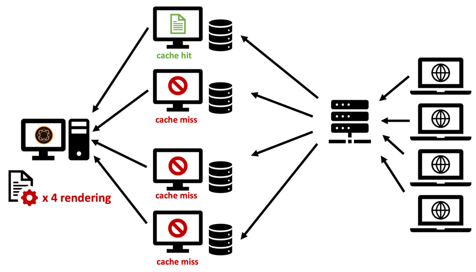

# 第2章 — 基础设施

## 设置缓存基础结构

在本系列第1章中，我们介绍了Publish系统和调度程序的基本拓扑。 可以根据预期负载、数据中心的拓扑和所需的故障转移属性，以多种不同的方式配置一组发布服务器和调度程序服务器。

我们将描绘最常见的拓扑，并描述它们的优势和不足之处。 列表— 当然 — 永远不可能是全面的。 唯一的限制是你的想象力。

### “旧版”设置

在早期，潜在访客的数量很少，硬件很昂贵，而Web服务器不像现在这样被视为业务关键。 常见设置是在两个或更多发布系统之前让一个调度程序充当负载平衡器和缓存。 Dispatcher核心的Apache服务器非常稳定，并且 — 在大多数情况下 — 能够提供足够数量的请求。

*“旧版”调度程序设置 — 按照当今的标准，不太常见*

  

这是调度程序从以下位置收到其名称的位置：它基本上是在发出请求。 此设置不再非常常见，因为它无法满足当今对性能和稳定性的更高要求。

### 多腿设置

如今，稍微不同的拓扑更为常见。 多条腿的拓扑每个Publish服务器将有一个调度程序。 专用（硬件）负载平衡器位于AEM基础架构的前面，用于调度对以下两个（或更多）腿的请求：

*现代“标准”调度程序设置 — 易于处理和维护*

  

这种设置的原因，

1. 平均而言，网站提供的流量比过去多得多。 因此，有必要扩大“阿帕奇基础设施” 。

2. “旧版”设置未在调度程序级别提供冗余。 如果Apache Server崩溃，则整个网站是不可到达的。

3. Apache Servers很便宜。 它们基于开放源，并且，如果您有虚拟数据中心，可以非常快速地配置它们。

4. 此设置为“滚动”或“交错”更新方案提供了简便的方法。 在发布1上安装新的软件包时，您只需关闭Dispatcher 1。 安装完成后，您已从内部网络中对Publish 1进行了充分的烟雾测试，您可以清理Dispatcher 1上的缓存，并在取下Dispatcher 2以维护Publish 2时重新开始它。

5. 在此设置中，缓存失效变得非常容易且是确定的。 由于只有一个发布系统连接到一个调度程序，因此只有一个调度程序要失效。 失效的顺序和时间微不足道。

### “缩小”设置

Apache Server价格低廉，易于配置，为什么不进一步扩展该级别。 为什么每个发布服务器前面没有两个或更多调度程序？

*“扩展”设置 — 有一些应用程序领域，但也有限制和警告*

  

你绝对能做到！ 该设置有许多有效的应用程序方案。 但您也应该考虑一些局限性和复杂性。

#### 无效

每个发布系统都连接到多个调度程序，当内容发生更改时，每个调度程序必须失效。

#### 维护

不言而喻，调度程序和发布系统的初始配置要复杂一些。 但同时要记住，“滚动”版本的工作量也要高一些。 AEM系统可以且必须在运行时进行更新。 但明智的做法是，在它们积极提供请求的同时，不要这样做。 通常，您只想更新发布系统的一部分，而其他系统仍在主动提供流量，然后在测试后切换到另一部分。 如果您很幸运，并且可以在部署过程中访问负载平衡器，则可以在此处禁用对维护中服务器的路由。 如果您使用共享负载平衡器但没有直接访问，则宁可关闭要更新的发布的调度程序。 越多，你就越得关门。 如果有大量客户并且您计划频繁进行更新，建议您实现一些自动化。 如果您没有自动化工具，扩展仍然是个坏主意。

在以前的项目中，我们使用不同的技巧从负载平衡中删除发布系统，而不直接访问负载平衡器本身。

负载平衡器通常为“ping”，这是一个特定页面，用于查看服务器是否已启动并正在运行。 通常，ping主页是个不重要的选择。 但是，如果您希望使用ping信号来指示负载平衡器不平衡流量，您会选择其他选项。 可创建专用模板或servlet，该模板或servlet可配置为使用`"up"`或`"down"`进行响应（在正文中或作为http响应代码）。 当然，该页面的响应不能缓存在调度程序中 — 因此始终从发布系统中新获取。 现在，如果配置负载平衡器以检查此模板或servlet，则可以轻松让“发布”“假装”关闭。 它不是负载平衡的一部分，可以更新。

#### 全球分发

“全球分发”是一个“横向扩展”设置，您在每个发布系统前面都有多个调度程序 — 现在分散到世界各地以更接近客户并提供更好的性能。 当然，在这种情况下，您没有中央负载平衡器，而是基于DNS和地理IP的负载平衡方案。

>[!NOTE]
>
>实际上，您正在使用此方法构建某种内容分发网络(CDN) — 因此您应考虑购买现成的CDN解决方案，而不是自己构建。 构建和维护自定义CDN并非易事的任务。

#### 水平缩放

即使在本地数据中心中，每个Publish系统前面具有多个Dispatcher的“向外扩展”拓扑也具有一些优势。 如果您发现Apache服务器上由于流量高（和良好的缓存命中率）而出现性能瓶颈，并且无法再扩展硬件（通过添加CPU、RAM和更快的磁盘），则可以通过添加Dispatcher来提高性能。 这称为“水平缩放”。 但是，这是有限制的，尤其是当您经常使流量失效时。 我们将在下一节中描述这一效果。

#### 扩展拓扑的限制

添加代理服务器通常应提高性能。 但是，在某些情况下，添加服务器实际上会降低性能。 怎么？ 假设您有一个新闻门户，每分钟都会在此介绍新文章和页面。 调度程序因“自动失效”而失效：每当发布页面时，同一站点的缓存中的所有页面都将失效。 这是一个有用的功能 — 我们在此系列的[第1章](chapter-1.md)中对此进行了介绍 — 但也意味着，当您的网站上频繁发生更改时，您会经常使缓存失效。 如果每个Publish实例只有一个调度程序，则请求页面的第一个访客会触发该页面的重新缓存。 第二个访客已获取缓存版本。

如果您有两个Dispatcher，则第二个访客未缓存页面的几率为50%，然后，当再次显示该页面时，他会遇到更大的延迟。 每个Publish拥有更多Dispatcher会使事情变得更糟。 发布服务器会承受更多负载，因为它必须分别为每个调度程序重新呈现页面。

*在频繁缓存刷新的扩展场景中降低性能。*

  

#### 减轻过度扩展问题

您可以考虑为所有调度程序使用中央共享存储，或同步Apache服务器的文件系统以缓解问题。 我们只能提供有限的第一手经验，但要准备好，这增加了系统的复杂性，并可以引入全新类别的错误。

我们在NFS方面做了一些实验，但NFS由于内容锁定而引起了巨大的性能问题。 这实际上降低了整体性能。

**结论**  — 建议不要在多个调度程序之间共享一个通用文件系统。

如果您遇到性能问题，请同等地扩展Publish和Dispatcher以避免Publisher实例的峰值负载。 发布/调度程序比率没有黄金规则 — 它高度取决于请求的分布以及发布和缓存失效的频率。

如果您还担心访客体验的延迟，请考虑使用内容投放网络、缓存重取、抢先缓存预热、设置宽限期（如本系列的[第1](chapter-1.md)章所述），或参考[第3](chapter-3.md)部分的一些高级构思。

### “交叉连接”设置

我们时不时看到的另一个设置是“交叉连接”设置：Publish实例没有专用的调度程序，但所有调度程序都连接到所有Publish系统。

  

*交叉连接的拓扑：增加冗余性和更复杂性。*

乍一看，这为相对较小的预算提供了一些更多冗余。 当其中一台Apache服务器关闭时，您仍可以有两个Publish系统执行渲染工作。 此外，如果某个Publish系统崩溃，您仍有两个Dispatcher为缓存的负载提供服务。

但这是有代价的。

首先，取一条腿进行维修相当麻烦。 事实上，这正是这个计划的初衷；更有弹性，并尽一切可能保持运转。 我们看到了如何处理这些问题的复杂维护计划。 首先重新配置Dispatcher 2，删除交叉连接。 正在重新启动Dispatcher 2。 正在关闭Dispatcher 1、更新Publish 1...等等。 如果这个长度超过两条腿，你应当仔细考虑。 你会得出结论，它实际上增加了复杂性、成本，是人类错误的一个可怕来源。 最好让这一过程自动化。 因此，最好检查一下，您是否确实拥有将此自动化任务包含在项目计划中的人力资源。 虽然您可以通过此节省一些硬件成本，但您可能会将多次投入IT员工。

其次，您可能在AEM上运行了需要登录的用户应用程序。 您可以使用粘滞会话，以确保始终从同一AEM实例中为一个用户提供服务，以便您能够在该实例上保持会话状态。 通过此交叉连接设置，您必须确保在负载平衡器和调度程序上的粘性会话正常工作。 这并非不可能，但您需要意识到这一点，并添加一些额外的配置和测试时间，这可能会节省您通过保存硬件计划的成本。

### 结论

我们不建议您将此交叉连接方案用作默认选项。 但是，如果您决定使用它，您将需要仔细评估风险和隐藏成本，并计划将配置自动化作为项目的一部分。

## 下一步

* [3 — 高级缓存主题](chapter-3.md)
