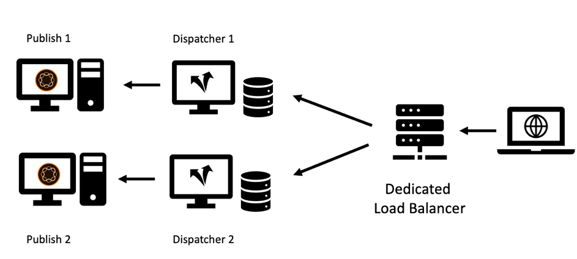

# 第2章 — 基础架构

## 设置缓存基础结构

在本系列的第1章中，我们介绍了Publish系统和Dispatcher的基本拓扑。 一组发布和Dispatcher服务器可以按许多不同方式进行配置 — 具体取决于预期负载、数据中心的拓扑以及所需的故障转移属性。

我们将描绘最常见的拓扑结构，并描述其优势和不足之处。 当然，这份清单永远不可能完整。 唯一的限制是你的想象力。

### “旧版”设置

在早期，潜在访客的数量很少，硬件价格昂贵，而且Web服务器并不像现在这样被视为业务关键型服务器。 常见的设置是将一个Dispatcher用作负载平衡器，并在两个或更多发布系统之前缓存。 位于Dispatcher核心的Apache服务器非常稳定，在大多数设置下，足以满足适当的请求量。

*“旧版”Dispatcher设置 — 按目前的标准来看不太常见*

  

Dispatcher从这里收到其名称：它基本上是在调度请求。 这种设置已不再常见，因为它无法满足当今对性能和稳定性的更高要求。

### 多足设置

现在，稍有不同的拓扑结构更为常见。 多分支拓扑的每个发布服务器将有一个Dispatcher。 专用（硬件）负载平衡器位于AEM基础架构的前面，将请求调度到以下两个（或更多）分支：

*现代“标准”Dispatcher设置 — 易于处理和维护*

  

以下是这种设置的原因，

1. 网站平均提供的流量比过去多得多。 因此，需要扩展“Apache基础架构”。

2. “旧版”设置未在Dispatcher级别提供冗余。 如果Apache Server出现故障，则无法访问整个网站。

3. Apache Server价格便宜。 它们基于开放源代码，而且如果您拥有虚拟数据中心，可以非常快速地配置它们。

4. 此设置提供了一种简单的方法用于“滚动”或“交错”更新场景。 只需在Publish 1上安装新软件包时关闭Dispatcher 1即可。 安装完成后，如果内部网络中的Publish 1已经过充分烟雾测试，那么可以清理Dispatcher 1上的缓存并重新启动，同时关闭Dispatcher 2以维护Publish 2。

5. 在此设置中，缓存失效变得非常容易且具有确定性。 由于只有一个发布系统连接到一个Dispatcher，因此只有一个要失效的Dispatcher。 失效的顺序和时间并不重要。

### “扩展”设置

Apache Server价格低廉且易于配置，何不进一步扩展该级别。 为什么每个发布服务器前面没有两个或更多Dispatcher？

*“横向扩展”设置 — 有一些应用领域，但也有一些限制和注意事项*

  

你绝对可以做到！ 对于该设置，有许多有效的应用场景。 但是，您还应考虑一些限制和复杂性。

#### 失效

每个发布系统都与多个Dispatcher连接，每个发布系统都必须在内容发生更改时失效。

#### 维护

不用说，Dispatcher和Publish系统的初始配置要复杂一些。 但也要记住，“滚动式”发布的工作量也要高一些。 AEM系统可以在运行时更新，并且必须更新。 但是，当他们积极为请求提供服务时，不这样做是明智的。 通常，您只想更新发布系统的一部分，而其他系统仍主动提供流量，然后在测试后，切换到其他部分。 如果您很幸运，并且可以在部署过程中访问负载平衡器，则可以在此处禁用到维护中服务器的路由。 如果您位于没有直接访问权限的共享负载平衡器上，则宁愿关闭要更新的发布的调度程序。 那里越多，你就越需要关门。 如果数量很大并且您计划频繁更新，建议采取一些自动化操作。 如果你没有自动化工具，那么扩大规模无论如何都是个坏主意。

在过去的一个项目中，我们使用了一种不同的技巧，在不直接访问负载平衡器本身的情况下，从负载平衡中删除Publish系统。

负载平衡器通常会“ping”，即用于查看服务器是否已启动并正在运行的特定页面。 一个微不足道的选择通常是Ping主页。 但是，如果您希望使用ping命令指示负载平衡器不要平衡流量，您可以选择其他内容。 您可以创建一个专用模板或servlet，可以将其配置为使用进行响应 `"up"` 或 `"down"` （在正文中或作为http响应代码）。 当然，不得将该页面的响应缓存在Dispatcher中 — 因此始终从发布系统中全新获取该响应。 现在，如果您将负载平衡器配置为检查此模板或servlet，则可以轻松让发布“假定”它关闭。 它不是负载平衡的一部分，可以更新。

#### 全球分发

“全球分发”是一种“扩展”设置，其中每个发布系统前有多个Dispatcher — 现在分布在世界各地，以更接近客户并提供更好的性能。 当然，在这种情况下，您没有中心负载平衡器，而是使用基于DNS和地理IP的负载平衡方案。

>[!NOTE]
>
>实际上，您正在使用此方法构建某种内容分发网络(CDN)，因此您应考虑购买现成的CDN解决方案，而不是自己构建一个解决方案。 构建和维护自定义CDN并非易事。

#### 水平缩放

即使在本地数据中心中，每个发布系统前面有多个Dispatcher的“横向扩展”拓扑也有一些优势。 如果由于高流量（以及良好的缓存命中率）而导致Apache Server出现性能瓶颈，并且您无法再扩展硬件（通过添加CPU、RAM和更快的磁盘），则可以通过添加Dispatcher来提高性能。 这称为“水平缩放”。 但是，这有限制，尤其是当您经常使流量失效时。 我们将在下一节中描述这种影响。

#### 横向扩展拓扑的限制

添加代理服务器通常会提高性能。 但是，在某些情况下，添加服务器实际上会降低性能。 如何进行？ 假设您有一个新闻门户，您每分钟都在该门户中介绍新文章和页面。 Dispatcher通过“自动失效”而失效：每当发布页面时，同一站点上的缓存中的所有页面都会失效。 这是一个有用的功能 — 我们在 [第1章](chapter-1.md) ，但这也意味着，当您的网站频繁发生更改时，您经常会使缓存失效。 如果您每个发布实例只有一个Dispatcher，则第一个请求页面的访客会触发该页面的重新缓存。 第二个访客已获得缓存版本。

如果您有两个Dispatcher，则第二个访客有50%的机会未缓存页面，然后再次呈现该页面时，他会遇到更大的延迟。 每个Publish拥有更多的Dispatcher会让情况变得更糟。 但实际情况是，发布服务器会收到更多负载，因为它必须分别重新渲染每个Dispatcher的页面。

*在缓存刷新频繁的横向扩展情形中性能下降。*

  

#### 缓解过度扩展问题

您可以考虑为所有Dispatcher使用中央共享存储或同步Apache服务器的文件系统以缓解问题。 我们只能提供有限的第一手经验，但是要做好准备，这增加了系统的复杂性，并且可能会引入全新的错误类别。

我们对NFS进行了一些实验，但NFS由于内容锁定而带来了巨大的性能问题。 这实际上降低了整体性能。

**结论**  — 不建议在多个调度程序之间共享通用文件系统。

如果您遇到性能问题，请同等地扩展Publish和Dispatcher以避免发布器实例上的峰值负载。 发布/Dispatcher比率没有黄金规则 — 它高度取决于请求的分布以及发布和缓存失效的频率。

如果您还担心访客体验的延迟，请考虑使用内容交付网络、缓存重新获取、抢先缓存预热、设置宽限时间，如中所述 [第1章](chapter-1.md) 或参考以下的一些高级想法： [第3部分](chapter-3.md).

### “交叉连接”设置

我们偶尔会看到的另一个设置是“交叉连接”设置：发布实例没有专用的Dispatcher，但所有Dispatcher都连接到所有发布系统。

  

*交叉连接拓扑：增加了冗余和复杂性。*

乍一看，这可以为相对较小的预算提供更多的冗余。 当其中一个Apache服务器关闭时，您仍然可以使用两个发布系统来执行渲染工作。 此外，如果其中一个Publish系统崩溃，您仍有两个Dispatcher提供缓存的加载。

但这是有代价的。

首先，取一条腿进行保养相当麻烦。 实际上，这就是这个计划的设计目的；为了更有弹性，并且尽可能保持正常运行。 我们已经看到了复杂的维护计划如何处理这种情况。 首先重新配置Dispatcher 2，删除交叉连接。 重新启动Dispatcher 2。 正在关闭Dispatcher 1、更新Publish 1、...等等。 如果能扩展到两条腿以上，您应该仔细考虑。 你会得出这样的结论：它实际上增加了复杂性，增加了成本，并且是造成人为错误的强大根源。 最好是自动执行这项操作。 所以，最好检查一下，如果您确实有人力资源将此自动化任务纳入您的项目计划。 虽然这样做可以节省一些硬件成本，但您可能会在IT员工上花费双倍的成本。

其次，您可能在AEM上运行了一些需要登录的用户应用程序。 您可以使用粘性会话，以确保始终从同一AEM实例中提供一个用户，以便您可以维护该实例上的会话状态。 进行此交叉连接设置时，您必须确保粘性会话在负载平衡器和Dispatcher上正常运行。 并非不可能 — 但您需要了解这一点，并添加一些额外的配置和测试时间，这同样可以节省硬件，从而节省您计划的成本。

### 结论

我们不建议您将此交叉连接方案用作默认选项。 但是，如果您决定使用它，则需要仔细评估风险和隐藏成本，并计划将配置自动化作为项目的一部分包括在内。

## 后续步骤

* [3 — 高级缓存主题](chapter-3.md)
