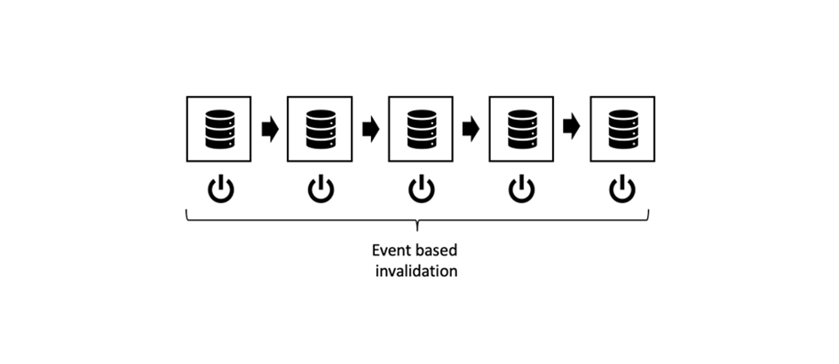
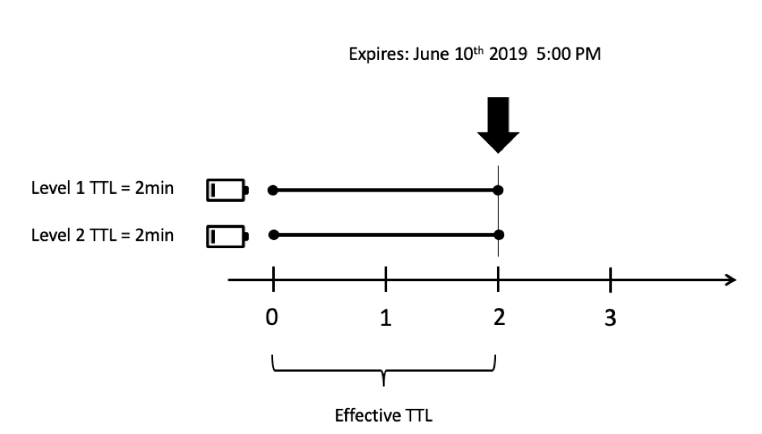

# 第3章 — 高级缓存主题

*“在计算机科学中，只有两样硬的东西：缓存失效和命名。”*

 — 菲尔·卡尔顿

## 概述

这是AEM缓存系列三部分中的第3部分。 前两个部分重点介绍Dispatcher中的普通http缓存以及存在哪些限制。 本部分将讨论有关如何克服这些限制的一些想法。

## 一般缓存

[第1章](chapter-1.md) 和 [第2章](chapter-2.md) 主要针对Dispatcher。 我们已经说明了基本信息、限制以及您需要进行某些权衡的位置。

缓存复杂性和复杂性不是Dispatcher特有的问题。 一般而言，缓存比较困难。

实际上，将Dispatcher作为您工具箱中的唯一工具是一种真正的限制。

在本章中，我们要进一步扩大对缓存的看法，并提出一些如何克服Dispatcher的某些缺点的想法。 没有灵丹妙药 — 您必须在项目中做出权衡。 请记住，在缓存和失效准确性中，总是伴随着复杂性，而在复杂性中，总是伴随着错误的可能性。

你需要在这些方面做出取舍，

* 性能和延迟
* 资源消耗/CPU负载/磁盘使用情况
* 准确性/货币/过时/安全性
* 简洁性/复杂性/成本/可维护性/错误倾向

这些维度在一个相当复杂的系统中相互关联。 没有简单的“如果 — 这个 — 那么 — 那个”。 使系统更简单可使它更快、更慢。 它可以降低您的开发成本，但会增加帮助台成本，例如，如果客户看到陈旧内容或抱怨网站速度缓慢，就会增加成本。 所有这些因素都需要相互考虑和平衡。 但现在你已经有了好主意，没有万灵丹妙药，也没有一套“最佳实践” — 只有大量不良实践和少数好的实践。

## 链接缓存

### 概述

#### 数据流

从服务器向客户端浏览器传送页面时，会跨越多个系统和子系统。 如果仔细观察，需要从源到漏获取大量跃点，每个跃点都是潜在的候选缓存点。


*典型CMS应用程序的数据流*

<br> 

让我们以硬盘上需要显示在浏览器中的数据片段开始我们的历程。

#### 硬件和操作系统

首先，硬盘驱动器(HDD)本身在硬件中内置了一些缓存。 其次，装载硬盘的操作系统使用可用内存缓存频繁访问的块以加快访问速度。

#### 内容存储库

下一个级别是CRX或Oak — AEM使用的文档数据库。 CRX和Oak将数据划分为可以缓存在内存中的区段，以避免更慢地访问HDD。

#### 第三方数据

大多数较大的Web安装也具有第三方数据；数据来自产品信息系统、客户关系管理系统、旧版数据库或任何其他任意Web服务。 在需要时，不需要从源中提取这些数据 — 特别是在已知“更改不太频繁”的情况下。 因此，如果它未在CRX数据库中同步，则可以缓存它。

#### 业务层 — 应用程序/模型

通常，模板脚本不会通过JCR API呈现来自CRX的原始内容。 您很可能在两者之间有一个业务层，用于合并、计算和/或转换业务域对象中的数据。 猜猜看，如果这些操作成本高昂，您应当考虑缓存它们。

#### 标记片段

现在，模型是呈现元件标注的基础。 为何不同时缓存渲染的模型？

#### Dispatcher、CDN和其他代理

关闭会将渲染的HTML页转到Dispatcher。 我们已经讨论过，Dispatcher的主要用途是缓存HTML页面和其他Web资源（尽管其名称为）。 在资源到达浏览器之前，它可能会传递一个反向代理（可以缓存）和一个也用于缓存的CDN。 客户端可能位于仅通过代理授予Web访问权限的办公室中，该代理可能决定缓存以节省流量。

#### 浏览器缓存

最后但同样重要的是，浏览器也会缓存。 这是一项容易被忽视的资产。 但它是缓存链中距离最近且速度最快的缓存。 很遗憾，此服务不会在用户之间共享，但仍在某个用户的不同请求之间共享。

### 缓存位置和原因

这是一长串潜在的高速缓存。 我们都面临着一些问题，我们看到了过时内容。 但是考虑到这个过程有几个阶段，它在大多数时间都奏效，这真是个奇迹。

但是，在供应链中的哪个环节进行缓存才是合理的呢？ 一开始呢？ 最后呢？ 到处都是？ 这取决于很多因素。 即使同一网站中的两个资源也可能希望以不同的方式回答此问题。

为了让您大致了解可能考虑的因素，

**存留时间**  — 如果对象的固有生存时间较短（流量数据的生存时间可能比天气数据短），则可能不值得缓存。

**生产成本 —** 重新制作和交付对象是多么昂贵（就CPU周期和I/O而言）。 如果它是廉价缓存，则可能没有必要。

**大小**  — 大型对象需要缓存更多资源。 这可能是一个限制因素，必须与其利益相平衡。

**访问频率**  — 如果很少访问对象，则缓存可能无效。 在它们第二次从缓存访问之前，它们只会失效或失效。 此类项目只会阻塞内存资源。

**共享访问**  — 多个实体使用的数据应进一步缓存到链的上方。 实际上，缓存链不是链，而是树。 存储库中的一段数据可能被多个模型使用。 这些模型进而可以由多个渲染脚本用于生成HTML片段。 这些片段包含在多个页面中，这些页面通过浏览器中的专用缓存分发给多个用户。 因此，“共享”并不意味着只在人与人之间共享，而不是在软件碎片之间共享。 如果要查找潜在的“共享”缓存，只需将树追溯到根并查找公共祖先 — 您应在该处进行缓存。

**地理空间分布**  — 如果您的用户分布在世界各地，使用分布式缓存网络可能有助于减少延迟。

**网络带宽和延迟**  — 说到延迟，您的客户是谁，他们使用哪种网络？ 或许您的客户是使用3G连接的老一代智能手机的缺发达国家移动客户？ 请考虑创建较小的对象并将其缓存在浏览器缓存中。

这份清单目前还不够全面，但我们认为你现在已经有了这个想法。

### 链接缓存的基本规则

再说一遍 — 缓存非常困难。 让我们分享一些基本规则，这些规则是从以前的项目中提取的，可以帮助您避免项目中出现问题。

#### 避免双重缓存

上一章介绍的每个层都为缓存链提供了一些价值。 或者通过节省计算周期，或者通过让数据更接近消费者。 在链的多个阶段缓存一段数据并没有错，但您应该始终考虑下一阶段的好处和成本。 在发布系统中缓存整页通常没有任何好处，因为在Dispatcher中已经这样做了。

#### 混合失效策略

有三种基本的失效策略：

* **TTL，生存时间：** 对象在固定时间（例如“从现在起2小时”）后过期
* **过期日期：** 对象在定义的未来时间过期（例如，“2019年6月10日下午5:00”）
* **基于事件：** 对象将在平台中发生的事件（例如，当页面更改并激活时）显式失效

现在，您可以在不同的缓存层上使用不同的策略，但也有一些“有毒”策略。

#### 基于事件的失效



*纯基于事件的失效：从内部缓存到外层失效*

<br> 

纯事件失效是理解最简单、理论最正确、最准确的失效方法。

简言之，当对象更改后，缓存将逐个失效。

您只需记住一条规则：

始终使从内部到外部缓存失效。 如果先使外部缓存失效，则可能会重新缓存内部缓存的过时内容。 不要在缓存重新更新的时间进行任何假设 — 请确保。 最好是通过触发外部缓存的失效 _之后_ 使内部节点失效。

这就是理论。 但实际上，存在许多难题需要解决。 事件必须分发 — 可能通过网络分发。 在实际应用中，这使其成为最难实现的失效方案。

#### 自动 — 修复

对于基于事件的失效，您应该有一个应急计划。 如果缺少失效事件，该怎么办？ 一个简单的策略就是在一定时间后使无效或清除。 因此，您可能已错过该活动，现在提供了过时的内容。 但是，您的对象还具有仅数小时（天）的隐式TTL。 所以最终这个系统会自动自我修复。

#### 纯基于TTL的失效


*基于未同步TTL的失效*

<br> 

这个计划也相当普遍。 您可以栈叠多个缓存层，每个缓存层都有权在特定时间内为对象提供服务。

实施容易。 不幸的是，很难预测数据的有效寿命。


*外部高速缓存延长内部对象的生命周期*

<br> 

请看上图。 每个缓存层引入的TTL为2分钟。 现在 — 总体TTL也必须2分钟，对吗？ 不尽然。 如果外层在对象失效之前获取对象，则外层实际上会延长对象的有效生存时间。 在这种情况下，有效活动时间可以是2到4分钟。 假设您同意业务部门的意见，那么一天是可以容忍的，而且您有四层缓存。 每个层上的实际TTL不能超过六小时……正在增加缓存未命中率……

我们并不是说这是个糟糕的计划。 你应该知道它的极限。 这是一个简单好用的策略。 仅当您的网站流量增加时，您才可以考虑使用更准确的策略。

*通过设置特定日期同步失效时间*

#### 基于到期日期的失效

如果您在内部对象中设置特定日期并将其传播到外部缓存，则可以获得更可预测的有效生存时间。



*同步到期日期*

<br> 

但是，并非所有缓存都可以传播日期。 当外部缓存聚合两个具有不同过期日期的内部对象时，可能会变得非常糟糕。

#### 混合基于事件和基于TTL的失效


*混合基于事件和基于TTL的策略*

<br> 

此外，AEM世界中的一种常见方案是在内部缓存（例如，内存中的缓存，事件可以近乎实时地处理）中使用基于事件的失效，而在外部使用基于TTL的缓存，则您可能无权访问显式失效。

在AEM世界中，当基础资源发生更改并将此更改事件传播到也可基于事件工作的Dispatcher时，发布系统中将出现用于业务对象和HTML片段的内存缓存，即失效。 例如，之前您将有一个基于TTL的CDN。

在Dispatcher前面放置一层（短）基于TTL的缓存可以有效地缓解自动失效后通常会出现的峰值。

#### 混合TTL和基于事件的失效


*毒性：混合TTL — 和基于事件的失效*

<br> 

这种组合是有毒的。 切勿在缓存了TTL或基于到期的缓存之后放置基于事件的缓存。 还记得我们在“纯TTL”战略中所具有的溢出效应吗？ 同样的效应在这里可以看到。 只有已发生外部缓存的失效事件才可能不会再次发生，这可以将缓存对象的生命周期扩展到无限。


*基于TTL和基于事件的组合：溢出到无限*

<br> 

## 部分缓存和内存中缓存

可以挂接到渲染过程的阶段以添加缓存层。 从获取远程数据传输对象或创建本地业务对象，到缓存单个组件的呈现标记。 我们将在以后的教程中保留具体的实施。 但也许您计划自己已经实施了其中一些缓存层。 因此，我们至少可以在这里引入基本原则 — 和格言。

### 警告词

#### 遵守访问控制

这里介绍的技术非常强大， _必需_ 每个AEM开发人员的工具箱中。 但不要太兴奋，明智地使用它们。 通过将对象存储在缓存中并在后续请求中共享给其他用户，实际上意味着规避访问控制。 这在面向公众的网站上通常不是问题，但在用户需要登录才能访问网站时可能会成为问题。

假设您将站点主菜单的HTML标记存储在内存缓存中，以便在不同的页面之间共享该标记。 实际上，这是一个存储部分渲染的HTML的完美示例，因为创建导航通常很昂贵，因为它需要遍历大量页面。

您并非在所有页面之间共享相同的菜单结构，而是与所有用户共享该菜单结构，这会使其更高效。 但是，请稍候……但可能菜单中的某些项目仅为特定用户组保留。 在这种情况下，缓存可能会变得复杂一些。

#### 仅缓存自定义业务对象

如果有的话（这是最重要的建议），我们可以为您提供：

>[!WARNING]
>
>仅缓存属于您的对象、不可变对象、自行构建的对象、浅层对象以及没有传出引用的对象。

这是什么意思？

1. 您不知道其他人的对象的预期活动周期。 假定您获得了对请求对象的引用，并决定对其进行缓存。 现在，请求已结束，并且servlet容器希望将该对象循环用于下一个传入请求。 在这种情况下，其他人将更改您认为拥有独占控制权的内容。 不要忽视这一点 — 我们在一个项目中看到了类似的情况。 客户看到的是其他客户数据，而不是他们自己的数据。

2. 只要某个对象被其他引用链引用，就无法从栈中删除该对象。 如果您在缓存中保留了一个所谓的小对象，且该对象引用了，那么就假设该图像以4MB为单位呈现，那么您就有很好的机会来解决内存泄漏问题。 高速缓存应该基于弱引用。 但是 — 弱引用不会按预期起作用。 这是产生内存泄漏并结束内存不足错误的最佳绝对方法。 而且，您不知道外部对象的保留内存的大小是多少，对吧？

3. 特别是在Sling中，您可以使每个对象（几乎）彼此适应。 考虑将资源放入缓存。 下一个请求（具有不同的访问权限）将获取该资源并将其调整到resourceResolver或会话中以访问他无权访问的其他资源。

4. 即使您通过AEM在资源周围创建一个精简“包装器”，也不能缓存该包装器，即使它是您自己的不可变包装器也是如此。 包装的对象将是一个引用（我们之前禁止使用该引用），如果我们看起来很锐利，则基本上会产生与上一项中所述相同的问题。

5. 如果要缓存，请通过将原始数据复制到自己的共享对象中来创建自己的对象。 您可能希望通过引用链接您自己的对象 — 例如，您可能希望缓存对象树。 没有问题 — 但只缓存您刚在同一请求中创建的对象 — 没有从其他位置请求的对象（即使是“您的”对象的名称空间也是如此）。 _复制对象_ 是关键。 并确保立即清除链接对象的整个结构，并避免对结构的传入和传出引用。

6. 是 — 并且使您的对象不可变。 私有属性，仅限且无设置者。

这是很多规则，但值得遵循。 即使你经验丰富，非常聪明，一切都在掌控之中。 您项目中的年轻同事刚刚从大学毕业。 他不知道所有这些隐患。 如果没有隐患，就没有可避免的。 保持简单明了。

### 工具和库

本系列介绍如何理解各种概念，使您能够构建最适合您用例的架构。

我们没有特别推广任何工具。 但是给你一些如何评估它们的提示。 例如，自6.0版起，AEM就有一个带有固定TTL的简单内置缓存。你会用吗？ 发布时可能不会，因为链中跟有基于事件的缓存（提示：调度程序）。 但对于作者来说，这或许是一个不错的选择。 AdobeACS Commons也有一个HTTP缓存，可能值得考虑。

或者，您基于成熟的缓存框架(如 [Ehcache](https://www.ehcache.org). 这可用于缓存Java对象和渲染的标记(`String` 对象)。

在一些简单的情况下，您可能还能够同时使用并发哈希图，在这里，无论是在工具中还是在技能中，您都可以很快看到限制。 并发与命名和缓存一样难以掌握。

#### 引用

* [ACS Commons http缓存](https://adobe-consulting-services.github.io/acs-aem-commons/features/http-cache/index.html)
* [缓存框架](https://www.ehcache.org)

### 基本术语

我们不会在这里深入讨论缓存理论，但我们觉得有必要提供一些流行语，以便您有一个良好的快速入门。

#### 缓存逐出

我们谈了很多无效和清除的事。 _缓存逐出_ 与以下术语相关：退出登录后，将无法再使用。 但是，逐出不会发生在条目过期时，而是发生在缓存已满时。 较新项目或“较重要”项目将较旧项目或较不重要的项目推出缓存。 您需要牺牲哪些条目是逐一做出决定的。 您可能希望驱逐最旧的或很少使用或最后访问时间很长的那些文件。

#### 抢占式缓存

抢占式缓存是指在条目失效或被视为过期时，使用新内容重新创建条目。 当然 — 您只需使用少量资源即可做到这一点，您确定可以频繁且立即访问。 否则，在创建可能永远不会被请求的缓存条目时会浪费资源。 通过抢先创建缓存条目，您可以减少缓存失效后对资源的第一个请求的延迟。

#### 缓存预热

缓存预热与抢占式缓存密切相关。 虽然你不会用这个术语来形容实时系统。 而且时间限制也比前者少。 失效后，您不必立即重新缓存，而是在时间允许时逐渐填充缓存。

例如，您从负载平衡器中取出Publish / Dispatcher代码以对其进行更新。 在重新集成它之前，您将自动爬网最常访问的页面，以将其重新放入缓存。 当缓存“热” — 已充分填充时，您将腿重新集成到负载平衡器中。

或者，你可以立刻重新整合这条腿，但是你可以把流量调节到这条腿，这样它就有机会通过定期使用来暖和它的快取。

或者，您可能还希望在系统空闲时缓存一些不太经常访问的页面，以便在实际请求访问这些页面时减少延迟。

#### 缓存对象标识、有效负载、失效依赖关系和TTL

一般而言，缓存的对象或“条目”有五个主要属性，

#### 键

这是标识，即用于标识和对象的属性。 检索有效负载或从缓存中清除有效负载。 例如，Dispatcher使用页面的URL作为键。 请注意，Dispatcher不使用页面路径。 这不足以区分不同的渲染。 其他缓存可能使用不同的键。 我们稍后将看到一些示例。

#### 值/有效负荷

这是物品的宝库，您希望检索的数据。 对于Dispatcher，关键是文件内容。 但它也可以是一个Java对象树。

#### TTL

我们已经涵盖了TTL。 在此时间后，条目将被视为过时，且不应再发送。

#### 依赖关系

这与基于事件的失效相关。 该对象所依赖的原始数据是什么？ 我们已经说过，在第一部分中，真实而准确的依赖性跟踪过于复杂。 但根据我们对系统的了解，您可以使用更简单的模型来近似依赖关系。 我们使足够多的对象失效，以清除过时的内容……而且可能无意中超过了所需的数量。 然而，我们试图保持“清空一切”的底线。

哪些对象取决于每个应用程序中的其他对象是真实的。 我们稍后将给出一些有关如何实施依赖关系策略的示例。

### HTML片段缓存


*在不同页面上重用渲染的片段*

<br> 

HTML片段缓存是一个强大的工具。 其思想是将组件生成的HTML标记缓存到内存缓存中。 你可能会问，我为什么要那么做？ 我反正在Dispatcher中缓存整个页面的标记 — 包括该组件的标记。 我们同意。 您可以 — 但每页只能访问一次。 您未在页面之间共享该标记。

想象一下，您将在每个页面的顶部渲染导航。 每个页面上的标记看起来都一样。 但您正在对每个页面重复渲染它，调度程序中没有这样做。 并记住：自动失效后，所有页面都需要重新渲染。 基本上，你运行着相同的代码，其结果是数百次。

根据我们的经验，渲染嵌套的顶部导航是一项非常昂贵的任务。 通常，要遍历文档树的很大一部分来生成导航项。 即使您只需要导航标题和URL ，页面也必须加载到内存中。 在这里，他们正阻塞着宝贵的资源。 一次又一次。

但是，该组件可以在多个页面之间共享。 共享某些内容即表示使用缓存。 因此 — 您要执行的操作是检查导航组件是否已渲染和缓存，并且不是重新渲染而是仅发出缓存值。

该计划有两个很好的细节，很容易被忽视：

1. 您正在缓存Java字符串。 String没有任何传出引用，并且是不可变的。 因此，考虑到上述警告，这超级安全。

2. 失效也非常简单。 每当有内容更改您的网站时，您都会希望使此缓存条目失效。 重建相对便宜，因为它只需要执行一次，然后被所有数百页重复使用。

这对您的Publish服务器是一大安慰。

### 片段缓存的实施

#### 自定义标记

过去，将JSP用作模板引擎时，经常使用自定义JSP标记来封装组件渲染代码。

```
<!-- Pseudo Code -->

<myapp:cache
  key=' ${info.homePagePath} + ${component.path}'
  cache='main-navigation'
  dependency='${info.homePagePath}'>

… original components code ..

</myapp:cache>
```

将捕获其主体并将其写入缓存或阻止执行其主体并输出缓存项的有效负荷的自定义标记。

“密钥”是它在主页上具有的组件路径。 我们不在当前页面上使用组件的路径，因为这样会为每个页面创建一个缓存条目 — 这与我们共享该组件的意图相冲突。 我们也不只是使用组件相对路径(`jcr:conten/mainnavigation`)，因为这样会阻止我们在不同站点中使用不同的导航组件。

“缓存”是一个指示器，指示存储条目的位置。 您通常有多个缓存，可在其中存储项目。 其中每一个的表现可能都有些不同。 因此，区分存储的内容很有用，即使最终只是字符串。

“依赖项”是缓存条目所依赖的对象。 “主导航”缓存可能有规则，如果节点“依赖关系”下有任何更改，则必须清除相应的条目。 因此 — 您的缓存实施需要将其自身注册为存储库中的事件侦听器以了解更改，然后应用特定于缓存的规则来找出需要失效的内容。

以上只是一个例子。 您还可以选择拥有一棵缓存树。 其中，第一级别用于分隔站点（或租户），第二级别然后分为不同的内容类型（例如“主导航”） — 这使您能够像上面的示例一样添加主页路径。

顺便说一下，您也可以将此方法用于更现代的基于HTL的组件。 然后，您的HTL脚本周围会有一个JSP包装器。

#### 组件筛选器

但在纯HTL方法中，您会希望使用Sling组件过滤器构建片段缓存。 我们还没有看到这种情况，但我们将采取这种办法处理这个问题。

#### Sling Dynamic 包括

如果在不断变化的环境（不同页面）的上下文中有一些常量（导航），则使用片段缓存。

但您可能也有相反的情况，一个相对固定的上下文（一个很少更改的页面）以及该页面上一些不断变化的片段（例如，实时股票代码）。

在这种情况下，您可以 [Sling Dynamic包含](https://sling.apache.org/documentation/bundles/dynamic-includes.html) 一个机会。 本质上，这是一个组件过滤器，它包装在动态组件周围，而不是将组件呈现到页面中，而是会创建引用。 此引用可以是Ajax调用 — 以便浏览器包含该组件，因此可以静态缓存周围的页面。 或者，Sling Dynamic Include可以生成SSI指令（服务器端包含）。 此指令将在Apache Server中执行。 如果您利用Varnish或支持ESI脚本的CDN，您甚至可以使用ESI - Edge Side Include指令。


*使用Sling Dynamic Include的请求的序列图*

<br> 

SDI文档规定，在处理动态组件时，应禁用以“*.nocache.html”结尾的URL的缓存，这样才有意义。

您可能会看到如何使用SDI的另一个选项：如果您 _不要_ 为包含禁用Dispatcher缓存，Dispatcher的行为类似于片段缓存，类似于我们在上一章中描述的那样：页面和组件片段均等地独立地缓存在Dispatcher中，并在请求页面时由Apache服务器中的SSI脚本拼合在一起。 这样，您就可以实施共享组件，如主导航（因为您始终使用相同的组件URL）。

这在理论上应该有效。 但是……

我们建议不要这样做：您将失去为真正的动态组件绕过缓存的能力。 SDI是全局配置的，您对“post-mans-fragment-cache”所做的更改也将应用于动态组件。

我们建议您仔细研究SDI文档。 还有其他几个限制，但在某些情况下，SDI是一个有价值的工具。

#### 引用

* [docs.oracle.com — 如何编写自定义JSP标记](https://docs.oracle.com/cd/E11035_01/wls100/taglib/quickstart.html)
* [Dominik Suß — 创建和使用组件筛选器](https://www.slideshare.net/connectwebex/prsentation-dominik-suess)
* [sling.apache.org - Sling Dynamic包含](https://sling.apache.org/documentation/bundles/dynamic-includes.html)
* [helpx.adobe.com — 在AEM中设置Sling Dynamic Include](https://helpx.adobe.com/experience-manager/kt/platform-repository/using/sling-dynamic-include-technical-video-setup.html)


#### 模型缓存


*基于模型的缓存：一个业务对象具有两个不同的渲染*

<br> 

让我们通过导航再次重新审视此案例。 我们假定，每个页面都需要相同的导航标记。

但也许事实并非如此。 您可能希望在表示 _当前页面_.

```
Travel Destinations

<ul class="maninnav">
  <li class="currentPage">Travel Destinations
    <ul>
      <li>Finland
      <li>Canada
      <li>Norway
    </ul>
  <li>News
  <li>About us
<ul>
```

```
News

<ul class="maninnav">
  <li>Travel Destinations
  <li class="currentPage">News
    <ul>
      <li>Winter is coming>
      <li>Calm down in the wild
    </ul>
  <li>About us
<is
```

这是两种完全不同的渲染。 尽管如此， _业务对象_  — 完整的导航树 — 是相同的。  此 _业务对象_  下面是一个对象图，表示树中的节点。 此图形可以轻松地存储在内存缓存中。 但是，请记住，此图形不得包含任何对象或引用您未自行创建的任何对象，尤其是当前的JCR节点。

#### 浏览器中的缓存

我们已经提到了浏览器中缓存的重要性，现在有许多优秀的教程。 最后，对于浏览器，Dispatcher只是一个遵循HTTP协议的Web服务器。

然而，尽管有这个理论，我们还是收集了一些知识，这些知识是我们独一无二的，我们想要分享的。

本质上，浏览器缓存可以通过两种不同的方式利用，

1. 浏览器缓存了资源，知道确切的到期日期。 在这种情况下，它不会再次请求资源。

2. 浏览器具有资源，但不确定它是否仍然有效。 在这种情况下，它会询问Web服务器（在本例中为Dispatcher）。 如果资源自您上次交付以来已修改，请向我提供该资源。 如果未更改，则服务器将使用“304 — 未更改”进行响应，并且只传输元数据。

#### 调试

如果您正在优化用于浏览器缓存的Dispatcher设置，则在浏览器和Web服务器之间使用桌面代理服务器将非常有用。 我们更喜欢卡尔·冯·兰多的《Charles Web Debugging Proxy》。

使用Charles，您可以读取传输到服务器或从服务器传输的请求和响应。 并且，您可以了解有关HTTP协议的许多信息。 现代浏览器也提供一些调试功能，但桌面代理的功能是前所未有的。 您可以处理传输的数据、限制传输、重放单个请求等等。 用户界面排列清晰，比较全面。

最基本的测试是将网站作为普通用户使用（代理位于两者之间），并在静态请求（向/etc/...）的数量随时间逐渐减少时签入代理 — 因为这些请求应该位于缓存中，不再请求。

我们发现，代理可以提供更清晰的概述，因为缓存的请求不会显示在日志中，而某些浏览器内置调试器仍会将这些请求显示为“0毫秒”或“从磁盘”。 这很正常，也很准确，但可能会使您的视图变得模糊。

然后，您可以深入查看并检查已传输文件的标头，以查看“Expires”http标头是否正确。 您可以使用if-modified-since标头设置来重放请求，以查看服务器是否正确响应了304或200响应代码。 您可以观察异步调用的时间，还可以在一定程度上测试您的安全假设。 请记住，我们告诉过您不要接受所有未明确要求的选择器？ 在这里，您可以对URL和参数进行播放，看看您的应用程序是否运行良好。

在调试缓存时，我们只要求您不要做一件事：

请勿在浏览器中重新加载页面！

“浏览器重新加载”，即 _简单重新加载_ 以及 _强制重装_ (&quot;_shift-reload_“)与普通页面请求不同。 简单的重新加载请求会设置标头

```
Cache-Control: max-age=0
```

Shift — 重新加载（按住Shift键并单击重新加载按钮）通常会设置请求标头

```
Cache-Control: no-cache
```

这两个标题的效果相似，但略有不同，但最重要的是，当您从URL插槽中打开URL或在网站上使用链接时，它们与常规请求完全不同。 正常浏览不会设置Cache-Control标头，但可能会设置if-modified-since标头。

因此，如果要调试正常的浏览行为，您应该完全执行此操作： _正常浏览_. 使用浏览器的重新加载按钮是避免在配置中看到缓存配置错误的最佳方法。

用你的查尔斯代理来看看我们在说什么。 是的，您可以在打开时重播请求。 无需从浏览器重新加载。

## 性能测试

通过使用代理，您可以了解页面的计时行为。 当然，这远不是一种性能测试。  性能测试需要多个客户端并行请求您的页面。

一个常见的错误（我们经常看到）是性能测试仅包含超少数量的页面，并且这些页面仅从Dispatcher缓存中交付。

如果将应用程序提升到实时系统，则负载与已测试的负载完全不同。

在实时系统上，访问模式并不是您在测试中拥有的少量均匀分布的页面（主页和少量内容页面）。 页数更大，请求分布非常不均匀。 并且 — 当然 — 无法完全从缓存为实时页面提供服务：来自发布系统的失效请求使很大一部分宝贵资源自动失效。

啊，是的。而且，当您重建Dispatcher缓存时，您会发现，发布系统的行为也非常不同，这取决于您请求的是只有少数几个页面，还是更大的页面数量。 即使所有页面都同样复杂，它们的数量也会起到一定作用。 还记得我们对链式缓存的评价吗？ 如果总是请求同样数量的页面，则很可能包含原始数据的块位于硬盘缓存中，或者这些块由操作系统缓存。 此外，存储库也很可能在其主内存中缓存了相应的区段。 因此，重新渲染的速度比您之前让其他页面轮流从各种缓存中逐出要快得多。

缓存和测试依赖于缓存的系统都很困难。 那么，怎样才能获得更准确的现实生活场景呢？

我们认为您必须执行多项测试，并且必须提供多项绩效指标作为解决方案质量的衡量标准。

如果您已经有一个网站，请测量请求的数量及其分配方式。 尝试为使用相似请求分布的测试建模。 加入一些随机性不会造成伤害。 您不必模拟会加载JS和CSS等静态资源的浏览器，这些其实并不重要。 最终，它们会缓存在浏览器或Dispatcher中，并且不会显着增加负载。 但参考的图像确实重要。 在旧日志文件中发现它们的分布并对类似的请求模式建模。

现在，在Dispatcher完全不缓存的情况下进行测试。 这是你最坏的情况。 了解在这种最恶劣的情况下，您的系统会在哪个峰值负载变得不稳定。 如果您愿意，还可以通过停止一些Dispatcher/Publish步骤来使问题变得更糟。

接下来，执行相同的测试，将所有必需的缓存设置设为“开”。 慢慢提升并行请求以预热缓存，并了解在这些最佳情况下，您的系统可容纳的流量。

一种常见的情况是，在启用Dispatcher的情况下运行测试，但同时也会发生一些无效情况。 您可以通过cronjob接触statfile或不定时地向Dispatcher发送失效请求来模拟这种情况。 别忘了偶尔清除一些非自动失效的资源。

您可以通过增加失效请求和增加负载来改变最后一种方案。

这比线性负载测试要复杂一些，但为您的解决方案增加了很多信心。

你可能会回避这种努力。 但至少要对Publish系统进行最坏情况的测试，使其具有更多页面（均匀分布），以查看系统的限制。 确保，您能够正确解释最佳案例的数量，并为您的系统预留足够的空间。
