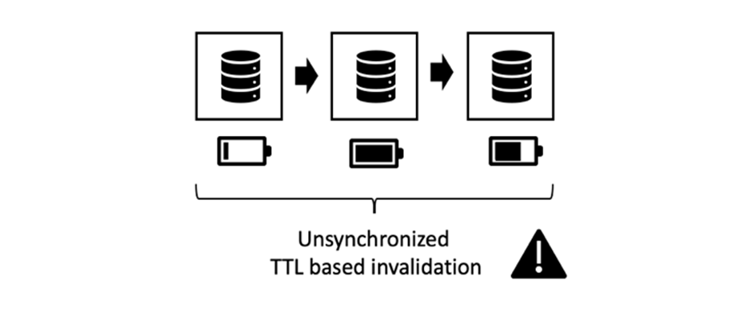
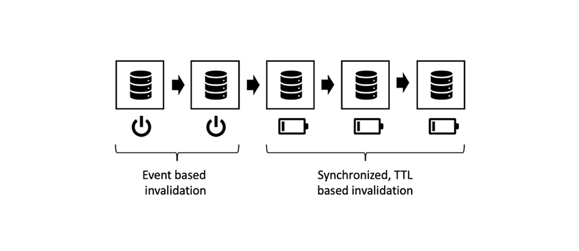

# 第3章 — 高级缓存主题

*“在计算机科学中，只有两件难事：缓存失效和命名事项。”*

 — 菲尔·卡尔顿

## 概述

这是三部分系列中用于在AEM中缓存的第3部分。 前两部分重点介绍Dispatcher中的纯http缓存以及存在哪些限制。 本部分讨论了如何克服这些限制的一些想法。

## 一般缓存

[本系列第1章](chapter-1.md) 和 [第2章](chapter-2.md) 主要针对Dispatcher。我们已解释了基础知识、限制以及您需要在何处进行某些权衡取舍。

缓存复杂性和复杂性并非Dispatcher所特有的问题。 通常，缓存很困难。

将Dispatcher作为工具箱中的唯一工具实际上将是一个实实在在的限制。

在本章中，我们希望进一步扩展我们对缓存的看法，并提出一些解决Dispatcher某些缺点的方法。 没有万灵丹 — 您必须在项目中做出权衡。 请记住，缓存和失效准确性总是会带来复杂性，而复杂性又会带来错误。

你需要在这些领域做出权衡，

* 性能和延迟
* 资源消耗/CPU负载/磁盘使用率
* 准确性/货币/稳定性/安全性
* 简单性/复杂性/成本/可维护性/易出错

这些维度在一个相当复杂的系统中相互关联。 没有简单的，如果，那。 使系统更简单可以使其更快或更慢。 它可以降低您的开发成本，但会增加服务台的成本，例如，如果客户看到陈旧内容或抱怨网站运行缓慢，则会增加成本。 所有这些因素都需要相互考虑和平衡。 但现在，你应该已经有了一个好主意，那就是没有万能之术，也没有一种“最佳做法” — 只有许多糟糕的做法和一些好的做法。

## 链式缓存

### 概述

#### 数据流

将页面从服务器传送到客户端的浏览器会跨多个系统和子系统。 如果仔细查看，需要从源数据到漏数据中选取多个跳数，每个跳数都是缓存的潜在候选项。


*典型CMS应用的数据流*

<br> 

让我们从硬盘上需要显示在浏览器中的一段数据开始我们的历程。

#### 硬件和操作系统

首先，硬盘(HDD)本身在硬件中具有一些内置的缓存。 其次，装载硬盘的操作系统使用空闲内存来缓存频繁访问的块以加快访问速度。

#### 内容存储库

下一级是CRX或Oak - AEM使用的文档数据库。 CRX和Oak将数据划分为可缓存在内存中的区段，以避免访问硬盘速度变慢。

#### 第三方数据

大多数较大的Web安装也具有第三方数据；来自产品信息系统、客户关系管理系统、旧数据库或任何其他任意web服务的数据。 无需在需要时随时从源中提取此数据 — 特别是在已知更改频率不太高时。 因此，如果未在CRX数据库中同步，则可以缓存该数据集。

#### 业务层 — 应用程序/模型

通常，模板脚本不会通过JCR API呈现来自CRX的原始内容。 在业务域对象中，很可能有一个业务层，用于合并、计算和/或转换数据。 猜怎么着 — 如果这些操作成本很高，您应该考虑缓存它们。

#### 标记片段

模型现在是渲染组件标记的基础。 为何不缓存呈现的模型？

#### 调度程序、CDN和其他代理

关闭会将呈现的HTML页面转到调度程序。 我们已经讨论了，Dispatcher的主要用途是缓存HTML页面和其他Web资源（尽管其名称为）。 在资源到达浏览器之前，可能会传递反向代理（可缓存和CDN），该代理也用于缓存。 客户端可能位于办公室，仅通过代理授予Web访问权限，而代理可能决定缓存并保存流量。

#### 浏览器缓存

最后，浏览器也会缓存。 这是一项容易被忽视的资产。 但它是缓存链中最接近、最快的缓存。 遗憾的是，它不是在用户之间共享的，而是仍在一个用户的不同请求之间共享。

### 缓存位置和原因

这是一长串潜在的缓存。 我们都面临着一些问题，我们看到的内容已经过时了。 但考虑到这里有多少个阶段，这是一个奇迹，它大部分时间都在起作用。

但是，在这条链子中，什么地方有意义呢？ 开始的时候？ 最后？ 到处都有？ 这取决于……取决于很多因素。 即使是同一网站中的两个资源也可能希望对该问题给出不同的答案。

为了大致了解考虑哪些因素，

**生存时间**  — 如果对象的固有实时时间较短（流量数据的实时时间可能比天气数据短），则可能不值得缓存。

**生产成本 —** 对象的再生产和交付成本（以CPU周期和I/O衡量）是多高。如果缓存成本较低，则可能不必。

**大小**  — 大型对象需要更多资源才能缓存。这可能是一个限制因素，必须与好处平衡。

**访问频度**  — 如果对象很少访问，则缓存可能无效。它们只会失效或失效，然后才能第二次从缓存访问。 这些项目只会阻塞内存资源。

**共享访问**  — 应在链上进一步缓存多个实体使用的数据。实际上，缓存链不是链，而是树。 存储库中的一段数据可能由多个模型使用。 这些模型反过来可由多个渲染脚本用来生成HTML片段。 这些片段包含在多个页面中，这些页面通过浏览器中的专用缓存分发给多个用户。 因此，“共享”并不意味着只在人与人之间共享，而是在软件之间共享。 如果要查找潜在的“共享”缓存，只需将树跟踪回根并找到共同的上级即可，您应该在该上级进行缓存。

**地理空间分布**  — 如果您的用户分布于全球，则使用分布式缓存网络可能有助于减少延迟。

**网络带宽和延迟**  — 说到延迟，您的客户是谁，他们使用的是哪种网络？或许您的客户是使用老一代智能手机3G连接的不发达国家的移动客户？ 请考虑创建较小的对象，并将它们缓存在浏览器缓存中。

这份清单目前还不够全面，但我们认为你现在已经知道了。

### 链式缓存的基本规则

同样，缓存很困难。 让我们分享一些基本规则，这些规则是我们从以前的项目中提取的，可帮助您避免项目中出现问题。

#### 避免双重缓存

最后一章中引入的每个层都会在缓存链中提供一些值。 或者通过节省计算周期，或者通过让数据更接近消费者。 在链的多个阶段中缓存一段数据并不错误，但您应始终考虑下一阶段的好处和成本。 在发布系统中缓存完整页面通常不会带来任何好处 — 这在Dispatcher中已经做到了。

#### 混合失效策略

有三种基本的失效策略：

* **TTL、生存时间：** 对象在固定时间后过期（例如，“2小时后”）
* **过期日期：** 对象在定义的时间在将来的过期（例如“2019年6月10日下午5:00”）
* **基于事件：** 对象由平台中发生的事件（例如，页面被更改和激活时）显式失效

现在，您可以在不同的缓存层上使用不同的策略，但有一些“有毒”的策略。

#### 基于事件的失效


*纯基于事件的失效：从内部缓存到外部层无效*

<br> 

纯粹基于事件的失效是最容易理解的失效，理论上最简单的失效和最准确的失效。

简单地说，在对象发生更改后，缓存会逐个失效。

您只需记住一条规则：

始终从内部到外部缓存失效。 如果先使外部缓存失效，则它可能会从内部缓存中重新缓存过时内容。 请勿在缓存何时重新刷新时做出任何假设 — 请确保。 最好，在&#x200B;_使内部缓存失效后，通过触发外部缓存_&#x200B;的失效。

这就是理论。 但实际上，有很多难题。 事件必须通过网络进行分发 — 可能是通过网络。 在实际中，这是最难实现的失效方案。

#### 自动 — 修复

如果使用基于事件的失效功能，则应制定应急计划。 如果错过了失效事件，该怎么办？ 一种简单的策略是在一定时间后失效或清除。 因此 — 您可能错过了该事件，现在会提供过时的内容。 但您的对象的隐式TTL仅为数小时（天）。 所以最终，系统会自动进行清理。

#### 纯基于TTL的失效



*基于未同步TTL的失效*

<br> 

这个方案也很常见。 您堆叠多层缓存，每个缓存有权在一定时间内为对象提供服务。

易于实施。 不幸的是，很难预测某个数据的有效寿命。


*延长内部对象寿命的外部缓存*

<br> 

请考虑上图。 每个缓存层的TTL为2分钟。 现在 — 总TTL也必须2分钟，对吗？ 不太清楚。 如果外层在对象失效前即提取该对象，则外层实际上会延长该对象的有效生存时间。 在这种情况下，有效的实时时间可以在2到4分钟之间。 假设你与业务部门达成了一致，那么一天就可以忍受了 — 你有四层缓存。 每个层上的实际TTL不得超过6小时……增加缓存丢失率……

我们并不是说这是一个坏计划。 你应该知道它的局限性。 这是一个好而容易的策略。 仅当您网站的流量增加时，您才可能考虑采用更准确的策略。

*通过设置特定日期同步失效时间*

#### 过期日期基于失效

如果在内部对象上设置了特定日期并将其传播到外部缓存，则可获得更可预测的有效生命周期。


*同步过期日期*

<br> 

但是，并非所有缓存都能传播日期。 当外部缓存聚合两个具有不同过期日期的内部对象时，会变得很讨厌。

#### 混合基于事件和基于TTL的失效



*混合基于事件和基于TTL的策略*

<br> 

AEM世界中的一个常见方案是在内部缓存（例如，内存中的缓存，其中可以近乎实时地处理事件）和外部基于TTL的缓存（可能您无权访问显式失效）使用基于事件的失效。

在AEM世界中，当基础资源发生更改并将此更改事件传播到调度程序时，发布系统中将为业务对象和HTML片段提供内存中的缓存，该缓存会失效，并且还会基于事件工作。 例如，在之前，您将拥有基于TTL的CDN。

在Dispatcher之前设置基于（短）TTL的缓存层，可以有效地缓解通常在自动失效后可能发生的尖峰。

#### 混合TTL和基于事件的失效


*有毒：混合TTL和基于事件的失效*

<br> 

这种组合是有毒的。 在缓存TTL或基于到期的缓存后，切勿放置基于事件和基于事件的缓存。 还记得“纯TTL”策略中的溢出效应吗？ 这里可以观察到同样的效果。 只有外部缓存的失效事件已经发生，才可能再次发生 — 这样，缓存对象的生命周期就会无限扩展。


*基于TTL和基于事件的组合：向无穷大溢出*

<br> 

## 部分缓存和内存中缓存

您可以挂接到渲染过程的阶段以添加缓存层。 从获取远程数据传输对象或创建本地业务对象到缓存单个组件渲染的标记。 我们将在稍后的教程中保留具体的实施。 但是，您可能打算自己已经实施了其中一些缓存层。 因此，我们至少可以在这里介绍基本原则 — 以及难题。

### 警告词

#### 遵守访问控制

此处介绍的技术非常强大，每个AEM开发人员的工具箱中都有一个&#x200B;_必备的_。 但别太激动，明智地用。 通过将对象存储在缓存中并在后续请求中将其共享给其他用户，实际上意味着规避访问控制。 这通常在面向公众的网站上不是问题，但在用户需要先登录才能访问时，可能会出现这种情况。

考虑将站点主菜单的HTML标记存储在内存中的缓存中，以便在不同页面之间共享该标记。 实际上，创建导航时，如果存储部分渲染的HTML，这是一个非常理想的示例，因为创建导航通常需要遍历大量页面，所以成本很高。

您不是在所有页面之间共享同一菜单结构，而是与所有用户共享，这样可以更高效地使用菜单结构。 但是，请稍候……但是菜单中可能有些项目是仅为特定用户组保留的。 在这种情况下，缓存可能会变得更加复杂。

#### 仅缓存自定义业务对象

如果有的话 — 这是最重要的建议，我们可以给您：

>[!WARNING]
>
>仅缓存属于您的、不可变的、您自己构建的、浅层且没有传出引用的对象。

这是什么意思？

1. 你不知道别人物品的预期生命周期。 假定您看到对请求对象的引用，并决定对其进行缓存。 现在，请求结束，Servlet容器希望为下一个传入请求回收该对象。 在这种情况下，其他人正在更改您认为您拥有专属控制权的内容。 不要忽视这一点 — 我们已经看到类似的事情在一个项目中发生。 客户正在查看其他客户数据，而不是他们自己的数据。

2. 只要对象被其他引用的链引用，就无法从堆中删除该对象。 如果您在缓存中保留一个应该引用的小对象，假设您有4MB的图像表示形式，则您很有可能会因内存泄漏而遇到问题。 缓存应基于弱引用。 但是，弱引用并不像你预期的那样有效。 这是产生内存泄漏并结束内存不足错误的绝对最佳方法。 而且 — 你不知道这些外国物体的剩余内存有多大，对吗？

3. 特别是在Sling中，您几乎可以（几乎）将每个对象相互调整。 考虑将资源放入缓存中。 下一个请求（具有不同的访问权限）会获取该资源并将其调整为resourceResolver或会话以访问他无权访问的其他资源。

4. 即使在AEM中的资源周围创建一个薄的“包装器”，也不得缓存该包装器 — 即使它是您自己的、不可变的。 包装的对象将是一个引用（我们以前禁止它），如果我们看起来很清晰，这基本上会产生与最后一项中描述的问题。

5. 如果要缓存，请通过将原始数据复制到自己的共享对象中来创建自己的对象。 您可能希望通过引用在自己的对象之间链接 — 例如，您可能希望缓存对象树。 这不错，但只能缓存您刚刚在同一请求中创建的对象，而不会从其他位置请求任何对象（即使它是“您的”对象的名称空格）。 _复_ 制对象是键。并确保同时清除链接对象的整个结构，并避免对结构的传入和传出引用。

6. 是 — 并保持对象不可变。 私有属性，仅和无设置者。

这是很多规则，但值得遵循。 即使你经验丰富，非常聪明，一切都在掌控之中。 你项目的年轻同事刚大学毕业。 他不知道这些陷阱。 如果没有陷阱，就没有可避免的。 简单易懂。

### 工具和库

此系列旨在了解概念并赋予您构建最适合您用例的架构的能力。

我们并没有特别推广任何工具。 但请给您一些如何评估它们的提示。 例如，AEM具有自版本6.0起就具有固定TTL的简单内置缓存。是否使用它？ 在发布时，基于事件的缓存会在链中跟随(提示：调度程序)。 但对作家来说，这可能是一个不错的选择。 还有一个由AdobeACS共享的HTTP缓存，这可能值得考虑。

或者，您也可以根据诸如[Ehcache](https://www.ehcache.org)之类的成熟缓存框架构建自己的缓存。 这可用于缓存Java对象和渲染的标记（`String`对象）。

在一些简单的情况下，您还可以使用并发哈希映射来学习 — 您会很快在此看到限制 — 无论是在工具中，还是在您的技能中。 并发与命名和缓存一样难以主控。

#### 引用

* [ACS Commons http缓存  ](https://adobe-consulting-services.github.io/acs-aem-commons/features/http-cache/index.html)
* [Ehcache缓存框架](https://www.ehcache.org)

### 基本术语

我们不会太深入地研究缓存理论，但我们觉得必须提供一些热门词语，这样您就可以有一个良好的快速入门。

#### 缓存逐出

我们谈过很多关于失效和清洗的事。 _缓存_ 驱逐与以下术语相关：条目被逐出后，便不再可用。但是，逐出不是在条目过期时，而是在缓存已满时。 较新或“更重要”的项目会将较旧或不太重要的项目从缓存中推送出去。 你必须牺牲哪些条目是个个案决定。 您可能希望驱逐那些最古老的或很少使用或上次访问时间较长的用户。

#### 抢先缓存

抢先缓存是指在条目失效或被视为已过时时，使用新内容重新创建条目。 当然，您只需使用一些资源即可完成此操作，您确实会频繁、立即访问。 否则，您将浪费资源来创建可能从未请求的缓存条目。 通过抢先创建缓存条目，可以减少缓存失效后第一个请求对资源的延迟。

#### 缓存预热

缓存预热与抢先缓存密切相关。 虽然你不会用这个词来作为实时系统。 而且时间比前者要少。 失效后不会立即重新缓存，但会在时间允许时逐渐填充缓存。

例如，从负载平衡器中取出Publish / Dispatcher腿以更新它。 在重新集成页面之前，您会自动爬网最常访问的页面，以再次将它们放入缓存中。 当缓存为“温暖”时 — 已充足，您将腿重新集成到负载平衡器中。

或者，你可以立即重新整合腿部，但是你将流量限制在该腿上，这样它就有机会通过常规使用来预热它的缓存。

或者，您可能还希望在系统空闲时缓存一些访问频率较低的页面，以减少实际请求访问这些页面时的延迟。

#### 缓存对象标识、有效负载、失效依赖项和TTL

通常，缓存对象或“条目”有五个主要属性，

#### 键

这是标识，即用于标识和对象的属性。 要检索其有效负载，或从缓存中清除该负载。 例如，调度程序使用页面的URL作为键。 请注意，调度程序不使用页面路径。 这不足以区分不同的渲染。 其他缓存可能使用不同的键。 以后我们会看一些例子。

#### 值/负载

这是物体的宝库，你要检索的数据。 对于调度程序，它是文件内容。 但它也可以是Java对象树。

#### TTL

我们已经覆盖了TTL。 在此时间后，某个条目会被视为已过时，不应再被提交。

#### 依赖关系

这与基于事件的失效相关。 该对象所依赖的原始数据是什么？ 在第一部分，我们已经说过，真实、准确的依赖关系跟踪过于复杂。 但是，根据我们对系统的了解，您可以使用更简单的模型来近似依赖关系。 我们使足够的对象失效，以清除过时的内容……并且可能无意中会超出所需数量。 但是，我们仍试图不要“扫清一切”。

哪些对象取决于每个应用程序中其他对象的真实内容。 我们稍后将提供一些关于如何实施依赖关系策略的示例。

### HTML片段缓存


*在不同页面上重新使用呈现的片段*

<br> 

HTML片段缓存是一个强大的工具。 其思想是将组件生成的HTML标记缓存在内存缓存中。 你可能会问，我为什么要这么做？ 无论如何，我都会在调度程序中缓存整个页面的标记 — 包括该组件的标记。 我们同意。 确实如此，但每页只需一次。 您不会在页面之间共享该标记。

想象一下，您将在每个页面顶部呈现一个导航。 标记在每个页面上看起来相同。 但您会为每个页面（不在Dispatcher中）一遍又一遍地渲染它。 请记住：自动失效后，需要重新渲染所有页面。 所以，基本上，你运行的是相同的代码，结果是相同的数百次。

根据我们的经验，渲染嵌套式顶部导航是一项非常昂贵的任务。 通常，您会遍历文档树的一大部分以生成导航项。 即使您只需要导航标题和URL，页面也必须加载到内存中。 他们正在堵塞宝贵的资源。 一遍又一遍。

但组件会在多个页面之间共享。 而共享某些内容表示使用缓存。 因此，您希望执行的操作是检查导航组件是否已渲染并缓存，而不是重新渲染只会发出缓存值。

这个计划有两个美妙的细节很容易被遗漏：

1. 正在缓存Java字符串。 字符串没有任何传出引用，并且不可更改。 因此，考虑到上述警告，这是超级安全的。

2. 失效也非常容易。 每当有任何内容更改您的网站时，您都希望使此缓存条目失效。 重建成本相对较低，因为只需执行一次，然后被数百页重新使用。

这对您的发布服务器非常轻松。

### 片段缓存的实施

#### 自定义标记

在以前，您使用JSP作为模板引擎时，通常使用自定义JSP标记来封装组件渲染代码。

```
<!-- Pseudo Code -->

<myapp:cache
  key=' ${info.homePagePath} + ${component.path}'
  cache='main-navigation'
  dependency='${info.homePagePath}'>

… original components code ..

</myapp:cache>
```

自定义标记，用于捕获其主体并将其写入缓存或阻止执行其主体并输出缓存条目的有效负荷。

“键值”是它在主页上拥有的组件路径。 我们不在当前页面上使用组件的路径，因为这样会在每个页面上创建一个缓存条目，这与我们共享该组件的意图相矛盾。 我们也不仅使用组件相对路径(`jcr:conten/mainnavigation`)，因为这样会阻止我们在不同站点中使用不同的导航组件。

“Cache”是用于存储条目的指示器。 您通常有多个缓存，可将项目存储到其中。 其中的每个行为可能略有不同。 因此，区分所存储的内容是好的 — 即使最终只是字符串。

“依赖项”是缓存条目所依赖的。 “主导航”缓存可能有一条规则，即如果在节点“依赖项”下方有任何更改，则必须清除相应条目。 因此 — 您的缓存实施需要将自身注册为存储库中的事件侦听器，以了解更改，然后应用特定于缓存的规则以找出需要失效的内容。

以上只是一个例子。 您还可以选择拥有一树高速缓存。 其中，第一级用于分隔网站（或租户），第二级用于划分内容类型（例如“主导航”） — 这可能会使您不必像上例中那样添加主页路径。

另外，您还可以将此方法与更新的基于HTL的组件结合使用。 然后，您的HTL脚本周围会有一个JSP包装器。

#### 组件过滤器

但是，在纯HTL方法中，您希望使用Sling组件过滤器构建片段缓存。 我们还没有在野外看到，但这是我们在这个问题上会采取的方法。

#### Sling动态包含

如果您在更改环境（不同页面）的上下文中具有某些常量（导航），则会使用片段缓存。

但您可能也有相反的内容，一个相对恒定的上下文（一个很少更改的页面）以及该页面上一些不断更改的片段（例如，实时滚动条）。

在这种情况下，您可能会给[Sling Dynamic Includes](https://sling.apache.org/documentation/bundles/dynamic-includes.html)一次机会。 本质上说，这是一个组件过滤器，它环绕动态组件，而不是将组件渲染到其创建引用的页面中。 此引用可以是Ajax调用，以便浏览器包含组件，从而可以静态缓存周围的页面。 或者 — 或者 — Sling Dynamic Include可以生成SSI指令（服务器端包含）。 此指令将在Apache服务器中执行。 如果您利用Quise或支持ESI脚本的CDN，甚至可以使用ESI - Edge Side Include指令。


*使用Sling动态包含的请求序列图*

<br> 

SDI文档说，您应当禁用对以“*.nocache.html”结尾的URL的缓存，这很合理 — 因为您处理的是动态组件。

您可能会看到另一个使用SDI的选项：如果&#x200B;_不_&#x200B;禁用包含的调度程序缓存，则调度程序的操作类似于片段缓存，类似于我们在最后一章中描述的片段缓存：页面和组件片段在调度程序中以均等方式独立地缓存，并在请求页面时由Apache服务器中的SSI脚本拼合在一起。 为此，您可以实施共享组件，如主导航（假定您始终使用相同的组件URL）。

理论上，这应该管用。 但是……

我们建议不要这样做：您将无法绕过实际动态组件的缓存。 SDI是全局配置的，您为“poor-mans-fragment-cache”所做的更改也将应用于动态组件。

我们建议您仔细研究SDI文档。 还有其他一些限制，但SDI在某些情况下是一个很有价值的工具。

#### 引用

* [docs.oracle.com — 如何编写自定义JSP标记](https://docs.oracle.com/cd/E11035_01/wls100/taglib/quickstart.html)
* [Dominik Süß — 创建和使用组件过滤器](https://www.slideshare.net/connectwebex/prsentation-dominik-suess)
* [sling.apache.org - Sling动态包含](https://sling.apache.org/documentation/bundles/dynamic-includes.html)
* [helpx.adobe.com — 在AEM中设置Sling动态包含](https://helpx.adobe.com/experience-manager/kt/platform-repository/using/sling-dynamic-include-technical-video-setup.html)


#### 模型缓存


*基于模型的缓存：具有两个不同渲染的一个业务对象*

<br> 

让我们再次通过导航重新查看案例。 我们假设每个页面都需要相同的导航标记。

但也许，情况并非如此。 您可能希望在表示&#x200B;_当前页面_&#x200B;的导航中为项目渲染不同的标记。

```
Travel Destinations

<ul class="maninnav">
  <li class="currentPage">Travel Destinations
    <ul>
      <li>Finland
      <li>Canada
      <li>Norway
    </ul>
  <li>News
  <li>About us
<ul>
```

```
News

<ul class="maninnav">
  <li>Travel Destinations
  <li class="currentPage">News
    <ul>
      <li>Winter is coming>
      <li>Calm down in the wild
    </ul>
  <li>About us
<is
```

这是两种完全不同的渲染。 但是，_业务对象_ — 完整的导航树 — 是相同的。  此处的&#x200B;_业务对象_&#x200B;将是表示树中节点的对象图。 此图表可以轻松存储在内存中的缓存中。 但请记住，此图表不得包含您未自行创建的任何对象或引用任何对象 — 特别是现在的JCR节点。

#### 浏览器中的缓存

我们已经提到了在浏览器中缓存的重要性，并且有许多好的教程。 最后，对于浏览器，Dispatcher只是遵循HTTP协议的Web服务器。

然而，尽管有这种理论，我们还是收集了一些我们没有发现、想分享的知识。

实际上，浏览器缓存可以采用两种不同的方式，

1. 浏览器已缓存资源，其中知道确切的过期日期。 在这种情况下，它不会再次请求资源。

2. 浏览器具有资源，但不确定该资源是否仍然有效。 在这种情况下，它会向Web服务器（在我们的示例中为Dispatcher）提出请求。 如果资源自您上次交付后被修改，请将资源提供给我。 如果未更改，则服务器将回答“304 — 未更改”，并且只传输元数据。

#### 调试

如果您正在优化Dispatcher设置以用于浏览器缓存，那么在浏览器和Web服务器之间使用桌面代理服务器会非常有用。 我们更喜欢卡尔·冯·兰多的《Charles Web Debugging Proxy》。

使用Charles，您可以读取与服务器进行传输的请求和响应。 此外，您还可以了解有关HTTP协议的许多信息。 现代浏览器也提供了一些调试功能，但桌面代理的功能是前所未有的。 您可以处理传输的数据、限制传输、重播单个请求等。 用户界面布局清晰、全面。

最基本的测试是将网站用作普通用户（代理介于中间），如果静态请求（对/etc/...）的数量随时间变化而减少，则检查代理，因为这些请求应位于缓存中，不再请求。

我们发现，代理可能会提供更清晰的概述，因为缓存的请求不会显示在日志中，而某些浏览器内置调试器仍会显示这些请求，其中包含“0毫秒”或“来自磁盘”。 这样既正确又准确，但可能会让您的视图变得模糊一些。

然后，您可以向下展开并检查传输文件的标头，以查看（例如，如果“Expires”http标头正确）。 您可以重播请求，其中设置if-modified-since标头，以查看服务器是否正确地使用304或200响应代码进行响应。 您可以观察异步调用的时间，还可以在一定程度上测试您的安全假设。 请记住，我们告诉您不要接受所有未明确预期的选择器？ 在此，您可以播放URL和参数，并查看应用程序是否行为良好。

在调试缓存时，我们只要求您不要执行以下操作：

请勿在浏览器中重新加载页面！

“浏览器重新加载”、_simple-reload_&#x200B;以及&#x200B;_forced-reload_(&quot;_shift-reload_&quot;)与普通页面请求不同。 简单的重新加载请求设置标头

```
Cache-Control: max-age=0
```

而Shift-Reload（在单击重新加载按钮时按住Shift键）通常会设置请求标头

```
Cache-Control: no-cache
```

两个标题的效果相似但略有不同，但最重要的是，它们与从URL插槽打开URL或在网站上使用链接时的常规请求完全不同。 正常浏览未设置Cache-Control标头，但可能设置了if-modified-since标头。

因此，如果要调试正常的浏览行为，您应该正确执行以下操作：_正常浏览_。 使用浏览器的重新加载按钮是在配置中不看到缓存配置错误的最佳方法。

使用您的Charles代理查看我们在讨论的内容。 是的 — 当您打开该请求时，您可以在此处重播请求。 无需从浏览器重新加载。

## 性能测试

通过使用代理，您可以了解页面的时间行为。 当然，这还远不是性能测试。  性能测试需要多个客户端并行请求您的页面。

我们经常看到的一个常见错误是性能测试只包含超小数量的页面，并且这些页面仅从Dispatcher缓存中交付。

如果将应用程序提升到实时系统，则负载与您测试的负载完全不同。

在实时系统中，访问模式并不是指测试中具有的平均分配页面数量较少（主页和内容页面较少）。 页数要大得多，请求的分布也非常不均。 而且 — 当然，实时页面不能从缓存中100%提供：来自发布系统的一些失效请求会自动使您大量宝贵资源失效。

啊，是的，当您重建Dispatcher缓存时，您会发现，发布系统的行为也存在很大差异，具体取决于您是仅请求少数几个页面，还是请求的页数更大。 即使所有页面都同样复杂，页码也会起作用。 还记得我们说过的链式缓存吗？ 如果始终请求相同数量的页面，则很可能是这样的：包含原始数据的相应块位于硬盘缓存中，或者块被操作系统缓存。 此外，很有可能存储库已在其主内存中缓存了相应区段。 因此，重新渲染的速度比其他页面立即逐出，然后从各种缓存中逐出的速度要快得多。

缓存很困难，因此测试依赖于缓存的系统也很困难。 那么，你能做些什么来让现实生活更准确？

我们认为您必须执行多个测试，并且必须提供多个性能指标来衡量您的解决方案的质量。

如果您已经拥有一个网站，请测量请求数以及请求的分发方式。 尝试为使用类似请求分布的测试建模。 加一些随机性是不会伤害的。 您无需模拟可加载静态资源（如JS和CSS）的浏览器，这些功能其实并不重要。 它们最终会缓存在浏览器或Dispatcher中，并且不会显着增加负载。 但参考图像确实很重要。 在旧日志文件中查找其分发情况，并建立类似请求模式的模型。

现在，对Dispatcher执行测试，而根本不缓存。 这是你最坏的情况。 了解在最坏的情况下，系统的峰值负载变得不稳定。 如果需要，您还可以拔掉一些调度程序/发布腿，从而让情况变得更糟。

接下来，使用“on”的所有所需缓存设置执行相同的测试。 缓慢地提高并行请求的温度，以了解在这些最佳情况下，您的系统可以花费多少时间来预热缓存。

平均情况是在启用Dispatcher的情况下运行测试，但同时也会发生一些无效情况。 您可以通过cronjob处理statfile来模拟这种情况，或者不定期向Dispatcher发送失效请求。 不要忘记，还要时不时清除一些非自动失效的资源。

您可以通过增加失效请求和增加负载来改变上一种情况。

这比线性负载测试要复杂得多，但为您的解决方案提供了更多的置信度。

你可能会避开努力。 但是，在发布系统上至少应进行最坏情况测试，测试的页数会更多（平均分发），以了解系统的限制。 请确保正确解释最佳情况的数量，并为系统配置足够的空间。