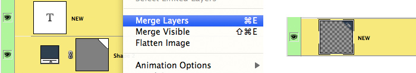
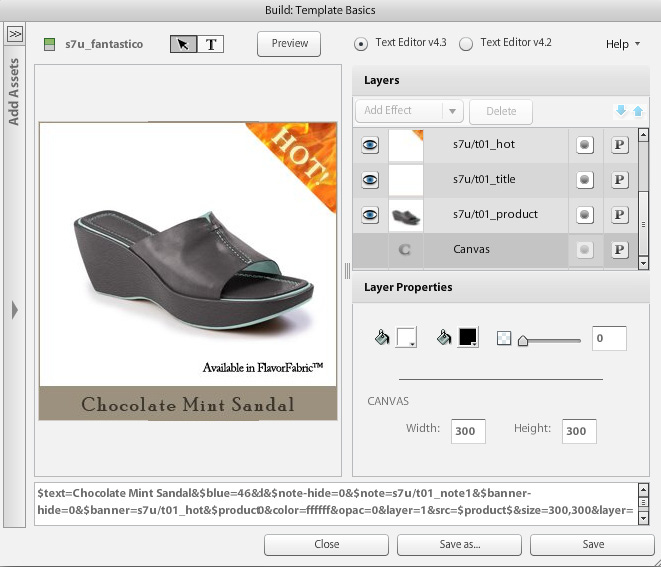

# 基本模板简介 {#basic-templates}

在Dynamic Media Classic术语中，模板是指在模板发布后可通过URL动态更改的文档。 Dynamic Media Classic提供了基本模板，这些模板是从图像服务器中调用的基于图像的模板，由图像和渲染的文本组成。

模板最强大的一个方面是它们具有直接的集成点，可让您将它们绑定到数据库。 因此，您不仅可以提供一个图像并调整其大小，还可以查询数据库以查找新项目或销售项目，并将其显示为图像上的叠加图。 您可以要求提供项目的说明，并将其显示为所选字体和布局的标签。 可能性是无限的。

基本模板可以通过多种不同的方式实施，从简单到复杂。 例如：

- 基本促销。 如果产品有免费送货，则使用“免费送货”等标签。 这些标签由Photoshop的商品团队设置，并且Web使用逻辑来知道何时将它们应用于图像。
- 高级促销。 每个模板都有多个变量，并且可能同时显示多个选项。 使用数据库、库存和业务规则确定何时将产品显示为“刚进”、“清仓”或“售罄”。 此外，还可以使用产品后面的透明度，在不同的背景（如在不同的房间）上显示产品。 可以在产品详细信息页面上重新调整相同的模板和/或资产的用途，以在不同背景上显示同一产品的较大或可缩放版本。

请务必了解，Dynamic Media Classic仅提供这些基于模板的应用程序的可视部分。 Dynamic Media Classic公司或其集成合作伙伴必须提供业务规则、数据库和开发技能以创建应用程序。 没有“内置”模板应用；设计人员在Dynamic Media Classic中设置模板，开发人员使用URL调用来更改模板中的变量。

在本教程的本节结束时，您将了解如何：

- 将Photoshop PSD上传到Dynamic Media Classic以将其用作模板的基础。
- 创建由图像层组成的简单促销基本模板。
- 添加文本层，并通过使用参数使其变量。
- 构建模板URL并通过Web浏览器动态地处理图像。

>[!NOTE]
>
>本章中的所有URL仅供说明性用途；它们不是实时链接。

## 基本模板概述

基本模板（或简称“模板”）的定义是URL可寻址的分层图像。 最终结果是一幅图像，但URL可以更改该图像。 它可以由照片、文本或图形组成 — Dynamic Media Classic中P-TIFF资产的任意组合。

模板与Photoshop PSD文件最相似，因为它们具有类似的工作流程和类似的功能。

- 这两个组件都由类似于醋酸层叠片的层组成。 您可以复合部分透明的图像，并通过图层的透明区域看到下面的图层。
- 可以移动和旋转图层以调整内容位置，并且可以改变不透明度和混合模式以使内容部分透明。
- 您可以创建基于文本的图层。 质量可能非常高，因为图像服务器使用的文本引擎与Photoshop和Illustrator相同。
- 可以将简单的图层样式应用于每个图层以创建特殊效果，如投影或发光。

但是，与Photoshop PSD不同，图层可以完全动态，并通过图像服务器上的URL进行控制。

- 您可以向所有模板属性添加变量，以便于动态更改其组成。
- 利用称为参数的变量，可仅显示要更改的模板部分。

您只需为每个要更改的层添加一个占位符，而不是像在Photoshop中那样将所有层放入单个文件中，并显示和隐藏它们（尽管您也可以这样做，如果愿意）。

使用占位符，您可以动态地将图层的内容与另一个已发布的资产交换，并且它会自动采用它所替换图层的相同属性（如大小和旋转）。

由于基本模板通常在Photoshop中设计，但是会通过URL进行部署，因此模板项目既需要设计，又需要技术技能。 我们通常假定从事创意模板工作的人员是Photoshop设计人员，而实施模板的人员是Web开发人员。 创意和开发团队必须密切合作，使模板取得成功。

模板项目可能相对简单或非常复杂，具体取决于应用程序的业务规则和需求。 从图像服务器中调用基本模板，但由于Dynamic Media Classic环境的灵活性，您甚至可以将模板嵌套在其他模板中，从而创建相当复杂的图像，这些图像可由通常命名的变量链接。

- 了解有关[模板基础知识](https://experienceleague.adobe.com/docs/dynamic-media-classic/using/template-basics/quick-start-template-basics.html)的更多信息。
- 了解如何创建[基本模板](https://experienceleague.adobe.com/docs/dynamic-media-classic/using/template-basics/creating-template.html#creating_a_template)。

## 创建基本模板

使用基本模板时，通常需按照下图中的工作流步骤操作。 如果您使用动态文本层，则使用虚线标记的步骤是可选的，并在下面的说明中指示为“文本工作流”。 如果不使用文本，则仅遵循主路径。

_基本模板工作流。_

1. 设计和创建资产。 大多数用户在Adobe Photoshop中都会执行此操作。 以所需的确切大小设计资产 — 如果某个缩略图页面的图像为200像素，则设计为200像素。 如果需要放大它，请将其设计为大约2000像素。 使用Photoshop(和/或另存为位图的Illustrator)创建资产，使用Dynamic Media Classic将各个部件组合在一起，管理图层，并添加变量。
2. 设计图形资产后，将其上传到Dynamic Media Classic。 与从PSD上传单个资产不同，我们建议您上传整个分层PSD文件，并通过上传中的&#x200B;**维护层**&#x200B;选项，让Dynamic Media Classic为每层创建一个文件（有关更多详细信息，请参阅下文）。 _文本工作流：如果创建动态文本，则还应上传字体。动态文本是可变的，并通过URL进行控制。 如果您的文本是静态的，或者只包含一些没有更改的短短语（例如，标记显示“新”或“销售”，而不是“X% Off”，其中X是变量数），我们建议在Photoshop中预渲染文本，并将作为栅格化图层上传为图像。 这样会更容易，您可以完全按照自己的需要设置文本样式。_
3. 在Dynamic Media Classic中使用“生成”菜单的“模板基础知识”编辑器生成模板，并添加图像层。 文本工作流：在同一编辑器中创建文本层。 在Dynamic Media Classic中手动构建模板时，需要执行此步骤。 选择与您的设计匹配的画布大小，将图像拖放到画布上，并设置图层属性（大小、旋转、不透明度等）。 您不会在模板上放置每个可能的层，而是只放置一个图像层占位符。 _文本工作流：使用文本工具创建文本层，与在Photoshop中创建文本层类似。您可以使用Photoshop文字工具中提供的相同选项来选择字体和样式。_ 另一个工作流程是上传PSD，并让Dynamic Media Classic生成“免费”模板，甚至可以重新创建文本层。稍后将更详细地讨论此问题。
4. 创建层后，将参数（变量）添加到要通过URL控制的任何层的任何属性，包括层的源（图像本身）。 _文本工作流：您还可以向文本图层添加参数，以控制文本的内容和图层本身的大小和位置，以及所有格式选项，如字体颜色、字体大小、水平跟踪等。_
5. 创建与模板大小匹配的图像预设。 为此，我们建议始终以1:1大小调用模板，并且还建议为任何大图像图层添加锐化，以便调整大小以适合模板。 如果要构建要缩放的模板，则无需执行此步骤。
6. 发布，从Dynamic Media Classic预览复制URL，然后在浏览器中测试它。

## 准备模板资产并将其上传到Dynamic Media Classic

在将模板资产上传到Dynamic Media Classic之前，您需要完成一些准备步骤。

### 准备要上传的PSD

在将Photoshop文件上传到Dynamic Media Classic之前，请简化Photoshop中的层，以便更轻松地使用和最大限度地兼容图像服务器。 您的PSD文件通常由许多Dynamic Media Classic无法识别的元素组成，您最终可能还会收到许多难以管理的小片段。 请务必保存主控PSD的备份，以备以后需要编辑原始PSD时使用。 您将上传简化的副本，而不是主控。

1. 通过将需要打开/关闭的相关层合并/拼合到单个层中来简化层结构。 例如，标签“NEW”和蓝色横幅将合并到单个图层中，以便您只需单击即可显示或隐藏它们。
   
2. Dynamic Media Classic或图像服务器不支持某些图层类型和图层效果，因此需要在上传之前对其进行栅格化。 否则，可能会忽略效果，或丢弃的层。 栅格化图层意味着从可编辑变为不可编辑。 要栅格化图层效果或文本层，请创建空图层，使用&#x200B;**“图层”>“合并图层”**&#x200B;或CTRL + E/CMD + E选择并合并这两个图层。

   - Dynamic Media Classic不能对层进行分组或链接。 组或链接集中的所有层都将转换为不再分组/链接的单独层。
   - 图层蒙版将在上传时转换为透明。
   - 不支持调整层，将会丢弃调整层。
   - 将栅格化填充层，如“纯色”层。
   - 在上传时，智能对象层和矢量层将栅格化为正常图像，并应用和栅格化智能滤镜。
   - 除非使用“提取文本”选项，否则还会栅格化文本层 — 有关详细信息，请参阅下文。
   - 大多数图层效果都将被忽略，并且仅支持少数混合模式。 如果有疑问，请在Dynamic Media Classic中添加简单效果（如内部或投影、内部或外部光线），或在Photoshop中使用空白图层来合并和栅格化效果。

### 使用字体

如果需要生成动态文本，您还将上传和发布字体。 Dynamic Media Classic中唯一包含的字体是Arial字体。

每个公司都有责任获取在Web上使用字体的许可证 — 只要在您的计算机上安装字体，您就无权在Web上以商业方式使用字体，如果未经许可，您的公司可能会面临字体发布者的法律诉讼。 此外，许可条款也有所不同 — 例如，您可能需要单独的许可证才能进行打印和屏幕显示。

Dynamic Media Classic支持标准OpenType(OTF)、TrueType(TTF)和Type 1 Postscript字体。 仅Mac的手提箱字体、类型收集文件、Windows系统字体和专有的机器字体（如雕刻机或刺绣机使用的字体）都不受支持 — 您必须将它们转换为一种标准字体格式，或者替换在Dynamic Media Classic和Image Server中使用的类似字体。

与任何其他资产一样，在将字体上传到Dynamic Media Classic后，还必须将其发布到图像服务器。 一个非常常见的模板错误是忘记发布字体，这将导致图像错误 — 图像服务器不会替换其他字体。 此外，如果要在上传时使用&#x200B;**提取文本**&#x200B;选项，则必须先上传字体文件，然后再上传使用这些字体的PSD。 **提取文本**&#x200B;功能将尝试重新创建作为可编辑文本层的文本，并将其置于Dynamic Media Classic模板中。 下一个主题（PSD选项）将讨论此问题。

请注意，字体具有多个内部名称，这些内部名称通常与其外部文件名不同。 在Dynamic Media Classic中，您可以在该资产的“详细信息”页面上看到其所有不同的名称。 以下是字体Adobe Caslon Pro Semibold的名称，列在Dynamic Media Classic的元数据选项卡下：

_Dynamic Media Classic中字体的“详细信息”页面上的“元数据”选项卡。_

Dynamic Media Classic使用此字体的文件名(AslonPro-Semibold)作为其资产ID，但该名称不是模板使用的名称。 模板使用底部列出的富文本格式(RTF)名称。 RTF是图像服务器文本引擎的本机“语言”。

如果您需要通过URL更改字体，则必须使用字体的RTF名称（而非资产ID），否则您会收到错误。 在这种情况下，此字体的正确名称将为“Adobe Caslon Pro”。 下面的“RTF和文本参数”主题中将讨论有关字体和RTF的更多信息。

在Windows和Mac系统上，最常见的字体文件格式是OpenType和TrueType。 OpenType的扩展名为.OTF，而TrueType为.TTF。 这两种格式在Dynamic Media Classic中同样适用。

### 在上传PSD时选择选项

您无需上传Photoshop文件(PSD)即可创建模板；模板可以使用Dynamic Media Classic中的任何图像资产构建。 但是，上传PSD可以更轻松地进行创作，因为您通常将这些资产已放在一个分层PSD中。 此外，在上传分层PSD时，Dynamic Media Classic将自动生成模板。

- **维护图层。** 这是最重要的选项。这可告知Dynamic Media Classic为每个Photoshop层创建一个图像资产。 如果未选中，则所有其他选项都将被禁用，PSD将被扁平化为单个图像。
- **** **CreateTemplate。** 此选项采用各种生成的层，并通过将它们组合在一起自动创建模板。使用自动生成模板的一个缺点是，Dynamic Media Classic将所有图层放置在一个文件中，而每个图层只需要一个占位符。 删除额外的层非常简单，但如果您有多个层，则重新创建这些层的速度会更快。 确保重命名新模板；如果没有，则下次重新上传同一PSD时，该PSD将被覆盖。
- **提取文本。** 这会使用您上传的字体，将PSD中的文本层重新创建为模板中的文本层。如果您的文本在Photoshop中处于路径中，并且您想要在模板中维护该路径，则需要执行此步骤。 此功能要求您使用&#x200B;**创建模板**&#x200B;选项，因为提取的文本只能由上传时生成的模板创建。
- **将图层扩展到背景大小。** 此设置可使每个图层的大小与整个PSD画布的大小相同。对于始终保持固定位置的图层，此选项非常有用：否则，在将图像交换到同一图层时，可能必须重新定位它们。
- **层命名。** 这可告知Dynamic Media Classic如何命名每个层生成的每个资产。我们建议使用&#x200B;**Photoshop** **和Layer** **名称**&#x200B;或Photoshop和&#x200B;**Layer** **Number**。 这两个选项都使用PSD名称作为名称的第一部分，并在末尾添加层名称或编号。 例如，如果您有一个名为“shirt.psd”的PSD，并且它有名为“front”、“sieves”和“collar”的图层，那么如果您使用&#x200B;**Photoshop和** Layer **Name**&#x200B;选项上传，Dynamic Media Classic将生成资产ID“shirt_front”、“shirt_seves”和“shirt_call”。 使用其中一个选项有助于确保该名称在Dynamic Media Classic中是唯一的。

## 创建具有图像层的模板

即使Dynamic Media Classic可以从分层PSD自动创建模板，您也应该知道如何手动构建模板。 如上所述，在某些情况下，您不想使用由Dynamic Media Classic创建的模板。

### 模板基础知识UI

让我们首先熟悉一下编辑界面。

在左中心，您的工作区会显示最终模板的预览。 右侧是“图层”和“图层属性”面板。 这些领域是您最擅长的工作。

_生成模板基础知识页面。_

- **预览/工作区。** 这是主窗口。在此，您可以使用鼠标移动、调整图层大小和旋转图层。 层轮廓显示为虚线。
- **层。** 这类似于Photoshop图层面板。在模板中添加图层时，这些图层将显示在此处。 图层从上到下堆叠 — “图层”面板中的顶层将显示在列表中图层下方其他图层的上方。
- **层属性。** 在此，您可以使用数字控件调整图层的所有属性。首先选择一个图层，然后调整其属性。
- **** **CompositeURL。** UI底部是复合URL区域。本教程的此部分将不会讨论此问题，但是在此，您将看到模板被解构为一系列图像服务URL修饰符。 此区域是可编辑的 — 如果您非常熟悉图像服务器命令，则可以在此处手动编辑模板。 但是，你也可以打破它。 与Photoshop一样，图层编号从0开始。 画布是第0层，您自己添加的第一层是第1层。 混合模式确定图层的像素如何与其下的像素混合。 您可以使用混合模式创建各种特殊效果。

#### 使用模板基础知识编辑器

以下是启动基本模板的工作流步骤：

1. 在Dynamic Media Classic中，转到&#x200B;**生成>模板基础知识**。 您可以选择未选择任何内容，或从选择图像开始，该图像将成为模板的第一层。
2. 选择“Size（大小）” ，然后按&#x200B;**OK**。 此大小应与您在Photoshop中设计的大小匹配。 将加载模板编辑器。
3. 如果未在第1步中选择图像，请搜索或浏览左侧资产面板中的图像，然后将其拖动到工作区域。

   - 图像将自动调整大小以适合画布的大小。 如果您计划替换高分辨率图像，则通常会引入一个大（2000像素）P-TIFF图像并将其用作占位符。
   - 这应该是模板的最底层层，但是您以后可以重新排序这些层。

4. 直接在工作区中调整图层大小或调整其位置，或通过调整“图层属性”面板中的设置。
5. 根据需要拖入其他图像层。 如果需要，还可添加图层效果。 请参阅下面的主题&#x200B;_添加层效果_。
6. 单击&#x200B;**Save**，选择位置，并为模板指定名称。 您可以预览，但是此时，您的模板将看起来完全像一个扁平化的Photoshop图像 — 它尚不可更改。

### 添加图层效果

图像服务器支持一些程序化图层效果 — 可更改图层内容外观的特殊效果。 它们的工作方式与Photoshop的图层效果类似。 它们连接到层，但与层无关地控制。 可以调整或删除这些参数，而无需对层本身进行永久更改。

- **投影**。在图层边界之外应用阴影，该阴影由x和y像素偏移定位。
- **内阴影**。在图层边界内应用阴影，该阴影由x和y像素偏移定位。
- **外发光**。均匀地在图层的所有边缘上应用发光效果。
- **内发光**。均匀地在图层的所有边缘内应用发光效果。

_具有和没有投影的图层_

要添加效果，请单击&#x200B;**Add Effect**，然后从菜单中选择效果。 与普通图层一样，您可以在“图层”面板中选择效果，然后使用“图层属性”面板调整其设置。

阴影效果在水平或垂直远离图层时偏移，而辉光效果在所有方向上均匀应用。 内效应作用在图层不透明部分的顶部，而外效应仅影响透明区域。

了解有关[添加层效果](https://experienceleague.adobe.com/docs/dynamic-media-classic/using/template-basics/creating-template.html#using-shadow-and-glow-effects-on-layers)的更多信息。

### 添加参数

如果您只是合并图层并保存它们，则最终结果与平展的Photoshop图像没有区别。 模板的特殊之处在于能够向每个层的属性添加参数，以便它们可以通过URL进行动态更改。

在Dynamic Media Classic术语中，参数是一个变量，可以链接到模板属性，以便通过URL对其进行操作。 当您向层添加参数时，Dynamic Media Classic会在URL中通过在参数名称前添加美元符号($)来公开该属性 — 例如，如果您创建一个名为“size”的参数来更改层的大小，Dynamic Media Classic会重命名您的参数$size。

如果不为属性添加参数，则该属性会保持隐藏在Dynamic Media Classic数据库中，且不会显示在URL中。

如果没有参数，URL的时间通常会长得多，尤其是如果您还使用动态文本的情况。 文本会在每个URL中添加大量额外字符。

最后，初始参数集将成为模板中属性的默认值。 如果您构建模板、添加参数，然后调用URL（不包含其参数），图像服务器将使用您在模板中保存的所有默认值来创建图像。 仅当要更改属性时才需要参数。 如果资产不需要更改，则无需设置参数。

#### 创建参数

以下是创建参数的工作流：

1. 单击要为其创建参数的层名称旁边的&#x200B;**参数**&#x200B;按钮。 此时将打开“参数”屏幕。 它列出了层上的每个属性及其值。
1. 选择要作为参数的每个属性的名称旁边的&#x200B;**On**&#x200B;选项。 将显示默认参数名称。 您只能将参数添加到已从其默认状态更改的属性。

   - 例如，如果添加一个层并将其保留在其默认xy位置0,0，则Dynamic Media Classic不会公开&#x200B;**Position**&#x200B;属性。 要固定，请至少移动一个像素。 现在，Dynamic Media Classic将公开&#x200B;**Position**&#x200B;作为您可以参数化的属性。
   - 要向show/hide属性添加参数（用于打开和关闭层），请单击&#x200B;**Show**&#x200B;或&#x200B;**Hide Layer**&#x200B;图标以关闭层（如果需要，可以随后将其重新打开）。 Dynamic Media Classic现在将公开可进行参数化的&#x200B;**Hide**&#x200B;属性。

1. 将默认参数名称重命名为更便于在URL中识别的名称。 例如，如果要添加参数以更改图像顶部的横幅层，请将“layer_2_src”的默认名称更改为“banner”。
1. 按&#x200B;**Close**&#x200B;退出“Parameters（参数）”屏幕。
1. 通过单击&#x200B;**Parameters**&#x200B;按钮并添加和重命名参数，对其他层重复此过程。
1. 完成后保存更改。

>[!TIP]
>
>将参数重命名为有意义的内容，并制定命名约定以标准化这些名称。 请确保设计和开发团队事先同意命名约定。
>
>无法添加参数，因为您看不到资产？ 只需将图层的属性从其默认值（通过移动、调整大小、隐藏等）更改为其属性即可。 此时您应会看到该资产已公开。

了解有关[模板参数](https://experienceleague.adobe.com/docs/dynamic-media-classic/using/template-basics/creating-template-parameters.html)的更多信息。

## 创建带有文本层的模板

现在，您将学习如何创建包含文本层的基本模板。

### 了解动态文本

您现在知道如何使用图像层构建基本模板。 对于许多应用程序，您只需要这样一个。 如您在上一个练习中所看到的，具有简单文本（如“Sale”和“New”）的图层可以栅格化并视为图像，因为其文本无需更改。

但是，如果您需要：

- 添加一个标签以表示“25%关闭”，其值25%为变量
- 在图像顶部添加名为产品的文本标签
- 根据模板所在的国家/地区，将您的图层本地化为不同的语言

在这种情况下，您需要添加一些包含参数的动态文本层以控制文本和/或格式。

要创建文本，您需要上传一些字体 — 否则，Dynamic Media Classic将默认为Arial。 字体还必须发布到图像服务器，否则在尝试渲染使用该字体的任何文本时，该字体会生成错误。

### RTF和文本参数

要使用模板基础工具将变量添加到文本，您应该了解文本的呈现方式。 图像服务器使用Adobe文本引擎(与Photoshop和Illustrator使用的引擎相同)生成文本，并将其作为最终图像中的图层进行复合。 为了与引擎通信，图像服务器使用富文本格式或RTF格式。

RTF是Microsoft为指定文档格式而开发的文件格式规范。 它是大多数文字处理和电子邮件软件使用的标准标记语言。 如果您在URL中写入了&amp;text=\b1 Hello，则图像服务器将生成一个粗体文字为“Hello”的图像，因为\b1是用于使文本变为粗体的RTF命令。

好消息是，Dynamic Media Classic会为您生成RTF。 无论您何时在模板中键入文本并添加格式，Dynamic Media Classic都会静悄悄地将RTF代码自动写入模板。 我们之所以提到，是因为您将直接向RTF本身添加参数，因此您应该熟悉一点。

#### 创建文本层

您可以通过以下两种方式在Dynamic Media Classic的模板中创建文本层：

1. Dynamic Media Classic中的文本工具。 下面将讨论此方法。 模板基础知识编辑器提供了一个工具，可用于创建文本框、输入文本和设置文本格式。 Dynamic Media Classic会根据需要生成RTF，并将其放入单独的层。
2. 提取文本（上传时）。 另一种方法是在Photoshop中创建文本层，并将其另存为PSD中的普通文本层（而不是将其栅格化为图像层）。 然后，将文件上传到Dynamic Media Classic，并使用&#x200B;**提取文本**&#x200B;选项。 Dynamic Media Classic将使用RTF命令将每个Photoshop文本层转换为图像服务文本层。 如果您使用此方法，请确保首先将字体上传到Dynamic Media Classic，否则Dynamic Media Classic将在上传时替换默认字体，并且无法轻松地重新替换正确的字体。

### 文本编辑器

使用文本编辑器输入文本。 文本编辑器是WYSIWYG界面，允许您使用与Photoshop或Illustrator中类似的格式控件输入文本并设置其格式。

_模板基础知识文本编辑器。_

您将在&#x200B;**Preview**&#x200B;选项卡中完成大部分工作，该选项卡允许您输入文本并查看文本在模板中的显示效果。 还有一个&#x200B;**Source**&#x200B;选项卡，用于根据需要手动编辑RTF。

一般工作流程是使用&#x200B;**Preview**&#x200B;选项卡键入一些文本。

然后选择文本，并使用顶部的控件选择一些格式，如字体颜色、字体大小或对齐。 在文本按所需方式设置样式后，单击&#x200B;**Apply**&#x200B;以在工作区预览中查看文本更新。 然后，关闭文本编辑器以返回到“模板基础知识”主窗口。

#### 使用文本编辑器

以下是在“模板基础知识”构建页面中添加文本的工作流步骤：

1. 单击生成页面顶部的&#x200B;**文本**&#x200B;工具按钮。
2. 拖出要显示文本的文本框。 文本编辑器窗口将在模式窗口中打开。 在后台，您将看到模板，但在编辑完文本之前，模板将不可编辑。
3. 键入首次加载模板时要显示的示例文本。 例如，如果您为个性化的电子邮件图像创建了文本框，则您的文本可能会显示“您好”。 现在是拯救的时候了！” 稍后，您将添加一个文本参数，以将Name替换为您在URL上发送的值。 在单击&#x200B;**Apply**&#x200B;之前，您的文本不会显示在窗口下方的模板中。
4. 要设置文本的格式，请使用鼠标拖动文本以将其选中，然后在UI中选择格式控件。

   - 格式选项有很多。 一些最常见的字体是字体（面）、字体大小和字体颜色，以及左/中/右对齐。
   - 不要忘记先选择文本。 否则，您将无法应用任何格式。
   - 要选择其他字体，请确保选择文本并打开“字体”菜单。 编辑器将显示上传到Dynamic Media Classic的所有字体的列表。 如果计算机上还安装了字体，字体将显示为黑色。 如果未在您的计算机上安装，则将以红色显示。 但是，在单击&#x200B;**Apply**&#x200B;时，预览窗口仍会呈现。 您只需将字体上传到Dynamic Media Classic，即可让任何使用Dynamic Media Classic的人都可以使用这些字体。 发布后，图像服务器将使用这些字体来生成文本 — 由于文本是图像的一部分，因此用户无需安装任何字体即可查看您创建的文本。
   - 与Photoshop和Illustrator不同，图像服务器可以在文本框中垂直对齐文本。 默认为顶部对齐方式。 要更改此设置，请选择您的文本，然后从&#x200B;**垂直对齐**&#x200B;菜单中选择&#x200B;**中间**&#x200B;或&#x200B;**底部**。
   - 如果文本太大，而不适合该框（或您的文本框太小），则全部或部分文本将被剪切并消失。 减小字体大小或使框变大。

5. 单击&#x200B;**Apply**&#x200B;以查看更改在工作区窗口中生效。 您必须单击&#x200B;**Apply**，否则将丢失所做的编辑。
6. 完成后，单击&#x200B;**关闭**。 如果要返回到编辑模式，请双击文本层以重新打开文本编辑器。

如果您的系统上本地安装了字体，则文本编辑器将准确预览字体的大小。

### 关于向文本层添加参数

现在，我们按照类似的过程来添加文本参数，就像我们对层参数所做的一样。 文本层还可以采用图层参数来进行大小、位置等方面的分析；但是，它们可以采用其他参数，以便您控制RTF的任何方面。

与层参数不同，您只选择要更改的值并向其添加参数，而不是向整个属性添加参数。

RTF示例：

检查RTF时，需要确定要更改的每个设置的位置。 在上面的RTF中，有些内容可能有意义，您可以看到格式的来源。

你可以看到“巧克力薄荷沙”这个短语就是文字本身。

- 引用字体Poor Richard — 这是选择字体的位置。
- 您可以看到RGB值：\red56\green53\blue4  — 这是文本颜色。
- 虽然字体大小为20，但您看不到数字20。 但是，您确实看到命令\fs40 — 出于一些奇怪的原因，RTF将字体测量为半点。 因此，\fs40是字体大小！

您有足够的信息来创建参数，但是图像提供文档中提供了所有RTF命令的完整参考。 请访问[图像服务文档](https://experienceleague.adobe.com/docs/dynamic-media-developer-resources/image-serving-api/image-serving-api/http-protocol-reference/text-formatting/c-text-formatting.html#concept-0d3136db7f6f49668274541cd4b6364c)。

#### 向文本层添加参数

以下是向文本层添加参数的步骤。

1. 单击要为其创建参数的文本层名称旁边的&#x200B;**参数**&#x200B;按钮(“P”)。 此时将打开“参数”屏幕。 **Common**&#x200B;选项卡列出了层上的每个属性及其值。 在此，可以添加常规层参数。
1. 单击&#x200B;**Text**&#x200B;选项卡。 您可以在顶部看到RTF;您添加的参数将位于该下方。
1. 要添加参数，请首先突出显示要更改的值，然后单击&#x200B;**Add Parameter**&#x200B;按钮。 确保只选择命令的值，而不是整个命令本身。 例如，要为上述RTF示例中的字体名称设置参数，我只会高亮显示“Poor Richard”，并在其中添加参数，但不会同时添加“\f0”。 单击&#x200B;**添加参数**&#x200B;后，该参数将显示在下面的列表中，在仍选中该参数时，该参数值将以红色显示在RTF中。 如果需要删除参数，请单击&#x200B;**On**&#x200B;旁边的复选框以关闭该参数，该参数将消失。
1. 单击可将参数重命名为更有意义的名称。
1. 完成后，您的RTF将以绿色突出显示，其中存在参数，并且参数名称和值将列在下面。
1. 单击&#x200B;**Close**&#x200B;退出“Parameters”屏幕。 然后，按&#x200B;**Save** ，以保存模板。 如果编辑完成，请按&#x200B;**Close**&#x200B;退出“模板基础知识”页面。
1. 单击&#x200B;**预览**&#x200B;以在Dynamic Media Classic中测试模板。 要测试文本参数，请在预览窗口中键入新文本或新值。 要更改字体，必须键入字体的确切RTF名称。

>[!TIP]
>
>要将参数添加到文本颜色，请分别添加红、绿和蓝的参数。 例如，如果RTF为`\red56\green53\blue46`，则需为值56、53和46分别添加红、绿和蓝参数。 在URL中，您可以通过调用所有这三个变量来更改颜色：`&$red=56&$green=53&$blue=46`。

了解如何[创建动态文本参数](https://experienceleague.adobe.com/docs/dynamic-media-classic/using/template-basics/creating-template-parameters.html#creating-dynamic-text-parameters)。

## 发布和创建模板URL

### 创建图像预设

不需要为模板创建预设。 我们建议将此作为最佳实践，以便始终以1:1的大小调用模板，并且还可向任何大图像图层添加锐化，以便调整大小以适合模板。 如果您调用的图像没有预设，图像服务器可能会将您的图像任意调整大小至默认大小（约400像素），且不会应用默认锐化。

模板的图像预设没有任何特殊之处。 如果您已经拥有相同大小的静态图像的预设，则可以改用该预设。

### 发布

您需要运行发布，才能查看实时将所做的更改推送到图像服务器。 请记住要发布的内容：各种图像资产层、动态文本的字体以及模板本身。 与图像集和旋转集等其他Dynamic Media Classic富媒体资产类似，基本模板是一种人工构造，它是数据库中的一个行项目，使用一系列“图像提供”命令来引用图像和字体。 因此，发布模板时，您所做的只是更新图像服务器上的数据。

了解有关[发布模板](https://experienceleague.adobe.com/docs/dynamic-media-classic/using/template-basics/publishing-templates.html)的更多信息。

### 模板URL构建

基本模板与常规图像调用具有相同的基本URL语法，如前面所述。 模板通常具有更多修饰符(用与号(&amp;)分隔的命令)，例如带值的参数。 但是，主要区别在于您调用模板作为主图像，而不是调用静态图像。

与图像预设不同，图像预设的预设名称两侧各有一个美元符号($)，参数的开头有一个美元符号。 这些美元信号的位置很重要。

**正确：**

`$text=46-inch LCD HDTV`

**错误：**

`$text$=46-inch LCD HDTV`

`$text=46-inch LCD HDTV$`

`text=46-inch LCD HDTV`

如前所述，参数用于更改模板。 如果您在调用模板时没有使用参数，则该模板将还原到在模板基础知识创作工具中设计的默认设置。 如果资产不需要更改，则无需设置参数。

_image模板示例，不设置参数（上面）和参数（下面）。_
