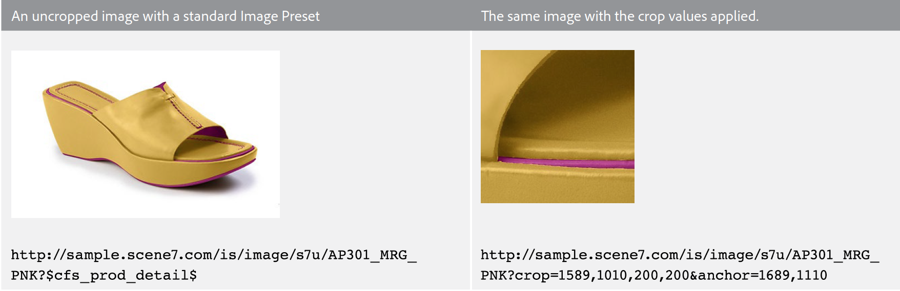

# 裁切、调整的图像和缩放目标 {#crop-adjusted-zoom-targets}

Dynamic Media Classic主图像概念的主要优势之一是，您可以将图像资源重新用于多种用途。 传统上，您必须为每个图像创建单独的裁剪版本才能显示详细信息或创建色板。 使用Dynamic Media Classic时，您可以在单个母版上执行相同的任务，并将这些裁剪的版本另存为新物理文件或作为无存储空间的虚拟派生项。

在本教程的此部分结束时，您将知道如何：

- 在Dynamic Media Classic中裁切图像，并另存为新的主文件或虚拟图像。 [了解详情](https://experienceleague.adobe.com/docs/dynamic-media-classic/using/master-files/cropping-image.html)。
- 保存虚拟已调整图像并使用它们代替主资产。 [了解详情](https://experienceleague.adobe.com/docs/dynamic-media-classic/using/master-files/adjusting-image.html)。
- 在图像上创建缩放目标以显示其高亮显示。 [了解详情](https://experienceleague.adobe.com/docs/dynamic-media-classic/using/zoom/creating-zoom-targets-guided-zoom.html)。

## 裁切

Dynamic Media Classic提供了一些可在UI中方便地使用的图像编辑工具，包括裁切工具。 您可能希望在Dynamic Media Classic中裁切主图像，原因有很多。 例如：

- 您无权访问原始文件。 您希望以不同的裁切或纵横比显示图像，但计算机上没有原始文件，或者您正在家里工作。 在这种情况下，您可以进入Dynamic Media Classic，查找图像，裁切图像并保存它，或将其另存为新版本。
- 删除多余的空格。 拍摄图像时使用了过多的空格，这使得产品看起来很小。 您希望缩略图图像尽可能多地填充画布。
- 要创建已调整映像，请创建不需要磁盘空间的映像的虚拟副本。 有些公司的业务规则要求它们保留同一映像的不同副本，但使用不同的名称。 或者，您可能想要同一图像的裁切和未裁切版本。
- 从源图像生成新图像。 例如，您可能希望创建色板或主图像的细节。 您可以在Adobe Photoshop中执行此操作并单独上传，或者使用Dynamic Media Classic中的裁切工具。

>[!NOTE]
>
>以下有关裁切的讨论中的所有URL都仅用于说明目的；它们不是实时链接。

### 使用裁切工具

Dynamic Media Classic您可以从资源的详细信息页面或单击 **编辑** 按钮。 您可以通过两种方式使用此工具进行裁剪：

- 默认裁剪模式，在此模式下可拖动裁剪窗口的手柄，或在“大小”框中键入值。 了解如何 [手动裁切](https://experienceleague.adobe.com/docs/dynamic-media-classic/using/master-files/cropping-image.html#select-an-area-to-crop).
- 修剪。 使用此选项可通过计算与图像不匹配的像素数来去除图像周围多余的空格。 了解如何 [通过修剪裁切](https://experienceleague.adobe.com/docs/dynamic-media-classic/using/master-files/cropping-image.html#crop-to-remove-white-space-around-an-image).

### _手动裁切_

在保存手动裁切的版本时，似乎图像已被永久裁切；Dynamic Media Classic实际上通过添加内部URL修饰符来裁切图像，以隐藏像素。 发布时，每个人都会看到图像已裁切，不过您可以稍后返回到裁切编辑器并删除裁切。

然后，您可以选择保存为新的主图像还是主图像的“附加视图”。 新主文件是占用存储空间的新物理文件(如TIFF或JPEG)。 另一个视图是不占用服务器空间的虚拟映像。 我们不建议您选择“替换原始”，因为这样会覆盖您的母版并使裁切成为永久裁切。 如果另存为新的主页或附加视图，则必须选择新的资产ID。 与其他资源ID一样，此资源ID必须是Dynamic Media Classic中的唯一名称。

### _裁切裁剪_

如果上传的图像主主题周围有太多的空白（画布），则在调整大小后，图像在Web上的尺寸会小得多。 对于150像素或更小的缩略图图像尤其如此 — 照片的主题可能会在其周围的所有额外空间中丢失。

比较同一图像的这两个版本。

通过去除产品周围的额外空间，右侧的图像更加突出。 可以使用裁切工具一次裁切一个图像，也可以在上传时作为批处理运行。 如果您希望将所有图像一致裁剪到主主题的边界，我们建议您作为批处理运行。 裁剪裁剪到边界框 — 图像周围的矩形。

>[!NOTE]
>
>修剪不会在图像周围创建透明度。 为此，您需要在图像上嵌入剪切路径并使用 **从剪切路径创建蒙版** 上传选项。
>
>此外，用于在使用图像时裁切图像后，将图像恢复到其原始状态 **保存** 选项，在裁切编辑器屏幕中显示图像并选择 **重置** 按钮。

### _上载时裁剪_

如前所述，您还可以选择在上传图像时裁切图像。 要在上载时使用修剪裁剪，请单击 **作业选项** 按钮，然后在“裁切选项”下，选择 **Trim**.

Dynamic Media Classic将在下次上传时记住此选项。 虽然您可能希望它为此上载裁切图像，但您可能不希望每次上载时都裁切图像。 另一个选项是设置一个特殊的计划FTP上传作业，并将裁切选项置于该位置。 这样一来，您只能在需要裁切图像时运行作业。

>[!IMPORTANT]
>
>如果您为上载设置裁切，则Dynamic Media Classic将放置一个Cookie以下次记住该设置。 作为最佳实践，请单击 **重置为公司默认值** 按钮来清除上次上载后遗留的任何裁切选项；否则，可能会意外裁切下一批图像。

### 按URL裁切

虽然在Dynamic Media Classic中并不明显，但您也可以完全通过URL裁切（甚至可以向图像预设添加裁切）。

无论何时使用裁切工具，您都将在底部的字段中看到URL值。 您可以获取这些值，并将它们作为URL修饰符直接应用于图像。

_裁切编辑器底部的裁切命令修饰符_

由于通过修剪使用裁剪时，必须基于每个图像计算大小，因此无法通过URL自动计算大小。 修剪裁剪只能在上传时运行，或者每次应用一个图像来运行。

### _在图像预设中裁剪_

图像预设有一个字段，您可以在其中添加额外的图像服务命令。 要将与上述相同的裁切添加到图像预设，请编辑预设并粘贴或在URL修饰符字段中键入值，然后保存并发布。

_将裁切命令（或任何命令）添加到图像预设的URL修饰符。_

现在，裁切将成为该图像预设的一部分，并在每次使用时自动应用。 当然，这种方法依赖于所有需要相同裁切量的图像。 如果您的图像并非全部以相同方式拍摄，则此方法不适合您。

## 已调整图像

使用裁切工具时，您可以选择执行以下操作 **另存为主视图的附加视图**. 保存后，这将创建一种新的Dynamic Media Classic资源，即调整后的图像。 调整后的图像（也称为派生）是虚拟图像。 它实际上根本不是映像；它是物理主映像的数据库引用（如别名或快捷方式）。

### 请站起来，真实的画面吗？`?`

你能分辨哪个是主图像，哪个是调整后的图像？

如果不在Dynamic Media Classic中查看并看到SBR_MAIN2的资源类型“已调整图像”，您应该无法分辨这些信息。

已调整映像不使用磁盘空间，因为它仅作为数据库中的行项存在。 它也会永久绑定到原始资产；如果删除原始资产，则也会删除已调整图像。 它可以包含整个、未裁剪的图像或仅图像的一部分（裁切）。

通常使用裁切工具创建已调整图像；不过，也可以使用其他图像编辑器（调整和锐化工具）创建这些图像。

调整后的图像需要一个唯一的资产ID。 发布后（必须像任何其他资产一样发布），它们将像任何其他图像一样发挥作用，并且其资产ID将对URL进行调用。 在“详细信息”页面中，您可以查看与主图像关联的已调整图像 **构建和派生** 选项卡。

_调整后的主图像视图ASIAN_BR_MAIN_

## 缩放目标

缩放目标也可在 **编辑** 菜单和 **详细信息** 页面的链接。 它们允许您设置“热点”以突出显示缩放图像的特定促销功能。 缩放查看器不会通过裁切较大的母版来创建单独的图像，而是可以提供图像顶部的详细信息，以及您创建的简短标签。

由于“缩放目标”本质上是一种促销功能，需要了解产品的卖点，因此它们通常由公司促销或产品团队中的人员创建。

该过程非常简单 — 单击该特征，为其提供一个描述性名称，然后保存。 如果目标相似，则可以将它们从一个图像复制到另一个图像，但此过程是手动进行的。 在Dynamic Media Classic中，无法自动创建缩放目标，因为每个图像均不相同，且具有不同的功能。

决定是否使用“缩放目标”的另一个因素是您选择的查看器。 并非所有查看器类型都可以显示缩放目标（例如，弹出查看器不支持它们）。

了解如何 [创建缩放目标](https://experienceleague.adobe.com/docs/dynamic-media-classic/using/zoom/creating-zoom-targets-guided-zoom.html#creating-and-editing-zoom-targets).

### 使用缩放目标工具

以下是有关在Dynamic Media Classic中创建目标的工作流。

1. 浏览到您的图像，单击 **编辑** 按钮，然后选择 **缩放目标**.
2. 将加载缩放目标编辑器。 您将在中间看到您的图像，在顶部看到一些按钮，在右侧看到一个空的目标面板。 在左下方，您会看到已选中查看器预设。 默认为“Zoom1-Guided”。
3. 用鼠标移动红色框并单击以创建新目标。

   - 红色方框是目标区域。 当用户单击该目标时，它会放大到框内的区域。
   - 目标大小由查看器预设中的视图大小决定。 这将确定主缩放图像的大小。 请参阅 _设置视图大小_，如下所示。

4. 您会看到刚刚创建的目标变为蓝色，而在右侧，您将看到该目标的缩略图版本以及默认名称“target-0”。
5. 要重命名目标，请单击其缩略图，然后键入新的 **名称**，然后单击 **输入** 或 **选项卡**  — 如果单击，则不会保存您的姓名。
6. 当选择目标时，框周围将有绿色虚线，您可以调整其大小并移动它。 拖动角以调整大小，或拖动目标框以移动它。

   - 这会将图像加载到默认的自定义缩放查看器中。 确保查看器预设支持缩放目标 — 通常，所有带有“ — Guided”一词的标准预设都设计为与缩放目标一起使用。 要使用目标，请将鼠标悬停在目标缩略图（或热点图标）上以查看标签，然后单击它以查看查看器放大该功能。
   - 与在Dynamic Media Classic中执行的所有其他工作一样，您必须发布以在Web上实时显示缩放目标。 如果您已在使用支持目标的查看器，则会立即显示这些目标（在清除缓存后）。 但是，如果您未使用启用了缩放目标的查看器，则它们将保持隐藏状态。

     

7. 此外，如果您需要删除目标，请单击其缩略图以将其选定，然后按 **删除目标** 按键或按键盘上的DELETE键。
8. 继续单击以添加新目标，在添加后重命名和/或调整大小。
9. 完成后，单击 **保存** 按钮，然后 **预览**.

### 在缩放查看器预设中设置视图大小

让我们先来谈谈缩放目标的大小来源。 在缩放查看器的查看器预设中，有一个称为视图大小的设置。 视图大小是缩放图像在查看器中的大小。 它不同于舞台大小，舞台大小是查看器的总大小，包括UI组件和图稿。

创建新目标时，它从视图大小导出其大小和纵横比。 例如，如果视图大小为200 x 200，则您只能制作最大缩放区域为200像素的方形目标。 目标可以大于200像素，但始终为正方形。 但这也意味着缩放查看器内的图像只有200像素 — 缩放目标的大小与查看器的大小直接相关。 因此，在设置目标之前，您首先要确定查看器的设计。

但是，默认情况下，视图大小为空白（设置为0 x 0），因为主视图图像的大小是动态的，并根据舞台的大小自动派生。 问题是，如果未在预设中明确设置视图大小，则“缩放目标”工具将不知道生成目标的大小。

加载“缩放目标”工具时，视图大小显示在预设的名称旁边。 比较内置的Zoom1-Guided预设与自定义ZT_AUTHORING预设之间的视图大小。

您可以看到内置预设的大小为900 x 550，这意味着目标永远不会小于这个相当大的大小。 这可能太大了 — 如果您有2000像素的图像，您只能调用跨度至少900像素的功能。 用户可以手动进一步缩放，但您无法引导他们离得更近。 将视图大小设置为350 x 350可允许目标非常密切地放大或放大大小。 但是，如果您希望在查看器中获得更大的缩放图像，则需要创建新预设，因为您的图像锁定在350像素。

### 创建或编辑支持缩放目标的查看器预设

要设置视图大小，请创建或编辑支持缩放目标的查看器预设。

1. 在查看器预设中，转到 **缩放设置** 选项。
2. 设置宽度和高度。
3. 保存预设，然后关闭。 如果您要在实时网站上使用该预设，则以后还必须发布。
4. 进入“缩放目标”工具，选择在左下角编辑的预设。 您将立即看到新的视图大小反映在您的目标中。
