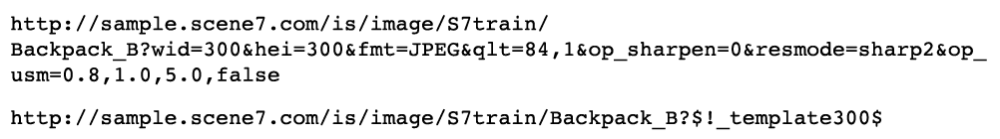

# 图像预设 {#image-presets}

图像预设实质上是一种方法，其中包含创建特定大小、格式、质量和锐化的图像所需的所有设置。 图像预设是动态大小调整的关键组件。

如果您查看的是任何Dynamic Media Classic客户的URL，您可能会看到正在使用的图像预设。 只需在URL的末尾查找$name$即可（名称中包含任何单词或单词）。

图像预设可缩短URL，因此您可以编写一个图像预设，而不是根据每个请求写出多个图像提供说明。 例如，这两个URL会生成具有锐化功能的相同300 x 300JPEG图像，但第二个URL会使用图像预设：

图像预设的真正价值在于，任何公司管理员都可以更新该图像预设的定义，并使用该格式影响每个图像，而无需更改任何Web代码。 清除URL的缓存后，您将看到对图像预设进行任何更改的结果。

>[!IMPORTANT]
>
>在调整图像大小时，长宽比、图像宽度与图像高度的比率应始终保持成比例，以便图像不会扭曲。

图像预设的名称两侧都有一个美元符号($)，并且该符号后面跟有问号(?) 分隔符.

>[!TIP]
>
>在您的网站上为每个唯一图像大小创建一个图像预设。 例如，如果您需要产品详细信息页面显示350 X 350图像，浏览/搜索页面显示120 X 120图像，交叉销售/特色项目显示90 X 90图像，则您需要三个图像预设，无论您有500张图像还是500,000张图像。

- 详细了解 [图像预设](https://experienceleague.adobe.com/docs/dynamic-media-classic/using/image-sizing/setting-image-presets.html).
- 了解如何 [创建图像预设](https://experienceleague.adobe.com/docs/dynamic-media-classic/using/image-sizing/setting-image-presets.html#creating-an-image-preset).

## 图像预设和锐化

图像预设通常会调整图像大小，每当您调整图像的原始大小时，都应该添加锐化。 这是因为调整大小会导致许多像素合并并混合到较小的空间中，从而使图像看起来柔和模糊。 锐化可增加图像中边缘和高对比度区域的对比度。

我们希望您上传到Dynamic Media Classic的高分辨率图像在放大后全尺寸查看时不需要任何锐化。 但是，无论大小小，通常都需要进行一些锐化。

>[!TIP]
>
>在调整图像大小时始终锐化！ 这意味着您需要为每个图像预设（和查看器预设）添加锐化，我们稍后将讨论这些预设)。
>
>如果您的图像看起来不好，可能是因为需要锐化，或者最初的质量很差。

要加多少锐度完全是主观的。 有些人喜欢柔和的图像，而另一些人则非常锐利。 通过对图像运行锐化滤镜的组合，可以轻松增强图像。 但是，也很容易过头和过度锐化图像。

下图显示了三种锐化级别。 从右到左，您不会锐化，只会锐化右数量，而且量过大。

Dynamic Media Classic允许进行三种类型的锐化：简单的锐化、重新取样模式和钝化蒙版。

详细了解 [Dynamic Media Classic锐化选项](https://experienceleague.adobe.com/docs/dynamic-media-classic/using/master-files/sharpening-image.html#sharpening_an_image).

## 其他资源

[图像预设指南](https://www.adobe.com/content/dam/www/us/en/experience-manager/pdfs/dynamic-media-image-preset-guide.pdf). 用于优化图像质量和加载速度的设置。

[图像是第2部分的一切：从来不是模糊 — 质量与速度](https://theblog.adobe.com/image-is-everything-part-2-its-never-just-a-blur-quality-versus-speed/). 讨论使用图像预设传送高质量、快速加载图像的博客文章。
