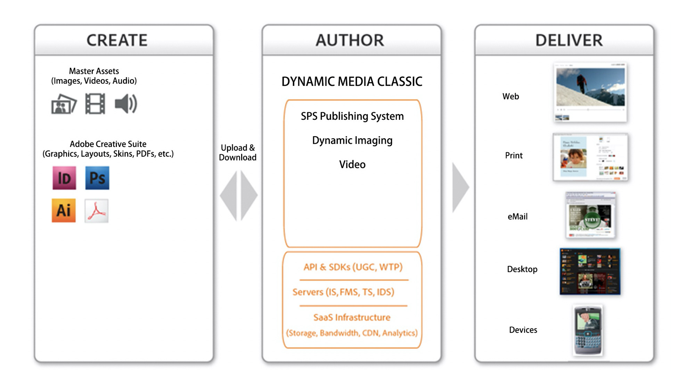
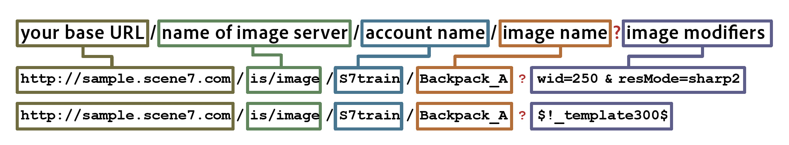

# Dynamic Media Classic主工作流程和预览资源 {#main-workflow}

Dynamic Media支持“创建”（和“上传”）、“创作”（和“发布”）和“交付”工作流过程。 您首先上传资产，然后处理这些资产，例如构建图像集，最后发布以使其上线。 对于某些工作流，“构建”步骤是可选的。 例如，如果您的目标仅是动态调整大小和缩放图像，或者转换和发布视频进行流式传输，则不需要进行必要的构建步骤。

Dynamic Media Classic解决方案中的工作流包括三个主要步骤：

1. 创建（和上传）源内容
2. 创作（和发布）资源
3. 交付资产

## 步骤1：创建（和上传）

这是工作流的开始。 在此步骤中，您将收集或创建适合您正在使用的工作流的源内容，并将其上传到Dynamic Media Classic。 系统支持图像、视频和字体的多种文件类型，也支持PDF、Adobe Illustrator和Adobe InDesign的文件类型。

查看完整列表 [支持的文件类型](https://experienceleague.adobe.com/docs/dynamic-media-classic/using/upload-publish/uploading-files.html#supported-asset-file-formats).

您可以通过多种不同的方式上传源内容：

- 直接从您的桌面或本地网络。 [了解如何](https://experienceleague.adobe.com/docs/dynamic-media-classic/using/upload-publish/uploading-files.html#upload-files-using-sps-desktop-application).
- 从Dynamic Media Classic FTP服务器。 [了解如何](https://experienceleague.adobe.com/docs/dynamic-media-classic/using/upload-publish/uploading-files.html#upload-files-using-via-ftp).

默认模式为“从桌面”，在该模式下可以浏览本地网络上的文件并开始上载。

>[!TIP]
>
>请勿手动添加文件夹。 相反，应从FTP运行上传并使用 **包括子文件夹** 用于在Dynamic Media Classic中重新创建文件夹结构的选项。

默认情况下，启用两个最重要的上传选项： **标记为发布**&#x200B;我们之前讨论过，并且 **覆盖**. 覆盖表示如果上传的文件与系统中已存在的文件同名，则新文件将替换现有版本。 如果取消选中此选项，则可能无法上传文件。

### 上传图像时覆盖选项

覆盖图像选项有四种变体可供您为整个公司设置，并且这些变体经常被误解。 简而言之，您或者设置了规则，希望更频繁地覆盖具有相同名称的资产，或者希望更不频繁地发生覆盖（在这种情况下，新图像将使用“–1”或“–2”扩展名进行重命名）。

- **在当前文件夹内，使用相同的基本图像名称/扩展名进行覆盖**.
此选项是最严格的更换规则。 它要求您将替换图像上传到与原始图像相同的文件夹，并且替换图像具有与原始图像相同的文件扩展名。 如果不满足这些要求，则会创建副本。

- **在当前文件夹内，使用相同的基本资源名称（不论扩展名是什么）进行覆盖**.
要求您将替换图像上传到与原始图像相同的文件夹，但文件扩展名可能与原始图像不同。 例如，chair.tif将取代chair.jpg。

- **在任意文件夹内，使用相同的基本资源名称和扩展名进行覆盖**.
要求替换图像具有与原始图像相同的文件扩展名（例如，chair.jpg必须替换chair.jpg，而不是chair.tif ）。 但是，您可以将替换图像上传到与原始图像不同的文件夹。 更新的图像驻留在新文件夹中；无法再在其原始位置找到该文件。

- **在任意文件夹内，使用相同的基本资源名称（不论扩展名是什么）进行覆盖**.
此选项是最具包容性的替换规则。 您可以将替换图像上载到与原始图像不同的文件夹，上载文件扩展名不同的文件，然后替换原始文件。 如果原始文件位于其他文件夹中，则替换图像将位于上载到的新文件夹中。

了解关于 [覆盖图像选项](https://experienceleague.adobe.com/docs/dynamic-media-classic/using/setup/application-setup.html#using-the-overwrite-images-option).

虽然不是必需的，但在使用上述两种方法之一进行上载时，您可以为该特定上载指定作业选项 — 例如，计划定期上载，在上载时设置裁剪选项以及许多其他选项。 这些工具对于某些工作流可能很有价值，因此，如果可供您使用，则值得考虑。

了解有关 [作业选项](https://experienceleague.adobe.com/docs/dynamic-media-classic/using/upload-publish/uploading-files.html#upload-options).

上传是任何工作流中第一个必要的步骤，因为Dynamic Media Classic无法处理其系统中尚未包含的任何内容。 在上传过程中，系统会通过中央的Dynamic Media Classic数据库注册每个上传的资源，分配一个ID，然后将其复制到存储中。 此外，该系统将图像文件转换为允许动态调整大小和缩放的格式，并将视频文件转换为MP4 Web友好格式。

### 概念：当您将图像上传到Dynamic Media Classic时，将会发生以下情况

将任何类型的图像上传到Dynamic Media Classic时，该图像都会转换为称为金字塔TIFF或PTIFF的主图像格式。 PTIFF与分层TIFF位图图像的格式类似，不同之处在于，文件包含同一图像的多种大小（分辨率），而不是不同的图层。

在转换图像时，Dynamic Media Classic会拍摄图像完整大小的“快照”，将其缩放一半并保存，将其再次缩放一半并保存，等等，直到填充了甚至为原始大小的倍数为止。 例如，2000像素的PTIFF在同一文件中具有1000、500、250和125像素大小（或更小）。 PTIFF文件采用Dynamic Media Classic中称为“主图像”的格式。

当您请求特定大小的图像时，创建PTIFF可让Dynamic Media Classic的图像服务器快速找到下一个较大的图像并将其按比例缩小。 例如，如果您上传2000像素的图像并请求100像素的图像，Dynamic Media Classic会查找125像素的版本并将其缩放到100像素，而不是从2000缩放到100像素。 这使得操作非常快速。 此外，在缩放图像时，这将使缩放查看器仅请求正在缩放的图像的拼贴，而不是整个全分辨率图像。 这就是主图像格式(即PTIFF文件)如何支持动态调整大小和缩放的方式。

同样，您可以将主源视频上传到Dynamic Media Classic，在上传时，Dynamic Media Classic可以自动调整其大小并将其转换为MP4 Web友好格式。

### 确定上传图像的最佳大小的经验规则

**上传所需最大大小的图像。**

- 如果需要缩放，请上传最长维度中范围在1500-2500像素之间的高分辨率图像。 考虑您要提供多少细节、源图像的质量以及所显示产品的尺寸。 例如，上传小圆环的1000像素图像，但上传整个房间场景的3000像素图像。
- 如果您不需要缩放，请按照显示的精确大小上传它。 例如，如果您要在页面上放置徽标或启动画面/横幅图像，请完全按照1:1的大小上传图像，然后完全按照该大小调用它们。

**上传到Dynamic Media Classic之前，请千万不要上传图像或将其放大。** 例如，不要对较小的图像上采样，使其成为2000像素的图像。 看起来不妙。 在上传之前，请使图像尽可能接近完美。

**缩放没有最小大小，但默认情况下，查看器的缩放比例不会超过100%。** 如果图像太小，则根本无法缩放，或者仅会放大很小的一部分以防止图像看起来不好。

**虽然没有图像大小下限，但我们建议不要上传巨型图像。** 一个巨大的图像可以被认为是4000+像素。 上传这种大小的图像可能会显示潜在的缺陷，如图像中的灰尘或头发。 此类图像在Dynamic Media Classic服务器上占用了更多空间，这可能会使您超出合同规定的存储限制。

了解有关 [正在上传文件](https://experienceleague.adobe.com/docs/dynamic-media-classic/using/upload-publish/uploading-files.html#uploading-your-files).

## 第2步：创作（和发布）

创建和上传内容后，您将通过执行一个或多个子工作流，从上传的资产中创作新的富媒体资产。 这包括所有不同类型的集集合 — “图像”、“色板”、“旋转”和“混合媒体”集以及“模板”。 其中还包括视频。 稍后我们将更详细地介绍每种类型的图像收集集和视频富媒体。 但是，在几乎所有情况下，您首先会选择一个或多个资产（或未选择资产），然后选择要构建的资产类型。 例如，您可以选择主图像以及该图像的几个视图，然后选择构建图像集，即同一产品的备用视图的集合。

>[!IMPORTANT]
>
>确保所有资源都标记为发布。 虽然默认情况下，上传时自动将所有资源标记为发布，但您上传内容中的任何新创作资源也需要标记为发布。

构建新资源后，您将运行发布作业。 您可以手动执行这项操作，也可以计划自动运行的发布作业。 发布会将私有的Dynamic Media Classic领域的所有内容复制到公式的发布服务器领域的公共中。 Dynamic Media发布作业的产品是每个已发布资源的唯一URL。

发布到的服务器取决于内容类型和工作流。 例如，所有图像都将转到图像服务器，并将视频流式传输到FMS服务器。 为了方便起见，我们将将“发布”作为单个事件发布到单个服务器。

发布会发布标记为发布的所有内容，而不仅仅是您的内容。 通常，单个管理员代表每个人（而非运行发布的单个用户）发布。 管理员可以根据需要发布作业，或者设置自动发布的每日、每周甚至每10分钟定期发布作业。 按照对您的业务有意义的时间表发布。

>[!TIP]
>
>自动执行发布作业，并安排每天凌晨12:00或傍晚的任何时间运行完全发布。

### 概念：了解Dynamic Media Classic URL

Dynamic Media Classic工作流的最终产品是一个指向资产（无论是图像集还是自适应视频集）的URL。 这些URL非常可预测，并遵循相同的模式。 在图像的情况下，每个图像都是从PTIFF主图像生成的。

以下是包含几个示例的图像URL的语法：

在URL中，问号左侧的所有内容都是特定图像的虚拟路径。 问号右侧的所有内容都是一个Image Server修饰符，这是有关如何处理图像的说明。 如果有多个修饰符，它们之间会以&amp;号分隔。

在第一个示例中，映像“Backpack_A”的虚拟路径为 `http://sample.scene7.com/is/image/s7train/BackpackA`. 图像服务器修饰符将图像大小调整为250像素的宽度（从wid=250），并使用Lanczos插值算法重新取样图像，该算法在调整大小（从resMode=sharp2）时锐化。

第二个示例将称为“图像预设”的内容应用于同一Backpack_A图像，如$所示！_template300$。 表达式两侧的$符号表示正在将图像预设（一组打包的图像修饰符）应用于图像。

了解Dynamic Media Classic URL如何组合在一起后，您就可以了解如何以编程方式更改它们，以及如何将它们更深入地集成到您的网站和后端系统中。

### 概念：了解缓存延迟

新上传和发布的资产会立即显示，而更新的资产可能会受到10小时缓存延迟的约束。 默认情况下，所有已发布的资产在过期前至少有10小时。 我们称之为最小值，因为每次查看图像时，它都会启动一个时钟，该时钟直到10个小时后才过期，在此期间没有人查看过该图像。 对于资产，此10小时期间为“生存时间”。 该资产的缓存过期后，即可交付更新版本。

这通常不是问题，除非发生错误，并且图像/资产的名称与以前发布的版本相同，但图像存在问题。 例如，您意外上传了一个低分辨率版本，或者您的艺术指导未批准该图像。 在这种情况下，您需要召回原始图像，并使用相同的资产ID将其替换为新版本。

了解如何 [手动清除需要更新的URL的缓存](https://experienceleague.adobe.com/docs/experience-manager-cloud-service/assets/dynamicmedia/invalidate-cdn-cache-dynamic-media.html?lang=zh-Hans).

>[!TIP]
>
>要避免出现缓存延迟问题，请始终向前工作 — 晚上、一天、两周等。 及时建立以便QA/接受内部各方在发布给公众之前证明您的工作。 即使是在工作之前的某个晚上，您也能够在当晚做出更改并重新发布。 到早上，10小时已经过去，缓存会更新为正确的图像。

- 了解有关 [创建发布作业](https://experienceleague.adobe.com/docs/dynamic-media-classic/using/upload-publish/publishing-files.html#creating-a-publish-job).
- 了解有关 [发布](https://experienceleague.adobe.com/docs/dynamic-media-classic/using/upload-publish/publishing-files.html).

## 步骤3：投放

请记住，Dynamic Media Classic工作流的最终产品是一个指向资产的URL。 URL可能指向单个图像、图像集、旋转集或某些其他图像集集合或视频。 您需要获取该URL并执行相应操作，例如编辑您的HTML，以便 `` 标记指向Dynamic Media Classic图像，而不是指向来自您当前网站的图像。

在“交付”步骤中，必须将这些URL集成到您的网站、移动设备应用程序、电子邮件促销活动或任何其他要显示资产的数字接触点中。

将图像的Dynamic Media Classic URL集成到网站的示例：

红色的URL是唯一特定于Dynamic Media Classic的元素。

您的IT团队或集成合作伙伴可以牵头编写和更改代码，以便将Dynamic Media Classic URL集成到您的网站中。 Adobe拥有一支咨询团队，可以提供技术、创意或一般指导，从而在这方面有所帮助。

对于更复杂的解决方案（例如缩放查看器或将缩放与替代视图相结合的查看器），通常该URL指向由Dynamic Media Classic托管的查看器，并且该URL中的也是对资源ID的引用。

将在新弹出窗口中打开查看器中的“图像集”的链接（红色）示例：

>[!IMPORTANT]
>
>您需要将Dynamic Media Classic URL集成到您的网站、移动应用程序、电子邮件和其他数字接触点中 — Dynamic Media Classic无法为您完成此操作！

## 预览资源

您可能希望预览已上传或正在创建或编辑的资产，以确保在客户查看资产时，这些资产会按所需的方式显示。 您可以通过单击任意 **预览** 按钮（位于资产的缩略图上） **浏览/构建面板**，或转到 **文件>预览**. 在浏览器窗口中，它将预览面板中当前存在的任何资源，无论该资源是图像、视频还是构建资源，如图像集。

### 动态大小预览（图像预设）

您可以使用以下图标预览多种大小的图像 **大小** 预览。 这会加载可用图像预设的列表。 我们稍后将讨论图像预设，但将它们视为用于以指定大小加载具有特定锐化和图像质量的图像的“脚本”。

### 缩放预览

您也可以使用 **缩放** 用于预览图像的选项，该选项可在许多预构建的缩放预设之一中预览，这些预设基于不同的已包含缩放查看器。

了解有关 [预览资源](https://experienceleague.adobe.com/docs/dynamic-media-classic/using/managing-assets/previewing-asset.html).
