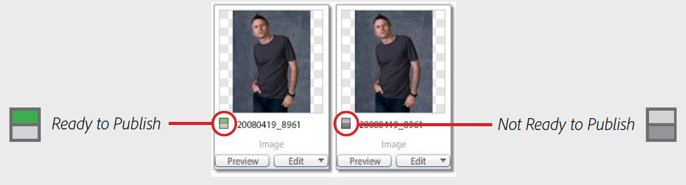

# Dynamic Media Classic最佳实践教程

本指南旨在帮助Dynamic Media Classic的当前和新用户更全面地了解他们可以使用Adobe的强大富媒体解决方案执行哪些操作。 我们将通过以下方式执行此操作：

- 向您介绍Dynamic Media Classic，介绍其内容，并概述其核心功能和用户界面(UI)。
- 解释在解决方案中处理资产时将遵循的常规创建、创作和交付工作流。
- 讨论在跳入和使用解决方案之前要设置的重要项目。
- 深入了解如何使用解决方案的几项核心功能。

在整个指南中，我们将提供示例、提示和最佳实践。 我们还将解释您在使用Dynamic Media Classic时应该熟悉的重要术语和概念。 当某个主题可用时，我们会向您介绍相关的网络研讨会、博客文章和在线文档。

我们希望本指南为您提供从Dynamic Media Classic解决方案中释放巨大价值所需的信息。 为了更轻松地浏览本指南的章节，请单击指南左侧的书签图标以查看其内容。

## Dynamic Media Classic概述

Dynamic Media Classic是客户创建、创作和交付富媒体内容的中心。 Dynamic Media Classic是一个集成的富媒体管理、发布和服务环境。 富媒体可以交付到所有营销和销售渠道，包括Web、打印材料、电子邮件促销活动、Web应用程序、桌面和设备。

图像服务或许是Dynamic Media Classic最常用的功能。 事实上，大多数客户都使用Dynamic Media Classic来提供其网站上的所有图像，包括用于缩放或富媒体的图像。 但是，它也可用于许多其他目的，包括视频交付和使用AI优化交付的图像。

## Dynamic Media Classic的核心功能

在本指南中，我们将讨论以下Dynamic Media Classic的核心功能。

- **动态图像处理.** 实时编辑、格式化和大小调整、交互式缩放和平移的伞形术语；颜色和纹理切换；360度旋转；图像模板；和多媒体查看器。
- **视频.** 上传最终视频、发布这些视频，并逐步将它们下载到可配置的视频查看器中。
- **智能成像.** 此技术利用Adobe Sensei AI功能并与现有的“图像预设”配合使用，根据客户端浏览器功能自动优化图像格式、大小和质量，从而增强图像交付性能。

要发现解决方案的其他功能，请访问 [Dynamic Media Classic文档](https://experienceleague.adobe.com/docs/dynamic-media-classic/using/intro/introduction.html).

## Dynamic Media Classic用户界面(UI)

Dynamic Media Classic主UI包含三个主要区域：全局导航栏、资产库和浏览面板/构建面板。

_Dynamic Media Classic UI_

**全局导航栏。** 位于屏幕顶部的按钮，您可以使用此栏上的按钮访问解决方案的关键区域和功能。 例如，您将使用它访问上传功能，打开各种资产构建区域（图像集、旋转集等），执行重要任务（如设置图像预设和查看器预设），以及发布您的资产。 在此，您还可以监控作业、查看最近的活动，以及从各种帮助选项中进行选择。

**资产库.** 资产库位于屏幕左下方，是一个资产库面板，用于组织您创建的文件夹和子文件夹中的资产。 在面板顶部，您将找到搜索和过滤器，以帮助您查找资产。 高级搜索允许您通过指定多个选项作为搜索条件进行搜索，包括附加到该资产的隐藏元数据字段。 在面板底部，您可以通过单击垃圾桶图标来查看已删除的项目。 最初，您不会以任何文件夹开头，但顶级文件夹除外，该文件夹与您的帐户名称同名。

>[!NOTE]
>
>垃圾桶中的资产在放置七天后将自动被永久删除，除非您恢复这些资产。

**浏览/生成面板。** 这是UI的中心，您可以在此处以“浏览”模式浏览资产，或者，如果在“生成”模式下，您会将其用作画布，以在工作流中构建资产。 首次登录时，您将看到“浏览”面板。 屏幕中央是网格视图中图像的缩略图版本。 您可以更改为列表视图，或选择资产并使用详细信息视图查看有关该资产的详细信息。

>[!IMPORTANT]
>
>在每个资产ID旁边， **标记为发布** 切换。 当切换开启（绿色）时，表示资产已标记为发布。

>[!TIP]
>
>选择 **上传后发布** 复选框，以在上传时自动发布资产。

详细了解 [导航Dynamic Media Classic的UI](https://experienceleague.adobe.com/docs/dynamic-media-classic/using/getting-started/navigation-basics.html).
