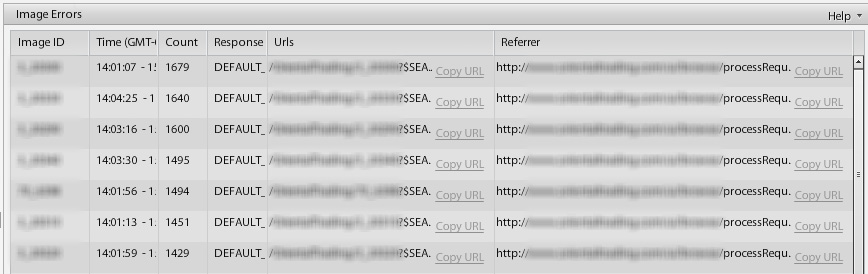

# 对管理员有价值的报告 {#valuable-reports}

在本最后一章中，我们只想让您了解如果您是管理员，可以考虑设置的两份重要报表：带宽和存储报表以及图像错误报表。

## 带宽和存储报告

“ Bandwidth &amp; Storage ”报告详细说明了每个月占用的Image Server带宽以及您在Dynamic Media Classic上使用的存储空间。 存储是合同金额，因此务必检查并确保未超出您的限制以避免超额费用。

_“ Bandwidth &amp; Storage ”报告显示该帐户已超出30 GB的存储限制。_

## 图像错误报表

每当URL请求缺少图像时，图像服务器都会生成错误。 您可以设置默认图像以在这些情况下显示，但您仍然应该意识到错误。 “Image Errors”（图像错误）报告列出了过去24小时内出现的20个最常见的图像错误，并提供了详细信息，例如发生错误的次数、出现错误的图像以及包含问题图像的页面。 如果响应为“DEFAULT”，则表示提供的是默认图像。

_图像错误报告。_

## 结论

我们希望您发现此最佳实践指南中的内容对开始使用功能强大的富媒体解决方案或从中获得更多价值很有帮助。

要进一步了解Dynamic Media Classic，请查看以下资源：

- [Experience League上的Dynamic Media Classic — 实现价值](https://guided.adobe.com/?launch=AEM-5a#recommended/solutions/experience-manager)
- [Experience League上的Dynamic Media Classic — 执行更多操作](https://guided.adobe.com/?launch=AEM-6a#recommended/solutions/experience-manager)
- [Dynamic Media新闻稿存档](https://experienceleague.adobe.com/docs/dynamic-media-classic/using/dynamic-media-newsletter.html)
- [Dynamic Media Classic文档](https://experienceleague.adobe.com/docs/dynamic-media-classic/using/home.html)
