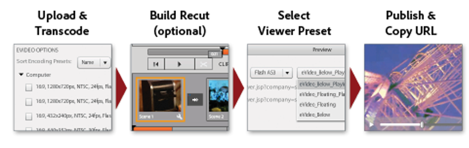

# 视频概述 {#video-overview}

Dynamic Media Classic附带在上传时自动将视频转换、将视频流传输到桌面和移动设备，以及针对基于设备和带宽的播放进行了优化的自适应视频集。 关于视频最重要的一点就是工作流程非常简单 — 设计工作流程是为了让任何人都可以使用它，即使他们不熟悉视频技术。

在本教程的此部分结束时，您将知道如何：

- 上传视频并编码（转码）为不同的大小和格式
- 在可供上传的视频预设中进行选择
- 添加或编辑视频编码预设
- 在视频查看器中预览视频
- 将视频部署到Web和移动站点
- 向视频添加字幕和章节标记
- 自定义和发布适用于桌面和移动设备用户的视频查看器

>[!NOTE]
>
>本章中的所有URL仅用于说明目的；它们不是实时链接。

## Dynamic Media Classic概述视频

让我们首先更好地了解一下使用Dynamic Media Classic进行视频传输的可能性。

### 特性和功能

Dynamic Media Classic视频平台提供了视频解决方案的所有部分 — 上传、转换和管理视频；向视频添加字幕和章节标记的功能；以及使用预设轻松播放的功能。

它让您能够轻松发布高质量自适应视频，以便在多个屏幕(包括台式机、iOS、Android™、BlackBerry®和Windows移动设备)上流式传输。 自适应视频集对使用不同比特率和格式（例如400 kbps、800 kbps和1000 kbps）编码的相同视频的版本进行分组。 台式计算机或移动设备检测可用带宽。

此外，如果桌面或移动设备上的网络状况发生更改，则视频质量会自动进行动态切换。 此外，如果客户在桌面上进入全屏模式，则自适应视频集使用更好的分辨率进行响应，从而改善客户的观看体验。 通过使用自适应视频集，您可以为在多台屏幕和设备上播放Dynamic Media Classic视频的客户提供尽可能最佳的播放方式。

### 视频管理

处理视频可能比处理静止数字图像更复杂。 使用视频，您可以处理多种格式和标准，以及受众能否播放剪辑的不确定性。 Dynamic Media Classic使处理视频变得容易，提供了“隐藏的”许多强大工具，但消除了处理这些工具的复杂性。

Dynamic Media Classic可以识别多种可用的源格式并且可以与它们一起使用。 但是，阅读视频只是工作的一部分，您还必须将视频转换为Web友好格式。 Dynamic Media Classic通过允许您将视频转换为H.264视频来解决此问题。

使用许多现有的专业和爱好者工具，自行转换视频会变得非常复杂。 Dynamic Media Classic通过提供针对不同质量设置进行优化的简单预设，使其保持简单。 但是，如果您希望进行更多自定义，也可以创建自己的预设。

如果您拥有大量视频，那么您一定会感激能够在Dynamic Media Classic中管理您的所有资源以及图像和其他媒体。 您可以通过强大的XMP元数据支持来整理、编录和搜索资源，包括视频资源。

### 视频播放

与转换视频以使其对Web友好且可访问的问题相似，实施视频并将其部署到网站也存在问题。 选择购买播放器还是构建自己的播放器，使其兼容各种设备和屏幕，然后维护您的播放器，可能是一项全职工作。

同样地，Dynamic Media Classic的方法是允许您选择符合自己需求的预设和查看器。 您有多种不同的查看器选项和许多可用的预设库。

您可以轻松地将视频交付到Web和移动设备，因为Dynamic Media Classic支持HTML5视频，这意味着您可以定位运行各种浏览器的用户以及Android™和iOS平台用户。 流式视频允许流畅播放较长内容或高清内容，而渐进式HTML5视频则具有针对小屏幕而优化的预设。

视频的查看器预设可部分配置，具体取决于查看器类型。

与所有查看器一样，集成是通过每个查看器或视频的单个Dynamic Media Classic URL实现的。

>[!NOTE]
>
>作为最佳实践，请使用Dynamic Media Classic HTML5视频查看器。 HTML5视频查看器中使用的预设是可靠的视频播放器。 通过将使用HTML5和CSS设计播放组件的功能整合到单个播放器中、嵌入播放器，以及根据浏览器的功能使用自适应流和渐进式流，您可以将富媒体内容的范围扩展到桌面、平板电脑和移动设备用户，并确保简化的视频体验。

最后一条关于Dynamic Media Classic视频的注释可能适用于某些客户：并非所有公司都为其帐户启用了自动转化、流或视频预设。 如果由于某种原因而无法访问流视频的URL，这可能是原因。 您可以上传和发布逐步下载的视频，并访问所有视频查看器。 但是，要利用完整的Dynamic Media Classic视频功能，请联系您的客户经理或销售经理来启用这些功能。

在Dynamic Media Classic](https://experienceleague.adobe.com/docs/dynamic-media-classic/using/video/quick-start-video.html)中了解有关[视频的更多信息。

## Video 101

### 基本视频概念和术语

在开始之前，让我们讨论一些您应该熟悉的术语以使用视频。 这些概念并不是特定于Dynamic Media Classic的，如果您要管理专业网站的视频，最好进一步了解一下这个主题。 我们建议在本节末尾提供一些资源。

- **编码/转码。**&#x200B;编码是应用视频压缩以将原始未压缩视频数据转换为更易于使用的格式的过程。 转码与此类似，指的是从一种编码方法转换成另一种编码方法。

   - 使用视频编辑软件创建的主视频文件通常太大，格式不正确，无法传送到在线目标。 它们通常经过编码，用于在桌面上快速播放和进行编辑，但无法通过Web交付。
   - 为了将数字视频转换为在不同屏幕上播放的正确格式和规范，视频文件被转码为更小、更高效的文件大小，以最佳方式传送到Web和移动设备。

- **视频压缩。**&#x200B;减少用于表示数字视频图像的数据量，它是空间图像压缩和时间运动补偿的组合。

   - 大多数压缩技术都是有损的，这意味着它们会丢弃数据以实现更小的大小。
   - 例如，DV视频压缩得相对较少，可让您轻松编辑源素材，但如果要在Web上使用，甚至要放在DVD上，则压缩量太大。

- **文件格式。**&#x200B;格式是一个容器，与ZIP文件类似，可确定文件在视频文件中的组织方式，但通常不是文件的编码方式。

   - 源视频的常见文件格式包括Windows Media (WMV)、QuickTime (MOV)、Microsoft®AVI和MPEG等。 Dynamic Media Classic发布的格式为MP4。
   - 视频文件通常包含多个相互关联且同步的轨道 — 一个视频轨道（没有音频）和一个或多个音频轨道（没有视频）。
   - 视频文件格式确定如何组织这些不同的数据跟踪和元数据。

- **编解码器。**&#x200B;视频编解码器描述了使用压缩对视频进行编码的算法。 音频也通过音频编解码器编码。

   - 编解码器可最大限度地减少播放视频所需的信息量。 只存储关于一个帧与下一个帧之间差异的信息，而不是关于每个单独帧的信息。
   - 由于大多数视频在帧间变化很小，因此编解码器允许较高的压缩率，从而缩小文件大小。
   - 视频播放器根据其编解码器解码视频，然后在屏幕上显示一系列图像或帧。
   - 常见的视频编解码器包括H.264、On2 VP6和H.263。

- **分辨率。**&#x200B;视频的高度和宽度（以像素为单位）。

   - 源视频的大小由摄像头和编辑软件的输出决定。 高清摄像头可创建高分辨率1920 x 1080视频，但为了在网络上顺利播放，您可以将其缩减像素采样（调整大小）至更小的分辨率，例如1280 x 720、640 x 480或更小。
   - 分辨率直接影响文件大小和播放该视频所需的带宽。

- **显示宽高比。**&#x200B;视频宽度与视频高度的比率。 当视频的长宽比与播放器的长宽比不匹配时，您可能会看到“黑条”或空格。 用于显示视频的两个常见纵横比是：

   - 4:3 (1.33:1)。 用于几乎所有标准清晰度电视广播内容。
   - 16:9 (1.78:1)。 用于几乎所有宽屏、高清电视内容(HDTV)和电影。

- **比特率/数据速率。**&#x200B;经过编码以构成视频播放一秒的数据量（千位/秒）。

   - 通常，比特率越低，Web所需的比特率就越大，因为它的下载速度更快。 但是，这也意味着由于压缩损失，质量较低。
   - 一个好的编解码器应该平衡低比特率和好的质量。

- **帧速率（每秒帧数或FPS）。**&#x200B;视频的每秒帧数，即静止图像数。 通常，北美电视(NTSC)以29.97 FPS播放；欧洲和亚洲电视(PAL)以25 FPS播放；电影（模拟和数字）通常以24 (23.976) FPS播放。

   - 为了让事情更加混乱，还有渐进和交错的框架。 每个渐进帧包含整个图像帧，而交错帧则包含图像帧中的其他每一行像素。 然后，这些帧会快速回放，看起来混合在一起。 胶片使用渐进扫描方法，而数字视频通常是交错的。
   - 通常，无论源视频是否为交错视频，Dynamic Media Classic都会在转换后的视频中保留扫描方法。
   - 流式/渐进式投放。 视频流是指以连续流的形式发送媒体，在媒体到达时可以播放，而逐步下载的视频将像从服务器下载的任何其他文件一样缓存在本地浏览器中。

希望本入门课程有助于您了解在使用Dynamic Media Classic视频时涉及的各个选项。

## 视频工作流

在Dynamic Media Classic中使用视频时，遵循与处理图像类似的基本工作流程。

1. 首先，将视频文件上传到Dynamic Media Classic。 为此，请打开Dynamic Media Classic扩展面板底部的&#x200B;**工具菜单**，然后选择&#x200B;**上传到Dynamic Media Classic >文件到文件夹名称**，或&#x200B;**上传到Dynamic Media Classic >文件夹到文件夹名称**。 “Folder name”是您当前使用该扩展浏览的任何文件夹。 视频文件可能会很大，因此我们建议使用FTP上传大文件。 在上传过程中，选择一个或多个用于编码视频的视频预设。 上传视频时，可以将视频转码为MP4视频。 有关使用和创建编码预设的更多信息，请参阅下面的视频预设主题。 了解[视频上传和编码](https://experienceleague.adobe.com/docs/dynamic-media-classic/using/video/uploading-encoding-videos.html)。
2. 选择或修改视频查看器预设并预览视频。 您可以选择预先构建的查看器预设，也可以自定义您自己的查看器预设。 如果您定位的是移动用户，则无需在此处执行任何操作，因为移动平台不需要查看器或预设。 了解有关[在视频查看器中预览视频](https://experienceleague.adobe.com/docs/dynamic-media-classic/using/video/previewing-videos-video-viewer.html)和[添加或编辑视频查看器预设](https://experienceleague.adobe.com/docs/dynamic-media-classic/using/video/previewing-videos-video-viewer.html#adding-or-editing-a-video-viewer-preset)的更多信息。
3. 运行视频Publish、获取URL并集成。 视频工作流的此步骤与图像工作流的主要区别在于，您运行的是特殊的视频Publish，而不是（也许和）标准的图像服务发布。 桌面上的视频查看器集成与图像查看器集成的工作方式完全相同，但是对于移动设备来说，它甚至更简单 — 您只需要视频本身的URL即可。

### 关于转码

转码之前被定义为从一种编码方法转换到另一种编码方法的过程。 在Dynamic Media Classic中，是将源视频从当前格式转换为MP4的过程。 您的视频在桌面浏览器或移动设备上出现之前需要此项。

Dynamic Media Classic可以为您处理所有转码工作，这是一个巨大的优势。 您可以自行转码视频并上传已转换为MP4的文件，但这是一个复杂的过程，需要复杂的软件。 除非您知道自己在做什么，否则在第一次尝试时通常不会获得良好的结果。

Dynamic Media Classic不仅可以为您转换文件，还可以通过提供易于使用的预设来简化转换过程。 您其实不需要了解有关此过程的技术方面的更多信息 — 您应该知道的只是您希望从系统中获得的最终容量以及您最终用户拥有的带宽。

虽然预先构建的预设很方便且可满足大多数需求，但有时您还是希望获得一些更自定义的预设效果。 在这种情况下，您可以创建自己的编码预设。 在Dynamic Media Classic中，编码预设称为视频预设。 本章稍后将对此进行解释。

### 关于流

另一个值得注意的主要功能是视频流，这是Dynamic Media Classic视频平台的标准功能。 流媒体在交付时不断地由最终用户接收并呈现给最终用户。 这意义重大，而且出于几个原因，也是可取的。

与渐进式下载相比，流式传输通常需要更少的带宽，因为仅传送所观看的视频部分。 Dynamic Media Classic视频流服务器和查看器使用自动带宽检测来尽可能为用户的Internet连接提供最佳流。

使用流式传输时，视频开始播放的速度比使用其他方法时更快。 因为只有观看过的视频部分会发送到客户端，所以它还可以更有效地利用网络资源。

另一种交付方法是渐进式下载。 与流视频相比，渐进式下载只有一个持续优势，即无需流服务器即可交付视频。 当然，这也是Dynamic Media Classic的优势所在 — Dynamic Media Classic在平台中内置了流服务器，因此您无需费力或额外成本来维护这一专用硬件。

渐进式下载视频可以从任何普通Web服务器提供。 虽然这既方便又可能经济实惠，但请记住，渐进式下载的搜寻和导航功能有限，用户可以访问您的内容并重新调整其用途。 在某些情况下（例如在严格的网络防火墙后进行播放），可能会阻止流式交付；在这些情况下，可能需要回滚到渐进式交付。

渐进式下载适用于流量要求较低的爱好者或网站；如果他们不介意将内容缓存在用户计算机上；如果他们只需要交付长度较短的视频（少于10分钟）；或者他们的访客由于某种原因无法接收流视频。

如果您需要高级功能和控制视频交付，并且/或者您需要向更大的受众显示视频（例如，多个100位同时观看者）、跟踪和报告使用情况或查看统计数据，或者希望为观看者提供最佳交互式播放体验，则需要流式传输视频。

最后，如果您担心保护媒体安全，以解决知识产权或权限管理问题，流式传输可提供更安全的视频交付，因为进行流式传输时，媒体不会保存到客户端的缓存中。

## 视频预设

上传视频时，您可以从一个或多个预设中进行选择，这些预设包含用于通过编码将主视频转换为Web友好格式的设置。 视频预设有两种风格，自适应视频预设和单个编码预设。

查看[可用的视频预设](https://experienceleague.adobe.com/docs/dynamic-media-classic/using/setup/application-setup.html#video-presets-for-encoding-video-files)。

默认情况下，会激活自适应视频预设，这意味着它们可用于编码。 如果要使用单个编码预设，管理员需要激活它才能使其显示在视频预设列表中。

了解如何[激活或停用视频预设](https://experienceleague.adobe.com/docs/dynamic-media-classic/using/video/uploading-encoding-videos.html#activating-or-deactivating-video-encoding-presets)。

您可以从Dynamic Media Classic随附的众多预建预设中选择一个，也可以创建您自己的预设；但是，默认情况下不会选择上传预设。 换言之，**如果您在上传时未选择视频预设，则您的视频将不会被转换，并且有可能无法发布**。 不过，您可以自己离线转换视频，也可以上传并发布。 仅当您希望Dynamic Media Classic为您进行转换时，才需要视频预设。

上载时，在“作业选项”面板中选择&#x200B;**视频选项**&#x200B;来选择视频预设。 然后，选择您要为“计算机”、“移动设备”还是“平板电脑”编码。

- 计算机用于桌面。 在这里，您通常会发现占用更多带宽的较大预设（如HD）。
- 移动设备和平板电脑为iPhone和Android™智能手机等设备创建MP4视频。 移动与平板电脑的唯一区别在于，平板电脑预设通常具有较大的带宽，因为它们基于WiFi使用。 移动预设针对较慢的3G使用率进行了优化。

### 选择预设前应自问的问题

在选择预设时，您应该了解受众和源素材。 您对客户了解多少？ 他们怎么看视频 — 用电脑显示器还是移动设备？

您的视频的分辨率是多少？ 如果选择的预设大于原始预设，则可能会获得模糊/像素化的视频。 如果您的视频大于预设，但不要选择大于源视频的预设，则可以这样做。

其宽高比是多少？ 如果您在转换后的视频周围看到黑色条，则表明您选择了错误的纵横比。 Dynamic Media Classic无法自动检测这些设置，因为它必须先检查文件才能上传。

### 视频选项划分

视频预设通过指定这些设置来确定视频的编码方式。 如果您不熟悉这些术语，请查看上面的“基本视频概念和术语”主题。

- **宽高比。**&#x200B;标准4:3或宽屏16:9。
- **大小。**&#x200B;这与显示分辨率相同，并以像素测量。 这与长宽比有关。 在16:9的比率下，视频为432 x 240像素，而在4:3时，视频为320 x 240像素。
- **FPS。**&#x200B;标准帧速率为每秒30帧、每秒25帧或每秒24帧(fps)，具体取决于视频标准 — NTSC、PAL或Film。 此设置无关紧要，因为Dynamic Media Classic始终使用与源视频相同的帧速率。
- **格式。**&#x200B;这是MP4。
- **带宽。**&#x200B;这是目标用户所需的连接速度。 它们有快速或慢速的Internet连接？ 他们通常使用台式计算机还是移动设备？ 这也与分辨率（大小）有关，因为视频越大，它需要的带宽就越多。

### 确定视频的数据速率或“比特率”

计算视频的比特率是向Web提供视频时了解最少的一个因素，但可能是最重要的因素，因为它直接影响用户体验。 如果比特率设置得太高，则视频质量会很高，但性能会很差。 Internet连接速度较慢的用户被迫等待，因为视频在播放时不断暂停。 但是，如果设置过低，质量就会受损。 在视频预设中，Dynamic Media Classic会根据您的Target带宽提供一系列建议。 这是一个很好的起点。

但是如果你想自己算出来，你需要一个比特率计算器。 这是一个视频专业人员和视频爱好者经常使用的工具，用于估计给定流或媒体（如DVD）中可容纳的数据量。

## 创建自定义视频预设

有时，您可能会发现需要特殊的视频预设，但该预设与内置编码视频预设的设置不匹配。 如果您有特定大小的自定义视频，例如从3D动画软件创建的视频或已从原始大小裁剪的视频，则可能会发生这种情况。 您可能希望尝试使用不同的带宽设置，以提供更高或更低质量的视频。 无论哪种情况，都应创建自定义的单个编码视频预设。

### 视频预设工作流程

1. 视频预设位于&#x200B;**设置>应用程序设置>视频预设**&#x200B;下。 您将在此处找到公司可用的所有编码预设列表。

   - 每个流视频帐户都有数十个现成的预设，如果您创建自己的自定义预设，则也会在此处看到这些预设。
   - 您可以使用下拉菜单按类型过滤。 预设分为“计算机”、“移动设备”和“平板电脑”。
     

2. “活动”列允许您选择是要在上载时显示所有预设，还是只显示您选择的预设。 如果您在美国，则可能需要取消选中European PAL预设；如果您在英国/欧洲、中东和非洲地区，请取消选中NTSC预设。
3. 单击“**添加**”按钮可创建自定义预设。 这将打开添加视频预设面板。 此处的过程与创建图像预设类似。
4. 首先，为它指定要在预设列表中显示的&#x200B;**预设名称**。 在上述示例中，此预设适用于屏幕捕获教程视频。
5. **Description**&#x200B;是可选的，但它会向您的用户提供描述此预设用途的工具提示。
6. **编码文件后缀**&#x200B;将附加到您在此处创建的视频名称的末尾。 请记住，您将会拥有母版视频以及此编码视频，它是母版的派生，并且Dynamic Media Classic中的任意两个资源不能具有相同的资源ID。
7. **播放设备**&#x200B;是您选择所需视频文件格式（计算机、移动设备或Tablet）的地方。 请记住，移动设备和平板电脑会产生相同的MP4格式。 Dynamic Media Classic只需要知道预设的放置类别；但是，理论上的区别在于，平板电脑预设通常用于更快的互联网连接，因为所有预设都支持WiFi。
8. **目标数据速率**&#x200B;是您必须自行确定的数字，不过您可以在下面的图像上看到建议的范围。 或者，可以将滑块拖动到近似的目标带宽。 要获得更精确的数字，请使用比特率计算器。 这其中涉及一些试错。

   

9. 设置源文件的&#x200B;**宽高比**。 此设置直接绑定到下面的大小。 如果选择&#x200B;_自定义_，则必须手动输入宽度和高度。
10. 如果您选择纵横比，则为&#x200B;**分辨率大小**&#x200B;设置一个值，Dynamic Media Classic将自动填充另一个值。 但是，对于自定义纵横比，请填充这两个值。 您的规模应与数据速率一致。 如果设置的数据速率低且大小大，则质量可能会不佳。
11. 单击&#x200B;**保存**&#x200B;以保存预设。 与所有其他预设不同，您现在不需要发布，因为预设仅用于上传文件。 稍后，您必须发布经过编码的视频，但预设仅供Dynamic Media Classic内部使用。
12. 若要验证您的视频预设是否在上传列表中，请转到&#x200B;**上传**。 选择&#x200B;**作业选项**&#x200B;并展开&#x200B;**视频选项**。 您的预设会列在您选择的播放设备（“计算机”、“移动设备”或“平板电脑”）的类别中。

了解有关[添加或编辑视频预设](https://experienceleague.adobe.com/docs/dynamic-media-classic/using/video/uploading-encoding-videos.html#adding-or-editing-a-video-encoding-preset)的详细信息。

## 在视频中添加字幕

有时候，向视频添加字幕会很有用，例如，当您需要以多种语言向查看者提供视频，但不希望以另一种语言对音频进行复调或再次以单独的语言录制视频时。 此外，为听力受损并使用隐藏式字幕的用户提供更好的辅助功能。 通过Dynamic Media Classic，可以轻松地将字幕添加到视频中。

了解如何[向视频添加字幕](https://experienceleague.adobe.com/docs/dynamic-media-classic/using/video/adding-captions-video.html)。

## 向视频添加章节标记

对于长格式视频，观看者可能会喜欢使用章节标记导航视频所提供的功能和便利。 Dynamic Media Classic提供向视频轻松添加章节标记的功能。

了解如何[向视频添加章节标记](https://experienceleague.adobe.com/docs/dynamic-media-classic/using/video/adding-chapter-markers-video.html)。

## 视频实施主题

### Publish和复制URL

Dynamic Media Classic工作流中的最后一个步骤是发布视频内容。 但是，视频有其自己的发布作业，称为视频服务器发布，可在“高级”下找到。

了解如何[Publish您的视频](https://experienceleague.adobe.com/docs/dynamic-media-classic/using/video/deploying-video-websites-mobile-sites.html#publishing-video)。

运行视频发布后，您就能够获得一个URL，以便在Web浏览器中访问您的视频和任何现成的Dynamic Media Classic Viewer预设。 但是，如果您自定义或创建自己的视频查看器预设，则需要运行单独的图像服务器发布。

- 了解如何[将URL链接到移动网站或网站](https://experienceleague.adobe.com/docs/dynamic-media-classic/using/video/deploying-video-websites-mobile-sites.html#linking-a-video-url-to-a-mobile-site-or-a-website)。
- 了解如何[在网页上嵌入视频查看器](https://experienceleague.adobe.com/docs/dynamic-media-classic/using/video/deploying-video-websites-mobile-sites.html#embedding-the-video-viewer-on-a-web-page)。

您也可以使用第三方或自定义视频播放器来部署视频。

了解如何使用第三方视频播放器[部署视频](https://experienceleague.adobe.com/docs/dynamic-media-classic/using/video/deploying-video-websites-mobile-sites.html#deploying-video-using-a-third-party-video-player)。

此外，如果您还想使用视频缩略图（从视频中提取的图像），则需要运行图像服务器发布。 这是因为视频的缩略图图像位于图像服务器上，而视频本身位于视频服务器上。 视频缩略图可用于视频搜索结果、视频播放列表，并可用作在视频播放之前显示在视频查看器中的初始“海报帧”。

了解有关[使用视频缩略图](https://experienceleague.adobe.com/docs/dynamic-media-classic/using/video/deploying-video-websites-mobile-sites.html#working-with-video-thumbnails)的详细信息。

### 选择和自定义查看器预设

选择和自定义查看器预设的过程与图像的过程相同。 您可以创建预设或修改现有预设，然后以新名称保存、进行编辑并运行图像服务发布。 所有查看器预设都将发布到图像服务器，而不仅仅是图像的预设，因此您必须运行图像发布才能查看新预设或修改的预设。

>[!TIP]
>
>在视频服务器发布后运行图像服务发布，以发布与视频关联的任何缩略图。

## 视频搜索引擎优化

搜索引擎优化(SEO)是提高搜索引擎中网站或网页的可见性的过程。 尽管搜索引擎在收集有关文本内容的信息方面表现出色，但是除非向搜索引擎提供视频信息，否则搜索引擎将无法充分获取有关视频的信息。 通过使用Dynamic Media Classic视频SEO，您可以使用元数据向搜索引擎提供视频描述。 视频SEO功能允许您创建视频站点地图和媒体RSS (mRSS)源。

- **视频站点地图**。 告知Google网站上视频内容的确切位置和内容。 因此，可以在Google上完全搜索视频。 例如，视频站点地图可以指定视频的运行时间和类别。
- **mRSS源**。 内容发布者用来将媒体文件馈送到Yahoo！ 视频搜索。 Google支持视频站点地图和媒体RSS (mRSS)馈送协议来将信息提交到搜索引擎。

在创建视频站点地图和mRSS馈送时，您可以决定要包含视频文件中的哪些元数据字段。 这样，您就可以将视频描述给搜索引擎，以便搜索引擎可以更准确地将流量引导至您网站上的视频。

创建站点地图或馈送后，您可以让Dynamic Media Classic自动发布站点地图或馈送，手动发布站点地图，或仅生成一个可在以后编辑的文件。 此外，Dynamic Media Classic可以每天自动生成并发布此文件。

在该流程结束时，您将向搜索引擎提交文件或URL。 这项任务在Dynamic Media Classic之外完成；但我们会在下面进行简要讨论。

### Sitemap/mRSS文件要求

要让Google和其他搜索引擎不拒绝您的文件，它们必须采用正确的格式并包含特定信息。 Dynamic Media Classic会生成一个正确格式的文件；但是，如果某些视频没有相应的信息，则不会将这些视频包含在文件中。

必填字段为“Landing Page”（提供视频的页面的URL，而不是视频本身的URL）、“Title”和“Description”。 每个视频必须具有用于这些项目的条目，否则将不会包含在生成的文件中。 可选字段包括“标记”和“类别”。

还有其他两个必填字段 — 内容URL（视频资源本身的URL）和缩略图（视频缩略图图像的URL），但Dynamic Media Classic会自动为您填充这些值。

推荐的工作流程是在使用XMP元数据上传之前将此数据嵌入到视频中，Dynamic Media Classic将在上传时提取该数据。 您将使用诸如Adobe Bridge之类的应用程序(此应用程序包含在所有Adobe Creative Cloud应用程序中)将数据填充到标准元数据字段中。

通过使用此方法，您不必使用Dynamic Media Classic手动输入此数据。 不过，您也可以在Dynamic Media Classic中使用元数据预设，作为每次输入相同数据的快速方法。

有关此主题的详细信息，请参阅[查看、添加和导出元数据](https://experienceleague.adobe.com/docs/dynamic-media-classic/using/managing-assets/viewing-adding-exporting-metadata.html)。

填充元数据后，您便能够在该视频资产的详细信息视图中看到该元数据。 关键字也可能存在，但这些关键字位于“关键字”选项卡下。

- 了解有关[添加关键字](https://experienceleague.adobe.com/docs/dynamic-media-classic/using/managing-assets/viewing-adding-exporting-metadata.html#add-or-edit-keywords)的详细信息。
- 了解有关[视频SEO](https://experienceleague.adobe.com/docs/dynamic-media-classic/using/setup/video-seo-search-engine-optimization.html)的更多信息。
- 了解视频SEO](https://experienceleague.adobe.com/docs/dynamic-media-classic/using/setup/video-seo-search-engine-optimization.html#choosing-video-seo-settings)的[设置。

#### 设置视频SEO

设置视频SEO首先需要选择所需的格式类型、生成方法以及应该放入文件中的元数据字段。

1. 转到&#x200B;**设置>应用程序设置>视频SEO >设置**。
2. 在&#x200B;**生成模式**&#x200B;菜单中，选择文件格式。 默认值为“关闭”，因此要启用它，请选择“视频站点地图”、“mRSS”或“两者”。
3. 选择是自动生成还是手动生成。 为方便起见，建议将其设置为&#x200B;**自动模式**。 如果选择“自动”，则还应设置&#x200B;**标记为Publish**&#x200B;选项，否则文件将不会上线。 Sitemap和RSS文件是XML文档的类型，必须像任何其他资源一样发布。 如果现在还没有准备好所有信息，或者只想进行一次性生成，请使用手动模式之一。
4. 填充文件中使用的元数据标记。 此步骤不是可选的。 您至少必须包含三个标有星号(\*)的字段： **登陆页面** 、 **标题**&#x200B;和&#x200B;**描述**。 要将您的元数据用于这些任务，请将右侧元数据面板中的字段拖放到表单上的相应字段中。 Dynamic Media Classic将自动使用每个视频中的实际数据填充占位符字段。 您不必使用元数据字段。 您可以在此处键入一些静态文本，但每个视频将显示相同的文本。
5. 在三个必填字段中输入信息后，Dynamic Media Classic将启用&#x200B;**保存**&#x200B;和&#x200B;**保存并生成**&#x200B;按钮。 单击其中一个按钮以保存您的设置。 如果您处于自动模式并且希望让Dynamic Media Classic稍后生成文件，请使用&#x200B;**保存**。 使用&#x200B;**保存并生成**&#x200B;立即创建文件。

### 测试和发布视频站点地图、mRSS馈送或同时发布这两个文件

生成的文件将显示在帐户的根（基本）目录中。

这些文件必须发布，因为视频SEO工具无法单独运行发布。 只要它们被标记为发布，它们就会在下次运行发布时发送到发布服务器。

发布后，可以使用此URL格式访问您的文件。

示例：

### 提交到搜索引擎

该过程的最后一步是将文件和/或URL提交到搜索引擎。 Dynamic Media Classic无法为您执行此步骤；但是，假定您提交URL而不是XML文件本身，则下次生成文件并进行发布时，应更新您的信息源。

提交到搜索引擎的方法会有所不同，但是对于Google，您使用的是Google网站管理员工具。 之后，转到&#x200B;**站点配置> Sitemaps**，然后单击&#x200B;**提交站点地图**&#x200B;按钮。 您可以在此处将Dynamic Media Classic URL放置到SEO文件。

### 视频SEO报表

Dynamic Media Classic提供了一个报表，用于显示成功在文件中包含的视频数量，更重要的是，由于错误未包含这些视频。 要访问报告，请转到&#x200B;**设置>应用程序设置>视频SEO >报告**。

## MP4视频的移动实施

Dynamic Media Classic不包含用于移动设备的查看器预设，因为查看器不需要在支持的移动设备上播放视频。 只要您编码为H.264 MP4格式（在上传时转换或在桌面上预先编码），受支持的平板电脑和智能手机就可以在无需查看器的情况下播放您的视频。 这在Android和iOS(iPhone和iPad)设备上受支持。

不需要查看器是因为两个平台都支持本机H.264。 您可以将视频嵌入到HTML5网页中，也可以将视频嵌入到应用程序本身中，Android和iOS操作系统将提供用于播放视频的控制器。

因此，Dynamic Media Classic不会向您提供移动设备查看者的URL，而是为您提供直接指向视频的URL。 在MP4视频的“预览”窗口中，提供了桌面和移动设备链接。 移动URL指向发布的视频。

关于已发布的视频，需要注意的一点是URL列出了视频的完整路径，而不仅仅是资产ID。 处理图像时，无论文件夹结构如何，您都会按图像的资产ID来调用图像。 但是，对于视频，还必须指定文件夹结构。 在上面的URL中，视频存储在路径中：

这也可以表示为视频的公司名称/文件夹路径/名称。

### 方法#1：浏览器播放 — HTML5代码

要在网页中嵌入MP4视频，请使用HTML5视频标签。

此方法同样适用于桌面Web，但您可能会遇到浏览器支持问题 — 并非所有桌面Web浏览器都原生支持H.264视频，包括Firefox。

### 方法#2：iOS上的应用程序播放 — Media Player Framework

或者，您可以将Dynamic Media Classic MP4视频嵌入到移动设备应用程序代码中。 以下是使用Media Player框架的iOS的通用示例，仅供说明之用：

## 其他资源

观看[Dynamic Media Skill Builder：Dynamic Media Classic中的视频](https://seminars.adobeconnect.com/p2ueiaswkuze)点播网络研讨会，了解如何使用Dynamic Media Classic中的视频功能。
