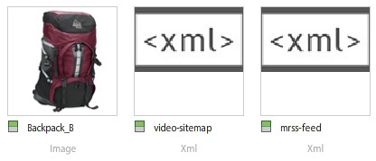

# 视频概述 {#video-overview}

Dynamic Media Classic随附自动转换上传视频、视频流到桌面和移动设备以及根据设备和带宽为回放而优化的自适应视频集。 视频最重要的一点是工作流程很简单——它的设计使任何人都可以使用它，即使他们不太熟悉视频技术。

在本教程的本节结尾，您将了解如何：

- 将视频上传并编码为不同大小和格式
- 从可用的视频预设中进行选择以进行上传
- 添加或编辑视频编码预设
- 预览视频查看器中的视频
- 将视频部署到网站和移动站点
- 向视频添加字幕和章节标记
- 为桌面和移动用户自定义和发布视频查看器

>[!NOTE]
>
>本章中的所有URL仅用于说明目的；它们不是实时链接。

## Dynamic Media Classic视频概述

让我们首先使用Dynamic Media Classic更好地了解视频的可能性。

### 特性和功能

动态媒体经典视频平台优惠视频解决方案的所有部分——视频上传、转换和管理；能够向视频添加字幕和章节标记；以及使用预设轻松回放的功能。

它可轻松发布高质量自适应视频以跨多种屏幕（包括桌面、iOS、Android、Blackberry和Windows移动设备）进行流化。 自适应视频集是同一个视频的一组版本，这些版本以不同的比特率和格式进行编码，例如 400 kbps、800 kbps 和 1000 kbps。台式计算机或移动设备会检测可用带宽。

此外，如果桌面或移动设备上的网络状况发生变化，视频质量会自动动态切换。此外，如果客户在桌面上进入全屏模式，自适应视频集会做出响应，使用更好的分辨率，从而改善客户的观看体验。 使用自适应视频集，为在多个屏幕和设备上播放Dynamic Media Classic视频的客户提供最佳的播放方式。

### 视频管理

处理视频比处理静态数字图像更复杂。 对于视频，您需要处理各种格式和标准以及受众能否回放剪辑的不确定性。 Dynamic Media Classic可让您轻松处理视频，“内在”提供许多强大的工具，但消除了处理它们的复杂性。

Dynamic Media Classic可识别并可处理多种不同的可用源格式。 但是，阅读视频只是工作的一部分——您还必须将视频转换为适合Web的格式。 Dynamic Media Classic允许您将视频转换为H.264视频，从而解决这一问题。

使用可用的众多专业和发烧友工具，自行转换视频会变得非常复杂。 Dynamic Media Classic提供针对不同质量设置进行了优化的简单预设，让您的工作变得轻而易举。 但是，如果您想要更自定义的内容，也可以创建自己的预设。

如果您有大量视频，您会非常欣赏在动态媒体经典中管理所有资产以及图像和其他媒体的能力。 您可以借助强大的XMP元数据支持来组织、编录和搜索您的资产（包括视频资产）。

### 视频播放

与转换视频使其易于访问网络的问题相似，是在网站上实施和部署视频的问题。 选择是购买播放器还是构建自己的播放器，使其与各种设备和屏幕兼容，然后维护您的播放器可能是全职工作。

同样，Dynamic Media Classic的方法是允许您选择适合您需求的预设和查看器。 您有许多不同的查看器选项，并且有一个包含大量预设的库。

您可以轻松地将视频交付到Web和移动设备，因为Dynamic Media Classic支持HTML5视频，这意味着您可以目标运行各种浏览器的用户以及Android和iOS平台用户。 流式视频允许流畅地播放较长或高清内容，而渐进式HTML5视频的预设则针对小屏幕进行了优化。

视频的查看器预设可根据查看器类型进行部分配置。

与所有查看器一样，每个查看器或视频通过单个Dynamic Media Classic URL进行集成。

>[!NOTE]
>
>作为最佳实践，请使用Dynamic Media Classic HTML5视频查看器。 HTML5视频查看器中使用的预设是强大的视频播放器。 通过将使用HTML5和CSS设计播放组件、实现嵌入式播放以及根据浏览器的功能使用自适应和渐进式流播放的功能组合为一个播放器，您可以将多媒体内容的触及范围扩展到桌面、平板电脑和移动用户，并确保简化的视频体验。

关于Dynamic Media Classic视频的最后一点说明（可能适用于某些客户）:并非所有公司都为其帐户启用了自动转换、流式或视频预设。 如果由于某些原因您无法访问流视频的URL，则可能是原因。 您仍然可以上传和发布渐进式下载的视频，并有权访问所有视频查看器。 但是，要充分利用Dynamic Media Classic视频功能，您需要联系客户经理或销售经理以启用这些功能。

进一步了 [解Dynamic Media Classic中的视频](https://docs.adobe.com/content/help/en/dynamic-media-classic/using/video/quick-start-video.html)。

## Video 101

### 基本视频概念和术语

在我们开始之前，让我们讨论一些您应该熟悉的术语，以便使用视频。 这些概念并非特定于Dynamic Media Classic，如果您要管理专业网站的视频，最好就该主题进行进一步的教育。 在本节结尾，我们将推荐一些资源。

- **编码／转码。** 编码是应用视频压缩将原始的、未压缩的视频数据转换为便于处理的格式的过程。 转码（虽然类似）是指从一种编码方法转换为另一种编码方法。

   - 使用视频编辑软件创建的主控视频文件通常太大，并且格式不正确，无法投放到在线目标。 它们通常进行编码，以便在桌面上快速回放和进行编辑，但不用于在Web上投放。
   - 要将数字视频转换为适当的格式和规范，以便在不同屏幕上播放，视频文件将转码为最小、最有效的文件大小，以便投放到Web和移动设备。

- **视频压缩。** 减少用于表示数字视频图像的数据量，是空间图像压缩和时间运动补偿的组合。

   - 大多数压缩技术都是有损的，这意味着它们会丢弃数据以实现更小的大小。
   - 例如，DV视频压缩相对较少，因此您可以轻松编辑源素材，但它太大，无法通过Web使用甚至放入DVD。

- **文件格式。** 该格式是一种与ZIP文件类似的容器，它决定了视频文件中文件的组织方式，但通常不决定文件的编码方式。

   - 源视频的常见文件格式包括Windows Media(WMV)、QuickTime(MOV)、Microsoft AVI和MPEG等。 Dynamic Media Classic发布的格式为MP4。
   - 视频文件通常包含多个轨道——一个视频轨道（无音频）和一个或多个音频轨道（无视频）-它们是相互关联和同步的。
   - 视频文件格式决定了这些不同的数据跟踪和元数据的组织方式。

- **编解码.** 视频编解码器描述通过使用压缩对视频进行编码的算法。 音频也通过音频编解码器进行编码。

   - 编解码器将播放视频所需的信息量降至最低。 与每个单独帧的信息不同，仅存储有关一个帧和下一个帧之间差异的信息。
   - 由于大多数视频从一个帧到另一个帧的变化都很小，因此编解码器允许较高的压缩率，这会导致较小的文件大小。
   - 视频播放器根据视频的编解码器对视频进行解码，然后在屏幕上显示一系列图像或帧。
   - 常见视频编解码器包括H.264、On2 VP6和H.263。

- **分辨率.** 视频的高度和宽度（以像素为单位）。

   - 源视频的大小由相机和编辑软件的输出决定。 高清相机通常会创建1920 x 1080的高分辨率视频，但是，要在Web上顺利播放，您需要将其缩减像素采样（调整大小）至1280 x 720、640 x 480或更小的分辨率。
   - 分辨率直接影响文件大小以及播放该视频所需的带宽。

- **显示长宽比。** 视频的宽度与视频高度的比率。 当视频的长宽比与播放器的比率不匹配时，您可能会看到“黑条”或空白。 用于显示视频的两个常见长宽比是：

   - 4:3 (1.33:1). 用于几乎所有标准清晰度电视广播内容。
   - 16:9 (1.78:1). 用于几乎所有宽屏、高清电视内容(HDTV)和电影。

- **比特率／数据率。** 编码以构成一秒钟视频播放的数据量（千比特／秒）。

   - 通常，比特率越低，Web越理想，因为下载速度更快。 但是，这也意味着由于压缩损失，质量较低。
   - 良好的编解码器应在低比特率和高质量之间取得平衡。

- **帧速率（每秒帧数，或FPS）。** 每秒视频的帧数或静止图像数。 通常，北美TV(NTSC)以29.97 FPS的速率播放；欧洲和亚洲电视(PAL)以25 FPS进行广播；电影（模拟和数字）通常采用24(23.976)FPS。

   - 为了使事情更加混乱，还有逐行和交错的帧。 每个逐行帧包含整个图像帧，而隔行帧包含图像帧中每一行像素。 然后，帧会很快播放，并且看起来会混合在一起。 电影使用逐行扫描方法，而数字视频通常是隔行扫描的。
   - 通常，源素材是否是隔行扫描并无关系- Dynamic Media Classic将保留转换后视频中的扫描方法。
   - 流／渐进投放。 视频流是指在连续流中发送媒体，当媒体到达时即可播放，而渐进式下载的视频会像从服务器下载的任何其他文件一样从浏览器中本地缓存。

希望本入门能帮助您了解使用Dynamic Media Classic视频时涉及的各种选项。

## 视频工作流

在Dynamic Media Classic中处理视频时，您遵循与处理图像类似的基本工作流。

1. 开始，方法是将视频文件上传到Dynamic Media Classic。 为此，请打开Dynamic **Media Classic扩展面板底部的** “工具菜单”，然后选择 **“上传到Dynamic Media Classic”>“文件到文件夹名称**”，或“ **上传到Dynamic Media Classic”>“文件夹到文件夹名称”**。 “文件夹名称”将是您当前使用扩展浏览的任何文件夹。 视频文件可能很大，因此我们建议使用FTP上传大文件。 在上传过程中，选择一个或多个视频预设来对视频进行编码。 上传时，视频可转码为MP4视频。 有关使用和创建编码预设的更多信息，请参阅以下视频预设主题。 了解上 [传和编码视频](https://docs.adobe.com/content/help/en/dynamic-media-classic/using/video/uploading-encoding-videos.html)。
2. 选择或选择并修改视频查看器预设，然后预览视频。 您可以选择预置的查看器预设，也可以自定义自己的查看器预设。 如果您针对的是移动用户，您无需在此处执行任何操作，因为移动平台不需要查看器或预设。 了解有关在视 [频查看器中预览视频](https://docs.adobe.com/content/help/en/dynamic-media-classic/using/video/previewing-videos-video-viewer.html)[以及添加或编辑视频查看器预设的更多信息](https://docs.adobe.com/content/help/en/dynamic-media-classic/using/video/previewing-videos-video-viewer.html#adding-or-editing-a-video-viewer-preset)。
3. 运行视频发布、获取URL并进行集成。 与图像工作流相比，视频工作流的这一步骤的主要区别在于您将运行一个特殊的视频发布，而不是（或者可能还有）标准的图像服务发布。 桌面上的视频查看器集成的工作方式与图像查看器集成完全相同，但移动设备的集成更简单——您只需要视频本身的URL。

### 关于转码

转码之前定义为从一种编码方法转换为另一种编码方法的过程。 对于Dynamic Media Classic，它是将源视频从其当前格式转换为MP4的过程。 这是视频在桌面浏览器或移动设备上显示之前所必需的。

Dynamic Media Classic可以为您处理所有转码工作，这是一个巨大的优势。 您可以自行转码视频并上传已转换为MP4的文件，但这可能是一个需要复杂软件的复杂过程。 除非您知道自己在做什么，否则您通常在第一次尝试时不会获得良好的结果。

Dynamic Media Classic不仅可为您转换文件，还提供易于使用的预设，让您轻松完成转换。 您确实不需要了解该过程的技术方面——您应该了解的只是您希望从系统中获得的最终大小以及最终用户所拥有的带宽。

虽然预置的预设很方便，并且可满足大多数需求，但有时您需要更自定义的预设。 在这种情况下，您可以创建自己的编码预设。 在Dynamic Media Classic中，编码预设称为视频预设。 本章稍后将对此进行说明。

### 关于流

另一个值得注意的主要功能是视频流，它是动态媒体经典视频平台的标准功能。 在交付时，流媒体不断被最终用户接收并呈现给最终用户。 这是重要的，也是可取的，原因有若干。

与渐进式下载相比，流播放通常需要的带宽更少，因为实际上只交付观看的视频部分。 动态媒体经典视频流服务器和查看器使用自动带宽检测，为用户的Internet连接提供最佳流。

通过流播放，视频开始比使用其他方法更快地播放。 它还可以更有效地利用网络资源，因为只有被观看的视频部分才会发送到客户端。

另一种投放方法是渐进式下载。 与流式视频相比，渐进式下载实际上只有一个一致的优势——您无需流式服务器即可交付视频。 这当然是Dynamic Media Classic的用途- Dynamic Media Classic在平台中内置了流服务器，因此您无需花费太多精力或额外成本来维护这块专用硬件。

渐进式下载视频可从任何普通Web服务器提供。 虽然这既方便又可能具有成本效益，但请记住，渐进式下载具有有限的搜索和导航功能，用户可以访问和重用您的内容。 在某些情况下，如在非常严格的网络防火墙后播放，流式投放可能会被阻止；在这些情况下，可以希望回滚到渐进投放。

对于拥有低流量要求的爱好者或网站而言，渐进式下载是一个不错的选择；如果他们不介意自己的内容是否缓存在用户的计算机上；如果他们只需要提供更短长度的视频（不到10分钟）;或者访客由于某种原因无法接收流视频。

如果您需要高级功能并控制视频投放，和／或您需要向较大受众（例如，数百个同时查看器）显示视频，跟踪和报告使用情况或查看统计信息，或者希望优惠您的查看者获得最佳的交互式播放体验，您需要流式播放视频。

最后，如果您担心在知识产权或版权管理问题上保护媒体，流会提供更安全的视频投放，因为流播放时媒体不会保存到客户端的缓存中。

## 视频预设

上传视频时，您可以从一个或多个预设中进行选择，这些预设包含通过编码将主控视频转换为适合Web的格式的设置。 视频预设有两种形式，自适应视频预设和单个编码预设。

请参 [阅可用的视频预设](https://docs.adobe.com/content/help/en/dynamic-media-classic/using/setup/application-setup.html#video-presets-for-encoding-video-files)。

自适应视频预设默认处于激活状态，这意味着它们可用于编码。 如果您希望使用单个编码预设，管理员需要激活该预设，才能在视频预设列表中显示。

了解如何激 [活或取消激活视频预设](https://docs.adobe.com/content/help/en/dynamic-media-classic/using/video/uploading-encoding-videos.html#activating-or-deactivating-video-encoding-presets)。

您可以选择Dynamic Media Classic附带的多种预建预设之一，也可以自行创建；但是，默认情况下不会选择任何预设进行上传。 换言之，如 **果您在上传时未选择视频预设，您的视频将不会转换，并且可能无法发布**。 但是，您可以自行脱机转换视频，并且上传和发布正常。 视频预设仅在您希望Dynamic Media Classic为您进行转换时才是必需的。

上传时，您可以通过在“作业选项”面板中选 **择“视频选项** ”来选择视频预设。 然后，您可以选择是要为计算机、移动设备还是平板电脑进行编码。

- 计算机用于桌面。 您通常会在此处找到占用更多带宽的较大预设（如HD）。
- 移动和平板电脑为iPhone和Android智能手机等设备创建MP4视频。 手机和平板电脑的唯一区别在于平板电脑预设通常具有更高的带宽，因为它们基于WiFi使用。 移动预设已针对较慢的3G使用进行优化。

### 在选择预设前询问您自己的问题

选择预设时，您应了解受众以及源素材。 您对客户了解多少？ 他们如何通过计算机监视器或移动设备观看视频？

您的视频的分辨率是多少？ 如果您选择的预设大于原始预设，您可能会获得一个模糊／像素化的视频。 如果视频大于预设，则可以，但不要选择大于源视频的预设。

它的长宽比是多少？ 如果您在转换的视频周围看到黑条，则选择了错误的长宽比。 Dynamic Media Classic无法自动检测这些设置，因为它必须先检查文件，然后才能上传。

### 视频选项细分

视频预设通过指定这些设置来确定视频的编码方式。 如果您不熟悉这些术语，请查阅上面的基本视频概念和术语主题。

- **宽高比.** 通常标准4:3或宽屏16:9。
- **大小.** 这与显示分辨率相同，以像素为单位。 这与宽高比有关。 如果比率为16:9，则视频为432 x 240像素，而在4:3，则为320 x 240像素。
- **FPS.** 标准帧速率为30、25或24帧／秒(fps)，具体取决于视频标准- NTSC、PAL或胶片。 此设置无关紧要，因为Dynamic Media Classic始终使用与源视频相同的帧速率。
- **格式.** 这是MP4。
- **带宽。** 这是目标用户的期望连接速度。 他们是使用快速Internet连接还是使用慢速连接？ 他们通常使用台式计算机或移动设备吗？ 这也与分辨率（大小）有关，因为视频越大，它需要的带宽就越多。

### 确定视频的数据速率或“比特率”

计算视频的比特率是将视频提供给Web时最不容易理解的因素之一，但可能最重要的是，它直接影响用户体验。 如果设置的比特率过高，您的视频质量会很高，但性能会很差。 网络连接速度较慢的用户将被迫等待，因为视频在播放时会不断暂停。 但是，如果设置得太低，质量就会受到影响。 在“视频预设”中，Dynamic Media Classic会根据您的目标带宽建议一系列数据。 那是开始的好地方。

但是，如果您想自己计算，您需要一个位速率计算器。 这是视频专业人士和发烧友常用的工具，用于估计特定流或介质（如DVD）中的数据量。

## 创建自定义视频预设

有时，您可能会发现需要一个与内置编码视频预设的设置不匹配的特殊视频预设。 如果您有特定大小的自定义视频，如从3D动画软件创建的视频或从原始大小裁剪的视频，则可能会发生这种情况。 也许您希望尝试不同的带宽设置以提供更高或更低质量的视频。 无论如何，您都需要创建自定义的单一编码视频预设。

### 视频预设工作流

1. 视频预设位于“设置”>“ **应用程序设置”>“视频预设”下**。 您会在这里找到列表，其中包含所有可用于公司的编码预设。

   - 每个流视频帐户都有数十种现成预设，如果您创建自己的自定义预设，您也会在此处看到这些预设。
   - 您可以使用下拉菜单按类型进行筛选。 预设分为计算机、手机和平板电脑。
      

2. 活动列允许您选择是要在上传时显示所有预设，还是只显示您选择的预设。 如果您在美国，则可能要取消选中“欧洲PAL预设”；如果在英国／欧洲、中东和非洲，取消选中“NTSC预设”。
3. 单击“ **添加** ”按钮以创建自定义预设。 此操作将打开“添加视频预设”面板。 此处的过程与创建图像预设类似。
4. 首先，为其指定一 **个预设名** 称，使其显示在预设列表中。 在上面的示例中，此预设针对屏幕捕捉教程视频。
5. 说 **明是** 可选的，但会向用户提供说明此预设用途的工具提示。
6. “ **编码文件** ”后缀将附加到您在此创建的视频名称的末尾。 请记住，您将拥有主控视频以及此编码视频，该视频是主控的衍生项，并且动态媒体经典中没有两个资产可以具有相同的资产ID。
7. **回放设备** ，您可以选择所需的视频文件格式（计算机、移动设备或平板电脑）。 请记住，手机和平板电脑制作的MP4格式相同。 Dynamic Media Classic只需知道放置预设的类别;但是，理论上的区别在于，平板电脑预设通常用于更快的互联网连接，因为所有预设都支持WiFi。
8. **目标数据** 率是您必须自己确定的内容，但是您可以在下面的图像上看到建议的范围。 您也可以将滑块拖动到近似的目标带宽。 要获得更精确的数字，请使用位速率计算器。 涉及一些试用和错误。

   

9. 设置源文件的长 **宽比**。 此设置直接与以下大小相关。 如果选择“ _自定义_”，则必须手动输入宽度和高度。
10. 如果您选择宽高比，则为“分辨率大小” **设置一个值** ,Dynamic Media Classic将自动填充另一个值。 但是，对于自定义长宽比，请填写这两个值。 您的大小应与您的数据率一致。 如果设置的数据率很低，而且规模很大，您会认为质量很差。
11. 单击 **保存** ，以保存您的预设。 与其他预设不同，此时您无需发布，因为这些预设仅用于上传文件。 以后，您必须发布已编码的视频，但预设仅用于内部Dynamic Media Classic。
12. 要验证您的视频预设是否处于上传列表，请转 **至**“上传”。选 **择“作业选项** ”并展 **开“视频选项**”。 您的预设将列在您选择的播放设备（计算机、移动设备或平板电脑）的类别中。

了解有关添加 [或编辑视频预设的更多信息](https://docs.adobe.com/content/help/en/dynamic-media-classic/using/video/uploading-encoding-videos.html#adding-or-editing-a-video-encoding-preset)。

## 为视频添加字幕

在某些情况下，向视频添加字幕可能很有用——例如，当您需要以多种语言向观看者提供视频，但不想使用其他语言混音音频或以不同语言再次录制视频时。 此外，添加字幕可为听力受损者提供更好的辅助功能，并可使用隐藏式字幕。 利用Dynamic Media Classic，您可以轻松地向视频添加字幕。

了解如何向 [视频添加字幕](https://docs.adobe.com/content/help/en/dynamic-media-classic/using/video/adding-captions-video.html)。

## 向视频添加章节标记

对于长篇视频，观众可能会欣赏到使用章节标记导航视频所提供的功能和便利。 Dynamic Media Classic能够轻松地向视频添加章节标记。

了解如何向 [视频添加章节标记](https://docs.adobe.com/content/help/en/dynamic-media-classic/using/video/adding-chapter-markers-video.html)。

## 视频实施主题

### 发布和复制URL

Dynamic Media Classic工作流程的最后一步是发布视频内容。 但是，视频有其自己的发布作业，称为“视频服务器发布”，该作业位于“高级”下。

了解如何发 [布视频](https://docs.adobe.com/content/help/en/dynamic-media-classic/using/video/deploying-video-websites-mobile-sites.html#publishing-video)。

运行视频发布后，您将能够获取URL，在Web浏览器中访问您的视频和任何现成的Dynamic Media经典查看器预设。 但是，如果您自定义或创建自己的视频查看器预设，您仍需要运行单独的图像服务器发布。

- 了解如 [何将URL链接到移动站点或网站](https://docs.adobe.com/content/help/en/dynamic-media-classic/using/video/deploying-video-websites-mobile-sites.html#linking-a-video-url-to-a-mobile-site-or-a-website)。
- 了解如何 [在网页上嵌入视频查看器](https://docs.adobe.com/content/help/en/dynamic-media-classic/using/video/deploying-video-websites-mobile-sites.html#embedding-the-video-viewer-on-a-web-page)。

您还可以使用第三方或自定义构建的视频播放器部署视频。

了解如何 [使用第三方视频播放器部署视频](https://docs.adobe.com/content/help/en/dynamic-media-classic/using/video/deploying-video-websites-mobile-sites.html#deploying-video-using-a-third-party-video-player)。

此外，如果还要使用视频缩略图（从视频中提取的图像），您还需要运行图像服务器发布。 这是因为视频的缩略图图像位于图像服务器上，而视频本身位于视频服务器上。 视频缩略图可用于视频搜索结果、视频播放列表，并可用作视频播放前在视频查看器中显示的初始“海报帧”。

了解有关使用视 [频缩略图的更多信息](https://docs.adobe.com/content/help/en/dynamic-media-classic/using/video/deploying-video-websites-mobile-sites.html#working-with-video-thumbnails)。

### 选择和自定义查看器预设

选择和自定义查看器预设的过程与图像的过程完全相同。 您可以创建新预设或修改现有预设，然后使用新名称进行保存，进行编辑，并运行图像服务发布。 所有查看器预设都会发布到图像服务器，而不仅仅是图像预设，因此您必须运行图像发布才能查看新的或修改的预设。

>[!TIP]
>
>在视频服务器发布后运行图像服务发布，以发布与视频关联的任何缩略图图像。

## 视频搜索引擎优化

搜索引擎优化(SEO)是提高网站或网页在搜索引擎中可见性的过程。 搜索引擎在收集基于文本的内容的相关信息方面表现出色，但是，除非向它们提供此信息，否则它们无法充分获取视频信息。 使用Dynamic Media Classic Video SEO，您可以使用元数据为搜索引擎提供视频的描述。 通过视频SEO功能，您可以创建视频站点地图和媒体RSS(mRSS)服务。

- **视频站点地图**。 准确告知Google视频内容在网站上的位置和内容。 因此，视频在Google上完全可搜索。 例如，视频站点地图可以指定视频的运行时间和类别。
- **mRSS源**。 内容发布者用来将媒体文件馈送到Yahoo! 视频搜索。 Google支持视频站点地图和媒体RSS(mRSS)服务协议，以便向搜索引擎提交信息。

在创建视频站点地图和mRSS源时，您需要确定要包括的视频文件中的元数据字段。 这样，您就可以将视频描述到搜索引擎中，以便搜索引擎能够更准确地将流量定向到您网站上的视频。

创建Sitemap或源后，您可以让Dynamic Media Classic自动发布它、手动发布它或只生成一个可在以后编辑的文件。 此外，Dynamic Media Classic可每天自动生成和发布此文件。

在流程结束时，您将向搜索引擎提交文件或URL。 此任务在Dynamic Media Classic之外完成；不过，我们将在下面简略讨论。

### Sitemap/mRSS文件的要求

为了使Google和其他搜索引擎不会拒绝您的文件，它们必须采用正确的格式并包含某些信息。 Dynamic Media Classic将生成格式正确的文件；但是，如果某些视频不提供该信息，则这些信息将不会包含在文件中。

必填字段包括登陆页（提供视频的页面的URL，而非视频本身的URL）、标题和说明。 每个视频都必须有这些项目的条目，否则它将不会包含在生成的文件中。 可选字段为标记和类别。

还有两个其他必填字段——内容URL、视频资产本身的URL和视频缩略图的URL，但是Dynamic Media Classic将自动为您填写这些值。

建议的工作流是使用XMP元数据在上传之前将此数据嵌入到您的视频中，Dynamic Media Classic将在上传时提取该数据。 您应使用诸如Adobe Bridge等应用程序(它包含在所有Adobe Creative Cloud应用程序中)将数据填充到标准元数据字段中。

通过使用此方法，您无需使用Dynamic Media Classic手动输入此数据。 但是，您也可以在Dynamic Media Classic中使用元数据预设，作为每次输入相同数据的快速方法。

有关该主题的详细信息，请参 [阅查看、添加和导出元数据](https://docs.adobe.com/content/help/en/dynamic-media-classic/using/managing-assets/viewing-adding-exporting-metadata.html)。

填充元数据后，您将能够在该视频资产的详细信息视图中看到该元数据。 关键字也可能存在，但它们位于关键字选项卡下。

- 了解有关添加关键 [字的更多信息](https://docs.adobe.com/content/help/en/dynamic-media-classic/using/managing-assets/viewing-adding-exporting-metadata.html#add-or-edit-keywords)。
- 进一步了 [解视频SEO](https://docs.adobe.com/content/help/en/dynamic-media-classic/using/setup/video-seo-search-engine-optimization.html)。
- 了解 [视频SEO设置](https://docs.adobe.com/content/help/en/dynamic-media-classic/using/setup/video-seo-search-engine-optimization.html#choosing-video-seo-settings)。

#### 设置视频SEO

设置视频SEO开始，选择您需要的格式类型、生成方法以及应进入文件的元数据字段。

1. 转到“设 **置”>“应用程序设置”>“视频SEO”>“设置”**。
2. 在“生 **成模式** ”菜单中，选择文件格式。 默认设置为“关闭”，因此要启用它，请选择“视频站点地图”、“mRSS”或“两者”。
3. 选择自动还是手动生成。 为简单起见，我们建议您将其设置为 **自动模式**。 如果选择“自动”，则还 **要设置“标记为发布** ”选项，否则文件将不会生效。 Sitemap和RSS文件是XML文档的类型，必须像发布任何其他资产一样发布。 如果您现在没有准备好所有信息，或者只想进行一次性生成，请使用一种手动模式。
4. 填充将在文件中使用的元数据标记。 此步骤不是可选的。 至少必须包含标有星号(\*)的三个字段： **登陆页****、**&#x200B;标题 **和**&#x200B;说明。 要对这些任务使用元数据，请将右侧的“元数据”面板中的字段拖放到表单的相应字段中。 Dynamic Media Classic将使用每个视频的实际数据自动填充占位符字段。 您不必使用元数据字段。 您可以在此处键入一些静态文本，但每个视频将显示相同的文本。
5. 在三个必填字段中输入信息后，Dynamic Media Classic将启用“保存” **和“****保存并生成** ”按钮。 单击一个以保存设置。 如果 **您处于** “自动”模式，并且希望Dynamic Media Classic稍后生成文件，请使用“保存”。 使用 **“保存并生成** ”可立即创建文件。

### 测试和发布视频站点地图、mRSS源或两个文件

生成的文件将显示在帐户的根（基）目录中。

这些文件必须发布，因为视频SEO工具不能自行运行发布。 只要标记为发布，它们就会在下次运行发布时发送到发布服务器。

发布后，您的文件将使用此URL格式可用。

示例:

### 提交到搜索引擎

最后一步是将文件和／或URL提交到搜索引擎。 Dynamic Media Classic无法为您执行此步骤；但是，如果您提交URL而不是XML文件本身，则在下次生成文件并发布时，应更新您的源。

提交到搜索引擎的方法将有所不同，但是对于您使用Google Webmaster工具的Google。 访问站点后，转 **到“站点配置”>** “站点地图”, **然后单击“提交站点地图** ”按钮。 您可以在此将Dynamic Media Classic URL放置到SEO文件中。

### 视频SEO报表

Dynamic Media Classic提供报告，用于显示文件中成功包含的视频数，更重要的是，由于错误而未包含这些视频。 要访问报表，请转到设置> **应用程序设置>视频SEO >报表**。

## MP4视频的移动实现

Dynamic Media Classic不包含移动查看器预设，因为在支持的移动设备上播放视频时，查看器是不必要的。 只要编码为H.264 MP4格式（通过上传时转换或在桌面上进行预编码），支持的平板电脑和智能手机就无需查看器即可播放视频。 Android和iOS（iPhone和iPad）设备支持此功能。

不需要查看器的原因是这两个平台都支持本机H.264。 您可以将视频嵌入HTML5网页，或将视频嵌入到应用程序本身中，Android和iOS操作系统将提供一个控制器来播放视频。

因此，Dynamic Media Classic不会为移动设备的查看器提供URL，而是直接为视频提供URL。 在MP4视频的预览窗口中，将显示桌面和移动设备链接。 移动URL指向已发布的视频。

有关已发布的视频，需要注意的一个重要事项是URL将列表到视频的完整路径，而不仅仅是资产ID。 处理图像时，无论文件夹结构如何，您都可以按图像的资产ID来调用该图像。 但是，对于视频，您还必须指定文件夹结构。 在以上URL中，视频存储在路径中：

这也可以表示为视频的公司名／文件夹路径／名称。

### 方法#1:浏览器播放- HTML5代码

要将MP4视频嵌入网页，请使用HTML5视频标签。

此方法也适用于桌面Web，但您可能在浏览器支持方面遇到问题——并非所有桌面Web浏览器本身都支持H.264视频，包括Firefox。

### 方法#2:iOS上的应用程序播放- Media Player Framework

或者，您也可以在移动应用程序代码中嵌入Dynamic Media Classic MP4视频。 以下是使用Media Player框架的iOS的一个通用示例，该框架仅供说明性用途：

## 其他资源

观看Dynamic [Media Skill Builder:Dynamic Media Classic点播网络研讨会](https://seminars.adobeconnect.com/p2ueiaswkuze) 中的视频，可了解如何使用Dynamic Media Classic中的视频功能。
