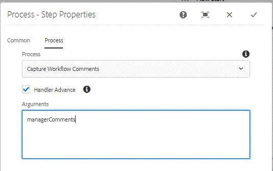

# 在自适应Forms Workflow{#capturing-workflow-comments-in-adaptive-forms-workflow}中捕获工作流注释

>[仅适用于AEM Forms6.4。在AEM Forms6.5中，请使用变量功能实现此用例]

一个常见请求是允许将任务审阅人输入的注释包含在电子邮件中。 在AEM Forms6.4中，没有现成的机制来捕获用户输入的注释并将这些注释包含在电子邮件中。

为满足此要求，提供了一个范例OSGi捆绑包，它可用于捕获注释并将这些注释存储为工作流元数据属性。

以下屏幕截图显示了如何使用[AEM Workflow](http://localhost:4502/editor.html/conf/global/settings/workflow/models/CaptureComments.html)中的进程步骤来捕获注释并将它们存储为元数据属性。 “捕获工作流注释”是需要在流程步骤中使用的java类的名称。 您需要传递将包含注释的元数据属性名称。 在下面的屏幕截图中，managerComments是用于存储注释的元数据属性。

要在系统上测试此功能，请执行以下步骤：
* [确保将工作流中的流程步骤配置为使用捕获工作流注释](http://localhost:4502/editor.html/conf/global/settings/workflow/models/CaptureComments.html)

* [使用服务用户包部署开发](/help/forms/assets/common-osgi-bundles/DevelopingWithServiceUser.jar)

* [部署SetValue包](/help/forms/assets/common-osgi-bundles/SetValueApp.core-1.0-SNAPSHOT.jar)。此捆绑包包含用于捕获注释并将其存储为元数据属性的示例代码

* [将与本文相关的资产下载并解压缩到您的文件](assets/capturecomments.zip) 系统中资产包含工作流模型和示例自适应表单。

* 使用包管理器将2个zip文件导入AEM

* [预览表单，方法是浏览到此URL](http://localhost:4502/content/dam/formsanddocuments/capturecomments/jcr:content?wcmmode=disabled)

* 填写表单字段并提交表单

* [检查AEM收件箱](http://localhost:4502/aem/inbox)

* 从收件箱中打开任务并提交表单。 请在出现提示时输入一些评论。

注释将存储在crx中名为managerComments的元数据属性中。 以管理员身份检查注释登录到crx。 工作流实例存储在以下路径中

/var/workflow/instances/server0

选择相应的工作流实例，并在元数据节点中检查属性管理器注释。

