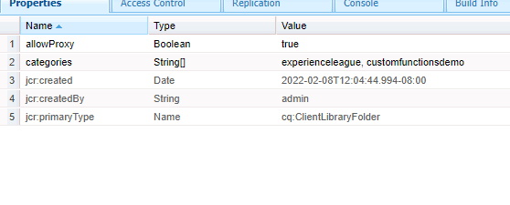

# 自定义函数

AEM Forms 6.5引入了定义JavaScript函数的功能，这些函数可用于使用规则编辑器定义复杂的业务规则。
AEM Forms提供了许多此类开箱即用的自定义函数，但您将需要定义自己的自定义函数并在多个表单中使用它们。

要定义您的第一个自定义函数，请执行以下步骤：
* [登录crx](http://localhost:4502/crx/de/index.jsp#/apps/experience-league/clientlibs)
* 在名为experience-league的应用程序下创建新文件夹（您可以选择此文件夹名称）
* 保存更改。
* 在experience-league文件夹下，创建一个名为clientlibs的cq:ClientLibraryFolder类型的新节点。
* 选择新创建的clientlibs文件夹，并添加屏幕快照中显示的allowProxy和类别属性，并保存您所做的更改。


* 创建名为 **js** 下 **clientlibs** 文件夹
* 创建一个名为 **functions.js** 下 **js** 文件夹
* 创建一个名为 **js.txt** 下 **clientlibs** 文件夹。 保存更改。
* 文件夹结构应类似于下面的屏幕截图。


* 双击functions.js以打开编辑器。
将以下代码复制到functions.js中，并保存您所做的更改。

```javascript
/**
* Get List of County names
* @name getCountyNamesList Get list of county names
* @return {OPTIONS} drop down options 
 */
function getCountyNamesList()
{
    var countyNames= [];
    countyNames[0] = "Santa Clara";
    countyNames[1] = "Alameda";
    countyNames[2] = "Buxor";
    countyNames[3] = "Contra Costa";
    countyNames[4] = "Merced";

    return countyNames;

}
/**
* Covert UTC to Local Time
* @name convertUTC Convert UTC Time to Local Time
* @param {string} strUTCString in Stringformat
* @return {string}
*/
function convertUTC(strUTCString)
{
    var dt = new Date(strUTCString);
    console.log(dt.toLocaleString());
    return dt.toLocaleString();
}
```

请 [请参阅jsdoc ](https://jsdoc.app/index.html)有关对javascript函数添加注释的更多详细信息。
上述代码具有两个函数：
**getCountyNamesList**  — 返回字符串数组
**convertUTC**  — 将UTC时间戳转换为本地时区

打开js.txt并粘贴以下代码，然后保存更改。

```javascript
#base=js
functions.js
```

#base=js行指定JavaScript文件位于哪个目录中。
以下各行指示JavaScript文件相对于基本位置的位置。

如果您在创建自定义函数时遇到问题，请随时 [下载并安装此包](assets/custom-functions.zip) 在AEM实例中。

## 使用自定义函数

以下视频将指导您完成在自适应表单的规则编辑器中使用自定义函数涉及的步骤
>[!VIDEO](https://video.tv.adobe.com/v/340305?quality=12&learn=on)
