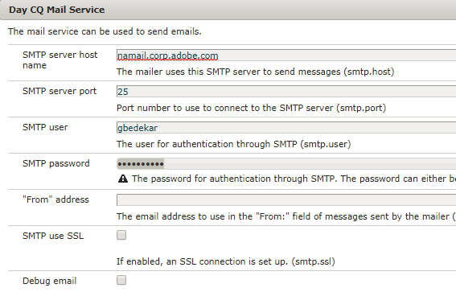

# 使用Forms Workflow的“发送电子邮件”步骤 {#using-send-email-step-of-forms-workflow}

AEM Forms 6.4中引入了“发送电子邮件”步骤。通过此步骤，我们可以构建业务流程或工作流，从而允许您发送带有或不带有附件的电子邮件。 以下视频介绍了配置发送电子邮件组件的步骤。

>[!VIDEO](https://video.tv.adobe.com/v/21499?quality=12&learn=on)

作为本文的一部分，我们将引导您完成以下用例：

1. 用户填写休假请求表单
1. 在提交表单时，会触发AEM Workflow
1. AEM Workflow利用发送电子邮件组件发送包含DoR作为附件的电子邮件

在使用“发送电子邮件”步骤之前，请确保从以下位置配置Day CQ邮件服务 [configMgr](http://localhost:4502/system/console/configMgr). 提供特定于您的环境的值

作为与本文关联的资源的一部分，您将获得以下内容

1. 自适应表单，提交时将触发工作流
1. 将发送带有DOR作为附件的电子邮件的示例工作流
1. 创建元数据属性的OSGi包

要在系统上运行示例，请执行以下操作：

1. [部署Developing withserviceuser捆绑包](/help/forms/assets/common-osgi-bundles/DevelopingWithServiceUser.jar)

1. [下载并安装setvalue包](/help/forms/assets/common-osgi-bundles/SetValueApp.core-1.0-SNAPSHOT.jar)此捆绑包包含用于在工作流的流程步骤中创建元数据属性的代码。
1. [配置Day CQ邮件服务](https://helpx.adobe.com/experience-manager/6-5/sites/administering/using/notification.html)
1. [使用包管理器将与此文章关联的资产导入和安装到CRX中](assets/emaildoraemformskt.zip)
1. 启动 [自适应表单](http://localhost:4502/content/dam/formsanddocuments/helpx/timeoffrequestform/jcr:content?wcmmode=disabled). 填写必填字段并提交。
1. 您应会收到一封包含DocumentOfRecord作为附件的电子邮件

探索 [工作流模型](http://localhost:4502/editor.html/conf/global/settings/workflow/models/emaildor.html)

了解工作流的流程步骤。 与流程步骤关联的自定义代码将创建元数据属性名称，并根据提交的数据设置其值。然后，发送电子邮件组件会使用这些值。

>[!NOTE]
>
>在AEM Forms 6.5及更高版本中，您不需要此自定义代码来创建元数据属性。 请使用AEM Workflow中的变量功能

确保按照以下屏幕快照配置发送电子邮件组件的附件选项卡
“DOR.pdf”值必须与在自适应表单的提交选项中指定的记录文档路径中指定的值匹配。
