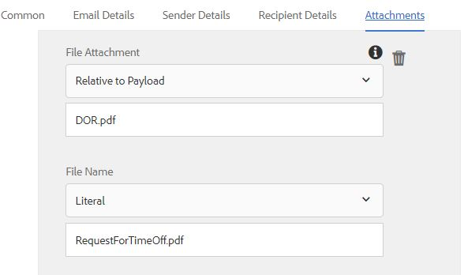

# 使用发送电子邮件步骤Forms Workflow {#using-send-email-step-of-forms-workflow}

“发送电子邮件”步骤在AEM Forms 6.4中引入。使用此步骤，我们可以构建业务流程或工作流，以便您发送包含或不包含附件的电子邮件。 以下视频将演示配置发送电子邮件组件的步骤。

>[!VIDEO](https://video.tv.adobe.com/v/21499/?quality=9&learn=on)

在本文中，我们将指导您完成以下用例：

1. 用户填写请求结束时间表
1. 提交表单时，会触发AEM工作流
1. AEM工作流利用“发送电子邮件”组件以DoR作为附件发送电子邮件

在使用“发送电子邮件”步骤之前，请确保从[configMgr](http://localhost:4502/system/console/configMgr)配置Day CQ Mail服务。 提供特定于您的环境的值

作为与本文关联的资产的一部分，您将获得以下信息

1. 自适应表单，在提交时触发工作流
1. 将以DOR作为其附件发送电子邮件的示例工作流
1. 用于创建元数据属性的OSGi包

要在您的系统上运行示例，请执行以下操作：

1. [部署Developmingwithserviceuser包](/help/forms/assets/common-osgi-bundles/DevelopingWithServiceUser.jar)

1. [下载和安装setvalue包](/help/forms/assets/common-osgi-bundles/SetValueApp.core-1.0-SNAPSHOT.jar)此包包含用于在工作流的流程步骤中创建元数据属性的代码。
1. [配置Day CQ Mail Service](https://helpx.adobe.com/experience-manager/6-5/sites/administering/using/notification.html)
1. [使用包管理器将与本文关联的资产导入和安装到CRX中](assets/emaildoraemformskt.zip)
1. 启动[自适应表单](http://localhost:4502/content/dam/formsanddocuments/helpx/timeoffrequestform/jcr:content?wcmmode=disabled)。 填写必填字段并提交。
1. 您应会收到一封电子邮件，其中DocumentOfRecord作为附件

浏览[工作流模型](http://localhost:4502/editor.html/conf/global/settings/workflow/models/emaildor.html)

了解工作流的流程步骤。 与流程步骤关联的自定义代码将创建元数据属性名称，并根据提交的数据设置其值。这些值随后由发送电子邮件组件使用。

>[!NOTE]
>
>在AEM Forms 6.5及更高版本中，您无需此自定义代码即可创建元数据属性。 请使用AEM工作流中的变量功能

确保根据以下屏幕快照，将“发送电子邮件”组件的“附件”选项卡配置为
“DOR.pdf”值必须与自适应表单提交选项中指定的“记录路径文档”路径中指定的值匹配。

