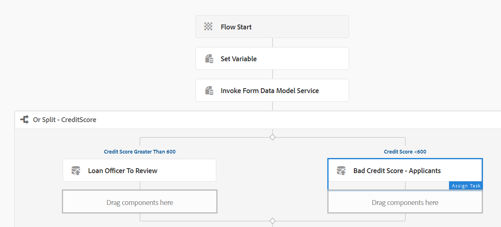

# 在AEM 6.5工作流中将表单数据模型服务用作步骤 {#using-form-data-model-service-as-step-in-workflow}

从AEM Forms 6.4开始，我们现在能够将表单数据模型服务用作AEM Workflow的一部分。 以下视频介绍了在AEM Workflow中配置表单数据模型步骤所需的步骤

>本视频中演示的功能需要使用AEM Forms 6.5.1

>[!VIDEO](https://video.tv.adobe.com/v/28145?quality=12&learn=on)

要在您的服务器上测试此功能，请按照以下说明操作

* 使用SampleRest.war文件设置tomcat，如所述 [此处](https://helpx.adobe.com/experience-manager/kt/forms/using/preparing-datasource-for-form-data-model-tutorial-use.html)在Tomcat中部署的war文件具有返回申请人的信用分数的代码。信用分数是200到800之间的随机数

* [使用包管理器将资源导入AEM](assets/aem65-loanapplication.zip)
* 该软件包包含以下内容：

   * 使用FDM步骤的工作流模型。
   * FDM步骤中使用的表单数据模型。
   * 自适应表单在提交时触发工作流。
* 打开 [MortgageApplicationForm](http://localhost:4502/content/dam/formsanddocuments/loanapplication/jcr:content?wcmmode=disabled). 填写详细信息并提交。 在提交表单时 [贷款申请工作流](http://http://localhost:4502/editor.html/conf/global/settings/workflow/models/LoanApplication2.html) 触发。

.
如果信用评分超过500，工作流将利用“或拆分”组件将申请路由给管理员。 如果信用评分低于500，则申请将被转交cavery。
