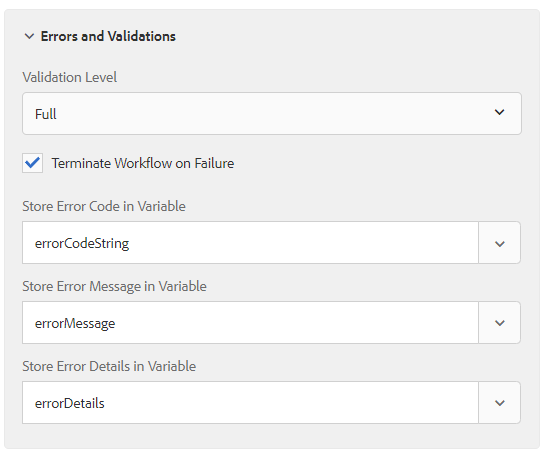

# 在调用表单数据模型服务步骤中捕获错误消息

从AEM Forms 6.5.1开始，我们现在可以选择捕获错误消息并指定验证选项。 已增强调用表单数据模型服务步骤，以提供以下功能。

* 提供三层验证（“OFF”、“BASIC”和“FULL”）选项，以处理调用表单数据模型服务时遇到的异常。 这3个选项依次表示检查数据库特定要求的更严格版本。
  

* 提供用于自定义工作流执行的复选框。 因此，用户现在可以灵活地执行工作流，即使调用表单数据模型步骤引发异常也是如此。

* 存储因验证异常引起的错误的重要信息。 引入了三个自动完成类型的变量选择器，用于选择相关变量以存储ErrorCode(String)、ErrorMessage(String)和ErrorDetails(JSON)。 但是，如果异常不是DermisValidationException，则ErrorDetails将设置为null。
  

通过这些更改，调用表单数据模型服务步骤确保输入值遵守swagger文件中提供的数据约束。 例如，当accountId和余额值不符合swagger文件中指定的数据约束时，将引发以下错误消息。

```json
{
    "errorCode": "AEM-FDM-001-049"
    "errorMessage": "Input validations failed during operation execution"
    "violations": {
        "/accountId": ["numeric instance is greater than the required maximum (maximum: 20, found: 97)"],
        "/newAccount/balance": ["instance type (string) does not match any allowed primitive type (allowed: [\"integer\",\"number\"])"]
    }   
}
```
