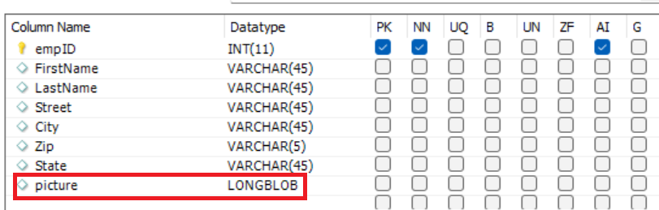

# 在数据库中插入表单附件

本文将介绍在MySQL数据库中存储表单附件的用例。

客户的常见要求是将捕获的表单数据和表单附件存储在数据库表中。
要完成此用例，请执行以下步骤

## 创建数据库表以保存表单数据和附件

创建了名为newhire的表以保存表单数据。 请注意类型的列名称图片 **长斑** 用于存储附件表单


## 创建表单数据模型

创建表单数据模型以与MySQL数据库通信。 您需要创建以下内容

* [AEM中的JDBC数据源](./data-integration-technical-video-setup.md)
* [基于JDBC数据源的表单数据模型](./jdbc-data-model-technical-video-use.md)

## 创建工作流

将自适应表单配置为提交到AEM工作流后，您可以选择在工作流变量中保存表单附件，或在有效负荷下将附件保存在指定的文件夹中。 对于此用例，我们需要将附件保存在“文档数组列表”类型的工作流变量中。 从此ArrayList中，我们需要提取第一个项目并初始化文档变量。 称为的工作流变量 **listOfDocuments** 和 **employeePhoto** 创建。
提交自适应表单以触发工作流后，工作流中的一个步骤将使用ECMA脚本初始化employeePhoto变量。 以下是ECMA脚本代码

```javascript
log.info("executing script now...");
var metaDataMap = graniteWorkItem.getWorkflow().getWorkflowData().getMetaDataMap();
var listOfAttachments = [];
// Make sure you have a workflow variable caled listOfDocuments defined
listOfAttachments = metaDataMap.get("listOfDocuments");
log.info("$$$  got listOfAttachments");
//Make sure you have a workflow variable caled employeePhoto defined
var employeePhoto = listOfAttachments[0];
metaDataMap.put("employeePhoto", employeePhoto);
log.info("Employee Photo updated");
```

工作流中的下一步是使用调用表单数据模型服务组件将数据和表单附件插入到表中。

[可从此处下载包含示例ecma脚本的完整工作流](assets/add-new-employee.zip).

>[!NOTE]
> 您必须创建新的基于JDBC的表单数据模型，并在工作流中使用该表单数据模型

## 创建自适应表单

根据前面步骤中创建的表单数据模型创建自适应表单。 将表单数据模型元素拖放到表单上。 配置表单提交以触发工作流，并指定以下属性，如以下屏幕快照所示
