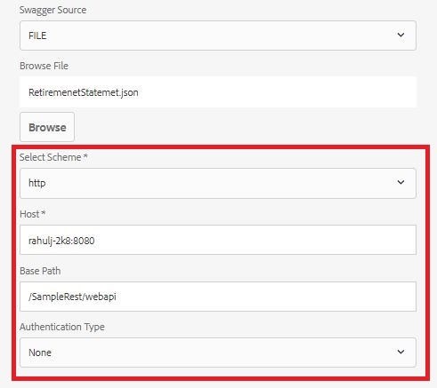

# 能够修改数据源配置设置{#ability-to-modify-data-source-configuration-settings}

在AEM Forms 6.4版本发布之前，配置数据源后，您无法更改RESTful服务的方案、主机和基本路径。 如果您希望针对不同的环境测试数据源，这会产生问题。

随着AEM Forms 6.5的发布，您现在可以轻松更改上述资产。 凭借这项新功能，您现在可以根据开发环境创建表单数据模型，在对结果感到满意后，您可以更改属性以指向其他环境。

以下屏幕截图显示了AEM Forms 6.4和Forms 6.5中的数据源配置设置

**AEM 6.4中的数据源配置**

**AEM 6.5及更高版本中的可编辑数据源配置**

