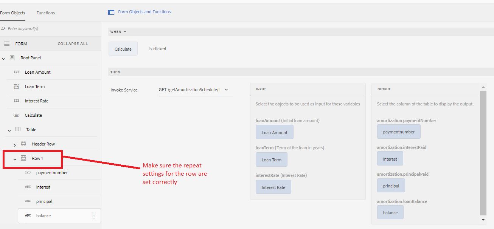

# 使用表单数据模型服务调用的结果填充自适应表单表

[将在此处托管实](https://forms.enablementadobe.com/content/dam/formsanddocuments/amortization/jcr:content?wcmmode=disabled)
时表单在本文中，我们通过从表单数据模型服务调用中获取数据来查看如何填充自适应表单表。我们将在表格中创建一个摊销时间表，列出一段时间内每一笔抵押贷款的定期付款。 摊销结果由我们的表单数据模型返回。 表单数据模型的服务将在计算按钮的点击事件中调用，如屏幕截图所示。 服务调用的输入和输出参数被正确映射，如屏幕快照中所示。 输出已映射到Row1的列

Row1配置为根据服务调用返回的数据而增长。 请注意此处指定的重复设置。 值为–1表示表中的行数不限

## 在您的服务器上部署此组件

[按此处指定的方](/help/forms/ic-print-channel-tutorial/set-up-tomcat.md)
[式安装Tomcat部署此zip文件中包含的SampleRest.war](https://experienceleague.adobe.com/docs/experience-manager-learn/forms/assets/common-osgi-bundles/sample-rest.zip)
[文件使用AEM包管理器 ](assets/amortizationschedule.zip) 安装资产打开摊销计划表

单输入相应值并单击计算摊销计划应在您的表单中填充

