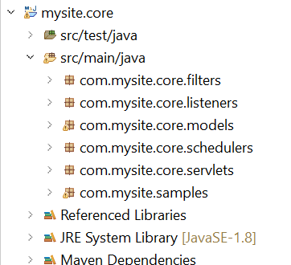

# 创建您的第一个OSGi捆绑包

OSGi捆绑包是一个Java™存档文件，其中包含Java代码、资源以及描述捆绑包及其依赖关系的清单。 捆绑是应用程序的部署单元。 本文适用于希望使用AEM Forms 6.4或6.5创建OSGi服务或servlet的开发人员。要构建您的第一个OSGi捆绑包，请执行以下步骤：


## 安装JDK

安装支持的JDK版本。 我使用的是JDK1.8。确保已在环境变量中添加了&#x200B;**JAVA_HOME**，并且指向JDK安装的根文件夹。
将%JAVA_HOME%/bin添加到路径中


>[!NOTE]
> 请勿使用JDK 15。 AEM不支持它。

### 测试您的JDK版本

打开新的命令提示符窗口并键入： `java -version`。 您应该获取由`JAVA_HOME`变量标识的JDK版本


## 安装Maven

Maven是一种构建自动化工具，主要用于Java项目。 请按照以下步骤在本地系统上安装maven。

* 在C驱动器中创建名为`maven`的文件夹
* 下载[二进制zip存档](https://maven.apache.org/download.cgi)
* 将zip存档的内容提取到`c:\maven`
* 使用值`C:\maven\apache-maven-3.6.0`创建一个名为`M2_HOME`的环境变量。 在我的示例中，**mvn**&#x200B;版本是3.6.0。在撰写本文时，最新的maven版本是3.6.3
* 将`%M2_HOME%\bin`添加到您的路径
* 保存更改
* 打开新的命令提示符并键入`mvn -version`。 您应该会看到如下面的屏幕快照中所示的&#x200B;**mvn**&#x200B;版本


## 安装Eclipse

安装最新版本的[eclipse](https://www.eclipse.org/downloads/)

## 创建您的第一个项目

Archetype是一个Maven项目模板工具包。 原型被定义为原始阵列或模型，所有同类的其他事物都通过它来制造。 此名称适合我们尝试提供的系统，该系统提供生成Maven项目的一致方法。 Archetype可帮助作者为用户创建Maven项目模板，并为用户提供生成这些项目模板的参数化版本的方法。
要创建您的第一个maven项目，请执行以下步骤：

* 在C驱动器中创建一个名为`aemformsbundles`的新文件夹
* 打开命令提示符并导航到`c:\aemformsbundles`
* 在命令提示符下运行以下命令

```java
mvn -B org.apache.maven.plugins:maven-archetype-plugin:3.2.1:generate -D archetypeGroupId=com.adobe.aem -D archetypeArtifactId=aem-project-archetype -D archetypeVersion=36 -D appTitle="My Site" -D appId="mysite" -D groupId="com.mysite" -D aemVersion=6.5.13
```

成功完成后，您应在命令窗口中看到生成成功消息

## 从maven项目创建eclipse项目

* 将工作目录更改为`mysite`
* 从命令行执行`mvn eclipse:eclipse`。 该命令可读取您的pom文件并使用正确的元数据创建Eclipse项目，以便Eclipse了解项目类型、关系、类路径等。

## 将项目导入eclipse

启动&#x200B;**Eclipse**

转到&#x200B;**文件 — >导入**&#x200B;并选择&#x200B;**现有Maven项目**，如下所示


单击“下一步”

通过单击&#x200B;**浏览**&#x200B;按钮选择c：\aemformsbundles\mysite


>[!NOTE]
>您可以根据需要选择导入相应的模块。 仅当要在项目中创建Java代码时，才选择并导入核心模块。

单击&#x200B;**完成**&#x200B;以开始导入过程

项目已导入到Eclipse中，并且您看到许多`mysite.xxxx`文件夹

展开`mysite.core`文件夹下的`src/main/java`。 这是在其中编写大部分代码的文件夹。



## 包含AEMFD客户端SDK

您需要在项目中包含AEMFD客户端SDK，以利用AEM Forms随附的各种服务。 请参阅[AEMFD客户端SDK](https://mvnrepository.com/artifact/com.adobe.aemfd/aemfd-client-sdk)以在您的Maven项目中包含相应的客户端SDK。 您必须将AEM FD客户端SDK包含在核心项目`pom.xml`的依赖关系部分中，如下所示。

```xml
<dependency>
    <groupId>com.adobe.aemfd</groupId>
    <artifactId>aemfd-client-sdk</artifactId>
    <version>6.0.122</version>
</dependency>
```

要构建项目，请执行以下步骤：

* 打开&#x200B;**命令提示符窗口**
* 导航到`c:\aemformsbundles\mysite\core`
* 执行命令`mvn clean install -PautoInstallBundle`
上述命令在`http://localhost:4502`上运行的AEM服务器中生成并安装捆绑包。 该捆绑包还可在文件系统上获得，网址为
  `C:\AEMFormsBundles\mysite\core\target`并且可以使用[Felix Web控制台](http://localhost:4502/system/console/bundles)进行部署

## 后续步骤

[创建OSGi服务](./create-osgi-service.md)

