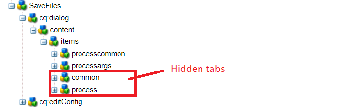
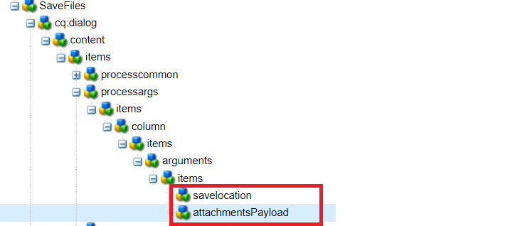

# 自定义工作流组件

本教程面向需要创建自定义工作流组件的AEM Forms客户。 工作流组件将配置为执行在上一步中编写的代码。 工作流组件能够为代码指定进程参数。 在本文中，我们将探讨与代码关联的工作流组件。

[下载自定义工作流组件](assets/saveFiles.zip)
使用包管理器[&#128279;](http://localhost:4502/crx/packmgr/index.jsp)导入工作流组件

自定义工作流组件位于/apps/AEMFormsDemoListings/workflowcomponent/SaveFiles中

选择SaveFiles节点并检查其属性

**componentGroup** — 此属性的值确定工作流组件的类别。

**jcr：Title** — 这是工作流组件的标题。

**sling：resourceSuperType**&#x200B;此属性的值将决定此组件的继承。 在这种情况下，我们继承了流程组件

## cq：dialog

对话框用于允许作者与组件交互。 cq：dialog位于SaveFiles节点下

项目节点下的节点表示作者将与组件交互的组件选项卡。 “常用”和“流程”选项卡处于隐藏状态。 “常用”和“参数”选项卡可见。

进程的进程参数位于processargs节点下

作者指定参数，如下面的屏幕快照中所示

这些值将存储为元数据节点的属性。 例如，值&#x200B;**c：\formsattachments**&#x200B;将存储在元数据节点的属性saveToLocation中

## cq：editConfig

cq：EditConfig只是组件根目录下具有主类型cq：EditConfig和名称cq：editConfig的节点
组件的编辑行为通过在组件节点下添加cq：EditConfig类型（cq：Component类型）的cq：editConfig节点来配置

cq：formParameters （节点类型nt：unstructured）：定义添加到对话框表单的其他参数。

注意cq：formParameters节点的属性

属性PROCESS的值指示将与工作流组件关联的Java代码。
