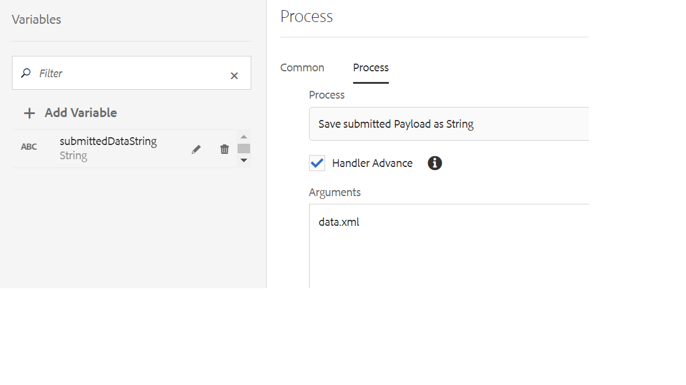

# 提取绑定数据并将其保存在字符串变量中

利用此功能，可将提交的数据包含在电子邮件正文中。 自定义流程步骤会提取 **绑定数据** 从自适应表单提交中，并使用数据填充字符串类型的变量。 然后，您可以使用此字符串变量将数据插入电子邮件模板。
以下屏幕快照显示了您需要传递到自定义流程步骤的参数


以下是参数

* `data.xml`  — 包含已提交数据的文件。 如果格式为json，则文件名可以是data.json

然后，自定义流程步骤将提取绑定的数据并将其存储在工作流中定义的submittedDataString变量中


[可从此处下载自定义包](assets/AEMFormsProcessStep.core-1.0.0-SNAPSHOT.jar)

```java
package AEMFormsProcessStep.core;
import com.adobe.granite.workflow.metadata.MetaDataMap;
import com.adobe.granite.workflow.WorkflowException;
import com.adobe.granite.workflow.WorkflowSession;
import com.adobe.granite.workflow.exec.WorkItem;
import org.slf4j.Logger;
import org.slf4j.LoggerFactory;
import org.osgi.service.component.annotations.Component;
import com.adobe.granite.workflow.exec.WorkflowProcess;
import javax.jcr.Session;
import com.google.gson.Gson;
import com.google.gson.JsonObject;
import javax.xml.parsers.DocumentBuilderFactory;
import javax.xml.transform.OutputKeys;
import javax.xml.transform.Transformer;
import javax.xml.transform.TransformerFactory;
import javax.xml.transform.dom.DOMSource;
import javax.xml.transform.stream.StreamResult;
import javax.xml.xpath.XPath;
import javax.xml.xpath.XPathConstants;
import javax.xml.xpath.XPathFactory;
import org.w3c.dom.Document;
import javax.xml.parsers.DocumentBuilder;

import java.io.BufferedReader;
import java.io.InputStream;
import java.io.InputStreamReader;
import java.io.StringWriter;

import javax.jcr.Node;

@Component(property = {
  "service.description=Save submitted Payload as String",
  "process.label=Save submitted Payload as String"
})
public class SaveSubmittedDataInStringVariable implements WorkflowProcess {
  private Logger log;

  @Override
  public void execute(WorkItem workItem, WorkflowSession workflowSession, MetaDataMap metaDataMap) throws WorkflowException {

    String submittedDataFile = ((String) metaDataMap.get("PROCESS_ARGS", (Object)
      "string")).toString();
    String payloadPath = workItem.getWorkflowData().getPayload().toString();
    log = LoggerFactory.getLogger(SaveSubmittedDataInStringVariable.class);

    String dataFilePath = payloadPath + "/" + submittedDataFile + "/jcr:content";
    Session session = (Session) workflowSession.adaptTo((Class) Session.class);
    Node submittedDataNode = null;
    try {
      submittedDataNode = session.getNode(dataFilePath);
      if (submittedDataFile.endsWith("json")) {
        InputStream jsonDataStream = submittedDataNode.getProperty("jcr:data").getBinary().getStream();
        BufferedReader streamReader = new BufferedReader(new InputStreamReader(jsonDataStream, "UTF-8"));
        StringBuilder responseStrBuilder = new StringBuilder();
        String inputStr;
        while ((inputStr = streamReader.readLine()) != null) {
          responseStrBuilder.append(inputStr);
        }
        JsonObject jsonObject = new Gson().fromJson(responseStrBuilder.toString(), JsonObject.class);
        JsonObject boundData = jsonObject.getAsJsonObject("afData").getAsJsonObject("afBoundData").getAsJsonObject("data");
        System.out.println(jsonObject.getAsJsonObject("afData").getAsJsonObject("afBoundData").getAsJsonObject("data"));
        metaDataMap = workItem.getWorkflow().getWorkflowData().getMetaDataMap();
        metaDataMap.put("submittedDataString", boundData.toString());

      }
      if (submittedDataFile.endsWith("xml")) {
        log.debug("Got xml file");
        DocumentBuilderFactory factory = null;
        DocumentBuilder builder = null;
        Document xmlDocument = null;
        InputStream xmlDataStream = submittedDataNode.getProperty("jcr:data").getBinary().getStream();
        System.out.println("Got xml file" + submittedDataNode);
        XPath xPath = XPathFactory.newInstance().newXPath();
        factory = DocumentBuilderFactory.newInstance();
        builder = factory.newDocumentBuilder();
        xmlDocument = builder.parse(xmlDataStream);

        org.w3c.dom.Node node = (org.w3c.dom.Node) xPath.compile("/afData/afBoundData").evaluate(xmlDocument, XPathConstants.NODE);
        Transformer transformer = TransformerFactory.newInstance().newTransformer();
        transformer.setOutputProperty(OutputKeys.INDENT, "yes");
        StreamResult result = new StreamResult(new StringWriter());
        DOMSource source = new DOMSource(node);
        transformer.transform(source, result);
        String xmlString = result.getWriter().toString();
        log.debug("The xml string is " + xmlString);
        metaDataMap = workItem.getWorkflow().getWorkflowData().getMetaDataMap();
        metaDataMap.put("submittedDataString", xmlString);
      }

    } catch (Exception e) {
      
      log.debug(e.getMessage());
    }

  }

}
```
