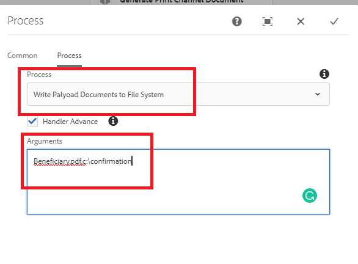

# 将文档写入文件系统

常见的用例是将工作流中生成的文档写入文件系统。
该自定义工作流流程步骤使得将工作流文档写入文件系统变得容易。
自定义流程采用以下逗号分隔的参数

```java
ChangeBeneficiary.pdf,c:\confirmation
```

第一个参数是要保存到文件系统中的文档的名称。 第二个参数是要保存文档的文件夹位置。 例如，在上述使用案例中，文档被写入 `c:\confirmation\ChangeBeneficiary.pdf`

以下屏幕抓图显示了您需要传递给自定义流程步骤的参数


[可从此处下载自定义捆绑包](/help/forms/assets/common-osgi-bundles/SetValueApp.core-1.0-SNAPSHOT.jar)
