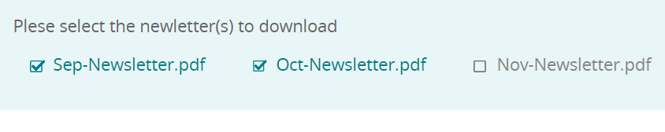

# 将项目动态添加到选择组组件

AEM Forms 6.5引入了将项目动态添加到自适应Forms选择组组件（如复选框、单选按钮和图像列表）的功能。 在本文中，我们将讨论使用DAM文件夹内容填充选择组组件的用例。 在屏幕快照中，这3个文件位于名为新闻稿的文件夹中。每次向文件夹中添加新新闻稿时，都会更新选择组组件以自动列出其内容。 用户可以选择一个或多个要下载的新闻稿。



## 创建servlet以返回DAM文件夹内容

编写了以下代码以返回JSON格式的DAM文件夹内容。

```java
package com.newsletters.core.servlets;
import static com.day.cq.commons.jcr.JcrConstants.JCR_CONTENT;
import java.io.IOException;
import java.io.PrintWriter;
import java.util.ArrayList;
import java.util.List;
import javax.servlet.Servlet;
import org.apache.sling.api.SlingHttpServletRequest;
import org.apache.sling.api.SlingHttpServletResponse;
import org.apache.sling.api.resource.Resource;
import org.apache.sling.api.servlets.SlingSafeMethodsServlet;
import org.osgi.service.component.annotations.Component;
import org.slf4j.Logger;
import org.slf4j.LoggerFactory;
import com.google.gson.Gson;
import com.google.gson.JsonObject;

@Component(service = {
  Servlet.class
}, property = {
  "sling.servlet.methods=get",
  "sling.servlet.paths=/bin/listfoldercontents"
})
public class ListFolderContent extends SlingSafeMethodsServlet {
  private static final long serialVersionUID = 1 L;
  private static final Logger log = LoggerFactory.getLogger(ListFolderContent.class);
  protected void doGet(SlingHttpServletRequest request, SlingHttpServletResponse response) {
    Resource resource = request.getResourceResolver().getResource(request.getParameter("damFolder"));
    List < JsonObject > results = new ArrayList < > ();
    resource.getChildren().forEach(child -> {
      if (!JCR_CONTENT.equals(child.getName())) {
        JsonObject asset = new JsonObject();
        log.debug("##The child name is " + child.getName());
        asset.addProperty("assetname", child.getName());
        asset.addProperty("assetpath", child.getPath());
        results.add(asset);

      }
    });
    PrintWriter out = null;
    try {
      out = response.getWriter();
    } catch (IOException e) {

      log.debug(e.getMessage());
    }
    response.setContentType("application/json");
    response.setCharacterEncoding("UTF-8");
    Gson gson = new Gson();
    out.print(gson.toJson(results));
    out.flush();
  }

}
```

## 使用JavaScript功能创建客户端库

从JavaScript函数调用此servlet。 此函数返回一个数组对象，该对象将用于填充选项组组件

```javascript
/**
 * Populate drop down/choice group  with assets from specified folder
 * @return {string[]} 
 */
function getDAMFolderAssets(damFolder) {
   // strUrl is whatever URL you need to call
   var strUrl = '/bin/listfoldercontents?damFolder=' + damFolder;
   var documents = [];
   $.ajax({
      url: strUrl,
      success: function(jsonData) {
         for (i = 0; i < jsonData.length; i++) {
            documents.push(jsonData[i].assetpath + "=" + jsonData[i].assetname);
         }
      },
      async: false
   });
   return documents;
}
```

## 创建自适应表单

创建自适应表单并将表单与客户端库&#x200B;**listfolderassets**关联。 将复选框组件添加到表单。 使用规则编辑器填充屏幕快照中显示的复选框选项


我们正在调用名为&#x200B;**getDAMFolderAssets**&#x200B;的javascript函数，并在表单中传递要列出的DAM文件夹资源的路径。

## 后续步骤

[汇编选定的Assets](./assemble-selected-newsletters.md)
