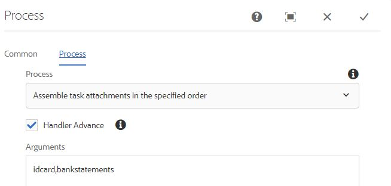

# 组合表单附件

本文提供按指定顺序组合自适应表单附件的资源。 此示例代码需要采用PDF格式才能使用表单附件。 用例如下所示。
用户填写自适应表单会将一个或多个PDF文档附加到表单。
在提交表单时，组合表单附件以生成一个PDF。 您可以指定装配附件以生成最终PDF的顺序。

## 创建实施WorkflowProcess接口的OSGi组件

创建实现[com.adobe.granite.workflow.exec.WorkflowProcess接口](https://helpx.adobe.com/experience-manager/6-5/sites/developing/using/reference-materials/javadoc/com/adobe/granite/workflow/exec/WorkflowProcess.html)的OSGi组件。 此组件中的代码可以与AEM工作流中的流程步骤组件关联。 在此组件中实现了接口com.adobe.granite.workflow.exec.WorkflowProcess的执行方法。

在提交自适应表单以触发AEM工作流时，提交的数据将存储在有效负荷文件夹下的指定文件中。 例如，这是提交的数据文件。 我们需要组合idcard和bankstatements标签下指定的附件。
。

### 获取标记名称

附件的顺序指定为工作流中的流程步骤参数，如下面的屏幕快照所示。 在这里，我们将组合添加到字段标识卡的附件，其后是银行报表



以下代码片段从进程参数中提取附件名称

```java
String  []attachmentNames  = arg2.get("PROCESS_ARGS","string").toString().split(",");
```

### 从附件名称创建DDX

然后，我们需要创建[文档描述XML (DDX)](https://helpx.adobe.com/pdf/aem-forms/6-2/ddxRef.pdf)文档，该文档由汇编程序服务用于汇编文档。 下面是从进程参数创建的DDX。 利用NoForms元素，可在组装基于XFA的文档之前将其扁平化。 请注意，PDF源元素的顺序在进程参数中指定的是正确的。


### 创建文档映射

然后，我们将创建以附件名称为键且附件为值的文档映射。 查询生成器服务用于查询有效负荷路径下的附件并生成文档映射。 汇编程序服务需要此文档映射和DDX来汇编最终pdf。

```java
public Map<String, Object> createMapOfDocuments(String payloadPath,WorkflowSession workflowSession )
{
  Map<String, String> queryMap = new HashMap<String, String>();
  Map<String,Object>mapOfDocuments = new HashMap<String,Object>();
  queryMap.put("type", "nt:file");
  queryMap.put("path",payloadPath);
  Query query = queryBuilder.createQuery(PredicateGroup.create(queryMap),workflowSession.adaptTo(Session.class));
  query.setStart(0);
  query.setHitsPerPage(30);
  SearchResult result = query.getResult();
  log.debug("Get result hits "+result.getHits().size());
  for (Hit hit : result.getHits()) {
    try {
          String path = hit.getPath();
          log.debug("The title "+hit.getTitle()+" path "+path);
          if(hit.getTitle().endsWith("pdf"))
           {
             com.adobe.aemfd.docmanager.Document attachmentDocument = new com.adobe.aemfd.docmanager.Document(path);
             mapOfDocuments.put(hit.getTitle(),attachmentDocument);
             log.debug("@@@@Added to map@@@@@ "+hit.getTitle());
           }
        }
    catch (Exception e)
       {
          log.debug(e.getMessage());
       }

}
return mapOfDocuments;
}
```

### 使用AssemblerService汇编文档

创建DDX和文档映射后，下一步是使用AssemblerService来组装文档。
以下代码组合并返回组合的pdf。

```java
private com.adobe.aemfd.docmanager.Document assembleDocuments(Map<String, Object> mapOfDocuments, com.adobe.aemfd.docmanager.Document ddxDocument)
{
    AssemblerOptionSpec aoSpec = new AssemblerOptionSpec();
    aoSpec.setFailOnError(true);
    AssemblerResult ar = null;
    try
    {
        ar = assemblerService.invoke(ddxDocument, mapOfDocuments, aoSpec);
        return (com.adobe.aemfd.docmanager.Document) ar.getDocuments().get("GeneratedDocument.pdf");
    }
    catch (OperationException e)
    {
        log.debug(e.getMessage());
    }
    return null;
    
}
```

### 将组合后的pdf保存在有效负荷文件夹下

最后一步是将组合后的PDF保存在有效负荷文件夹下。 然后，可在工作流的后续步骤中访问此PDF以进行进一步处理。
以下代码片段用于将该文件保存在有效负荷文件夹中

```java
Session session = workflowSession.adaptTo(Session.class);
javax.jcr.Node payloadNode =  workflowSession.adaptTo(Session.class).getNode(workItem.getWorkflowData().getPayload().toString());
log.debug("The payload Path is "+payloadNode.getPath());
javax.jcr.Node assembledPDFNode = payloadNode.addNode("assembled-pdf.pdf", "nt:file"); 
javax.jcr.Node jcrContentNode =  assembledPDFNode.addNode("jcr:content", "nt:resource");
Binary binary =  session.getValueFactory().createBinary(assembledDocument.getInputStream());
jcrContentNode.setProperty("jcr:data", binary);
log.debug("Saved !!!!!!"); 
session.save();
```

以下是组装并存储表单附件后的有效负荷文件夹结构。


### 使此功能在您的AEM服务器上正常工作

* 将[组合表单附件表单](assets/assemble-form-attachments-af.zip)下载到您的本地系统。
* 从[Forms和文档](http://localhost:4502/aem/forms.html/content/dam/formsanddocuments)页面导入表单。
* 下载[工作流](assets/assemble-form-attachments.zip)并使用包管理器导入到AEM中。
* 下载[自定义捆绑包](assets/assembletaskattachments.assembletaskattachments.core-1.0-SNAPSHOT.jar)
* 使用[Web控制台](http://localhost:4502/system/console/bundles)部署和启动捆绑包
* 将浏览器指向[组合附件表单](http://localhost:4502/content/dam/formsanddocuments/assembleattachments/jcr:content?wcmmode=disabled)
* 在ID文档中添加一个附件，并将几个pdf文档添加到银行对帐单部分
* 提交表单以触发工作流
* 检查crx](http://localhost:4502/crx/de/index.jsp#/var/fd/dashboard/payload)中工作流的[有效负荷文件夹中的已组合pdf

>[!NOTE]
> 如果已为自定义捆绑包启用了记录器，则DDX和组合的文件将写入AEM安装的文件夹。
