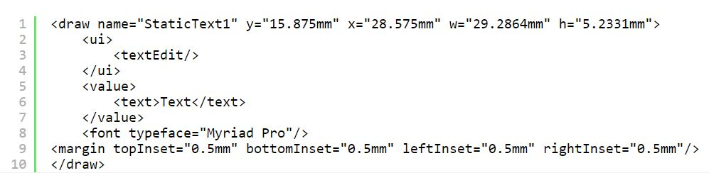
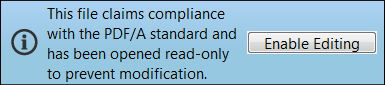

# PDF

可移植文档格式(PDF)实际上是一系列文件格式，本文详细介绍了与表单开发人员最相关的格式。 各种PDF类型的许多技术细节和标准都在不断演变和变化。 其中一些格式和规范是国际标准化组织(ISO)标准，还有一些是Adobe拥有的特定知识产权。

本文介绍如何创建各种类型的PDF。 它有助于您了解如何使用每种应用程序以及为什么使用它们。 所有这些类型在用于查看和使用PDF的Premier Client工具(Adobe Acrobat DC)中表现最佳。

以下是Acrobat DC中的PDF/A文件示例。

示例文件可以是 [从此处下载](assets/pdf-file-types.zip)

## XML Forms架构PDF(XFAPDF)

Adobe使用术语XFAPDF表单来引用您使用AEM Forms Designer创建的交互式和动态Forms。 使用Designer创建的Forms和文件基于Adobe的XML Forms架构(XFA)。 在许多方面，XFAPDF文件格式与HTML文件相比更接近PDF文件。 例如，以下代码显示了简单文本对象在XFAPDF文件中的外观。

XFA Forms基于XML。 这种结构良好且灵活的格式使AEM Forms Server能够将您的Designer文件转换为不同的格式，包括传统的PDF、PDF/A和HTML。 通过选择布局编辑器的“XML源”选项卡，可以在Designer中查看Forms的完整XML结构。 您可以在AEM Forms Designer中创建静态和动态XFA Forms。

## 静态PDF

静态XFAPDF forms布局在运行时从不更改，但可为用户交互操作。 以下是静态XFAPDF forms的一些优势：

* 静态XFAPDF forms布局在运行时从不更改，但可为用户交互操作。
* 静态Forms支持Acrobat的注释和标记工具。
* 静态Forms允许您导入和导出Acrobat注释。
* 静态Forms支持字体子设置，这种技术可以在AEM Forms服务器上完成。
* 静态Forms可以使用现代浏览器附带的内置PDF查看器渲染。

>[!NOTE]
>
> 您可以将XDP另存为“静态PDF表单”，从而使用AEM Forms Designer创建AdobePDF

### 动态Forms

动态XFAPDF可在运行时更改其布局，因此不支持注释和标记功能。 但是，动态XFAPDF具有以下优势：

* 动态表单支持可更改表单布局和分页的客户端脚本。 例如，如果您将Purchase Order.xdp另存为动态表单，它将进行扩展和分页以适应无限数量的数据
* 动态表单在运行时支持表单的所有属性，而静态表单仅支持一个子集

* [请参阅本文档以了解静态与动态PDF表单之间的差异](https://experienceleague.adobe.com/docs/experience-manager-learn/forms/document-services/pdf-forms-and-documents.html#:~:text=Dynamic%20forms%20support%20all%20the,forms%20support%20only%20a%20subset)

>[!NOTE]
>
> 您可以将XDP另存为Adobe动态XML表单，从而使用AEM Forms Designer创建动态PDF

>[!NOTE]
>
> 无法使用现代浏览器的内置的pdf查看器呈现动态表单。

### PDF文件(传统PDF)

经认证的文档为PDF文档和Forms接收者增加了其真实性和完整性的保证。

PDF格式中普遍使用且最流行的是传统的PDF文件。 创建传统PDF文件的方法多种多样，包括使用Acrobat和许多第三方工具。 Acrobat提供了以下所有创建传统PDF文件的方法。 如果您未安装Acrobat，则可能无法在计算机上看到这些选项。

* 通过捕获桌面应用程序的打印流：选择创作应用程序的“打印”命令，然后选择Adobe PDF打印机图标。 您创建的不是文档的打印副本，而是文档的PDF文件
* 通过将Acrobat PDFMaker插件与Microsoft Office应用程序一起使用：安装Acrobat时，它会将Adobe PDF菜单添加到Microsoft Office应用程序，并将图标添加到Office功能区。 您可以使用这些添加的功能直接在Microsoft Office中创建PDF文件
* 通过使用Acrobat Distiller将Postscript和封装的Postscript (EPS)文件转换为PDF：Distiller通常用于打印发布和其他需要从Postscript格式转换为PDF格式的工作流
* 实际上，传统的PDF与XFAPDF有很大区别。 它没有相同的XML结构，并且由于它是通过捕获文件的打印流创建的，因此传统的PDF是静态的只读文件。

经认证的文档为PDF文档提供并表单接收者增加了其真实性和完整性的保证。

### Acroforms

Acroform是Adobe较早的交互式表单技术；它们可追溯到Acrobat版本3。 Adobe提供 [Acrobat Forms API参考](assets/FormsAPIReference.pdf)日期为2003年5月，提供了此技术的技术细节。 Acroform是以下项目的组合：

* 定义表单的静态布局和图形的传统PDF。
* 使用Adobe Acrobat程序的表单工具固定到顶部的交互式表单字段。 这些表单工具只是AEM Forms Designer中可用功能的一小部分。

### PDF/A(存档PDF)

PDF/A (归档的PDF)建立在传统PDF的文档存储优势之上，有许多具体的细节可增强长期归档功能。 传统的PDF文件格式为长期文档存储提供了许多好处。 PDF的紧凑特性便于传输并节省空间，其良好的结构特性支持强大的索引和搜索功能。 传统PDF对元数据的支持非常广泛，而PDF在支持各种计算机环境方面有着悠久的历史。

与PDF一样，PDF/A也是ISO标准规范。 它由包括信息与图像管理协会(AIIM)、国家印刷设备协会(NPES)和美国法院行政办公室在内的一个工作组开发。 由于PDF/A规范的目标是提供长期的存档格式，因此省略了许多PDF功能，因此文件可以自包含。 以下是有关该规范的一些要点，它们增强了PDF/A文件的长期可重现性：

* 所有内容都必须包含在文件中，并且不能依赖于外部源，如超链接、字体或软件程序。
* 所有字体都必须嵌入，并且它们必须是拥有电子文档无限使用许可证的字体。
* 不允许使用JavaScript
* 不允许透明
* 不允许加密
* 不允许音频和视频内容
* 必须以与设备无关的方式定义颜色空间
* 所有元数据都必须遵循某些标准

### 查看PDF/文件

示例文件中的两个文件是从同一个Microsoft Word文件创建的。 一个作为传统PDF创建，另一个作为PDF/A文件创建。 在Acrobat Professional中打开这两个文件：

* simpleWordFile.pdf
* simpleWordFilePDFA.pdf

尽管文档的外观相同，但PDF/A文件仍会打开，顶部有一个蓝色栏，表示您正在以PDF/A模式查看此文档。 此蓝色条是Acrobat的文档消息栏，打开某些类型的PDF文件时，将会看到此消息栏。

文档消息栏包括帮助您完成任务的说明和可能的按钮。 它标有颜色，当您打开特殊类型的PDF(如此PDF/A文件)以及经认证和数字签名的PDF时，您会看到蓝色。 当您参与PDF审核时，PDF forms的栏会变为紫色，而黄色会变为黄色。

>[!NOTE]
>
> 如果单击“启用编辑”，则将此文档从PDF/A合规性中删除。
