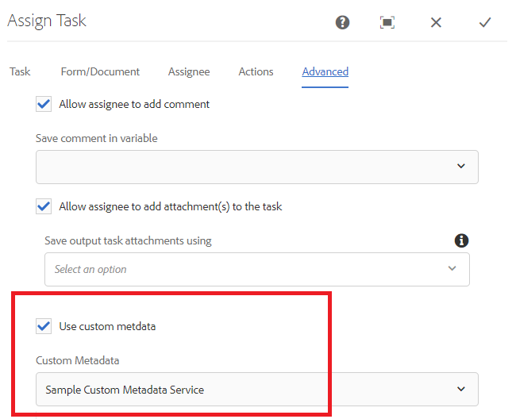

# 自定义分配任务通知

“分配任务”组件用于将任务分配给工作流参与者。 将任务分配给用户或组时，会向定义的用户或组成员发送电子邮件通知。
此电子邮件通知通常包含与任务相关的动态数据。 此动态数据是使用生成的系统获取的 [元数据属性](https://experienceleague.adobe.com/docs/experience-manager-65/forms/publish-process-aem-forms/use-metadata-in-email-notifications.html#using-system-generated-metadata-in-an-email-notification).
要在电子邮件通知中包含来自已提交表单数据的值，我们需要创建自定义元数据属性，然后在电子邮件模板中使用这些自定义元数据属性


## 创建自定义元数据属性

推荐的方法是创建一个OSGI组件，用于实现的getUserMetadata方法 [WorkitemUserMetadataService](https://helpx.adobe.com/experience-manager/6-5/forms/javadocs/com/adobe/fd/workspace/service/external/WorkitemUserMetadataService.html#getUserMetadataMap--)

以下代码创建4个元数据属性(_名字_，_姓氏_，_原因_ 和 _请求金额_)，并根据提交的数据设置其值。 例如，元数据属性 _名字_&#x200B;的值设置为所提交数据中名为firstName的元素的值。 以下代码假定自适应表单提交的数据为xml格式。 基于JSON架构或表单数据模型的自适应Forms会生成JSON格式的数据。


```java
package com.aemforms.workitemuserservice.core;

import java.io.InputStream;
import java.util.HashMap;
import java.util.Map;

import javax.jcr.Session;
import javax.xml.parsers.DocumentBuilder;
import javax.xml.parsers.DocumentBuilderFactory;
import javax.xml.xpath.XPath;

import org.osgi.framework.Constants;
import org.osgi.service.component.annotations.Component;
import org.slf4j.Logger;
import org.slf4j.LoggerFactory;
import org.w3c.dom.*;


import com.adobe.fd.workspace.service.external.WorkitemUserMetadataService;
import com.adobe.granite.workflow.WorkflowSession;
import com.adobe.granite.workflow.exec.WorkItem;
import com.adobe.granite.workflow.metadata.MetaDataMap;
@Component(property={Constants.SERVICE_DESCRIPTION+"=A sample implementation of a user metadata service.",
Constants.SERVICE_VENDOR+"=Adobe Systems",
"process.label"+"=Sample Custom Metadata Service"})


public class WorkItemUserServiceImpl implements WorkitemUserMetadataService {
private static final Logger log = LoggerFactory.getLogger(WorkItemUserServiceImpl.class);

@Override
public Map<String, String> getUserMetadata(WorkItem workItem, WorkflowSession workflowSession,MetaDataMap metadataMap)
{
HashMap<String, String> customMetadataMap = new HashMap<String, String>();
String payloadPath = workItem.getWorkflowData().getPayload().toString();
String dataFilePath = payloadPath + "/Data.xml/jcr:content";
Session session = workflowSession.adaptTo(Session.class);
DocumentBuilderFactory factory = null;
DocumentBuilder builder = null;
Document xmlDocument = null;
javax.jcr.Node xmlDataNode = null;
try
{
    xmlDataNode = session.getNode(dataFilePath);
    InputStream xmlDataStream = xmlDataNode.getProperty("jcr:data").getBinary().getStream();
    XPath xPath = javax.xml.xpath.XPathFactory.newInstance().newXPath();
    factory = DocumentBuilderFactory.newInstance();
    builder = factory.newDocumentBuilder();
    xmlDocument = builder.parse(xmlDataStream);
    Node firstNameNode = (org.w3c.dom.Node) xPath.compile("afData/afUnboundData/data/firstName")
            .evaluate(xmlDocument, javax.xml.xpath.XPathConstants.NODE);
    log.debug("The value of first name element  is " + firstNameNode.getTextContent());
    Node lastNameNode = (org.w3c.dom.Node) xPath.compile("afData/afUnboundData/data/lastName")
            .evaluate(xmlDocument, javax.xml.xpath.XPathConstants.NODE);
    Node amountRequested = (org.w3c.dom.Node) xPath
            .compile("afData/afUnboundData/data/amountRequested")
            .evaluate(xmlDocument, javax.xml.xpath.XPathConstants.NODE);
    Node reason = (org.w3c.dom.Node) xPath.compile("afData/afUnboundData/data/reason")
            .evaluate(xmlDocument, javax.xml.xpath.XPathConstants.NODE);
    customMetadataMap.put("firstName", firstNameNode.getTextContent());
    customMetadataMap.put("lastName", lastNameNode.getTextContent());
    customMetadataMap.put("amountRequested", amountRequested.getTextContent());
    customMetadataMap.put("reason", reason.getTextContent());
    log.debug("Created  " + customMetadataMap.size() + " metadata  properties");

}
catch (Exception e)
{
    log.debug(e.getMessage());
}
return customMetadataMap;
}

}
```

## 在任务通知电子邮件模板中使用自定义元数据属性

在电子邮件模板中，您可以使用以下语法来包含元数据属性，其中amountRequested是元数据属性 `${amountRequested}`

## 配置分配任务以使用自定义元数据属性

构建OSGi组件并将其部署到AEM服务器后，配置分配任务组件（如下所示）以使用自定义元数据属性。


## 允许使用自定义元数据属性



## 在您的服务器上尝试此操作

* [配置Day CQ邮件服务](https://experienceleague.adobe.com/docs/experience-manager-65/administering/operations/notification.html#configuring-the-mail-service)
* 将有效的电子邮件ID与 [管理员用户](http://localhost:4502/security/users.html)
* 下载并安装 [工作流和通知模板](assets/workflow-and-task-notification-template.zip) 使用 [包管理器](http://localhost:4502/crx/packmgr/index.jsp)
* 下载 [自适应表单](assets/request-travel-authorization.zip) 并从导入AEM [表单和文档ui](http://localhost:4502/aem/forms.html/content/dam/formsanddocuments).
* 部署和启动 [自定义捆绑包](assets/work-items-user-service-bundle.jar) 使用 [Web控制台](http://localhost:4502/system/console/bundles)
* [预览并提交表单](http://localhost:4502/content/dam/formsanddocuments/requestfortravelauhtorization/jcr:content?wcmmode=disabled)

在表单提交时，任务分配通知将发送到与管理员用户关联的电子邮件ID。 以下屏幕截图显示了任务分配通知示例


>[!NOTE]
>分配任务通知的电子邮件模板需要采用以下格式。
>
> subject=已分配的任务 —  `${workitem_title}`
>
> message=表示电子邮件模板的字符串，且不含任何换行字符。

## “分配任务”电子邮件通知中的任务注释

在某些情况下，您可能希望在后续任务通知中包含上一个任务所有者的备注。 下面列出了用于捕获任务最后评论的代码：

```java
package samples.aemforms.taskcomments.core;

import org.osgi.service.component.annotations.Component;

import java.util.HashMap;
import java.util.List;
import java.util.Map;

import javax.jcr.Session;

import org.osgi.framework.Constants;
import org.slf4j.Logger;
import org.slf4j.LoggerFactory;
import com.adobe.granite.workflow.WorkflowSession;
import com.adobe.granite.workflow.exec.HistoryItem;
import com.adobe.granite.workflow.exec.WorkItem;
import com.adobe.granite.workflow.metadata.MetaDataMap;

import com.adobe.fd.workspace.service.external.WorkitemUserMetadataService;
@Component(property = {
  Constants.SERVICE_DESCRIPTION + "=A sample implementation of a user metadata service.",
  Constants.SERVICE_VENDOR + "=Adobe Systems",
  "process.label" + "=Capture Workflow Comments"
})

public class CaptureTaskComments implements WorkitemUserMetadataService {
  private static final Logger log = LoggerFactory.getLogger(CaptureTaskComments.class);
  @Override
  public Map <String, String> getUserMetadata(WorkItem workItem, WorkflowSession workflowSession, MetaDataMap metadataMap) {
    HashMap < String, String > customMetadataMap = new HashMap < String, String > ();
    workflowSession.adaptTo(Session.class);
    try {
      List <HistoryItem> workItemsHistory = workflowSession.getHistory(workItem.getWorkflow());
      int listSize = workItemsHistory.size();
      HistoryItem lastItem = workItemsHistory.get(listSize - 1);
      String reviewerComments = (String) lastItem.getWorkItem().getMetaDataMap().get("workitemComment");
      log.debug("####The comment I got was ...." + reviewerComments);
      customMetadataMap.put("comments", reviewerComments);
      log.debug("Created  " + customMetadataMap.size() + " metadata  properties");

    } catch (Exception e) {
      log.debug(e.getMessage());
    }
    return customMetadataMap;
  }

}
```

具有上述代码的捆绑包可以是 [从此处下载](assets/samples.aemforms.taskcomments.taskcomments.core-1.0-SNAPSHOT.jar)
