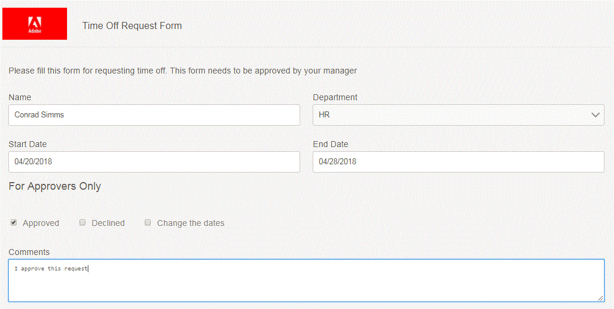

# 简单带薪休息时间请求工作流

在本文中，我们将讨论一个用于请求付费休息时间的简单工作流。 业务需求如下：

* 用户A通过填写自适应表单请求休假。
* 表单被路由到AEM管理员用户（在实际情况中，表单被路由到提交者的经理）
* 管理员打开表单。 管理员应该不能编辑提交者填写的任何信息。
* 审批者部分应对审批者可见(在本例中，审批者是AEM管理员用户)。

为了满足上述要求，我们在表单中使用名为&#x200B;**initialstep**&#x200B;的隐藏字段，其默认值设置为“是”。提交表单时，工作流中的第一步将initialstep的值设置为“否”。 该表单具有根据初始步骤值隐藏和显示相应部分的业务规则。

**配置表单以触发AEM工作流**

>[!VIDEO](https://video.tv.adobe.com/v/28406?quality=12&learn=on)

**工作流演练**

>[!VIDEO](https://video.tv.adobe.com/v/28407?quality=12&learn=on)

**提交者的休息时间申请表视图**

**表单的审批者视图**

在审批者视图中，审批者无法编辑提交的数据。 此外，还新增了一个仅供审批者使用的部分。

要在您的系统上测试此工作流，请按照以下所述步骤操作：
* [下载并部署DevelopingWidthServiceUserBundle](/help/forms/assets/common-osgi-bundles/DevelopingWithServiceUser.jar)
* [下载和部署SetValue自定义OSGI捆绑包](/help/forms/assets/common-osgi-bundles/SetValueApp.core-1.0-SNAPSHOT.jar)
* [将与本文相关的资源导入AEM](assets/helpxworkflow.zip)
* 打开[休息时间请求表单](http://localhost:4502/content/dam/formsanddocuments/helpx/timeoffrequestform/jcr:content?wcmmode=disabled)
* 填写详细信息并提交
* 打开[收件箱](http://localhost:4502/mnt/overlay/cq/inbox/content/inbox.html)。 您应该会看到已分配的新任务。 打开窗体。 提交者的数据应为只读，并且应会显示一个新的审批者部分。
* 浏览[工作流模型](http://localhost:4502/editor.html/conf/global/settings/workflow/models/helpxworkflow.html)
* 浏览流程步骤。 这是将initialstep的值设置为“否”的步骤。
