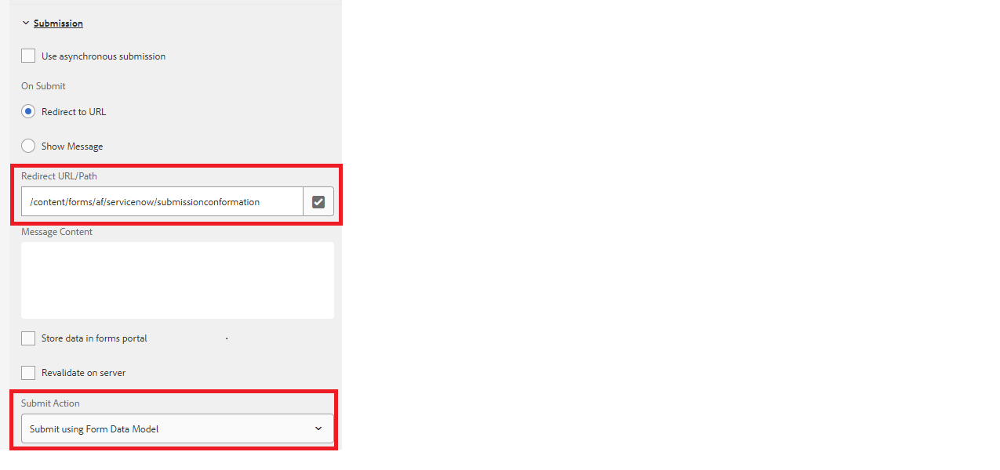

# 自定义感谢页面

向REST端点提交自适应表单时，您会希望显示确认消息，以告知用户其表单提交成功。 POST响应包含有关提交的详细信息（如提交ID），而设计良好的确认消息包含有助于改善用户体验的提交ID。 此响应可显示在配置有自适应表单的感谢页面中。

以下屏幕快照显示正在使用表单数据模型提交操作提交的表单，并配置了感谢页面



表单数据模型的POST将始终在响应中返回JSON对象。 此JSON作为名为的查询参数显示在感谢页面URL中 _fdmSubmitResult_. 您可以解析此查询参数，并在感谢页面中显示JSON元素。
以下示例代码解析JSON响应以提取数字字段的值。 然后，系统会构建适当的xml，并在slingRequest中传递它以填充表单。 此代码通常编写在与自适应表单模板关联的页面组件的jsp中。

```java
if(request.getParameter("fdmSubmitResult")!=null)
{
    String fdmSubmitResult =  request.getParameter("fdmSubmitResult");
    String status = request.getParameter("status");
    com.google.gson.JsonObject jsonObject = com.google.gson.JsonParser.parseString(fdmSubmitResult).getAsJsonObject();
    String caseNumber = jsonObject.get("result").getAsJsonObject().get("number").getAsString();
    slingRequest.setAttribute("data","<afData><afUnboundData><data><caseNumber>"+caseNumber+"</caseNumber><status>"+status+"</status></data></afUnboundData></afData>");
}
```

建议您将感谢页面基于新的自适应表单模板，通过模板可编写自定义代码以从查询参数中提取响应。

## 测试解决方案

创建自适应表单并将其配置为使用表单数据模型提交操作提交表单。
[部署示例自适应表单模板](assets/thank-you-page-template.zip)
基于此模板创建感谢表单将此感谢页面与主表单关联在中修改jsp代码 [createXml.jsp](http://localhost:4502/apps/thank-you-page-template/component/page/thankyoupage/createxml.jsp) 构建预填充自适应表单所需的xml。
预览并提交您的自适应表单。
此时将显示感谢页面，并预填充在XML中指定的数据


