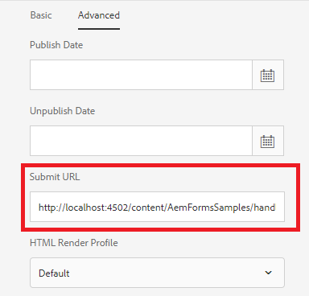

# 处理HTML5表单提交

可以将HTML5表单提交到AEM中托管的servlet。 提交的数据可在servlet中作为输入流访问。 要提交HTML5表单，您需要使用AEM Forms Designer在表单模板上添加“HTTP提交按钮”

## 创建提交处理程序

可以创建简单的servlet来处理HTML5表单提交。 然后，可以使用以下代码提取提交的数据。 此 [servlet](assets/html5-submit-handler.zip) 在本教程中提供给您使用。 请安装 [servlet](assets/html5-submit-handler.zip) 使用 [包管理器](http://localhost:4502/crx/packmgr/index.jsp)

第9行的代码可用于调用J2EE进程。 请确保您已配置 [AdobeLiveCycle客户端SDK配置](https://helpx.adobe.com/aem-forms/6/submit-form-data-livecycle-process.html) 如果您打算使用代码来调用J2EE进程。

```java
StringBuffer stringBuffer = new StringBuffer();
String line = null;
java.io.InputStreamReader isReader = new java.io.InputStreamReader(request.getInputStream(), "UTF-8");
java.io.BufferedReader reader = new java.io.BufferedReader(isReader);
while ((line = reader.readLine()) != null) {
    stringBuffer.append(line);
}
System.out.println("The submitted form data is " + stringBuffer.toString());
/*
        * java.util.Map params = new java.util.HashMap();
        * params.put("in",stringBuffer.toString());
        * com.adobe.livecycle.dsc.clientsdk.ServiceClientFactoryProvider scfp =
        * sling.getService(com.adobe.livecycle.dsc.clientsdk.
        * ServiceClientFactoryProvider.class);
        * com.adobe.idp.dsc.clientsdk.ServiceClientFactory serviceClientFactory =
        * scfp.getDefaultServiceClientFactory(); com.adobe.idp.dsc.InvocationRequest ir
        * = serviceClientFactory.createInvocationRequest("Test1/NewProcess1", "invoke",
        * params, true);
        * ir.setProperty(com.adobe.livecycle.dsc.clientsdk.InvocationProperties.
        * INVOKER_TYPE,com.adobe.livecycle.dsc.clientsdk.InvocationProperties.
        * INVOKER_TYPE_SYSTEM); com.adobe.idp.dsc.InvocationResponse response1 =
        * serviceClientFactory.getServiceClient().invoke(ir);
        * System.out.println("The response is "+response1.getInvocationId());
        */
```


## 配置HTML5表单的提交URL



* 点按xdp并单击 _属性_->_高级_
* 复制http://localhost:4502/content/AemFormsSamples/handlehml5formsubmission.html并将其粘贴到提交URL文本字段中
* 单击 _SaveAndClose_ 按钮。

### 在排除路径中添加条目

* 导航到 [configMgr](http://localhost:4502/system/console/configMgr).
* 搜索 _AdobeGranite CSRF筛选器_
* 在“排除的路径”部分中添加以下条目
* _/content/AemFormsSamples/handlehml5formsubmission_
* 保存更改

### 测试表单

* 点按xdp模板。
* 单击 _预览_->预览为HTML
* 在表单中输入一些数据，然后单击提交
* 您应该会看到提交的数据已写入服务器的stdout.log文件

### 附加阅读

此 [文章](https://experienceleague.adobe.com/docs/experience-manager-learn/forms/document-services/generate-pdf-from-mobile-form-submission-article.html) 此外，还建议在从HTML5表单提交生成PDF时这样做。
