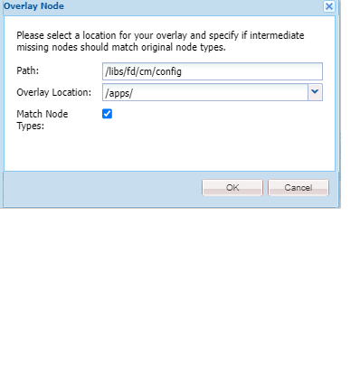

# 自定义文本编辑器{#customize-text-editor}

## 概述 {#overview}

您可以自定义用于创建文档片段的文本编辑器，以添加更多字体和字体大小。 这些字体包括英语和非英语（如日语）字体。

您可以自定义以更改字体设置中的以下内容：

* 字体系列和大小
* 高度和字母间距等属性
* 字体系列和大小、高度、字母间距和日期格式的默认值
* 项目符号缩进

为此，您需要：

1. [通过在CRX中编辑tbxeditor-config.xml文件来自定义字体](#customizefonts)
1. [将自定义字体添加到客户端计算机](#addcustomfonts)

## 通过在CRX中编辑tbxeditor-config.xml文件来自定义字体 {#customizefonts}

要通过编辑tbxeditor-config.xml文件来自定义字体，请执行以下操作：

1. 转到 `https://'[server]:[port]'/[ContextPath]/crx/de` 并以管理员身份登录。
1. 在apps文件夹中，创建一个名为config的文件夹，其路径/结构与config文件夹（位于libs/fd/cm/config）类似，具体步骤如下：

   1. 右键单击以下路径的items文件夹并选择 **覆盖节点**：

      `/libs/fd/cm/config`

      

   1. 确保“覆盖节点”对话框具有以下值：

      **路径：** /libs/fd/cm/config

      **位置：** /apps/

      **匹配节点类型：** 已选择

      

   1. 单击 **确定**. 文件夹结构将在apps文件夹中创建。

   1. 单击&#x200B;**全部保存**。

1. 使用下列步骤，在新创建的配置文件夹中创建tbxeditor-config.xml文件的副本：

   1. 右键单击libs/fd/cm/config上的tbxeditor-config.xml文件，然后选择 **复制**.
   1. 右键单击以下文件夹并选择 **粘贴：**

      `apps/fd/cm/config`

   1. 默认情况下，粘贴文件的名称为 `copy of tbxeditor-config.xml.` 将文件重命名为 `tbxeditor-config.xml` 并单击 **全部保存**.

1. 打开apps/fd/cm/config上的tbxeditor-config.xml文件，然后进行所需的更改。

   1. 双击apps/fd/cm/config上的tbxeditor-config.xml文件。 文件随即打开。

      ```xml
      <editorConfig>
         <bulletIndent>0.25in</bulletIndent>
      
         <defaultDateFormat>DD-MM-YYYY</defaultDateFormat>
      
         <fonts>
            <default>Times New Roman</default>
            <font>_sans</font>
            <font>_serif</font>
            <font>_typewriter</font>
            <font>Arial</font>
            <font>Courier</font>
            <font>Courier New</font>
            <font>Geneva</font>
            <font>Georgia</font>
            <font>Helvetica</font>
            <font>Tahoma</font>
            <font>Times New Roman</font>
            <font>Times</font>
            <font>Verdana</font>
         </fonts>
      
         <fontSizes>
            <default>12</default>
            <fontSize>8</fontSize>
            <fontSize>9</fontSize>
            <fontSize>10</fontSize>
            <fontSize>11</fontSize>
            <fontSize>12</fontSize>
            <fontSize>14</fontSize>
            <fontSize>16</fontSize>
            <fontSize>18</fontSize>
            <fontSize>20</fontSize>
            <fontSize>22</fontSize>
            <fontSize>24</fontSize>
            <fontSize>26</fontSize>
            <fontSize>28</fontSize>
            <fontSize>36</fontSize>
            <fontSize>48</fontSize>
            <fontSize>72</fontSize>
         </fontSizes>
      
         <lineHeights>
            <default>2</default>     
            <lineHeight>2</lineHeight>
            <lineHeight>3</lineHeight>
            <lineHeight>4</lineHeight>
            <lineHeight>5</lineHeight>
            <lineHeight>6</lineHeight>
            <lineHeight>7</lineHeight>
            <lineHeight>8</lineHeight>
            <lineHeight>9</lineHeight>
            <lineHeight>10</lineHeight>
            <lineHeight>11</lineHeight>
            <lineHeight>12</lineHeight>
            <lineHeight>13</lineHeight>
            <lineHeight>14</lineHeight>
            <lineHeight>15</lineHeight>
            <lineHeight>16</lineHeight>
         </lineHeights>
      
         <letterSpacings>
            <default>0</default>
            <letterSpacing>0</letterSpacing>
            <letterSpacing>1</letterSpacing>
            <letterSpacing>2</letterSpacing>
            <letterSpacing>3</letterSpacing>
            <letterSpacing>4</letterSpacing>
            <letterSpacing>5</letterSpacing>
            <letterSpacing>6</letterSpacing>
            <letterSpacing>7</letterSpacing>
            <letterSpacing>8</letterSpacing>
            <letterSpacing>9</letterSpacing>
            <letterSpacing>10</letterSpacing>
            <letterSpacing>11</letterSpacing>
            <letterSpacing>12</letterSpacing>
            <letterSpacing>13</letterSpacing>
            <letterSpacing>14</letterSpacing>
            <letterSpacing>15</letterSpacing>
            <letterSpacing>16</letterSpacing>
         </letterSpacings>
      </editorConfig>
      ```

   1. 在文件中进行所需的更改，以更改字体设置的以下内容：

      * 添加或删除字体系列和大小
      * 高度和字母间距等属性
      * 字体系列和大小、高度、字母间距和日期格式的默认值
      * 项目符号缩进

      例如，要添加名为Sazanami Mincho Medium的日语字体，需要在XML文件中输入以下条目： `<font>Sazanami Mincho Medium</font>`. 您还需要将此字体安装在用于访问和使用字体自定义的客户端计算机上。 有关更多信息，请参阅 [将自定义字体添加到客户端计算机](#addcustomfonts).

      您还可以更改文本各方面的默认值，通过删除条目从文本编辑器中删除字体。

   1. 单击&#x200B;**全部保存**。

## 将自定义字体添加到客户端计算机 {#addcustomfonts}

在交互式通信文本编辑器中访问字体时，它需要出现在用于访问交互式通信的客户端计算机中。 要在文本编辑器中使用自定义字体，首先需要在客户端计算机上安装该字体。

有关安装字体的详细信息，请参阅以下内容：

* [在Windows上安装或卸载字体](https://windows.microsoft.com/en-us/windows-vista/install-or-uninstall-fonts)
* [Mac基础知识：字体手册](https://support.apple.com/en-us/HT201749)

## 访问字体自定义 {#access-font-customizations}

在CRX的tbxeditor-config.xml文件中更改了字体，并在用于访问AEM Forms的客户端计算机上安装了所需的字体后，这些更改将显示在文本编辑器中。

例如， Sazanami Mincho Medium字体已添加到 [通过在CRX中编辑tbxeditor-config.xml文件来自定义字体](#customizefonts) 过程显示在文本编辑器UI中，如下所示：


>[!NOTE]
>
>要查看日文文本，首先需要输入包含日文字符的文本。 应用自定日文字体时，只按某种方式设置文本格式。 应用自定日文字体不会将英文或其他字符更改为日文字符。
