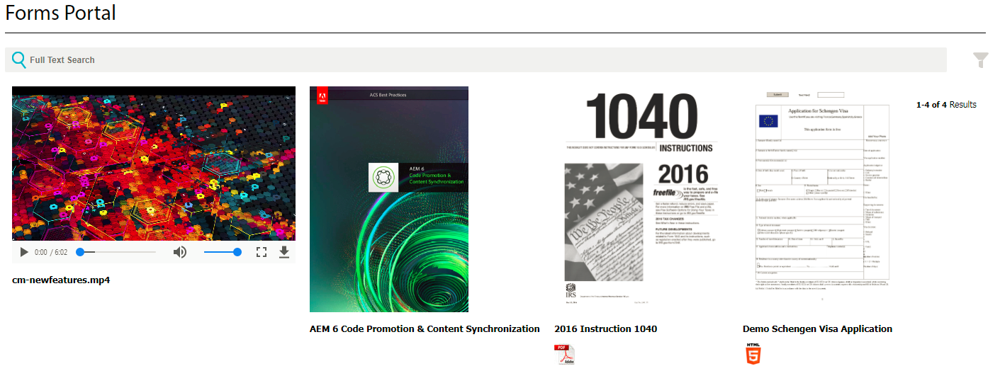

# 在AEM Forms中列出自定义资源类型 {#listing-custom-asset-types-in-aem-forms}

## 创建自定义模板 {#creating-custom-template}

出于本文的目的，我们将创建一个自定义模板，以便在同一页面上显示自定义资源类型和OOTB资源类型。 要创建自定义模板，请按照以下说明操作

1. 在/apps下创建一个sling：文件夹。 将其命名为“ myportalcomponent ”
1. 添加“fpContentType”属性。 将其值设置为&quot;**/libs/fd/ fp/formTemplate”。**
1. 添加“title”属性并将其值设置为“custom template”。 这是您将在搜索和列表程序组件的下拉列表中看到的名称
1. 在此文件夹下创建一个“template.html”。 此文件将包含用于样式设置和显示各种资源类型的代码。


以下代码列出了使用搜索和列表程序组件的各种类型的资源。 我们为每种类型的资产创建单独的html元素，如data-type = &quot;videos&quot;标记所示。 对于“视频”的资源类型，我们使用 &lt;video> 用于内联播放视频的元素。 对于“worddocuments”的资源类型，我们使用不同的html标记。

```html
<div class="__FP_boxes-container __FP_single-color">
   <div  data-repeatable="true">
     <div class = "__FP_boxes-thumbnail" style="float:left;margin-right:20px;" data-type = "videos">
   <video width="400" controls>
       <source src="${path}" type="video/mp4">
    </video>
         <h3 class="__FP_single-color" title="${name}" tabindex="0">${name}</h3>
     </div>
     <div class="__FP_boxes-thumbnail" style="float:left;margin-right:20px;" data-type = "worddocuments">
       <a href="/assetdetails.html${path}" target="_blank">
           
          </a>
          <h3 class="__FP_single-color" title="${name}" tabindex="0">${name}</h3>
     </div>
  <div class="__FP_boxes-thumbnail" style="float:left;margin-right:20px;" data-type = "xfaForm">
       <a href="/assetdetails.html${path}" target="_blank">
           
          </a>
          <h3 class="__FP_single-color" title="${name}" tabindex="0">${name}</h3>
                <a href="{formUrl}"></a><p>

     </div>
  <div class="__FP_boxes-thumbnail" style="float:left;margin-right:20px;" data-type = "printForm">
       <a href="/assetdetails.html${path}" target="_blank">
           
          </a>
          <h3 class="__FP_single-color" title="${name}" tabindex="0">${name}</h3>
                <a href="{pdfUrl}"></a><p>
     </div>
   </div>
</div>
```

>[!NOTE]
>
>第11行 — 请将图像src更改为指向您在DAM中选择的图像。
>
>要在此模板中列出自适应Forms，请创建一个新的div并将其数据类型属性设置为“guide”。 您可以复制并粘贴其data-type=&quot;printForm的div，并将新复制的div的数据类型设置为&quot;guide&quot;

## 配置搜索和列表程序组件 {#configure-search-and-lister-component}

定义自定义模板后，现在必须将此自定义模板与“Search and Lister”组件关联。 指向您的浏览器 [到此url](http://localhost:4502/editor.html/content/AemForms/CustomPortal.html).

切换到设计模式并将段落系统配置为在允许的组件组中包含搜索和列表程序组件。 搜索和列表程序组件是Document Services组的一部分。

切换到编辑模式并将Search and Lister组件添加到ParSys。

打开“搜索和列表程序”组件的配置属性。 确保选中“Asset Folders”选项卡。 在搜索和列表程序组件中，选择要从中列出资产的文件夹。 为撰写本文而选择

* /content/dam/VideosAndWordDocuments
* /content/dam/formsanddocuments/assettypes


按Tab键转到“显示”选项卡。 在此处，您可以选择要在搜索和列表程序组件中显示资产的模板。

从下拉菜单中选择“自定义模板”，如下所示。


配置要在门户中列出的资源的类型。 要将资源的选项卡类型配置到“资源列表”，请配置资源的类型。 在此示例中，我们配置了以下类型的资产

1. MP4文件
1. Word文档
1. 文档（这是OOTB资源类型）
1. 表单模板（这是OOTB资源类型）

以下屏幕抓图显示了为列出而配置的资源类型


现在，您已配置搜索和列表程序门户组件，接下来该查看该列表程序的操作了。 指向您的浏览器 [到此url](http://localhost:4502/content/AemForms/CustomPortal.html?wcmmode=disabled). 结果应该与下图类似。

>[!NOTE]
>
>如果您的门户在发布服务器上列出了自定义资源类型，请确保向节点授予“fd-service”用户的“读取”权限 **/apps/fd/fp/extensions/querybuilder**


[请使用包管理器下载并安装此包。](assets/customassettypekt1.zip) 这包含示例mp4和word文档以及用作资产类型的xdp文件，以使用搜索和列表程序组件列出
