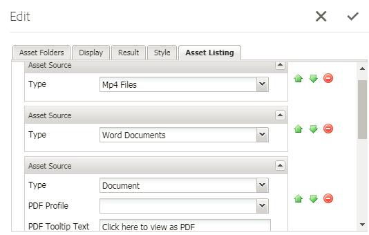

# 列出AEM Forms中的自定义资产类型{#listing-custom-asset-types-in-aem-forms}

## 创建自定义模板{#creating-custom-template}


为便于本文参考，我们将创建一个自定义模板，在同一页面上显示自定义资产类型和OOTB资产类型。 要创建自定义模板，请按照以下说明操作

1. 创建吊带：文件夹。 将其命名为&quot; myportalcomponent &quot;
1. 添加“fpContentType”属性。 将其值设置为“**/libs/fd/fp/formTemplate”。**
1. 添加“title”属性并将其值设置为“custom template”。 这是您将在搜索和制表人组件下拉列表中看到的名称
1. 在此文件夹下创建“template.html”。 此文件将保存用于设置样式和显示各种资产类型的代码。


以下代码使用搜索和制表人组件列表各种类型的资产。 我们会为每种类型的资产创建单独的html元素，如data-type = &quot;videos&quot;标签所示。 对于“videos”的资产类型，我们使用&lt;video>元素内联播放视频。 对于“worddocuments”的资源类型，我们使用不同的html标记。

```html
<div class="__FP_boxes-container __FP_single-color">
   <div  data-repeatable="true">
     <div class = "__FP_boxes-thumbnail" style="float:left;margin-right:20px;" data-type = "videos">
   <video width="400" controls>
       <source src="${path}" type="video/mp4">
    </video>
         <h3 class="__FP_single-color" title="${name}" tabindex="0">${name}</h3>
     </div>
     <div class="__FP_boxes-thumbnail" style="float:left;margin-right:20px;" data-type = "worddocuments">
       <a href="/assetdetails.html${path}" target="_blank">
           
          </a>
          <h3 class="__FP_single-color" title="${name}" tabindex="0">${name}</h3>
     </div>
  <div class="__FP_boxes-thumbnail" style="float:left;margin-right:20px;" data-type = "xfaForm">
       <a href="/assetdetails.html${path}" target="_blank">
           
          </a>
          <h3 class="__FP_single-color" title="${name}" tabindex="0">${name}</h3>
                <a href="{formUrl}"></a><p>

     </div>
  <div class="__FP_boxes-thumbnail" style="float:left;margin-right:20px;" data-type = "printForm">
       <a href="/assetdetails.html${path}" target="_blank">
           
          </a>
          <h3 class="__FP_single-color" title="${name}" tabindex="0">${name}</h3>
                <a href="{pdfUrl}"></a><p>
     </div>
   </div>
</div>
```

>[!NOTE]
>
>第11行 — 请更改图像src以指向您在DAM中选择的图像。
>
>要在此模板中列表Adaptive Forms，请新建一个div并将其数据类型属性设置为“guide”。 可以复制并粘贴其data-type=&quot;printForm的div，并将新复制的div的data-type设置为&quot;guide&quot;

## 配置搜索和制表器组件{#configure-search-and-lister-component}

定义自定义模板后，我们现在必须将此自定义模板与“搜索和制表人”组件关联。 将浏览器[指向此url ](http://localhost:4502/editor.html/content/AemForms/CustomPortal.html)。

切换到“设计”模式并配置段落系统，以在允许的组件组中包含“搜索和制表人”组件。 “搜索”和“制表人”组件是“文档服务”组的一部分。

切换到编辑模式，并将搜索和制表人组件添加到ParSys。

打开“搜索和制表人”组件的配置属性。 确保已选择“资产文件夹”选项卡。 在搜索和制表人组件中，选择要从中列表资产的文件夹。 为本文之目的，我已选择

* /content/dam/VideosAndWordDocuments
* /content/dam/formsanddocuments/assettypes


选项卡。 您将在此选择要在搜索和制表人组件中显示资产的模板。

从下拉菜单中选择“自定义模板”，如下所示。


配置要在门户中列表的资产类型。 要配置“资产列表”中资产选项卡的类型，请配置资产类型。 在此示例中，我们配置了以下类型的资产

1. MP4文件
1. Word文档
1. 文档（这是OOTB资产类型）
1. 表单模板（这是OOTB资产类型）

以下屏幕快照显示了为列表配置的资产类型



现在，您已配置了搜索和制表人门户组件，是时候让制表人开始行动了。 将浏览器[指向此url ](http://localhost:4502/content/AemForms/CustomPortal.html?wcmmode=disabled)。 结果应类似于下图。

>[!NOTE]
>
>如果您的门户在发布服务器上列出自定义资源类型，请确保您向节点&#x200B;**/apps/fp/extensions/querybuilder**&#x200B;的“fd-service”用户授予“read”权限


[源类型请使用包管理器下载并安装此包。](assets/customassettypekt1.zip) 它包含示例mp4和word文档以及xdp文件，这些文件将用作资源类型以使用搜索和制表人组件进行列表
