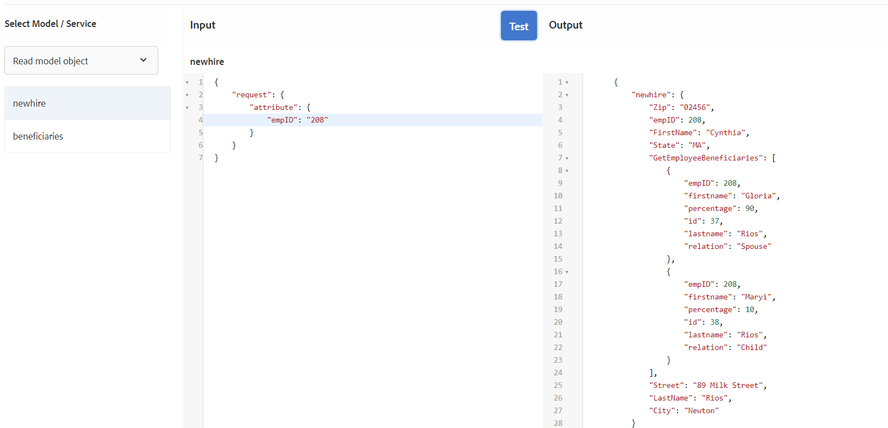

# 配置表单数据模型

## Apache Sling连接池化数据源

创建RDBMS支持的表单数据模型的第一步是配置Apache Sling连接池化数据源。 要配置数据源，请按照以下步骤操作：

* 将浏览器指向 [configMgr](http://localhost:4502/system/console/configMgr)
* 搜索 **Apache Sling连接池化数据源**
* 添加新条目并提供值，如屏幕快照中所示。
* 
* 保存更改

>[!NOTE]
>JDBC连接URI、用户名和密码将因MySQL数据库配置而异。

## 创建表单数据模型

* 将浏览器指向 [数据集成](http://localhost:4502/aem/forms.html/content/dam/formsanddocuments-fdm)
* 单击 _创建_->_表单数据模型_
* 为表单数据模型提供有意义的名称和标题，例如 **员工**
* 单击 _下一个_
* 选择在前面部分（论坛）中创建的数据源
* 单击 _创建_->编辑以在编辑模式下打开新创建的表单数据模型
* 展开 _论坛_ 节点，以查看员工架构。 展开employee节点以查看2个表

## 将实体添加到模型

* 确保展开员工节点
* 选择新实体和受益人实体，然后单击 _添加选定项_

## 将读取服务添加到新实体

* 选择新实体
* 单击 _编辑属性_
* 从读取服务下拉列表中选择get
* 单击+图标以将参数添加到get服务
* 指定屏幕快照中显示的值
* 
>[!NOTE]
> get服务需要映射到newhire实体的empID列的值。传递此值的方法有多种，在本教程中，empID通过名为empID的请求参数进行传递。
* 单击 _完成_ 保存获取服务的参数
* 单击 _完成_ 保存对表单数据模型的更改

## 添加两个实体之间的关联

在表单数据模型中不会自动创建数据库实体之间定义的关联。 需要使用表单数据模型编辑器定义实体之间的关联。 每个新实体可以有一个或多个受益人，我们需要定义新实体与受益实体之间的一对多关联。
以下步骤将指导您完成创建一对多关联的过程

* 选择新实体并单击 _添加关联_
* 为关联及其他属性提供有意义的标题和标识符，如下面的屏幕快照所示
  

* 单击 _编辑_ 图标（在“参数”部分下）

* 指定此屏幕快照中显示的值
* 
* **我们正在使用受益人和新实体的empID列将两个实体连接在一起。**
* 单击 _完成_ 以保存更改

## 测试表单数据模型

我们的表单数据模型现在具有 **_get_** 接受empID并返回新惠及其受益人的详细信息。 要测试获取服务，请按照以下步骤操作。

* 选择新实体
* 单击 _测试模型对象_
* 提供有效的empID并单击 _测试_
* 您应会获得如下面的屏幕快照中所示的结果
* 

## 后续步骤

[从URL获取empID](./get-request-parameter.md)