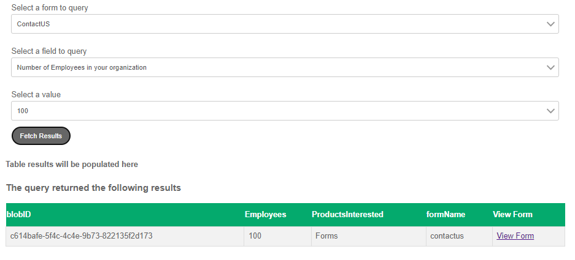

# 构建查询界面

我们构建了一个简单的查询界面，允许“管理员”输入搜索条件，以检索特定的表单提交内容。 然后，结果将以简单的表格格式显示，并带有查看特定表单提交的选项。

此界面中的下拉菜单是级联下拉菜单。 下拉菜单中可用的选项会根据在上一个下拉菜单中做出的选择而发生更改。

下拉列表是使用RESTful数据源填充的。

搜索结果显示在名为“SearchResults”的自定义组件中。 当用户单击“查看”按钮时，表单会预填充已提交的数据和附件。

## 后续步骤

[编写预填充服务](./part4.md)
