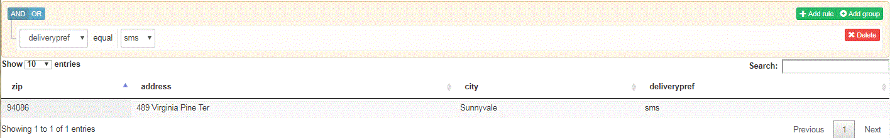

# 查询提交的数据


下一步是查询提交的数据并以表格形式显示结果。 为此，我们使用以下软件：

[Querybuilder](https://querybuilder.js.org/)  — 创建查询的UI组件

[数据表](https://datatables.net/) — 以表格形式显示查询结果。

生成了以下UI以启用查询提交的数据。 只有在JSON架构中标记为必需的元素才可供查询。 在下面的屏幕截图中，我们正在查询投放了deliverypref是短信的所有提交。

用于查询已提交数据的示例UI未使用QueryBuilder中提供的所有高级功能。 我们鼓励你自己试试。



>[!NOTE]
>
>本教程的当前版本不支持查询多个列。

选择要执行查询的表单时，会向发出GET调用 **/bin/getdatakeysfromschema**. 此GET调用返回与表单架构关联的必填字段。 之后，必填字段将填充到QueryBuilder的下拉列表中，以便您构建查询。

以下代码片段调用JSONSchemaOperations服务的getRequiredColumnsFromSchema方法。 我们将架构的属性和所需元素传递到此方法调用。 然后，会使用此函数调用返回的数组来填充查询生成器下拉列表

```java
public JSONArray getData(String formName) throws SQLException, IOException {

  org.json.JSONArray arrayOfDataKeys = new org.json.JSONArray();
  JSONObject jsonSchema = jsonSchemaOperations.getJSONSchemaFromDataBase(formName);
  Map<String, String> refKeys = new HashMap<String, String>();

  try {
   JSONObject properties = jsonSchema.getJSONObject("properties");
   JSONArray requiredFields = jsonSchema.has("required") ? jsonSchema.getJSONArray("required") : null;
   jsonSchemaOperations.getRequiredColumnsFromSchema(properties, arrayOfDataKeys, "", jsonSchema, refKeys,
     requiredFields);
  } catch (JSONException e) {
   // TODO Auto-generated catch block
   e.printStackTrace();
  }
  return arrayOfDataKeys;

 }
```

单击GetResult按钮时，会向发出Get调用 **“/bin/querydata”**. 我们通过查询参数将QueryBuilder UI生成的查询传递给servlet。 然后，Servlet将此查询按摩到可用于查询数据库的SQL查询中。 例如，如果您要搜索以检索所有名为“Mouse”的产品，则查询生成器查询字符串为 `$.productname = 'Mouse'`. 然后，此查询将转换为以下内容

选择 &#42; 来自aemformswithjson 。  formsubmissions where JSON_EXTRACT( formsubmissions .formdata，&quot;$.productName &quot;)= &#39;Mouse&#39;

然后，返回此查询的结果以填充UI中的表。

要在本地系统上运行此示例，请执行以下步骤

1. [请确保已执行此处提到的所有步骤](part2.md)
1. [使用AEM包管理器导入Dashboardv2.zip。](assets/dashboardv2.zip) 此包中包含查询数据所需的所有包、配置设置、自定义提交和示例页面。
1. 使用示例json架构创建自适应表单
1. 配置自适应表单以提交到“customsubmithelpx”自定义提交操作
1. 填写表单并提交
1. 将浏览器指向 [dashboard.html](http://localhost:4502/content/AemForms/dashboard.html)
1. 选择表单并执行简单查询
