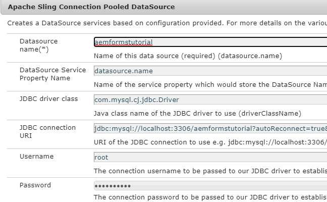

# 配置数据源

AEM可通过多种方式实现与外部数据库的集成。 集成数据库的最常见方法之一是通过使用Apache Sling连接池化数据源配置属性 [configMgr](http://localhost:4502/system/console/configMgr).
第一步是下载并部署相应的 [MySql驱动程序](https://mvnrepository.com/artifact/mysql/mysql-connector-java) 在AEM中。
创建Apache Sling连接池化数据源，并提供以下屏幕快照中指定的属性。 数据库架构作为本教程资源的一部分提供给您。

数据库有一个名为formdata的表，该表包含3列，如下面的屏幕快照所示。

>[!NOTE]
>请确保为数据源命名 **服饰**. 示例代码使用名称连接到数据库。

| 属性名称 | 价值 |
| ------------------------|--------------------------------------- |
| 数据源名称 | SaveAndContinue |
| JDBC驱动程序类 | com.mysql.cj.jdbc.Driver |
| JDBC连接uri | jdbc:mysql://localhost：3306/aemformstutorial |

## 资源

用于创建架构的SQL文件可以是 [从此处下载](assets/sign-multiple-forms.sql). 您需要使用MySql Workbench导入此文件以创建架构和表。

## 后续步骤

[创建OSGi服务以在数据库中存储和提取数据](./create-osgi-service.md)
