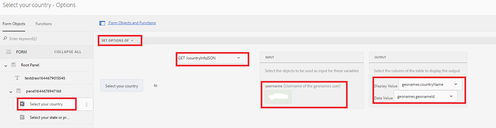

# 级联下拉列表

级联下拉列表是一系列依赖的DropDownList控件，其中一个DropDownList控件依赖于父或上一个DropDownList控件。 DropDownList控件中的项目是根据用户从另一个DropDownList控件中选择的项目填充的。

## 用例演示

>[!VIDEO](https://video.tv.adobe.com/v/340344?quality=12&learn=on)

在本教程中，我已使用[Geonames REST API](https://www.geonames.org/export/web-services.html)来演示此功能。
有许多组织提供此类服务，只要他们有详细记录的REST API，您就可以使用数据集成功能轻松与AEM Forms集成

执行以下步骤以在AEM Forms中实施级联下拉列表

## 创建开发人员帐户

创建具有[Geonames](https://www.geonames.org/login)的开发人员帐户。 记下用户名。 需要此用户名才能调用geonames.org的REST API。

## 创建Swagger/OpenAPI文件

OpenAPI规范（以前称为Swagger规范）是适用于REST API的API描述格式。 OpenAPI文件允许您描述整个API，包括：

* 每个端点(GET /users、POST /users)上的可用端点(/users)和操作
* 操作参数每个操作的输入和输出
身份验证方法
* 联系信息、许可证、使用条款和其他信息。
* API规范可以使用YAML或JSON编写。 该格式简单易学，对人和机器均可读取。

要创建您的第一个swagger/OpenAPI文件，请按照[OpenAPI文档](https://swagger.io/docs/specification/2-0/basic-structure/)操作

>[!NOTE]
> AEM Forms支持OpenAPI规范版本2.0 (FKA Swagger)。

使用[swagger编辑器](https://editor.swagger.io/)创建您的swagger文件，以描述获取所有国家/地区以及该国家/地区或州的子元素的操作。 swagger文件可以采用JSON或YAML格式创建。

## 创建数据源

要将AEM/AEM Forms与第三方应用程序集成，我们需要在云服务配置中[创建数据源](https://experienceleague.adobe.com/docs/experience-manager-learn/forms/ic-web-channel-tutorial/parttwo.html?lang=zh-Hans)。 请使用[swagger文件](assets/geonames-swagger-files.zip)创建数据源。
您需要创建2个数据源（一个用于获取所有国家/地区，另一个用于获取子元素）

## 创建表单数据模型

AEM Forms数据集成提供了一个直观的用户界面，用于创建和使用[表单数据模型](https://experienceleague.adobe.com/docs/experience-manager-65/forms/form-data-model/create-form-data-models.html?lang=zh-Hans)。 使表单数据模型基于上一步中创建的数据源。 具有2个数据源的表单数据模型

## 创建自适应表单

将表单数据模型的GET调用与您的自适应表单集成以填充下拉列表。
创建具有2个下拉列表的自适应表单。 一个用于列出国家/地区，另一个用于根据所选国家/地区列出州/省。

### “填充国家/地区”下拉列表

首次初始化表单时会填充国家/地区列表。 以下屏幕抓图显示了配置为填充国家/地区下拉列表选项的规则编辑器。 您需要提供用户名以及geonames帐户，才能使此功能正常工作。

#### 填充省/市/自治区下拉列表

我们需要根据所选国家/地区填充“州/省”下拉列表。 以下屏幕截图显示了规则编辑器配置

### 练习

在表格中添加2个名为县和市的下拉列表，以根据所选国家和省/市/自治区列出县/市。

### Assets示例

您可以下载以下资产，在创建级联下拉列表示例中抢先一步
可以从[此处](assets/geonames-swagger-files.zip)下载已完成的swagger文件
swagger文件介绍了以下REST API
* [获取所有国家/地区](https://secure.geonames.org/countryInfoJSON?username=yourusername)
* [获取Geoname对象的子项](https://secure.geonames.org/children?formatted=true&amp;geonameId=6252001&amp;username=yourusername)

可以从此处[&#128279;](assets/geonames-api-form-data-model.zip)下载已完成的表单数据模型
