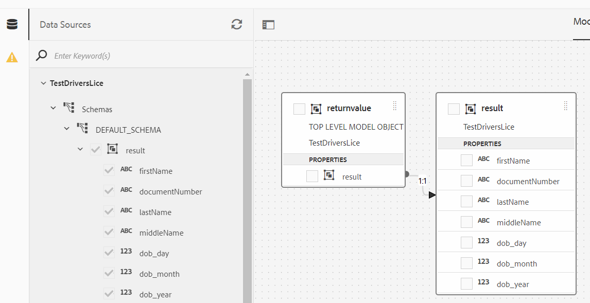

# OCR数据提取

自动从各种政府颁发的文档中提取数据以填充您的自适应表单。

有许多组织提供此服务，只要他们有详实的REST API文档，您就可以使用数据集成功能轻松与AEM Forms集成。 在本教程中，我使用了[ID Analyzer](https://www.idanalyzer.com/)来演示上传文档的OCR数据提取。

按照以下步骤，使用ID Analyzer服务在AEM Forms中实施OCR数据提取。

## 创建开发人员帐户

使用[ID Analyzer](https://portal.idanalyzer.com/signin.html)创建开发人员帐户。 记下API密钥。 需要此密钥才能调用ID分析器服务的REST API。

## 创建Swagger/OpenAPI文件

OpenAPI规范（以前称为Swagger规范）是REST API的API描述格式。 OpenAPI文件允许您描述整个API，包括：

* 每个端点上的可用端点(/users)和操作(GET/用户、POST/用户)
* 操作参数每个操作的输入和输出
身份验证方法
* 联系信息、许可证、使用条款和其他信息。
* API规范可以使用YAML或JSON编写。 该格式易于学习，对人类和机器都易读。

要创建您的第一个swagger/OpenAPI文件，请按照[OpenAPI文档](https://swagger.io/docs/specification/2-0/basic-structure/)操作

>[!NOTE]
> AEM Forms支持OpenAPI规范版本2.0(fka Swagger)。

使用[swagger editor](https://editor.swagger.io/)创建swagger文件，以描述使用短信发送和验证OTP代码的操作。 可以以JSON或YAML格式创建swagger文件。 可从[此处](assets/drivers-license-swagger.zip)下载完成的swagger文件

## 创建数据源

要将AEM/AEM Forms与第三方应用程序集成，我们需要在云服务配置中[创建数据源](https://experienceleague.adobe.com/docs/experience-manager-learn/forms/ic-web-channel-tutorial/parttwo.html)。 请使用[swagger文件](assets/drivers-license-swagger.zip)创建数据源。

## 创建表单数据模型

AEM Forms数据集成提供了直观的用户界面，用于创建和使用[表单数据模型](https://experienceleague.adobe.com/docs/experience-manager-65/forms/form-data-model/create-form-data-models.html)。 将表单数据模型基于在前面步骤中创建的数据源。

## 创建客户端库

我们需要获取已上传文档的base64编码字符串。 然后，此base64编码字符串将作为REST调用的参数之一进行传递。
可以从此处下载[客户端库。](assets/drivers-license-client-lib.zip)

## 创建自适应表单

将表单数据模型的POST调用与自适应表单相集成，以从用户上传的表单文档中提取数据。 您可以自行创建自己的自适应表单，并使用表单数据模型的POST调用来发送已上传文档的base64编码字符串。

## 在服务器上部署

如果要将示例资产与API密钥一起使用，请按照以下步骤操作：

* [下载数据](assets/drivers-license-source.zip) 源并使用包管理器 [导入AEM](http://localhost:4502/crx/packmgr/index.jsp)
* [使用包管理器](assets/drivers-license-fdm.zip) 将表单数据模型导入 [到AEM中](http://localhost:4502/crx/packmgr/index.jsp)
* [下载客户端库](assets/drivers-license-client-lib.zip)
* 可从此处](assets/adaptive-form-dl.zip)下载示例自适应表单。 [此示例表单使用作为本文一部分提供的表单数据模型的服务调用。
* 将表单从[Forms和文档UI](http://localhost:4502/aem/forms.html/content/dam/formsanddocuments)导入AEM
* 以[编辑模式打开表单。](http://localhost:4502/editor.html/content/forms/af/driverslicenseandpassport.html)
* 在apikey字段中指定API密钥作为默认值，并保存更改
* 打开Base 64 String字段的规则编辑器。 当此字段的值发生更改时，请注意服务调用。
* 保存表单
* [预览表单](http://localhost:4502/content/dam/formsanddocuments/driverslicenseandpassport/jcr:content?wcmmode=disabled)，上传您的驾驶执照前面的图片

