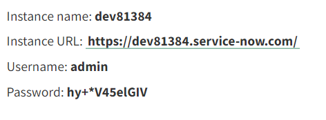

# 将AEM Forms与 [!DNL ServiceNow]

在中创建和显示事件 [!DNL ServiceNow] 在AEM Forms中使用表单数据模型。

## 前提条件

* [!DNL ServiceNow] 帐户。
* 熟悉 [创建数据源](https://experienceleague.adobe.com/docs/experience-manager-learn/forms/ic-web-channel-tutorial/parttwo.html)
* 熟悉 [表单数据模型](https://experienceleague.adobe.com/docs/experience-manager-65/forms/form-data-model/create-form-data-models.html)

## 资产示例

本文提供的示例资产包括以下内容

* 云服务配置
* Swagger文件以创建事件并获取所有事件
* 基于Swagger文件的表单数据模型
* 要创建和列出的自适应表单 [!DNL ServiceNow] 事件

## 在服务器上部署资产

* 下载 [示例资产](assets/service-now.zip)
* 使用将资产导入AEM [包管理器](http://localhost:4502/crx/packmgr/index.jsp)
* 用于此集成的swagger文件位于 ```/conf/9957/settings/cloudconfigs/fdm``` crx存储库中的文件夹
* 编辑 [CreateIncident云服务配置](http://localhost:4502/mnt/overlay/fd/fdm/gui/components/admin/fdmcloudservice/properties.html?item=%2Fconf%2F9957%2Fsettings%2Fcloudconfigs%2Ffdm%2Fcreateincident)以匹配您的ServiceNow实例。
* 编辑 [GetAllIncients云服务配置](http://localhost:4502/mnt/overlay/fd/fdm/gui/components/admin/fdmcloudservice/properties.html?item=%2Fconf%2F9957%2Fsettings%2Fcloudconfigs%2Ffdm%2Fgetallincidents) 以匹配您的ServiceNow实例。 您需要更改主机、用户名和密码，以匹配ServiceNow实例凭据。

## 访问ServiceNow实例凭据

* 单击您的用户配置文件
   

* 单击“管理实例密码”
* 实例详细信息如下所示
   

## 测试集成

* [打开自适应表单](http://localhost:4502/content/dam/formsanddocuments/create-incident-in-service-now/jcr:content?wcmmode=disabled)
* 在“说明和注释”字段中输入一些值，然后单击“创建事件”按钮
* 新创建事件的事件ID应填充在文本字段中，下表应列出所有事件。
