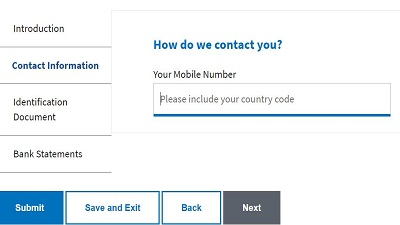

# 创建主自适应表单

表单&#x200B;**StoreAFWithAttachments**&#x200B;是主要的自适应表单。 此自适应表单是用例的入口点。 在此表单中，会捕获用户详细信息（包括移动号码）。 此表单还能添加一些附件。 单击“保存并退出”按钮时，执行服务器端代码以将表单数据存储到数据库中，并生成唯一的应用程序ID并将其呈现给用户以进行安全保存。 此应用程序ID将用于检索与应用程序关联的移动号码。

此表单与在课程前面创建的&#x200B;**bootboxjs540、storeAFWithAttachments**&#x200B;客户端库以及在提交表单时触发的AEM工作流相关联。

* 示例表单基于[自定义自适应表单模板](assets/custom-template-with-page-component.zip)，需要将这些模板导入AEM中才能正确呈现示例表单。

* 已完成的[StoreAfWithAttachments表单](assets/store-af-with-attachments-form.zip)可下载并导入到您的AEM实例中。

* 需要将与此表单](assets/workflow-model-store-af-with-attachments.zip)关联的[AEM工作流导入您的AEM实例，以使表单正常工作。

