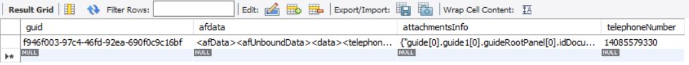

# 存储表单数据

下一步是创建一个服务，在数据库中插入新行，以存储自适应表单数据和关联的附件信息。
以下屏幕抓图显示了数据库中的一行。





以下代码在数据库中插入包含相应数据的新行

```java
public String storeFormData(String formData, String attachmentsInfo, String telephoneNumber) {
    log.debug("******Inside my AEMFormsWith DB service*****");
    log.debug("### Inserting data ... " + formData + "and the telephone number to insert is  " + telephoneNumber);
    String insertRowSQL = "INSERT INTO aemformstutorial.formdatawithattachments(guid,afdata,attachmentsInfo,telephoneNumber) VALUES(?,?,?,?)";
    UUID uuid = UUID.randomUUID();
    String randomUUIDString = uuid.toString();
    log.debug("The insert query is " + insertRowSQL);
    Connection c = getConnection();
    PreparedStatement pstmt = null;
    try {
        pstmt = null;
        pstmt = c.prepareStatement(insertRowSQL);
        pstmt.setString(1, randomUUIDString);
        pstmt.setString(2, formData);
        pstmt.setString(3, attachmentsInfo);
        pstmt.setString(4, telephoneNumber);
        log.debug("Executing the insert statment  " + pstmt.executeUpdate());
        c.commit();
    } catch (SQLException e) {

        log.error("unable to insert data in the table", e.getMessage());
    } finally {
        if (pstmt != null) {
            try {
                pstmt.close();
            } catch (SQLException e) {
                log.debug("error in closing prepared statement " + e.getMessage());
            }
        }
        if (c != null) {
            try {
                c.close();
            } catch (SQLException e) {
                log.debug("error in closing connection " + e.getMessage());
            }
        }
    }
    return randomUUIDString;
}
```

## 后续步骤

[实施保存并退出](./create-servlet.md)

